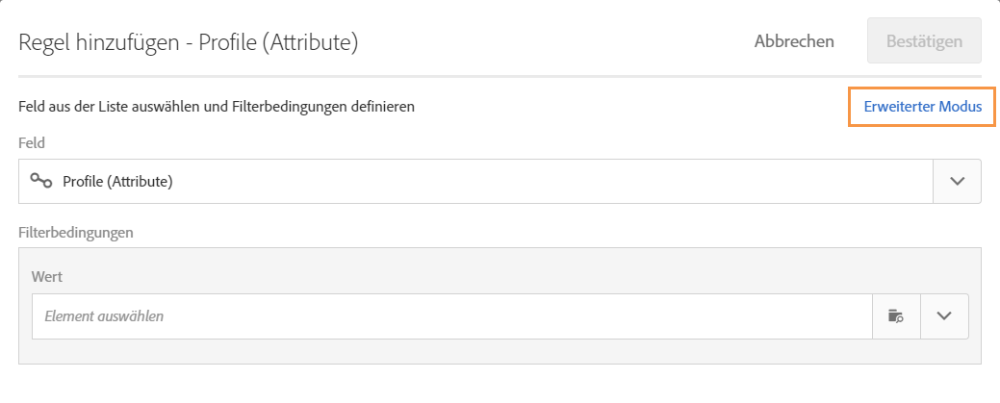

# Workflow-Anwendungsfall: Erstellen von Auslieferungen am Erstellungsdatum der Profile {#creation-date-query}

Sie können ein Angebot per E-Mail zum Jahrestag der Erstellung des Kundenprofils senden.

1. In **[!UICONTROL Marketing Activities]**, click **[!UICONTROL Create]** and select **[!UICONTROL Workflow]**.
1. Wählen Sie **[!UICONTROL Neuer Workflow]** als Workflowtyp aus, und klicken Sie auf **[!UICONTROL Weiter]**.
1. Geben Sie die Eigenschaften des Workflows ein, und klicken Sie auf **[!UICONTROL Erstellen]**.

## Creating a Scheduler activity {#creating-a-scheduler-activity}

1. Bei **[!UICONTROL Aktivitäten]** &gt; **[!UICONTROL Ausführung]** ziehen Sie eine **[!UICONTROL Scheduler-Aktivität]** per Drag &amp; Drop.
1. Doppelklicken Sie auf die Aktivität.
1. Konfigurieren Sie die Ausführung Ihrer Lieferung.
1. Wählen Sie in der **[!UICONTROL Ausführungsfrequenz]****[!UICONTROL Täglich]** aus.
1. Wählen Sie für den Workflow eine **[!UICONTROL Zeit]** und die **[!UICONTROL Wiederholungshäufigkeit]** der Ausführung aus.
1. Wählen Sie ein **[!UICONTROL Start]** - und **[!UICONTROL Ablaufdatum]** für Ihren Workflow aus.
1. Validieren Sie die Aktivität und speichern Sie den Workflow.

>[!NOTE]
>
>Um den Workflow in einer bestimmten Zeitzone zu starten, legen Sie im Register **[!UICONTROL Ausführungsoptionen]** die Zeitzone für Ihren Scheduler im Feld **[!UICONTROL Zeitzone]** fest.


## Creating a Query activity {#creating-a-query-activity}

1. Um die Empfänger auszuwählen, ziehen Sie eine **[!UICONTROL Abfrageaktivität]** und doppelklicken Sie darauf.
1. Fügen Sie **[!UICONTROL Profile]** hinzu und wählen Sie **[!UICONTROL keinen Kontakt mehr per E-Mail]** mit dem Wert **[!UICONTROL nein]**.

### Retrivieren von Profilen am Tag der Ausführung {#retriving-profiles-created-on-the-same-day}

1. Ziehen Sie in **[!UICONTROL Profil]** das **[!UICONTROL erstellte]** Feld, und ziehen Sie es ab. und klicken Sie auf **[!UICONTROL Erweiterten Modus]**.
   
1. Doppelklicken Sie in der **[!UICONTROL Liste der Funktionen]** auf **[!UICONTROL Tag]** vom Knoten **[!UICONTROL Datum]**.
1. Fügen Sie dann das Feld **[!UICONTROL Erstellt]** als Argument ein.
1. Wählen Sie **[!UICONTROL gleich (=)]** als Operator aus.
1. Wählen Sie für Wert **[!UICONTROL Tag]** aus dem Knoten **[!UICONTROL Datum]** in der **[!UICONTROL Liste der Funktionen]**.
1. Legen Sie die **[!UICONTROL GetDate()]**-Funktion als Argument ein.

Sie haben die Profile abgerufen, deren Erstellungstag dem aktuellen Tag entspricht.

Am Ende sollten Sie Folgendes haben:

```Day(@created) = Day(GetDate())```


Wählen Sie **[!UICONTROL Bestätigen]**.

### Retrivieren von Profilen, die am selben Monat erstellt wurden wie der Monat der Ausführung{#retriving-profiles-created-on-the-same-month}

1. Wählen Sie im **[!UICONTROL Abfrage]** -Editor die erste Abfrage aus, und doppelten Sie sie.
1. Öffnen Sie das Duplikat.
1. Ersetzen Sie **[!UICONTROL Tag]** durch **[!UICONTROL Monat]** in der Abfrage.
1. Wählen Sie **[!UICONTROL Bestätigen]**.


Am Ende sollten Sie Folgendes feststellen:

``` Month(@created) = Month(GetDate()) ```

Die letzte Abfrage wird angezeigt:

```Day(@created) = Day(GetDate()) AND Month(@created) = Month(GetDate())```


## Creating an Email delivery{#creating-an-email-delivery}

1. Ziehen Sie eine E-Mail-Zustellung ab.
1. Klicken Sie auf die Aktivität und wählen Sie  zu bearbeiten.
1. Wählen Sie **[!UICONTROL E-Mail]** wiederherstellen aus, und klicken Sie auf **[!UICONTROL Weiter]**.
1. Wählen Sie eine E-Mail-Vorlage aus, und klicken Sie auf **[!UICONTROL Weiter]**.
1. Geben Sie die E-Mail-Eigenschaften ein und klicken Sie auf **[!UICONTROL Weiter]**.
1. Um das Layout Ihrer E-Mail zu erstellen, klicken Sie auf **[!UICONTROL E-Mail-Designer]**.
1. Fügen Sie Elemente ein oder wählen Sie eine vorhandene Vorlage aus.
1. Personalisieren Sie Ihre E-Mail mit Feldern und Links.
Weitere Informationen finden Sie unter [Entwerfen einer E-Mail](../../designing/using/designing-from-scratch.md#designing-an-email-content-from-scratch).
1. Klicken Sie auf **[!UICONTROL Vorschau]** , um Ihr Layout zu überprüfen.
1. Wählen Sie **[!UICONTROL Speichern aus]**.

**Verwandte Themen:**

* [Abfrage](../../automating/using/query.md)
* [Planung](../../automating/using/scheduler.md)
* [E-Mail-Versand](../../automating/using/email-delivery.md)
* [E-Mail-Kanal](../../channels/using/creating-an-email.md)
