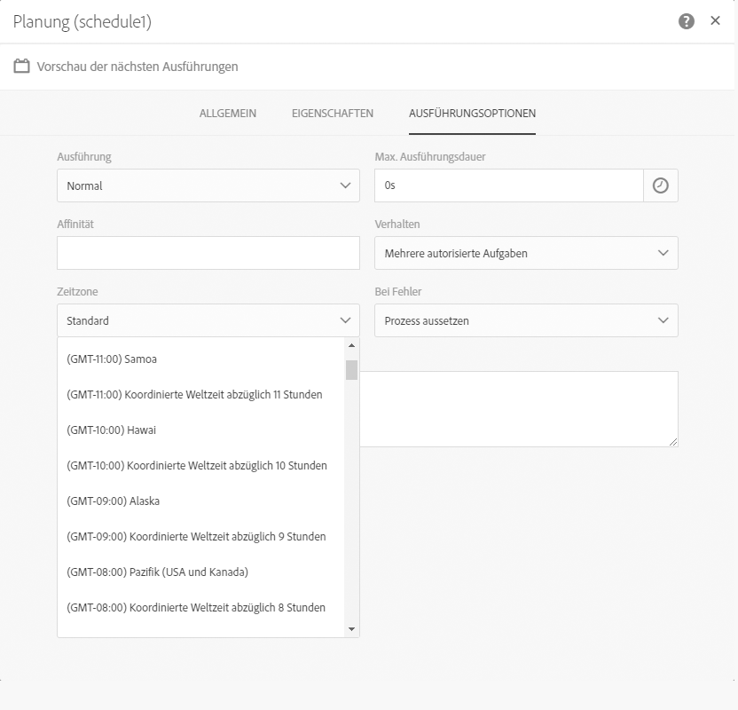
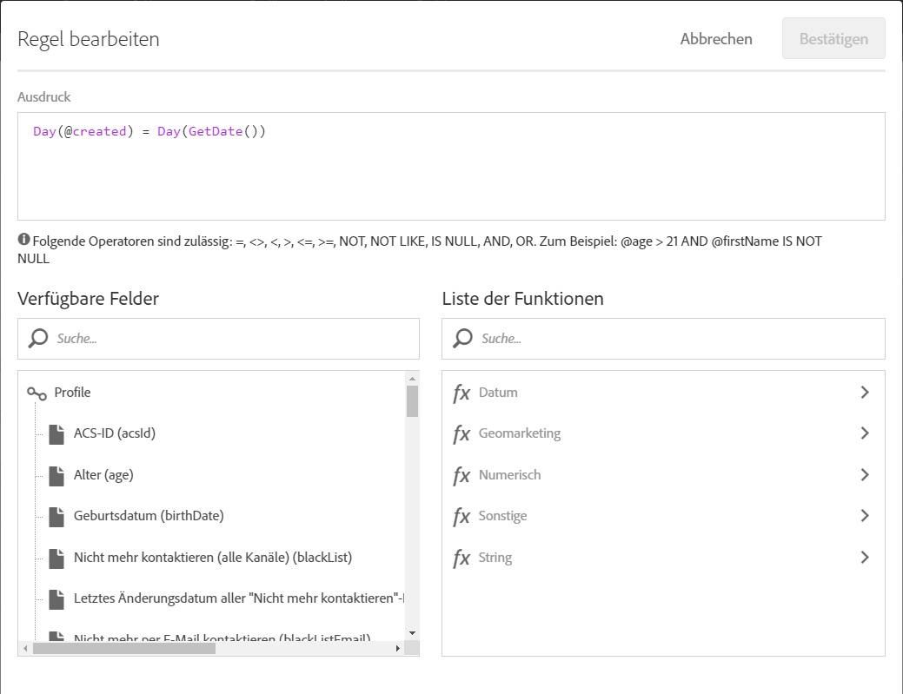
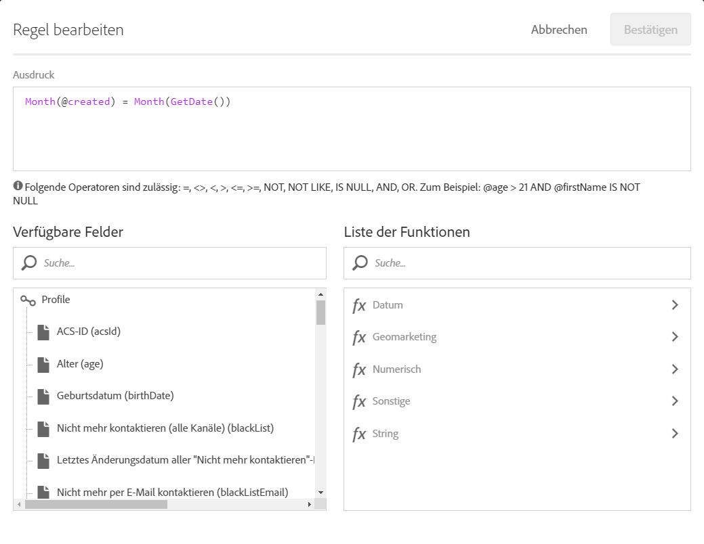
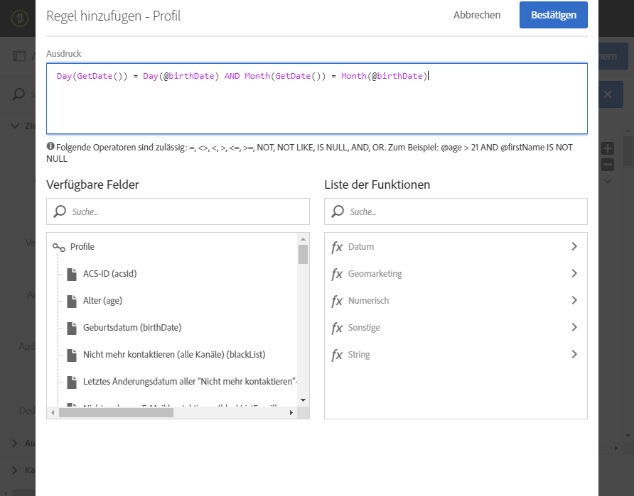

# Fall der Arbeitsströme: Erstellung von Lieferungen auf Profile "Datum der Erstellung « {#creation-date-query}

Sie können per E-Mail am Jahrestag der Profilerstellung des Kunden ein Angebot senden.

1. In **[!UICONTROL Marketing Activities]**, click **[!UICONTROL Create]** and select **[!UICONTROL Workflow]**.
1. Wählen **[!UICONTROL Sie New Workflow]** als Workflow und klicken **[!UICONTROL Sie als Nächstes]**.
1. Geben Sie die Eigenschaften des Arbeitslaufs und Klicken **[!UICONTROL .]**

## Creating a Scheduler activity {#creating-a-scheduler-activity}

1. Bei **[!UICONTROL Tätigkeiten]** &gt; **[!UICONTROL Hinrichtung]**, Hinrichtung und Abbruch einer **[!UICONTROL Flugplantätigkeit]**.
1. Verdoppeln Sie die Aktivität auf.
1. Konfiguriert die Ausführung Ihrer Lieferung.
1. In **[!UICONTROL Ausführungsfrequenz]** ist **[!UICONTROL täglich zu wählen]**.
1. Wählen Sie eine **[!UICONTROL Zeit]** und die **[!UICONTROL Wiederholungshäufigkeit]** für Ihren Arbeitsablauf.
1. Wählen Sie ein **[!UICONTROL Startdatum]** und **[!UICONTROL einen Zeitabschnitt]** für Ihren Arbeitsablauf.
1. Validieren Sie die Aktivität und speichern Sie den Workflow.

>[!NOTE]
>
>Um Ihren Arbeitsablauf in einer bestimmten Zeitzone zu beginnen, wird in der **[!UICONTROL Ausführungsoption]** die Zeitzone für Ihren Zeitplan im **[!UICONTROL Zeitzone]** eingerichtet.



## Creating a Query activity {#creating-a-query-activity}

1. Um Empfänger auszuwählen, ziehen Sie eine **[!UICONTROL Query-Aktivität]** und verdoppeln Sie sie.
1. Hinzufügen **[!UICONTROL Sie Profile]** und wählen **[!UICONTROL Sie nicht mehr per E-Email]** mit dem Wert **[!UICONTROL Nr]**.

### Neu auftretende Profile am selben Tag wie der Tag der Ausführung {#retriving-profiles-created-on-the-same-day}

1. Im **[!UICONTROL Profil]**, schleppen Sie das **[!UICONTROL geschaffene]** Feld. und klicken Sie auf **[!UICONTROL Advanced Mode]**.
   
1. In der **[!UICONTROL Liste der Funktionen]**, Doppelklick **[!UICONTROL Tag]** vom **[!UICONTROL Date]** node.
1. Dann wird das Feld **[!UICONTROL als Argument]** eingefügt.
1. Wählen **[!UICONTROL Sie gleich (=)]** als Betreiber.
1. Für Wert ist der **[!UICONTROL Tag]** vom Datum des **[!UICONTROL Datums]** in der **[!UICONTROL Liste der Funktionen zu wählen]**.
1. Das **[!UICONTROL getdate ()]** wird als Argument eingefügt.

Sie haben die Profile eingeholt, die der Tag der Schöpfung dem heutigen Tag entspricht.

Sie sollten mit folgendem Schluss kommen:

```Day(@created) = Day(GetDate())```



Wählen Sie **[!UICONTROL Bestätigen]**.

### Retrierungsprofile, die im selben Monat wie der Monat der Ausführung geschaffen wurden{#retriving-profiles-created-on-the-same-month}

1. Auf dem **[!UICONTROL Query]** -Redakteur die erste Frage auswählen und duplizieren.
1. Mach das Duplikat frei.
1. Tritt **[!UICONTROL Tag]** für **[!UICONTROL Monat]** an.
1. Wählen Sie **[!UICONTROL Bestätigen]**.



Sie sollten damit enden:

``` Month(@created) = Month(GetDate()) ```

Die endgültigen Abfrageanzeigen sind:

```Day(@created) = Day(GetDate()) AND Month(@created) = Month(GetDate())```



## Creating an Email delivery{#creating-an-email-delivery}

1. Ziehen Sie eine E-Email-Lieferung ab.
1. Klicken Sie die Tätigkeit und wählen  Sie sich zum Edit aus.
1. Wählen **[!UICONTROL Sie wiederkehrende E-Email]** und klicken **[!UICONTROL Sie.]**
1. Wählen Sie eine E-Email-Vorlage und klicken Sie **[!UICONTROL als Nächstes]**.
1. Geben Sie die E-Email-Eigenschaften und klicken **[!UICONTROL Sie.]**
1. Um das Layout Ihrer E-Email zu schaffen, klicken Sie **[!UICONTROL auf Email Designer]**.
1. Elemente einfügen oder ein bestehendes Muster auswählen.
1. Personalisierung deine E-Email unter Nutzung von Feldern und Verbindungen.
Weitere Informationen sind [der Konzeption einer E-Mail](../../designing/using/about-email-content-design.md#designing-an-email-content-from-scratch)zu entnehmen.
1. Klick **[!UICONTROL , um]** deine Layout zu überprüfen.
1. Wählen Sie **[!UICONTROL Speichern aus]**.

**Verwandte Themen:**

* [Abfrage](../../automating/using/query.md)
* [Planung](../../automating/using/scheduler.md)
* [E-Mail-Versand](../../automating/using/email-delivery.md)
* [E-Mail-Kanal](../../channels/using/creating-an-email.md)
