# Kanalübergreifenden Versand erstellen{#cross-channel-delivery}

Anhand dieses typischen Anwendungsbeispiels wird insbesondere die folgende Adobe-Campaign-Funktion vorgestellt: Erstellung eines Workflows zum kanalübergreifenden Versand.

Das Ziel besteht darin, aus den Empfängern der Datenbank eine Audience auszuwählen und diese in zwei gesonderte Gruppen zu unterteilen, um der ersten Gruppe eine E-Mail und der zweiten Gruppe eine SMS zukommen zu lassen.

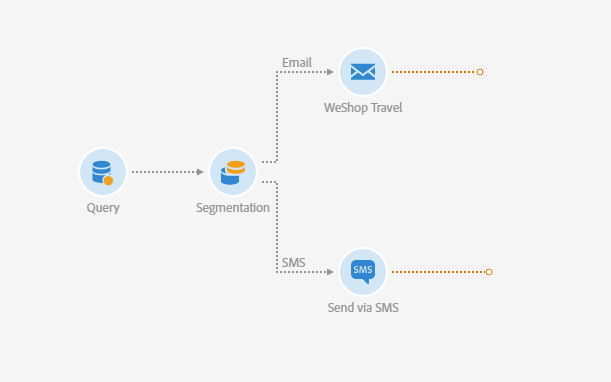

Weiterführende Informationen zu Workflows und den in Adobe Campaign verfügbaren Kanälen finden Sie in den folgenden Dokumenten:

* [Workflows](../../automating/using/get-started-workflows.md)
* [Kommunikationskanäle](../../channels/using/get-started-communication-channels.md)

## Workflow erstellen {#creating-workflow}

Bestimmen Sie im ersten Schritt die Zielgruppe, die Sie mit Ihrer Kommunikation erreichen möchten. Nachfolgend wird diese dann je nach Kommunikationsmedium in zwei Gruppen unterteilt.

Hierzu sind zur Identifizierung der Empfänger die Erstellung einer Abfrage und zur anschließenden Segmentierung die Erstellung eines Workflows notwendig.

Erstellen Sie also innerhalb des Programms oder der Kampagne Ihrer Wahl einen neuen Workflow:

1. Wählen Sie dazu in **[!UICONTROL Marketing-Aktivitäten]** die Option **[!UICONTROL Erstellen]** und dann **[!UICONTROL Workflow]** aus.
1. Wählen Sie als Workflow-Typ **[!UICONTROL Neuer Workflow]** und danach **[!UICONTROL Weiter]** aus.
1. Geben Sie die Eigenschaften des Workflows ein und wählen Sie **[!UICONTROL Erstellen]** aus.

Die detaillierten Schritte zum Erstellen eines Workflows werden im Abschnitt [Workflow erstellen](../../automating/using/building-a-workflow.md) beschrieben.

## Abfrageaktivität erstellen {#creating-query-activity}

Nach der Erstellung des Workflows werden Sie zu dessen Arbeitsbereich weitergeleitet.

Ziehen Sie eine Abfrage in Ihren Workflow, um die mittels Ihrer Sendungen zu kontaktierenden Profile zu bestimmen.

1. Ziehen Sie unter **[!UICONTROL Aktivitäten]** > **[!UICONTROL Zielgruppenbestimmung]** eine [Abfrageaktivität](../../automating/using/query.md) in den Arbeitsbereich.
1. Doppelklicken Sie auf die Aktivität.
1. Durchsuchen Sie im Tab **[!UICONTROL Zielgruppe]** die Schnellzugriffe und wählen Sie eine Ihrer [Audiences](../../audiences/using/about-audiences.md) aus.
1. Ziehen Sie den Schnellzugriff in den Arbeitsbereich. Je nach Typ des ausgewählten Schnellzugriffs öffnet sich ein bestimmtes Fenster.
1. Konfigurieren Sie die Zielgruppenbestimmungselemente und validieren Sie Ihre Abfrage.

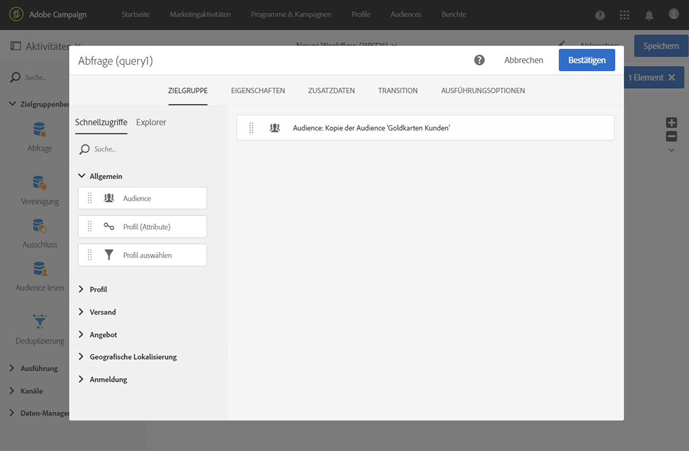

Sie können eine auf ein oder mehrere Element(e) bezogene Abfrage erstellen.

Verwenden Sie die Schaltfläche **[!UICONTROL Zählung]**, um die geschätzte Anzahl an Profilen anzuzeigen, auf die die Abfrage zutrifft.

## Segmentierungsaktivität erstellen {#creating-segmentation-activity}

Unterteilen Sie im nächsten Schritt Ihre mithilfe der Abfrageaktivität bestimmte Zielgruppe in zwei Segmente: das eine erhält eine E-Mail, das andere eine SMS.

Verwenden Sie hierzu die Aktivität [Segmentierung](../../automating/using/segmentation.md), um die zuvor ermittelte Population in zwei Segmente zu unterteilen.

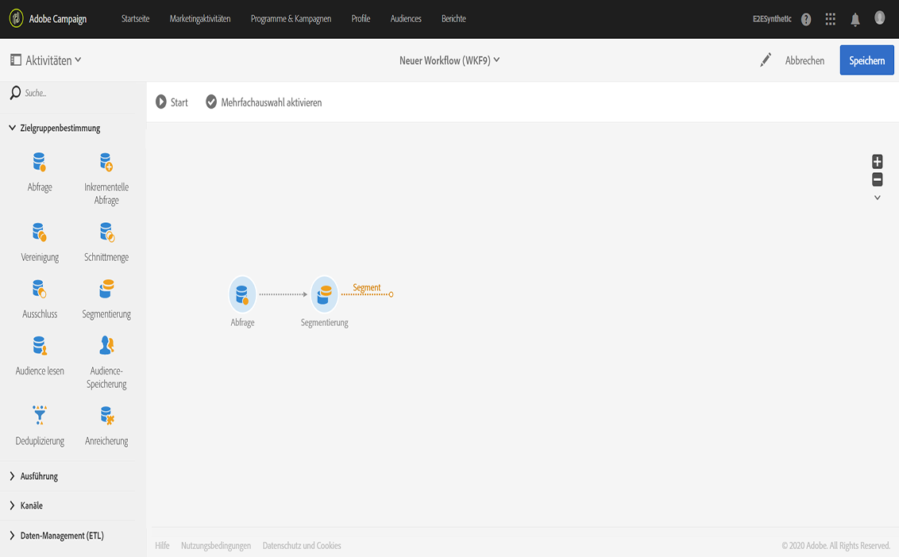

Die Gruppe **E-Mail** zielt auf die Empfängerinnen und Empfänger ab, die über eine E-Mail-Adresse verfügen, aber keine Mobiltelefonnummer haben. Die Gruppe **SMS** enthält die Empfängerinnen und Empfänger, deren Mobiltelefonnummer in ihrem Profil gespeichert ist.

Gehen sie wie folgt vor, um die erste Transition (E-Mail) zu konfigurieren:

1. Im Tab **[!UICONTROL Segmente]** steht standardmäßig ein erstes Segment zur Verfügung. Bearbeiten Sie die Eigenschaften des Segments, um es zu konfigurieren.

   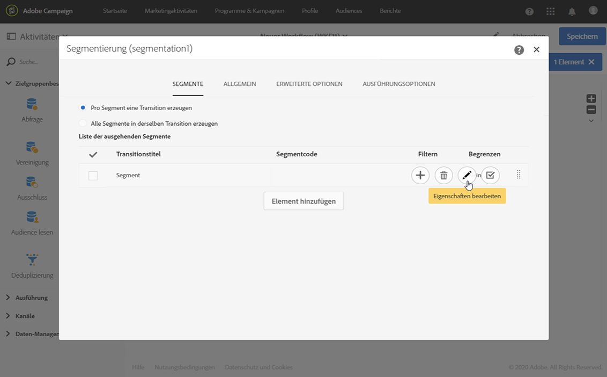

1. Wählen Sie als Filterbedingung die **[!UICONTROL E-Mail]** des Profils aus.

   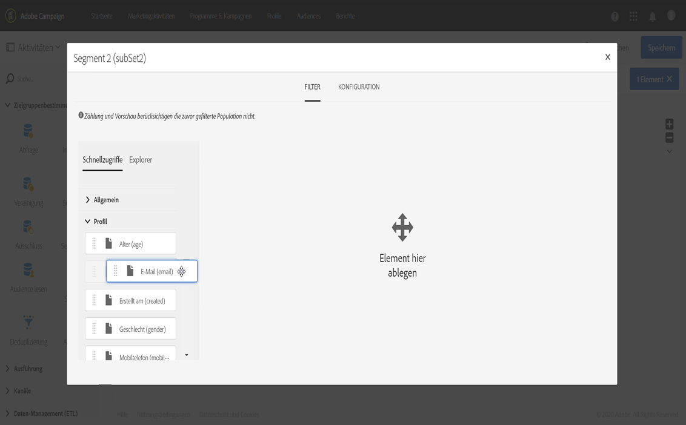

1. Wählen Sie im sich öffnenden Fenster den Operator **[!UICONTROL Ist nicht leer]** aus.

   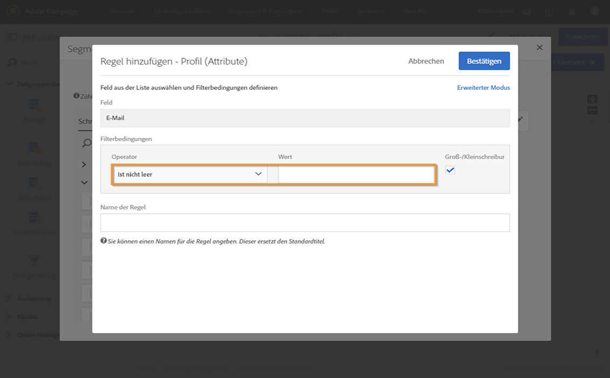

1. Fügen Sie **[!UICONTROL Mobil]** als zweite Filterbedingung hinzu und wählen Sie den Operator **[!UICONTROL Ist leer]** aus.

   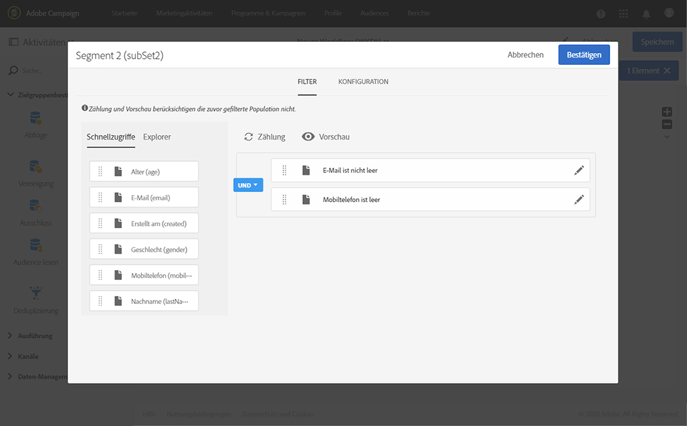

   Alle aus der Abfrage hervorgehenden Profile, die eine E-Mail-Adresse aber keine Mobiltelefonnummer aufweisen, sind in dieser Transition enthalten.

1. Bei Bedarf können Sie den Titel der Transition zwecks einer besseren Übersichtlichkeit des Workflows anpassen. Bestätigen Sie Ihre Änderungen.

   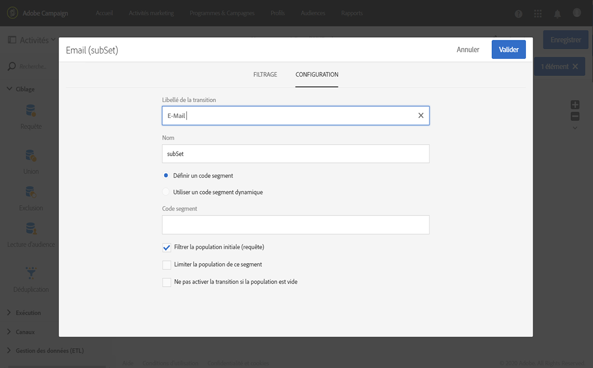

Die Konfiguration Ihrer ersten Transition ist abgeschlossen. Gehen Sie wie folgt vor, um die zweite Transition (SMS) zu konfigurieren:

1. Verwenden Sie die Schaltfläche **[!UICONTROL Element hinzufügen]**, um eine neue Transition hinzuzufügen.
1. Definieren Sie eine Bedingung, mit der Sie alle Profile abrufen können, deren Mobiltelefonnummern angegeben wurden. Erstellen Sie hierzu für das Feld **[!UICONTROL Mobil]** eine Regel mit dem logischen Operator **[!UICONTROL Ist nicht leer]**.

   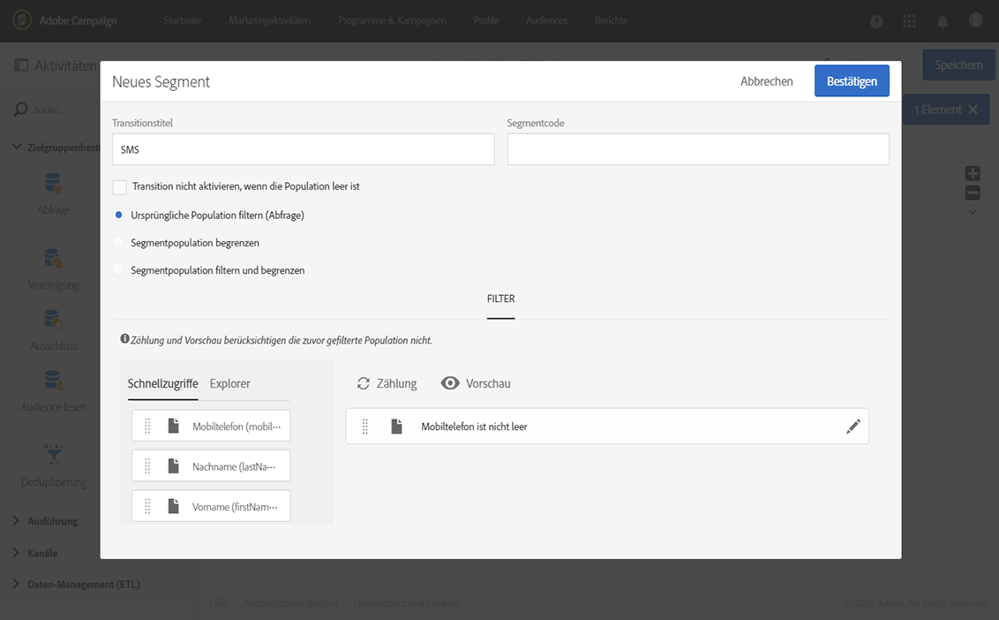

   Alle aus der Abfrage hervorgehenden Profile, die eine Mobiltelefonnummer aufweisen, werden in diese Transition aufgenommen.

1. Bei Bedarf können Sie den Titel der Transition anpassen. Bestätigen Sie Ihre Änderungen.

Die zweite Transition ist jetzt ebenfalls konfiguriert.

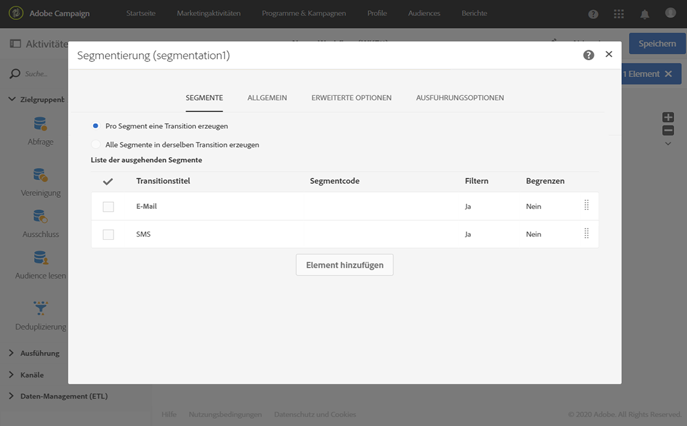

## Sendungen erstellen {#creating-deliveries}

Analog zu den zwei zuvor erstellten Transitionen müssen Sie nun zwei Typen von Sendungen an die aus der Segmentierungsaktivität ausgehenden Transitionen anschließen: die Aktivität [E-Mail-Versand](../../automating/using/email-delivery.md) und die Aktivität [SMS-Versand](../../automating/using/sms-delivery.md).

Mit Adobe Campaign können Sie Sendungen zu einem Workflow hinzufügen. Wählen Sie dazu einen Versand aus der Kategorie **[!UICONTROL Kanäle]** in der Aktivitätenpalette Ihres Workflows.

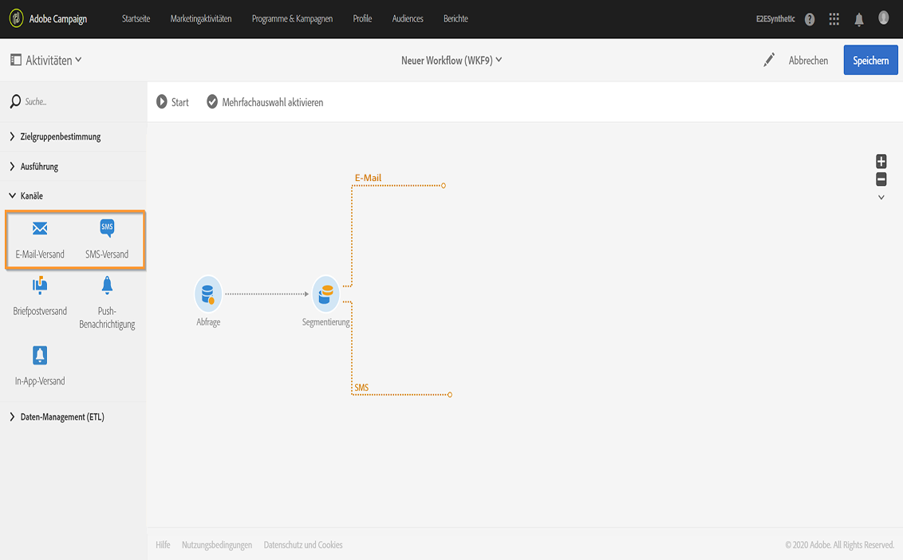

Gehen Sie wie folgt vor, um einen E-Mail-Versand zu erstellen:

1. Ziehen Sie die Aktivität [E-Mail-Versand](../../automating/using/email-delivery.md) hinter das erste Segment.
1. Doppelklicken Sie auf die Aktivität, um sie zu bearbeiten.
1. Wählen Sie **[!UICONTROL Einfache E-Mail]** aus.
1. Wählen Sie **[!UICONTROL Ausgehende Transition mit Population hinzufügen]** und danach **[!UICONTROL Weiter]** aus.

   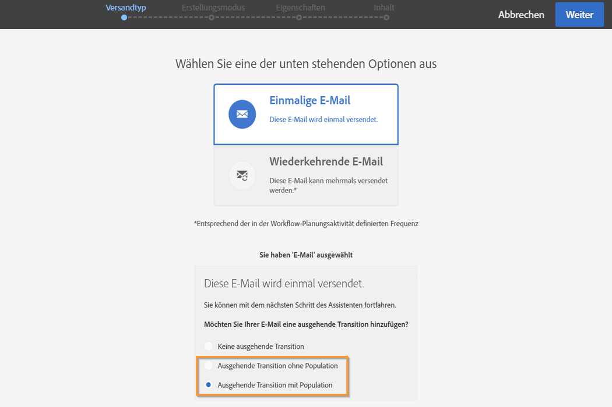

   Die ausgehende Transition ermöglicht es, die Population und die Trackinglogs abzurufen. Dies kann beispielsweise dazu dienen, jenen Personen erneut eine Sendung zukommen zu lassen, die nicht in der ersten E-Mail geklickt haben.

1. Wählen Sie eine E-Mail-Vorlage und danach **[!UICONTROL Weiter]** aus.
1. Geben Sie die E-Mail-Eigenschaften ein und wählen Sie **[!UICONTROL Weiter]** aus.
1. Um das Layout Ihrer E-Mail zu bearbeiten, wählen Sie **[!UICONTROL E-Mail-Designer verwenden]** aus.
1. Bearbeiten und speichern Sie Ihre Inhalte.
1. Deaktivieren Sie im Nachrichten-Dashboard im Bereich **[!UICONTROL Planung]** die Option **[!UICONTROL Vor dem Nachrichtenversand Bestätigung einholen]**.

Gehen Sie wie folgt vor, um einen SMS-Versand zu erstellen:

1. Ziehen Sie die Aktivität [SMS-Versand](../../automating/using/sms-delivery.md) hinter das andere Segment.
1. Doppelklicken Sie auf die Aktivität, um sie zu bearbeiten.
1. Wählen Sie **[!UICONTROL SMS]** und danach **[!UICONTROL Weiter]** aus.
1. Wählen Sie eine SMS-Vorlage und danach **[!UICONTROL Weiter]** aus.
1. Geben Sie die SMS-Eigenschaften ein und wählen Sie **[!UICONTROL Weiter]** aus.
1. Bearbeiten und speichern Sie Ihre Inhalte.

Nach der Konfiguration Ihrer Sendungen kann der Workflow gestartet werden.

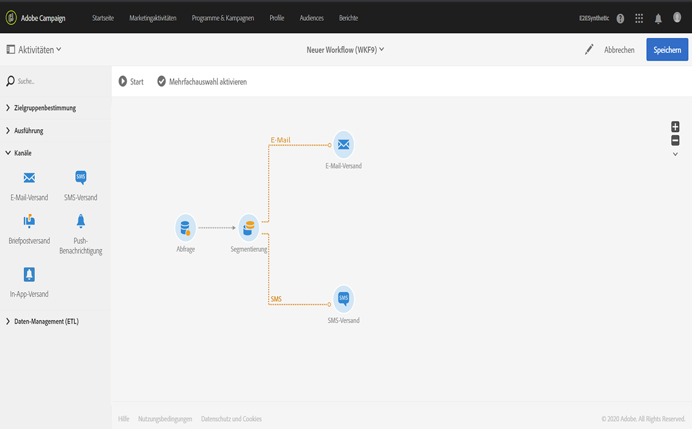

## Workflow ausführen {#running-the-workflow}

Durch Starten des Workflows wird die mithilfe der **[!UICONTROL Abfrageaktivität]** ermittelte Population segmentiert, damit die Populationssegmente anschließend einen E-Mail- bzw. SMS-Versand erhalten.

Verwenden Sie zur Ausführung des Workflows die Schaltfläche **[!UICONTROL Start]** in der Aktionsleiste.

Sie können Ihre Sendungen über das erweiterte Menü **[!UICONTROL Marketing-Pläne]** > **[!UICONTROL Marketing-Aktivitäten]** über das Adobe Campaign-Logo aufrufen. Klicken Sie auf den Versand und dann auf die Schaltfläche **[!UICONTROL Berichte]**, um auf die [Versandberichte](../../reporting/using/about-dynamic-reports.md#accessing-dynamic-reports) zuzugreifen, wie z. B. die Versandzusammenfassung, die Öffnungsrate oder die Darstellung der E-Mail je nach Posteingang der Nachrichten der Empfängerinnen und Empfänger.
