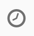
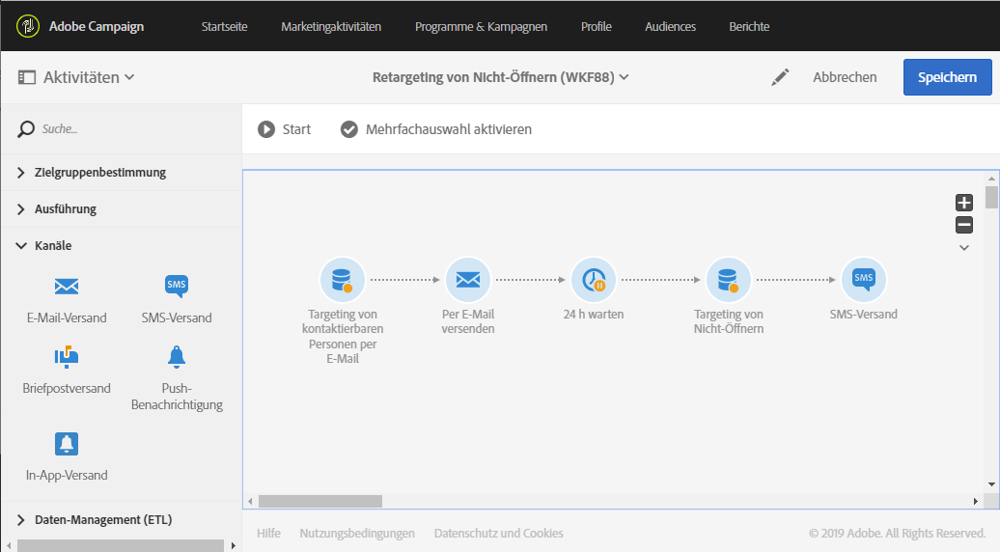

# Retargeting-Workflow für einen neuen Versand an Nicht-Öffner{#retargeting-delivery-to-non-openers}

Sie haben die Möglichkeit, eine E-Mail an Kunden zu senden und danach eine SMS an jene, die die E-Mail nicht geöffnet haben.

1. Wählen Sie dazu in **[!UICONTROL Marketing-Aktivitäten]** die Option **[!UICONTROL Erstellen]** und dann **[!UICONTROL Workflow]** aus.
1. Wählen Sie als Workflow-Typ **[!UICONTROL Neuer Workflow]** und danach **[!UICONTROL Weiter]** aus.
1. Geben Sie die Eigenschaften des Workflows ein und wählen Sie **[!UICONTROL Erstellen]** aus.

## Abfrageaktivität erstellen{#creating-a-query-activity}

1. Ziehen Sie unter **[!UICONTROL Aktivitäten]** > **[!UICONTROL Zielgruppenbestimmung]** eine [Abfrageaktivität](../../automating/using/query.md) in den Arbeitsbereich.
1. Doppelklicken Sie auf die Aktivität.
1. Ziehen Sie in **[!UICONTROL Verknüpfungen]** das Element **[!UICONTROL Profile]** in den Arbeitsbereich und wählen Sie **[!UICONTROL E-Mail]** mit dem Operator **[!UICONTROL Ist nicht leer]** aus.
1. Ziehen Sie in **[!UICONTROL Verknüpfungen]** das Element **[!UICONTROL Profile]** in den Arbeitsbereich und wählen Sie **[!UICONTROL Nicht mehr per E-Mail kontaktieren]** mit dem Wert **[!UICONTROL Nein]** aus.
1. Wählen Sie **[!UICONTROL Bestätigen]** aus.

## E-Mail-Versand erstellen{#creating-an-email-delivery}

1. Ziehen Sie einen [E-Mail-Versand](../../automating/using/email-delivery.md) per Drag &amp; Drop hinter jedes Segment.
1. Wählen Sie die Aktivität aus und danach , um die Bearbeitung zu ermöglichen.
1. Wählen Sie **[!UICONTROL Einfache E-Mail]** und danach **[!UICONTROL Weiter]** aus.
1. Wählen Sie **[!UICONTROL Ausgehende Transition ohne Population hinzufügen]** und danach **[!UICONTROL Weiter]** aus.
1. Wählen Sie eine E-Mail-Vorlage und danach **[!UICONTROL Weiter]** aus.
1. Geben Sie die E-Mail-Eigenschaften ein und wählen Sie **[!UICONTROL Weiter]** aus.
1. Um das Layout Ihrer E-Mail zu definieren, wählen Sie **[!UICONTROL Email Designer]** aus.
1. Fügen Sie Elemente ein oder wählen Sie eine bestehende Vorlage aus.
1. Personalisieren Sie Ihre E-Mail je nach Ort mit spezifischen Angeboten. Weiterführende Informationen finden Sie im Abschnitt zum [Gestalten einer E-Mail](../../designing/using/designing-from-scratch.md#designing-an-email-content-from-scratch).
1. Wählen Sie **[!UICONTROL Vorschau]** aus, um Ihr Layout zu überprüfen.
1. Wählen Sie **[!UICONTROL Speichern]** aus.

## Nicht-Öffner in einer Abfrageaktivität auswählen{#targeting-non-openers-in-a-query-activity}

1. Ziehen Sie in **[!UICONTROL Aktivitäten]** > **[!UICONTROL Ausführung]** eine [Warten](../../automating/using/wait.md)-Aktivität in den Arbeitsbereich.
1. Wählen Sie in **[!UICONTROL Dauer]**  aus und wählen Sie danach einen Tag aus.
1. Ziehen Sie unter **[!UICONTROL Aktivitäten]** > **[!UICONTROL Zielgruppenbestimmung]** eine **[!UICONTROL Abfrageaktivität]** in den Arbeitsbereich.
1. Doppelklicken Sie auf die Aktivität.
1. Ziehen Sie in **[!UICONTROL Verknüpfungen]** die Option **[!UICONTROL Trackinglogs]** mit dem Operator **[!UICONTROL Ist vorhanden]** in den Arbeitsbereich.
1. Ziehen Sie in **[!UICONTROL Schnellzugriffe]** > **[!UICONTROL Versand]** die Option **[!UICONTROL Versand]** mit dem Operator **[!UICONTROL Ist gleich]** in den Arbeitsbereich und wählen Sie als Wert den Versand aus.
1. Ziehen Sie in **[!UICONTROL Schnellzugriffe]** > **[!UICONTROL Versand]** die Option **[!UICONTROL Typ]** in den Arbeitsbereich und aktivieren Sie als Wert **[!UICONTROL Öffnen]**.
1. Wählen Sie als Operator zwischen den Regeln **[!UICONTROL Außer]** aus.
1. Wählen Sie **[!UICONTROL Bestätigen]** aus.

## SMS-Versand erstellen{#creating-a-sms-delivery}

1. Ziehen Sie einen SMS-Versand hinter jedes Segment.
1. Wählen Sie die Aktivität aus und danach , um die Bearbeitung zu ermöglichen.
1. Wählen Sie **[!UICONTROL Einfache SMS]** und danach **[!UICONTROL Weiter]** aus.
1. Wählen Sie eine SMS-Vorlage und danach **[!UICONTROL Weiter]** aus.
1. Geben Sie die SMS-Eigenschaften ein und wählen Sie **[!UICONTROL Weiter]** aus.
1. Um das Layout Ihrer SMS zu definieren, wählen Sie **[!UICONTROL Email Designer]** aus.
1. Fügen Sie Elemente ein oder wählen Sie eine bestehende Vorlage aus.
1. Personalisieren Sie Ihre SMS je nach Ort mit spezifischen Angeboten. Weiterführende Informationen hierzu finden Sie im Abschnitt [SMS erstellen](../../channels/using/creating-an-sms-message.md).
1. Wählen Sie **[!UICONTROL Vorschau]** aus, um Ihr Layout zu überprüfen.
1. Wählen Sie **[!UICONTROL Speichern]** aus.

**Verwandte Themen:**

* [E-Mail-Kanal](../../channels/using/creating-an-email.md)
