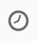

# Workflow-Anwendungsfall: Nachverlagerung des Arbeitsablaufs, der eine neue Zustellung an Nicht-Offener sendet{#retargeting-delivery-to-non-openers}

Sie können eine E-Mail an Kunden senden und dann eine SMS an diejenigen, die nicht geöffnet haben.

1. In **[!UICONTROL Marketing Activities]**, click **[!UICONTROL Create]** and select **[!UICONTROL Workflow]**.
1. Wählen Sie **[!UICONTROL Neuer Workflow]** als Workflowtyp aus, und klicken Sie auf **[!UICONTROL Weiter]**.
1. Geben Sie die Eigenschaften des Workflows ein, und klicken Sie auf **[!UICONTROL Erstellen]**.

## Creating a query activity{#creating-a-query-activity}

1. Bei **[!UICONTROL Aktivitäten]** &gt; **[!UICONTROL Targeting]** ziehen und löschen Sie eine **[!UICONTROL Abfrageaktivität]**.
1. Doppelklicken Sie auf die Aktivität.
1. Ziehen Sie in **[!UICONTROL Tastenkombinationen]** die **[!UICONTROL Profile]** , und wählen Sie **[!UICONTROL E-Mail]** mit dem Operator **[!UICONTROL ist nicht leer]**.
1. Ziehen Sie in **[!UICONTROL Tastenkombinationen]** die **[!UICONTROL Profile]** , und wählen Sie **[!UICONTROL keinen Kontakt mehr per E-Mail]** mit dem Wert **[!UICONTROL nein]**.
1. Wählen Sie **[!UICONTROL Bestätigen]**.

## Creating an email delivery{#creating-an-email-delivery}

1. Ziehen Sie nach jedem Segment eine **[!UICONTROL E-Mail-Zustellung]** ab und lassen Sie sie fallen.
1. Klicken Sie auf die Aktivität und wählen Sie  zu bearbeiten.
1. Wählen Sie **[!UICONTROL Einfache E-Mail]** aus, und klicken Sie auf **[!UICONTROL Weiter]**.
1. Wählen Sie **[!UICONTROL Einen Übergang zum Ausland ohne Population]** hinzufügen aus, und klicken Sie auf **[!UICONTROL Weiter]**.
1. Wählen Sie eine E-Mail-Vorlage aus, und klicken Sie auf **[!UICONTROL Weiter]**.
1. Geben Sie die E-Mail-Eigenschaften ein und klicken Sie auf **[!UICONTROL Weiter]**.
1. Um das Layout Ihrer E-Mail zu erstellen, klicken Sie auf **[!UICONTROL Verwenden des E-Mail-Designers]**.
1. Fügen Sie Elemente ein oder wählen Sie eine vorhandene Vorlage aus.
1. Personalisieren Sie Ihre E-Mail mit spezifischen Angeboten für jeden Speicherort.Weitere Informationen finden Sie unter [Entwerfen einer E-Mail](../../designing/using/designing-from-scratch.md#designing-an-email-content-from-scratch).
1. Klicken Sie auf **[!UICONTROL Vorschau]** , um Ihr Layout zu überprüfen.
1. Wählen Sie **[!UICONTROL Speichern aus]**.

## Targeting von Nicht-Openern in einer Abfrageaktivität{#targeting-non-openers-in-a-query-activity}

1. Bei **[!UICONTROL Aktivitäten]** &gt; **[!UICONTROL Ausführung]** ziehen und ziehen Sie eine **[!UICONTROL Warteaktivität]** ab .
1. Klicken Sie in **[!UICONTROL Laufzeit]** auf einen Tag  und wählen Sie einen Tag aus.
1. Bei **[!UICONTROL Aktivitäten]** &gt; **[!UICONTROL Targeting]** ziehen und löschen Sie eine **[!UICONTROL Abfrageaktivität]**.
1. Doppelklicken Sie auf die Aktivität.
1. In **[!UICONTROL Tastenkombinationen]** können Sie **[!UICONTROL Tracking Logs]** per Drag &amp; Drop und mit dem Operator **[!UICONTROL existieren]**.
1. Bei **[!UICONTROL Tastenkombinationen]**&gt; **[!UICONTROL Lieferung]** ist die Drag &amp; Drop- **[!UICONTROL Lieferung]** mit dem Bediener gleich **** und wählen Sie die Lieferung als Wert aus.
1. In **[!UICONTROL Tastenkombinationen]**&gt; **[!UICONTROL Lieferung]**, ziehen Sie den **[!UICONTROL Typ]** , und wählen Sie **[!UICONTROL Öffnen]** als Wert.
1. Wählen Sie den Operator zwischen Regeln wie **[!UICONTROL ausgenommen]** aus.
1. Wählen Sie **[!UICONTROL Bestätigen]**.

## Erstellen einer SMS-Lieferung{#creating-a-sms-delivery}

1. Ziehen Sie eine SMS-Zustellung nach jedem Segment ab.
1. Klicken Sie auf die Aktivität und wählen Sie  zu bearbeiten.
1. Wählen Sie **[!UICONTROL Einfache sms]** aus, und klicken Sie auf **[!UICONTROL Weiter]**.
1. Wählen Sie eine sms-Vorlage aus, und klicken Sie auf **[!UICONTROL Weiter]**.
1. Geben Sie die sms-Eigenschaften ein, und klicken Sie auf **[!UICONTROL Weiter]**.
1. Um das Layout Ihrer SMS zu erstellen, klicken Sie auf **[!UICONTROL E-Mail-Designer]**.
1. Fügen Sie Elemente ein oder wählen Sie eine vorhandene Vorlage aus.
1. Personalisieren Sie Ihre SMS mit spezifischen Angeboten für jeden Standort.
Weitere Informationen finden Sie unter [Entwerfen eines SMS](../../channels/using/creating-an-sms-message.md).
1. Klicken Sie auf **[!UICONTROL Vorschau]** , um Ihr Layout zu überprüfen.
1. Wählen Sie **[!UICONTROL Speichern aus]**.

**Verwandte Themen:**

* [Abfrage](../../automating/using/query.md)
* [SMS-Versand](../../automating/using/sms-delivery.md)
* [E-Mail-Versand](../../automating/using/email-delivery.md)
* [E-Mail-Kanal](../../channels/using/creating-an-email.md)
