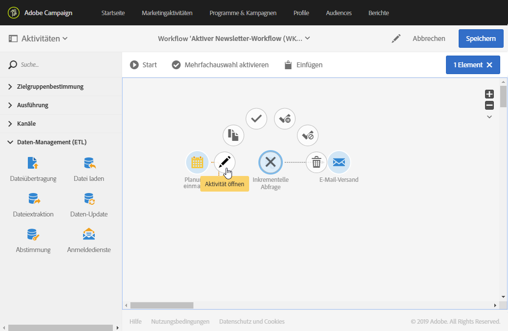
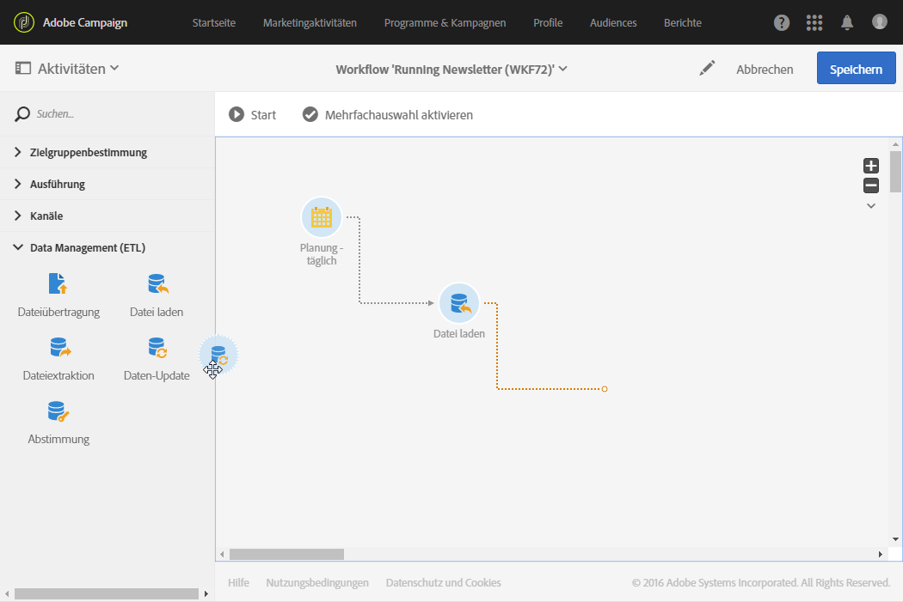
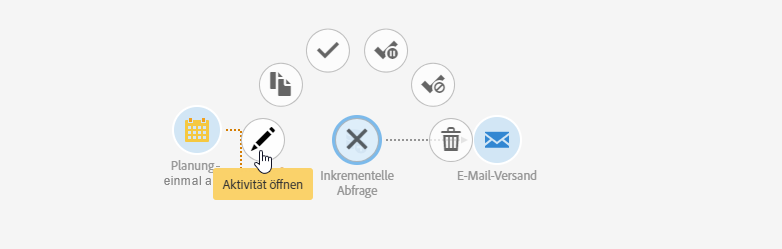
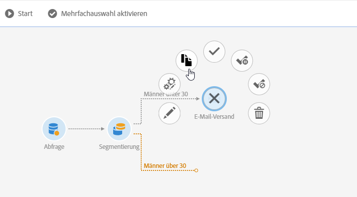
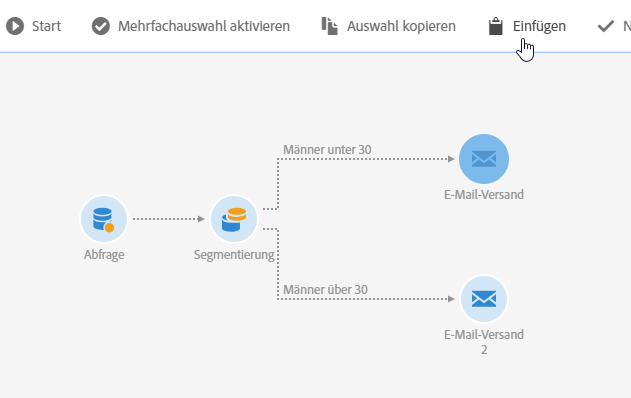
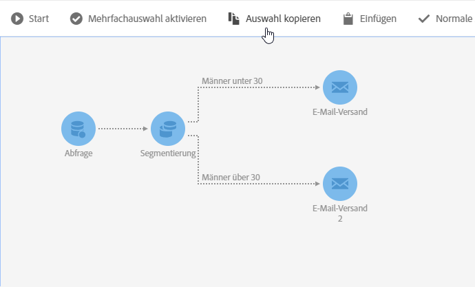

# Workflow-Oberfläche{#workflow-interface}

Im Rahmen von Programmen und Kampagnen dienen Workflows der Automatisierung von umfangreichen Arbeitsabläufen.

Die Workflow-Benutzeroberfläche weist folgende Elemente auf:

* [Palette](../../automating/using/workflow-interface.md#palette) mit den verfügbaren Aktivitäten;
* [Arbeitsbereich](../../automating/using/workflow-interface.md#workspace), in dem Aktivitäten angeordnet und konfiguriert werden;
* [Symbolleiste](../../automating/using/workflow-interface.md#action-bar) mit Schaltflächen, die die Interaktion mit dem Workflow und seinen Komponenten ermöglichen.
* [Quick Actions](../../automating/using/workflow-interface.md#quick-actions), die um eine ausgewählte Aktivität herum angezeigt werden und den Schnellzugriff auf diverse Aktionen ermöglichen.

## Palette {#palette}

Die Palette befindet sich auf der linken Bildschirmseite. Die verfügbaren Aktivitäten sind verschiedenen Kategorien zugeordnet:

* [Zielgruppenbestimmung](../../automating/using/about-targeting-activities.md) - Aktivitäten, die der Erstellung von Zielgruppen und der Verwendung bzw. Filterung von Populationen dienen.
* [Ausführung](../../automating/using/about-execution-activities.md) - Aktivitäten, die der Organisation und Ausführung von Workflows dienen.
* [Kanäle](../../automating/using/about-channel-activities.md) - Aktivitäten, die die verschiedenen Kommunikationskanäle repräsentieren.
* [Data Management (ETL)](../../automating/using/about-data-management-activities.md) - Aktivitäten, die dem Umgang mit Daten dienen.

Ziehen Sie die für Ihren Workflow erforderlichen Aktivitäten aus der Palette an die gewünschte Stelle im Arbeitsbereich.

Jede Aktivität muss separat konfiguriert werden, bevor Sie den Workflow starten.

## Arbeitsbereich {#workspace}

Die zentrale Fläche im Editor bildet den Arbeitsbereich des Workflows. Hier werden die verwendeten Aktivitäten abgelegt, mithilfe von Transitionen in Beziehung gesetzt und konfiguriert.

Um zwei Aktivitäten miteinander zu verbinden, ziehen Sie das Ende des Pfeils der ersten Aktivität zur nächsten Aktivität, bis sie miteinander verbunden werden. Sie können die Aktivität auch zur davorliegenden Pfeilspitze ziehen, um diese Aktivität mit der vorhergehenden zu verbinden. Wenn eine der zwei Aktivitäten verschoben wird, bleiben sie trotzdem verbunden.

Bei Aktivitäten, die Daten verarbeiten, enthalten die ausgehenden Transitionen die Zwischenergebnisse. Sie können darauf zugreifen, wenn Sie im Abschnitt **[!UICONTROL Ausführung]** der Workflow-Eigenschaften die Option **Zwischenergebnis festhalten]angekreuzt haben.[!UICONTROL **

Bei Markierung einer Aktivität erscheinen um diese herum die Quick Actions, die den Schnellzugriff auf diverse Aktionen ermöglichen. Um beispielsweise eine Aktivität zu konfigurieren, können Sie diese markieren und mithilfe der Quick-Action-Schaltfläche 

Gewisse Funktionen stehen nur im Arbeitsbereich zur Verfügung:

* Zeichnen einer Auswahlzone um mehrere Aktivitäten und Transitionen, um diese gleichzeitig zu markieren.
* Taste **Strg** + Linksklick zur Auswahl mehrerer Aktivitäten und/oder Transitionen.
* Taste **Enter** zum Zugriff auf die Detailansicht der aktuell ausgewählten Aktivität oder Transition.
* Taste **Entf** zum Löschen der aktuell ausgewählten Aktivität.
* Verwenden Sie **Strg + C**, um die ausgewählten Aktivitäten zu kopieren, und **Strg + V**, um sie in den Arbeitsbereich einzufügen.

## Symbolleiste {#action-bar}

Je nach im Arbeitsbereich ausgewählten Elementen oder Workflow-Status sind in der Symbolleiste unterschiedliche Schaltflächen verfügbar.

 **[!UICONTROL Open activityes ermöglicht]** Ihnen, die Eigenschaften des Workflows zu bearbeiten.

 **[!UICONTROL Startstart]** startet den Workflow.

 **[!UICONTROL Pausepauses]** des Workflows.

 **[!UICONTROL Ausführung des Workflow-]** Arbeitsablaufs. Eine Wiederaufnahme an der Stelle, an der er gestoppt wurde, ist nicht möglich.

 **[!UICONTROL Restartrestarts]** startet den Workflow.

 **[!UICONTROL Protokoll und tasksausführungsprotokoll wird geöffnet]** .

 **[!UICONTROL Mehrfachauswahl aktivieren Aktiviert Modus]** für mehrere Auswahlmöglichkeiten. Der Workflow muss mindestens zwei Aktivitäten enthalten.

 **[!UICONTROL Deaktivieren Sie Multi-selectiondisables]** Multi-Selection Mode. 

 **[!UICONTROL Open transitionöffnen]** Sie den ausgewählten Übergang. 

  **[!UICONTROL Normale executionre]** -Aktivierung Aktiviert die Auswahl, wenn sie zuvor deaktiviert oder als angehalten gekennzeichnet wurde. 

 **[!UICONTROL Execususpendedanhalten]** des Workflows für die ausgewählte Aktivität. 

 **[!UICONTROL No executiondisables]** the activity. 

 **[!UICONTROL Löschen Sie selectionlöscht]** die ausgewählten Aktivitäten. 

 **[!UICONTROL Selectioncopies]** Die ausgewählten Aktivitäten kopieren.

 **[!UICONTROL Pastepastes]** die kopierten Aktivitäten.

## Quick Actions {#quick-actions}

Bei Markierung einer Aktivität erscheinen um diese herum die Quick-Action-Schaltflächen, die den direkten Zugriff auf gewisse Funktionen ermöglichen.

 **[!UICONTROL Open activityöffnen]** Sie die ausgewählte Aktivität.

 **[!UICONTROL Selectioncopies]** Die ausgewählte Aktivität kopiert.

 **[!UICONTROL Öffnen Sie die erweiterte optionenöffnet die]** erweiterten Optionen der ausgewählten E-Mail- oder SMS-Bereitstellungsaktivität.

 **[!UICONTROL Normale executionre]** -Aktivierung Aktiviert die Auswahl, wenn sie zuvor deaktiviert oder als angehalten gekennzeichnet wurde.

 **[!UICONTROL Execususpendedanhalten]** des Workflows für die ausgewählte Aktivität.

 **[!UICONTROL No executiondisables]** the activity.

 **[!UICONTROL Sofortige executionerzwingt]** sofort die sofortige Verarbeitung der Auswahl. Diese Schaltfläche steht nur für die Aktivitäten Planung und Warten zur Verfügung.

 **[!UICONTROL Löschen Sie selectionlöscht]** die ausgewählten Aktivitäten.

## Workflow-Aktivitäten duplizieren {#duplicating-workflow-activities}

Sie können in einem Workflow Aktivitäten duplizieren, indem Sie sie mit Copy &amp; Paste in denselben Workflow oder einen anderen Workflow derselben Campaign-Instanz einfügen.

Die Konfiguration der duplizierten Aktivitäten bleibt dabei unverändert. Bei Versandaktivitäten (E-Mail, SMS, Push-Benachrichtigungen etc.) wird das an die Aktivität angehängte Versandobjekt dupliziert.

>[!NOTE]
>
>Workflow-Aktivitäten einer Instanz können nicht in einer anderen Instanz dupliziert werden. Aktivitäten von technischen Workflows können nicht dupliziert werden.

Um eine Aktivität zu duplizieren, gehen Sie wie folgt vor:

1. Wählen Sie die Aktivität und danach im Schnellzugriff die Schaltfläche **[!UICONTROL Auswahl kopieren]aus.**

   Sie können auch die Tastenkombination **Strg + C** verwenden.

   

1. Rechtsklicken Sie auf den Arbeitsbereich des Ziel-Workflows und wählen Sie dann die Schaltfläche **[!UICONTROL Einfügen]aus.**

   Sie können auch die Tastenkombination **Strg + V** verwenden.

   

1. Die Aktivität wird mit allen zuvor konfigurierten Einstellungen dupliziert.

Sie können auch mehrere Aktivitäten mit Copy &amp; Paste kopieren, sodass ein gesamter Workflow dupliziert werden kann.

Wählen Sie dabei die Aktivitäten aus, indem Sie rund um sie einen Kreis ziehen. Wählen Sie dann in der Symbolleiste die Schaltfläche **[!UICONTROL Auswahl kopieren]** aus (oder drücken Sie **Strg + C**). Danach können Sie die Aktivitäten an der gewünschten Position einfügen.

