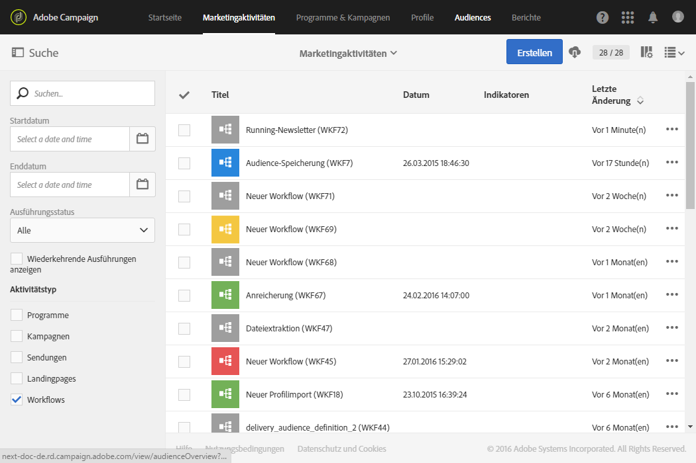

# Lebenszyklus eines Workflows {#life-cycle}

Der Lebenszyklus eines Workflows gestaltet sich in drei Hauptetappen:

* **In Bearbeitung** (grau)

   Hierbei handelt es sich um die Phase der Erstellung (siehe [Workflow erstellen](../../automating/using/building-a-workflow.md#creating-a-workflow)). Ein derartiger Workflow wurde noch nicht vom Server übernommen und kann daher problemlos geändert werden.

* **Gestartet** (blau)

   Nach Abschluss der Erstellungsphase kann der Workflow gestartet werden. Daraufhin wird er vom Server übernommen.

* **Abgeschlossen** (grün)

   Ein Workflow ist abgeschlossen, wenn keine Aufgaben mehr zur Verarbeitung anstehen, oder wenn die Ausführung ausdrücklich angehalten wurde.

Nach dem Start kann ein Workflow zwei weitere Status aufweisen:

* **Warnhinweis** (gelb)

   Der Workflow konnte nicht abgeschlossen werden oder er wurde anhand der Schaltflächen  bzw.  ausgesetzt.

* **Fehlerhaft** (rot)

   Bei der Ausführung des Workflows ist ein Fehler aufgetreten. Die Ausführung wurde angehalten und ein Eingreifen des Benutzers ist erforderlich. Mithilfe der Schaltfläche  gelangen Sie in das Workflow-Protokoll, dem Sie die Fehlerursache entnehmen können (siehe [Monitoring](#monitoring)).

Die Liste der Marketingaktivitäten ermöglicht die Anzeige aller Workflows inklusive ihrer Status. Weiterführende Informationen dazu finden Sie im Abschnitt [Marketingaktivitäten verwalten](../../start/using/marketing-activities.md#about-marketing-activities).

