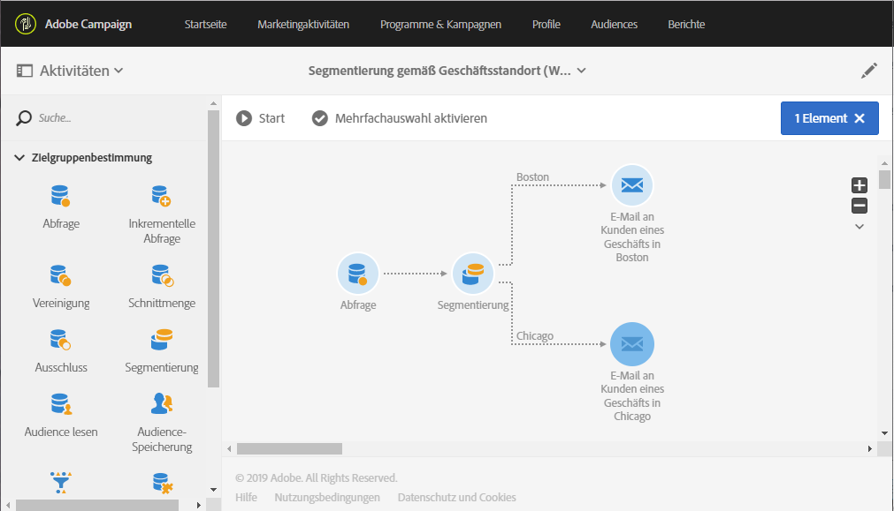

# Segmentierung am Standort {#segmentation-on-location}

Sie können Kunden eine E-Mail mit Angeboten in lokalen Geschäften schicken.

1. Wählen Sie dazu in **[!UICONTROL Marketingaktivitäten]** die Option **[!UICONTROL Erstellen]** und dann **[!UICONTROL Workflow]** aus.
1. Wählen Sie als Workflow-Typ **[!UICONTROL Neuer Workflow]** und danach **[!UICONTROL Weiter]** aus.
1. Geben Sie die Eigenschaften des Workflows ein und wählen Sie **[!UICONTROL Erstellen]** aus.

## Auswählen von Empfängern, die per E-Mail kontaktiert werden können{#selecting-recipients-contactable-via-email}

1. Ziehen Sie unter **[!UICONTROL Aktivitäten]** > **[!UICONTROL Zielgruppenbestimmung]** eine Abfrageaktivität in den Arbeitsbereich .
1. Doppelklicken Sie auf die Aktivität.
1. Ziehen Sie in **[!UICONTROL Verknüpfungen]** das Element **[!UICONTROL Profile]** in den Arbeitsbereich und wählen Sie das Feld **[!UICONTROL E-Mail]** mit dem Operator **[!UICONTROL Ist nicht leer]** aus.
1. Ziehen Sie in **[!UICONTROL Verknüpfungen]** das Element **[!UICONTROL Profile]** in den Arbeitsbereich und wählen Sie das Feld **[!UICONTROL Nicht mehr per E-Mail kontaktieren]** mit dem Wert **[!UICONTROL Nein]** aus.
1. Wählen Sie zweimal **[!UICONTROL Bestätigen]** aus.

## Segmentierungsaktivität erstellen.{#creating-a-segmentation-activity}

1. Ziehen Sie eine [Segmentierungsaktivität](../../automating/using/segmentation.md) in den Arbeitsbereich und doppelklicken Sie darauf.
1. Wählen Sie ein Segment aus und öffnen Sie danach eine Transition, um Personen in der ersten Stadt auszuwählen. In unserem Fall ist das Boston.
1. Ziehen Sie **[!UICONTROL Standort]** in den Arbeitsbereich und wählen Sie **[!UICONTROL Stadt]** mit dem Operator **[!UICONTROL Gleich]** und dem Wert **[!UICONTROL Boston]** aus.
Hinweis: Um auch alle Personen auszuwählen, die &quot;boston&quot; eingegeben haben, deaktivieren Sie die Option &quot;Von Schreibweise abhängig&quot;.
1. Wählen Sie **[!UICONTROL Bestätigen]** aus.
1. Wählen Sie in **[!UICONTROL Liste der ausgehenden Segmente]** die Option **[!UICONTROL Element hinzufügen]** und danach  aus, um ein Segment mit Personen der zweiten Stadt zu erstellen. In unserem Beispiel ist das Chicago.
1. Ziehen Sie **[!UICONTROL Standort]** in den Arbeitsbereich und wählen Sie **[!UICONTROL Stadt]** mit dem Operator **[!UICONTROL Gleich]** aus und geben Sie als Wert **[!UICONTROL Boston]** ein.
1. Um auch alle Personen auszuwählen, die &quot;chicago&quot; eingegeben haben, deaktivieren Sie die Option &quot;Von Schreibweise abhängig&quot;.
1. Wählen Sie **[!UICONTROL Bestätigen]** aus.

## E-Mail-Versand erstellen.{#creating-an-email-delivery}

1. Ziehen Sie in **[!UICONTROL Aktivitäten]** > **[!UICONTROL Kanäle]** hinter jedes Segment die Aktivität [E-Mail-Versand](../../automating/using/email-delivery.md).
1. Wählen Sie die Aktivität aus und danach , um die Bearbeitung zu ermöglichen.
1. Wählen Sie **[!UICONTROL Einfache E-Mail]** und danach **[!UICONTROL Weiter]** aus.
1. Wählen Sie eine E-Mail-Vorlage und danach **[!UICONTROL Weiter]** aus.
1. Geben Sie die E-Mail-Eigenschaften ein und wählen Sie **[!UICONTROL Weiter]** aus.
1. Um das Layout Ihrer E-Mail zu erstellen, wählen Sie **[!UICONTROL Email Designer]** aus.
1. Fügen Sie Elemente ein oder wählen Sie eine bestehende Vorlage aus.
1. Personalisieren Sie Ihre E-Mail je nach Ort mit spezifischen Angeboten.

   Weiterführende Informationen dazu finden Sie im Abschnitt zum [Gestalten einer E-Mail](../../designing/using/designing-from-scratch.md#designing-an-email-content-from-scratch).

1. Wählen Sie **[!UICONTROL Vorschau]** aus, um Ihr Layout zu überprüfen.
1. Wählen Sie **[!UICONTROL Speichern]** aus.

