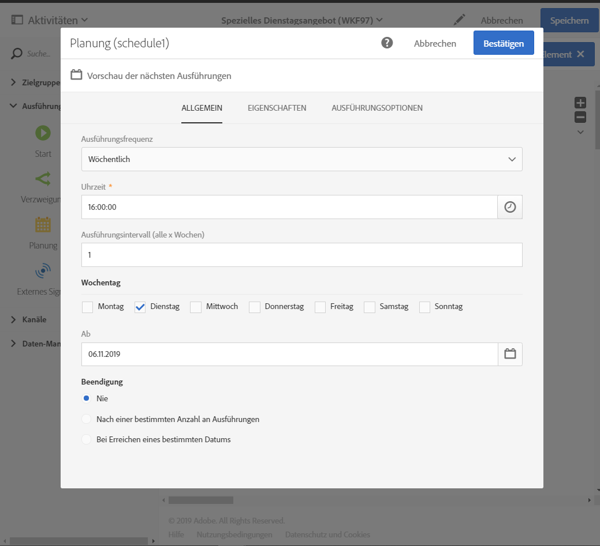
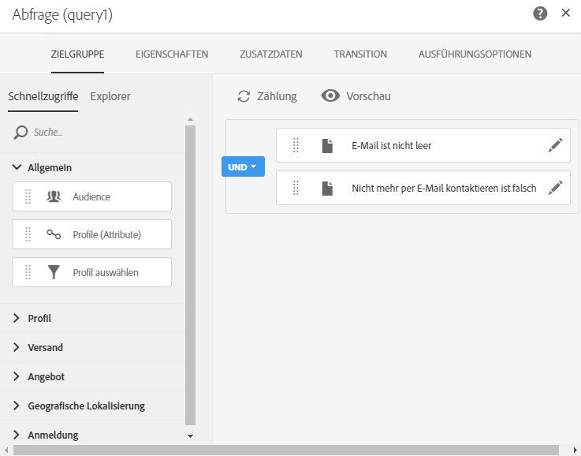

# Workflow-Anwendungsfall: Erstellen eines E-Mail-Versands, der jeden Dienstag ausgeführt wird{#creating-email-every-tuesday}

Sie haben die Möglichkeit, beispielsweise jeden Dienstag allen Kunden eine E-Mail mit speziellen Angeboten zu senden.

1. Wählen Sie dazu in **[!UICONTROL Marketingaktivitäten]**die Option**[!UICONTROL  Erstellen]** und dann **[!UICONTROL Workflow]**aus.
1. Wählen Sie als Workflow-Typ **[!UICONTROL Neuer Workflow]**und danach**[!UICONTROL  Weiter]** aus.
1. Geben Sie die Eigenschaften des Workflows ein und wählen Sie **[!UICONTROL Erstellen]**aus.

## Planungsaktivität erstellen{#creating-a-scheduler-activity}

1. In **[!UICONTROL Activities]**>**[!UICONTROL  Execution]**, drag and drop a **[!UICONTROL Scheduler activity]**.
1. Doppelklicken Sie auf die Aktivität.
1. Konfigurieren Sie Ihren Versand.
1. Wählen Sie in **[!UICONTROL Ausführungsfrequenz]**die Option**[!UICONTROL  Wöchentlich]** aus.
1. Wählen Sie eine **[!UICONTROL Zeit]**und das**[!UICONTROL  Ausführungsintervall]** für Ihre Sendungen aus.
1. Wählen Sie in **[!UICONTROL Wochentage]****[!UICONTROL  Dienstag]** aus.
1. Geben Sie für Ihren Workflow einen **[!UICONTROL Start]**und einen**[!UICONTROL  Gültigkeitsparameter]** ein.
1. Bestätigen Sie die Aktivität und speichern Sie den Workflow.

>[!NOTE]
>
>Um Ihren Workflow in einer bestimmten Zeitzone auszuführen, richten Sie in den **[!UICONTROL Ausführungsoptionen]**die Zeitzone für Ihren Zeitplan im Feld**[!UICONTROL  Zeitzone]** ein. Standardmäßig ist die ausgewählte Zeitzone die in den Workflow-Eigenschaften definierte Zeitzone (siehe [Erstellen eines Workflows](../../automating/using/building-a-workflow.md)).

## Abfrageaktivität erstellen{#creating-a-query-activity}.

1. In **[!UICONTROL Activities]**>**[!UICONTROL  Targeting]**, to select recipients, drag and drop a **[!UICONTROL query]**activity and double-click it.
1. In **[!UICONTROL Shortcuts]**>**[!UICONTROL  Profile]**, drag and drop **[!UICONTROL Email]**.
1. Wählen Sie als Operator **[!UICONTROL Ist nicht leer]**aus.
1. In **[!UICONTROL Shortcuts]**>**[!UICONTROL  General]**, add profiles and select **[!UICONTROL no longer contact by email]**with the value**[!UICONTROL  No]**.
1. Wählen Sie **[!UICONTROL Bestätigen]**aus.

## E-Mail-Versand erstellen{#creating-an-email-delivery}.

1. In **[!UICONTROL Activities]**>**[!UICONTROL  Channels]**, drag and drop an **[!UICONTROL Email delivery]**.
1. Wählen Sie die Aktivität aus und danach , um die Bearbeitung zu ermöglichen.
1. Wählen Sie **[!UICONTROL Wiederkehrende E-Mail]**und danach**[!UICONTROL  Weiter]** aus.
1. Wählen Sie eine E-Mail-Vorlage und danach **[!UICONTROL Weiter]**aus.
1. Geben Sie die E-Mail-Eigenschaften ein und wählen Sie **[!UICONTROL Weiter]**aus.
1. Um das Layout Ihrer E-Mail zu definieren, wählen Sie **[!UICONTROL Email Designer]**aus.
1. Fügen Sie Elemente ein oder wählen Sie eine bestehende Vorlage aus.
1. Personalisieren Sie Ihre E-Mail mit Feldern und Links.
1. Wählen Sie **[!UICONTROL Speichern]**aus.

Weiterführende Informationen dazu finden Sie im Abschnitt zum [Gestalten einer E-Mail](../../designing/using/designing-from-scratch.md#designing-an-email-content-from-scratch).

**Verwandte Themen:**

* [Abfrageaktivität](../..//automating/using/query.md)
* [Planungsaktivität](../..//automating/using/scheduler.md)
* [E-Mail-Versand](../..//automating/using/email-delivery.md)
* [E-Mail-Kanal](../..//channels/using/creating-an-email.md)
