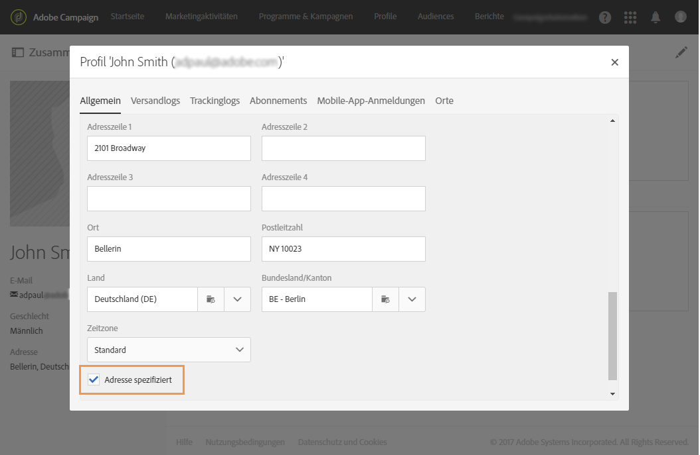
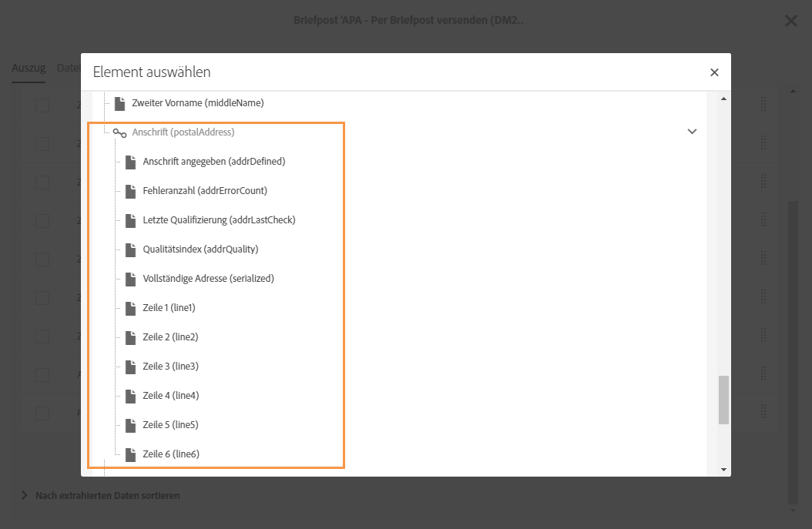

# Über Briefpost{#about-direct-mail}

Briefpost ist ein Offline-Kanal, über den Sie eine für Briefpost-Dienstleister nötige Datei erstellen und personalisieren können. Sie erhalten damit die Möglichkeit, Online- und Offline-Kanäle in Ihren Customer Journeys zu mischen.

>[!NOTE]
>
>Hierbei handelt es sich um eine optionale Funktion. Prüfen Sie diesbezüglich Ihren Lizenzvertrag. Für die Verwendung von Briefpost ist die **[!UICONTROL Export]**-Rolle erforderlich. Kontaktieren Sie diesbezüglich Ihren Administrator.

Über Online-Kanäle können Sie Nachrichten erstellen (E-Mail, SMS, Mobile-App-Versand etc.) und direkt über Adobe Campaign an Ihre Audience senden. Offline-Kanäle sind anders. Wenn Sie einen Briefpost-Versand vorbereiten, erzeugt Adobe Campaign eine Datei, die alle Zielgruppenprofile und die ausgewählte Kontaktinformationen enthält (z. B. Postanschrift). Dann senden Sie diese Datei an Ihren Briefpost-Dienstleister, der den tatsächlichen Versand vornimmt.

Im folgenden Abschnitt erfahren Sie, wie Sie einen einmaligen Briefpost-Versand erstellen. Sie können auch eine Briefpost-Aktivität in einen Workflow einbauen, um Kampagnen mit kombinierten Online- und Offline-Kanälen aufeinander abzustimmen. Weitere Informationen hierzu finden Sie im [Workflow](../../automating/using/get-started-workflows.md)-Handbuch.

Gehen Sie in Adobe Campaign folgendermaßen vor:

1. Versand erstellen
1. Audience auswählen
1. Nachrichteninhalt konfigurieren
1. Kontaktdatum festlegen
1. Datei erstellen

**Verwandte Themen:**

* [Verwendungsfall: Versand von E-Mail- und Direktversand](../../automating/using/coupling-email-direct-mail.md)

## Empfehlungen    {#recommendations}

### Briefpost-Dienstleister {#direct-mail-providers}

Erkundigen Sie sich zunächst bei Ihrem Briefpost-Dienstleister nach seinen Empfehlungen. Finden Sie heraus, welche Profilinformationen in der Extraktionsdatei enthalten sein müssen, damit der Anbieter die Nachrichten personalisieren und der Audience senden kann. Hierzu zählen beispielsweise der Vor- und Nachname, die Anschrift und ein Promotioncode. Diese Felder können Sie im Briefpost-Inhalt im Tab [Extraktion definieren](../../channels/using/defining-the-direct-mail-content.md#defining-the-extraction) hinzufügen.

Achten Sie darauf, dass in der Profilinformation die Option **[!UICONTROL Anschrift angegeben]** aktiviert ist. Wenn diese Option aktiviert ist, wird das Profil zur Zielgruppe hinzugefügt. Ist sie das nicht, wird sie in der Vorbereitungsphase durch eine Typologieregel ausgeschlossen (siehe [Briefpost erstellen](../../channels/using/creating-the-direct-mail.md)). Vergessen Sie nicht, bei einem Profilimport dieses Feld zu aktualisieren.

### Postanschriften  {#postal-addresses}

Die Anschriftsfelder zum Hinzufügen in die Extraktionsdatei finden Sie im Knoten **[!UICONTROL Ort]**.

Adobe Campaign bietet eine Reihe vordefinierter, berechneter Felder, die den allgemeinen Standards für Postanschriften entsprechen. Die Felder sind im Knoten **[!UICONTROL Anschrift]** verfügbar.

Standardmäßig kann eine Anschrift bis zu sechs Zeilen aufweisen: Das erste berechnete Feld (**[!UICONTROL Zeile 1]**) enthält den Vor- und Nachnamen des Empfängers, die folgenden Zeilen die für die Zustellung erforderlichen Informationen (z. B. Straße und Zusätze) und die letzte Zeile Postleitzahl und Ort.

