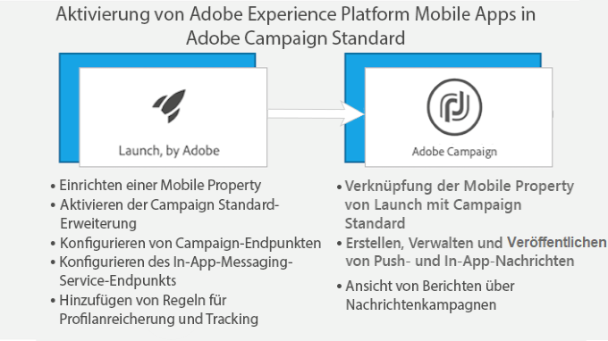

# Über In-App-Messaging{#about-in-app-messaging}

In-App-Messaging ist ein Messaging-Kanal, mit dem Sie in einer App eine Nachricht einblenden können, wenn ein Benutzer diese gerade verwendet. Dieser Nachrichtentyp ist eine Ergänzung zu Push-Benachrichtigungen, mit denen Nachrichten direkt an die Benachrichtigungszentrale des Telefons des Benutzers gesendet werden. Weiterführende Informationen zu Push-Benachrichtigungen erhalten Sie in [diesem Abschnitt](../../channels/using/about-push-notifications.md).

Dieser Kanal erfordert die Integration von Mobile Apps mit dem Adobe Experience Platform SDK. Diese Apps müssen in Adobe Experience Platform Launch aktiviert werden, damit sie in Adobe Campaign für In-App-Sendungen verfügbar sind.

Um In-App-Nachrichten mithilfe des Experience Platform SDK über Mobile Apps senden zu können, müssen folgende Voraussetzungen gegeben sein:

1. Sie benötigen in Adobe Campaign Zugriff auf den **[!UICONTROL In-App]**-Kanal. Wenn Sie keinen Zugriff auf diesen Kanal haben, kontaktieren Sie das für Ihr Konto zuständige Team.

1. Anwendungsfälle für Mobilgeräte, die in Adobe Campaign Standard in Kombination mit einer Experience Cloud SDK-Applikation unterstützt werden, erfordern eine in Adobe Experience Platform Launch erstellte und in Adobe Campaign Standard konfigurierte App. Eine Schritt-für-Schritt-Anleitung hierzu finden Sie auf dieser [Seite](https://helpx.adobe.com/de/campaign/kb/configuring-app-sdk.html).

1. Nach der Konfiguration können Sie Ihre In-App-Nachricht vorbereiten. Weiterführende Informationen hierzu finden Sie auf dieser [Seite](../../channels/using/preparing-and-sending-an-in-app-message.md#preparing-your-in-app-message).

1. Im Anschluss daran bestimmen Sie noch, ob Sie eine [In-App-Nachricht](../../channels/using/customizing-an-in-app-message.md) versenden oder eine [Nachricht vom Typ &quot;Lokale Benachrichtigung&quot; anpassen](../../channels/using/customizing-an-in-app-message.md#customizing-a-local-notification-message-type) möchten.

1. Ihre Nachricht ist jetzt bereit für den Versand. Weiterführende Informationen finden Sie auf dieser [Seite](../../channels/using/preparing-and-sending-an-in-app-message.md#sending-your-in-app-message).

**Verwandte Inhalte:**

* [In-App-Bericht](../../reporting/using/in-app-report.md)
* [Unterstützte Anwendungsfälle für Smartphones und Tablets in Adobe Campaign Standard](https://helpx.adobe.com/de/campaign/kb/configure-launch-rules-acs-use-cases.html)
* [Handbuch zu Campaign Standard Mobile](https://helpx.adobe.com/de/campaign/kb/acs-mobile.html)

## Häufig gestellte Fragen zu In-App-Nachrichten {#in-app-faq}

### Welche nützlichen Ressourcenempfehlungen stehen zur Verfügung, um mehr über In-App-Kanal in Adobe Campaign Standard zu erfahren? {#resources-inapp}

Sehen Sie sich die folgenden Ressourcen an:

* [Video-Tutorials](https://docs.adobe.com/content/help/en/campaign-standard-learn/tutorials/communication-channels/mobile/in-app/in-app-message-overview.html)
* [Blog-Post](https://theblog.adobe.com/get-more-out-of-the-new-in-app-message-channel-from-adobe-campaign/)
* [Community-Seite](https://experienceleaguecommunities.adobe.com/t5/adobe-campaign-standard/ct-p/adobe-campaign-standard-community)

### Welchen Zweck haben die APIs für Kampagne-Erweiterungen setLinkageField und resetLinkageField? {#extensions-apis}

Da In-App-Nachrichten vom SDK aus der Kampagne gezogen werden, möchten wir einen sicheren Mechanismus bereitstellen, um sicherzustellen, dass In-App-Nachrichten mit PII-Daten nicht in böswillige Hände fallen. Daher haben wir einen folgenden Mechanismus eingerichtet, um den sicheren Versand von Nachrichten an das Gerät sicherzustellen:

* Die Kunden kennzeichnen die Felder für mobile Profil (appSubscriberRcp-Tabelle) als &quot;Persönlich&quot;und &quot;Sensitiv&quot;, wenn sie sicherstellen möchten, dass diese Informationen sicher bereitgestellt werden.
* Als solche gekennzeichnete Felder können nur in der Vorlage &quot;Profil&quot;(nicht in der AppSubscriber-Vorlage oder Broadcast-Vorlage) verwendet werden, in der ein zusätzlicher Sicherheitsmechanismus integriert ist.
* Nachrichten, die mit der Vorlage &quot;Profil&quot;erstellt wurden, können nur verarbeitet werden, wenn sich der Benutzer bei der App angemeldet hat.
* Um diesen sicheren Handshake zu erleichtern, sollten Entwickler von mobilen Apps zusätzliche Authentifizierungsdetails mit der setLinkageField-API weiterleiten. Beachten Sie, dass das Verknüpfungsfeld diejenigen ist, die beim Erweitern der AppSubscriberRcp-Tabelle als Link zwischen dem Mobile Profil und dem CRM-Profil identifiziert werden.
* Sie sollten die auf dem Gerät gespeicherten In-App-Nachrichten löschen und &quot;resetLinkagefields&quot;zurücksetzen, wenn sich der Benutzer mit resetLinkageField aus der App abmeldet. Dadurch wird sichergestellt, dass andere Benutzer, die sich bei der App anmelden, die für den vorherigen Benutzer vorgesehenen Meldungen nicht sehen.
* Informationen zur clientseitigen Implementierung dieses Sicherheitsmechanismus finden Sie unter [Mobile SDK APIs](https://aep-sdks.gitbook.io/docs/using-mobile-extensions/adobe-campaign-standard/adobe-campaign-standard-api-reference) .

### Was muss ich tun, um In-App-Berichte in der Kampagne zu aktivieren? {#enable-inapp-reporting}

Sie müssen den In-App-Tracking-Postback konfigurieren. Instructions can be found [here](https://helpx.adobe.com/campaign/kb/config-app-in-launch.html#InApptrackingpostback).

Informationen zur Implementierung der Verfolgung lokaler Benachrichtigungen finden Sie auf dieser [Seite](../../administration/using/local-tracking.md).

### Welche Berichte stehen für In-App-Kanal zur Verfügung? {#report-inapp}

In Adobe Campaign für In-App-Kanal steht ein vordefinierter Bericht zur Verfügung. Refer to this [documentation](../../reporting/using/in-app-report.md).

Auf dieser [Seite](../../reporting/using/indicator-calculation.md#in-app-delivery) erfahren Sie, wie die einzelnen In-App-Metriken berechnet werden.

### Unterstützen Sie mehrsprachige Inhaltsvarianten für In-App ähnlich wie Push? {#multilingual-inapp}

Für In-App-Nachrichten stehen jetzt keine mehrsprachigen Vorlagen zur Verfügung.

Wenn das Ziel jedoch darin besteht, eine In-App-Nachricht in einer anderen Sprache als Englisch zu senden, können die Inhalte direkt in die verfügbaren Textfelder eingefügt werden.

### Können Kampagne-Personalisierungsfelder zu benutzerdefiniertem HTML hinzugefügt werden? {#custom-html-inapp}

Nein, das wird noch nicht unterstützt.

### Ich habe eine Warnmeldung konfiguriert, die jedoch nicht auf dem Gerät angezeigt wird. {#alert-message}

Für Warnmeldungen ist mindestens eine Schaltfläche zum Schließen erforderlich (bei primärem oder sekundärem Auftreten der Aktionsunterbrechung). Andernfalls kann die Nachricht gespeichert werden, sie wird jedoch nicht empfangen.

### Wenn lokale Benachrichtigungen iOS-Benutzerdefinierter Sound nicht abgespielt wird; Wird stattdessen der Standard-Sound abgespielt? {#local-notification-sound}

Für benutzerdefinierten Sound unter iOS müssen Sie beim Erstellen einer lokalen Benachrichtigung (z. B. &quot;sound.caf&quot;) einen Dateinamen mit einer Erweiterung angeben. Wenn diese Erweiterung nicht bereitgestellt wird, wird der Standardsound verwendet.

### Werden Deep-Links in In-App-Nachrichten unterstützt? {#inapp-deeplinks}

Ja, Deep-Links werden in In-App-Nachrichten unterstützt. Deep-Links sollten Folgendes umfassen:

* -Sprache, in der festgelegt wird, dass die Verfolgung von Versänden deaktiviert werden muss, damit die Deep-Links funktionieren.
* Appsflyer mit Zweig als Partner, die die deeplink-Verfolgung durchführen können. Weitere Informationen zur Branch- und Adobe Campaign Standard-Integration finden Sie auf dieser [Seite](https://help.branch.io/using-branch/docs/adobe-campaign-standard-1).

### Kann eine In-App-Nachricht ausgelöst werden, wenn der Benutzer die App über eine Push-Benachrichtigung startet? {#inapp-push-trigger}

Ja, diese Nachrichten werden auch als &quot;daisy chain&quot;-Nachrichten bezeichnet. Gehen Sie wie folgt vor:

1. Erstellen einer In-App-Nachricht.

1. Definieren Sie ein benutzerdefiniertes Ereignis und wählen Sie es als Ereignis-Auslöser für diese IAM, z. &quot;Auslöser aus Herbst Vorschau Push&quot;.

1. Definieren Sie beim Authoring Ihrer Push-Nachricht eine benutzerdefinierte Variable, deren Wert als Ereignis festgelegt werden kann, das IAM auslöst, z. B. Schlüssel = &quot;inappkey&quot;und Wert = &quot;Trigger from fall Vorschau Push&quot;.

1. Implementieren Sie im Code der mobilen App den Ereignis-Auslöser wie folgt:

   
