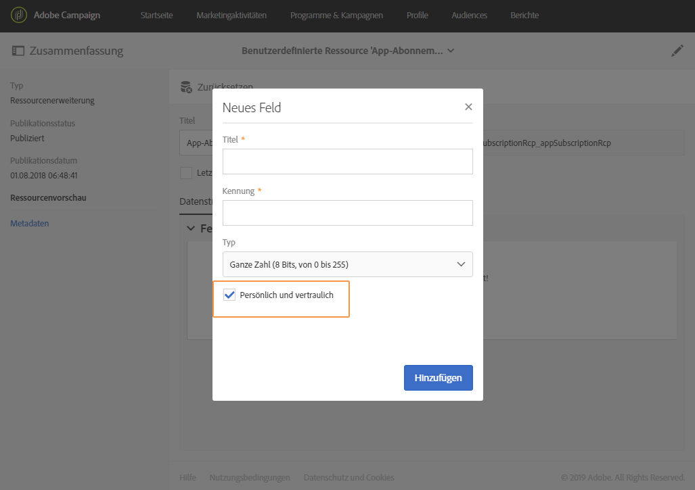

# Über In-App-Messaging{#about-in-app-messaging}

In-App-Messaging ist ein Messaging-Kanal, mit dem Sie in einer App eine Nachricht einblenden können, wenn ein Benutzer diese gerade verwendet. Dieser Nachrichtentyp ist eine Ergänzung zu Push-Benachrichtigungen, mit denen Nachrichten direkt an die Benachrichtigungszentrale des Telefons des Benutzers gesendet werden. Weiterführende Informationen zu Push-Benachrichtigungen erhalten Sie in [diesem Abschnitt](../../channels/using/about-push-notifications.md).

Dieser Kanal erfordert die Integration von Mobile Apps mit dem Adobe Experience Platform SDK. Diese Mobile Apps müssen in der Datenerfassungs-UI aktiviert werden, damit sie in Adobe Campaign für In-App-Sendungen verfügbar sind.

Um In-App-Nachrichten mithilfe des Experience Platform SDK über Mobile Apps senden zu können, müssen folgende Voraussetzungen gegeben sein:

1. Sie benötigen in Adobe Campaign Zugriff auf den **[!UICONTROL In-App]**-Kanal. Wenn Sie keinen Zugriff auf diesen Kanal haben, kontaktieren Sie das für Ihr Konto zuständige Team.

1. Anwendungsfälle für Mobilgeräte, die in Adobe Campaign Standard in Kombination mit einer Experience Cloud SDK-Anwendung unterstützt werden, erfordern eine in der Datenerfassungs-UI erstellte und in Adobe Campaign Standard konfigurierte Mobile App. Eine Schritt-für-Schritt-Anleitung hierzu finden Sie auf dieser [Seite](../../administration/using/configuring-a-mobile-application.md).

1. Nach der Konfiguration können Sie Ihre In-App-Nachricht vorbereiten. Weiterführende Informationen hierzu finden Sie auf dieser [Seite](../../channels/using/preparing-and-sending-an-in-app-message.md#preparing-your-in-app-message).

1. Im Anschluss daran bestimmen Sie noch, ob Sie eine [In-App-Nachricht](../../channels/using/customizing-an-in-app-message.md) versenden oder eine [Nachricht vom Typ &quot;Lokale Benachrichtigung&quot; anpassen](../../channels/using/customizing-an-in-app-message.md#customizing-a-local-notification-message-type) möchten.

1. Ihre Nachricht ist jetzt bereit für den Versand. Weiterführende Informationen finden Sie auf dieser [Seite](../../channels/using/preparing-and-sending-an-in-app-message.md#sending-your-in-app-message).

**Verwandte Inhalte:**

* [In-App-Bericht](../../reporting/using/in-app-report.md)
* [Unterstützte Anwendungsfälle für Smartphones und Tablets in Adobe Campaign Standard](../../administration/using/configuring-rules-launch.md)
* [Handbuch zu Campaign Standard Mobile](../../channels/using/get-started-communication-channels.md)

## Mobile Profilfelder mit personenbezogenen und sensiblen Daten verwenden {#handling-mobile-profile-fields-with-personal-and-sensitive-data}

In Adobe Campaign sind Attribute zu mobilen Profilen, die von Mobilgeräten gesendet werden, in der Ressource **[!UICONTROL App-Abonnements (appSubscriptionRcp)]** gespeichert. Dort können die Daten definiert werden, die über die Abonnenten Ihrer Apps gesammelt werden sollen.

Diese Ressource muss erweitert werden, damit die gewünschten, vom Mobilgerät an Adobe Campaign gesendeten Daten gesammelt werden. Eine detaillierte Anleitung dazu finden Sie auf dieser [Seite](../../developing/using/extending-the-subscriptions-to-an-application-resource.md).

Um eine sichere Personalisierung Ihrer In-App-Nachrichten zu ermöglichen, müssen die Profilfelder der Mobile App entsprechend konfiguriert werden. Aktivieren Sie in **[!UICONTROL App-Abonnements (appSubscriptionRcp)]** bei der Erstellung der neuen Profilfelder für eine Mobile App die Option **[!UICONTROL Persönlich und vertraulich]**, damit sie bei der Personalisierung von In-App-Nachrichten nicht verfügbar sind.

>[!NOTE]
>
>Wenn zu dieser Tabelle bereits eine Implementierung mit einer benutzerdefinierten Ressourcenerweiterung besteht, empfehlen wir, die Felder entsprechend zu benennen, bevor sie zur Personalisierung von In-App-Nachrichten verwendet werden.

Sobald die benutzerdefinierte Ressource **[!UICONTROL App-Abonnements]** konfiguriert und veröffentlicht wurde, können Sie mit der Vorbereitung Ihres In-App-Versands mit der Vorlage **[!UICONTROL Nutzer der Zielgruppe auf der Basis ihres mobilen Profils (inApp)]** beginnen. Zur Personalisierung stehen dann in der Ressource **[!UICONTROL App-Abonnements (appSubscriptionRcp)]** nur nicht-sensible Felder zur Verfügung.

Wenn Sie eine Personalisierung mit den Feldern **Persönlich und vertraulich** durchführen möchten, empfehlen wir die Verwendung der Vorlage **[!UICONTROL Nutzer der Zielgruppe auf der Basis ihres Campaign-Profils (inAppProfile)]**, die zusätzliche Sicherheitsfunktionen aufweist, sodass die personenbezogenen Daten Ihrer Benutzer geschützt bleiben.
