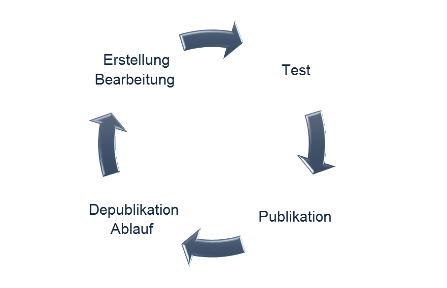

# Über Landingpages{#about-landing-pages}

Campaign bietet eine Landingpage-Funktion an. Landingpages sind Webformulare, mit denen Sie Informationen zu Ihren Audiences erfassen, Abonnements für einen Dienst anbieten, Daten darstellen und Ihre Datenbank erweitern können. Landingpages können außerdem zur Akquise oder Aktualisierung bestehender Profile verwendet werden.

>[!CAUTION]
>
>Landingpages ermöglichen ausschließlich die Aktualisierung von Profilen.

Campaign ist mit einer Reihe nativer Landingpage-Vorlagen ausgestattet:

* **[!UICONTROL Akquise]**: Dies ist die Standardvorlage für Landingpages, mit der Sie Daten in der Campaign-Datenbank erfassen und aktualisieren können.
* **[!UICONTROL Anmeldung]**: Mit dieser Vorlage können Sie Abonnements für einen Dienst anbieten.
* **[!UICONTROL Abmeldung]**: Mit dieser Vorlage können Sie eine Verbindung zwischen einer gesendeten E-Mail und Abonnenten eines Dienstes herstellen, sodass sich diese von diesem Dienst abmelden können.
* **[!UICONTROL Blacklist]**: Verwenden Sie diese Vorlage, wenn ein Kontakt nicht mehr von Campaign kontaktiert werden möchte. Weiterführende Informationen zum Blacklisting erfahren Sie im Abschnitt [Funktionsweise des Opt-in- und Opt-out-Verfahrens in Campaign](../../audiences/using/about-opt-in-and-opt-out-in-campaign.md).

Diese Vorlagen werden bei der Erstellung einer neuen Landingpage standardmäßig vorgeschlagen.

Adobe empfiehlt, eigene Vorlagen durch das Duplizieren nativer Vorlagen zu erstellen. Manche Parameter können nur in Landingpage-Vorlagen festgelegt und nicht direkt in Landingpages geändert werden.

>[!NOTE]
>
>Um auf Landingpage-Vorlagen zuzugreifen, wählen Sie das Adobe Campaign-Logo in der linken oberen Ecke aus und danach **[!UICONTROL Ressourcen]** &gt; **[!UICONTROL Vorlagen]** &gt; **[!UICONTROL Landingpage-Vorlagen]**.

Ein vollständiger Landingpage-Lebenszyklus umfasst die folgenden Phasen:

1. Erstellung: Erstellen Sie den Inhalt der Landingpage.
1. Test: Testen Sie die Landingpage mit einem Testprofil.
1. Publikation: Publizieren Sie die Landingpage.
1. Ablauf oder Depublikation: Depublizieren Sie die Landingpage manuell oder warten Sie, bis die Landingpage abgelaufen und nicht mehr verfügbar ist.

Nach der Erstellung und Publikation einer Landingpage können Sie diese auf einer Webseite zugänglich machen oder einen [direkten Link auf die Landingpage in eine E-Mail einfügen](../../designing/using/links.md#inserting-a-link).

**Verwandte Themen:**

* Video [Creating a landing page](https://helpx.adobe.com/de/campaign/kt/acs/using/acs-create-edit-landing-page-feature-video-use.html)
* [Über eine Landingpage zu einem Dienst anmelden](../../audiences/using/creating-a-service.md)