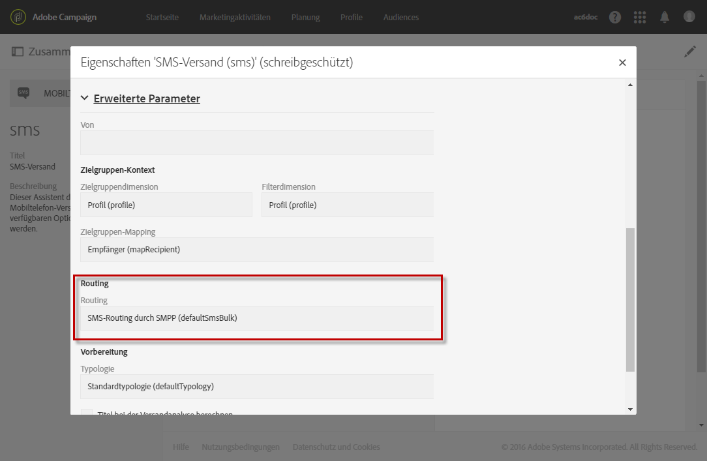

# Über SMS-Nachrichten{#about-sms-messages}

Adobe Campaign ermöglicht den Versand von Nachrichten per SMS (Short Message Service).

>[!NOTE]
>
>SMS-Kanal ist ein Add-on. Prüfen Sie diesbezüglich Ihren Lizenzvertrag.

Die Inhalt-Kachel von SMS bietet ebenfalls die Möglichkeit der Erstellung, Anpassung und Personalisierung von Nachrichteninhalten, jedoch ausschließlich im Textformat. Es ist außerdem möglich, vor dem Versand eine Vorschau der SMS zu erzeugen.

SMS, die das GSM-Alphabet verwenden, sind auf 160 Zeichen begrenzt, in Unicode verfasste SMS auf 70 Zeichen. Beachten Sie, dass gewisse Sonderzeichen einen Einfluss auf die Nachrichtenlänge haben können. Lesen Sie diesbezüglich auch den Abschnitt [SMS-Kodierung](../../administration/using/configuring-sms-channel.md#sms-encoding--length-and-transliteration).

SMS-Nachrichten können im Menü **[!UICONTROL Marketing-Aktivitäten]**, im Rahmen einer Kampagne oder in einem Workflow erstellt werden. Siehe [SMS erstellen](../../channels/using/creating-an-sms-message.md).

Folgende Voraussetzungen müssen gegeben sein, um SMS an Mobiltelefone senden zu können:

* ein externes Konto vom Typ **[!UICONTROL Routing]**, das für den Kanal **[!UICONTROL Mobiltelefon (SMS)]** mit dem Versandmodus **[!UICONTROL Gebündelter Versand]** konfiguriert wurde. Lesen Sie diesbezüglich auch den Abschnitt [Routing](../../administration/using/configuring-sms-channel.md#defining-an-sms-routing).
* Eine Versandvorlage, die auf das externe Konto Bezug nimmt.

**Verwandte Themen:**

* [Vorlagen verwalten](../../start/using/marketing-activity-templates.md)
* [SMS-Konfiguration](../../administration/using/configuring-sms-channel.md#defining-an-sms-routing)
* [SMS-Bericht](../../reporting/using/sms-report.md)
* [Handbuch zu Campaign Standard Mobile](../../channels/using/get-started-communication-channels.md)

## SMS-Versandvorlage {#sms-delivery-template}

Adobe Campaign enthält eine vorkonfigurierte Vorlage für Sendungen auf Mobiltelefone. Diese Vorlage muss korrekt mit dem für den Kanal **[!UICONTROL Mobiltelefon (SMS)]** verwendeten externen Konto verknüpft werden. So greifen Sie zur Bearbeitung darauf zu:

1. Wählen Sie im erweiterten Menü **[!UICONTROL Ressourcen]** > **[!UICONTROL Vorlagen]** > **[!UICONTROL Versandvorlagen]**.
1. Bewegen Sie die Maus über die Vorlage **[!UICONTROL Per SMS senden]** und wählen Sie die Option **Element duplizieren** aus.
1. Wählen Sie die neue Vorlage aus.
1. Benutzen Sie die Schaltfläche **[!UICONTROL Eigenschaften bearbeiten]**.
1. Prüfen Sie im Bereich **[!UICONTROL Erweiterte Parameter]** der Vorlageneigenschaften, ob die Vorlage korrekt mit dem für den SMS-Versand zu verwendenden externen Konto verknüpft ist.

   

**Verwandte Themen:**

* [Vorlagen verwalten](../../start/using/marketing-activity-templates.md)
