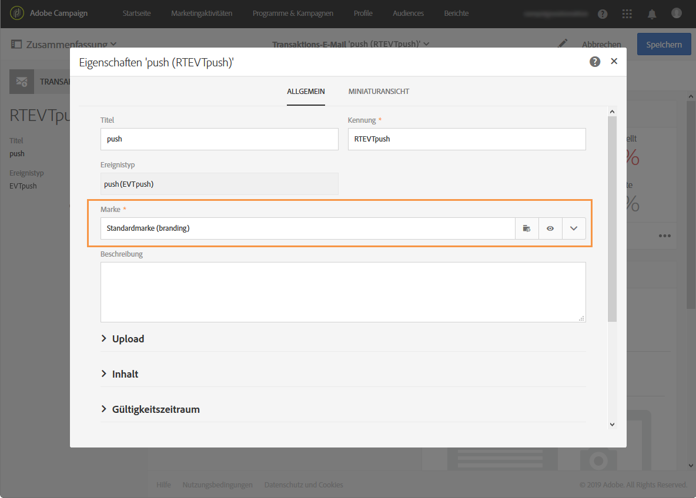

# Über den Versand von Transaktionsnachrichten{#about-transactional-messaging}

Adobe Campaign bietet Ihnen die Möglichkeit der Erstellung und Verwaltung von personalisierten Transaktionsnachrichten.

Bei einer Transaktionsnachricht handelt es sich um eine individuell auf einen Empfänger abgestimmte eindeutige Kommunikation, die beispielsweise über eine Webseite übermittelt wird.

* In der Regel wartet der Empfänger auf diese Art von Nachrichten, weil letztere eine Information enthalten, die er überprüfen bzw. bestätigen möchte. Dabei handelt es sich beispielsweise um Willkommensnachrichten anlässlich von Kontoerstellungen, Versandbestätigungen, Rechnungen oder Kennwortänderungsbestätigungen.
* Angesichts der Tatsache, dass diese Nachrichten großen Einfluss auf die Qualität der Kundenbeziehung haben, erwartet der Benutzer einen Versand in Echtzeit. Der Empfang der Transaktionsnachricht sollte daher nur wenige Augenblicke nach der Auslösung des Ereignisses erfolgen.
* Aufgrund der Wichtigkeit ihres Inhalts weisen Transaktionsnachrichten hohe Öffnungsraten auf.

In Adobe Campaign empfängt die entsprechende Funktion Ereignisse von einem Informationssystem, auf die sie mit personalisierten Transaktionsnachrichten reagiert.

>[!NOTE]
>
>Transaktionsnachrichten können je nach Ihren Optionen per E-Mail, SMS oder Push-Benachrichtigung versendet werden. Prüfen Sie diesbezüglich Ihren Lizenzvertrag.

In Adobe Campaign sind zwei Arten von Transaktionsnachrichten verfügbar:

* [Ereignis-Transaktionsnachrichten](../../channels/using/event-transactional-messages.md), die sich auf ein Ereignis beziehen. In diesem Fall werden die im Ereignis selbst enthaltenen Daten zur Bestimmung der Versandzielgruppe verwendet.
* [Profil-Transaktionsnachrichten](../../channels/using/profile-transactional-messages.md), die sich auf Profile in der Marketingdatenbank von Adobe Campaign beziehen. Sie können mithilfe von Informationen aus der Adobe-Campaign-Datenbank eine Transaktionsnachricht basierend auf Kunden-Marketing-Profilen senden.

Der Nachrichtentyp wird bei der Konfiguration des Ereignisses definiert, das eine Transaktionsnachricht auslösen soll. Siehe [Transaktionsnachrichten konfigurieren](../../administration/using/configuring-transactional-messaging.md).

>[!NOTE]
>
>In Adobe Campaign hat die Verarbeitung von Transaktionsnachrichten Priorität vor allen anderen Sendungen.

Transaktionsnachrichten sind auch in der Adobe Campaign Standard API verfügbar. Weiterführende Informationen finden Sie im [entsprechenden Handbuch](../../api/using/managing-transactional-messages.md).

>[!NOTE]
>
>Alle Transaktionsnachrichten werden nun mit dem Adobe Campaign Enhanced MTA gesendet, um die Zustellbarkeit, den Durchsatz und die Absprungbehandlung zu verbessern. Alle Auswirkungen sind dieselben wie bei standardmäßigen Marketingmeldungen. For more on this, see this [section](../../administration/using/configuring-email-channel.md).

## Funktionsweise von Transaktionsnachrichten {#transactional-messaging-operating-principle}

Nehmen wir zur Erläuterung der Funktionsweise den Fall einer Firmenwebseite, auf der Kunden Artikel kaufen können.

Verlässt ein Webseitenbesucher die Seite, ohne den Kauf abzuschließen, wird ihm automatisch eine Benachrichtigungs-E-Mail zugeschickt, um ihn an seinen stehen gelassenen Warenkorb zu erinnern.

Gehen Sie hierzu wie folgt vor:

1. Konfigurieren Sie ein Ereignis namens &quot;Stehen gelassener Warenkorb&quot;. Bei der Publikation dieser Ereigniskonfiguration wird automatisch eine Transaktionsnachricht erstellt. Die Erstellung und Veröffentlichung eines Ereignisses finden Sie im Abschnitt [Ereignis konfigurieren, um eine Ereignis-Transaktionsnachricht zu senden](../../administration/using/configuring-transactional-messaging.md#use-case--configuring-an-event-to-send-a-transactional-message).
1. Die Transaktionsnachricht muss personalisiert, getestet und dann publiziert werden. Siehe [Ereignis-Transaktionsnachrichten](../../channels/using/event-transactional-messages.md).
1. Außerdem muss dieses Ereignis über die Firmenwebseite unter Verwendung einer Adobe Campaign Standard REST-API gesendet werden, damit ersteres ausgelöst wird, wenn ein Kunde seinen Warenkorb stehen lässt. Siehe [Webseiten-Integration](../../administration/using/configuring-transactional-messaging.md#integrating-the-triggering-of-the-event-in-a-website).

Nachdem all diese Etappen durchlaufen sind, erhält ein Webseitenbesucher, sobald er die Seite verlässt, ohne die Artikel in seinem Warenkorb bestellt zu haben, automatisch eine Benachrichtigungs-E-Mail.

## Publikationsprozess bei Transaktionsnachrichten {#transactional-messaging-pub-process}

Die nachstehende Tabelle zeigt den Publikationsprozess bei Transaktionsnachrichten.

Weiterführende Informationen zu den Schritten der Ereigniskonfiguration finden Sie unter [Transaktionsnachrichten konfigurieren](../../administration/using/configuring-transactional-messaging.md).

## Einschränkungen bei Transaktionsnachrichten {#transactional-messaging-limitations}

>[!NOTE]
>
>Für den Zugriff auf Transaktionsnachrichten benötigen Sie Administratorrechte.

### Gestaltung und Publikation {#design-and-publication}

Bei der Gestaltung und Publikation von Transaktionsnachrichten können manche Schritte nicht mehr rückgängig gemacht werden. Achten Sie bitte auf folgende Einschränkungen:

* Für jede Ereigniskonfiguration kann jeweils nur ein Kanal verwendet werden. Siehe [Ereignis erstellen](../../administration/using/configuring-transactional-messaging.md#creating-an-event).
* Nach der Erstellung des Ereignisses lässt sich der Kanal nicht mehr ändern. Deshalb müssen Sie den Mechanismus festlegen, über den eine Nachricht im Fall einer erfolglosen Sendung über einen anderen Kanal mit einem Workflow gesendet werden kann. Siehe [Workflow-Daten und -Prozesse](../../automating/using/workflow-data-and-processes.md).
* You cannot change the targeting dimension ( **[!UICONTROL Real-time event]** or **[!UICONTROL Profile]** ) after the event is created. Siehe [Ereignis erstellen](../../administration/using/configuring-transactional-messaging.md#creating-an-event).
* Es ist nicht möglich, eine Publikation rückgängig zu machen, Sie können aber ein Ereignis depublizieren: Dadurch wird der Zugriff auf das Ereignis und die damit verknüpften Transaktionsnachrichten gesperrt. Siehe [Ereignis depublizieren](../../administration/using/configuring-transactional-messaging.md#unpublishing-an-event).
* Die einzige Transaktionsnachricht, die mit einem Ereignis verknüpft werden kann, ist die Nachricht, die automatisch beim Publizieren dieses Ereignisses erstellt wird. Siehe [Vorschau erstellen und Ereignis publizieren](../../administration/using/configuring-transactional-messaging.md#previewing-and-publishing-the-event).

### Personalisierung   {#personalization}

Die Möglichkeiten zur Personalisierung eines Nachrichteninhalts hängt vom Typ der Transaktionsnachricht ab. Unten finden Sie die Spezifikationen:

**Ereignisbasierte Transaktionsnachrichten**:

* Die Personalisierungsinformationen stammen von den im Ereignis selbst enthaltenen Daten. Siehe [Ereignis-Transaktionsnachrichten](../../channels/using/event-transactional-messages.md).
* Sie können in einer Ereignis-Transaktionsnachricht nicht die **Abmelde-Link**-Inhaltsbausteine verwenden.
* Beim ereignisbasierten Transaktionsnachrichtenversand sollen ausschließlich die Daten verwendet werden, die im gesendeten Ereignis der Personalisierung von Empfängern und Nachrichteninhalten dienen. Der Inhalt Ihrer Transaktionsnachricht lässt sich jedoch durch die Verwendung von in der Adobe-Campaign-Datenbank enthaltenen Informationen anreichern. Siehe [Inhalt der Transaktionsnachricht anreichern](../../administration/using/configuring-transactional-messaging.md#enriching-the-transactional-message-content).
* Da Ereignis-Transaktionsnachrichten keine Profilinformationen enthalten, sind sie nicht mit Ermüdungsregeln kompatibel (auch nicht, wenn sie mit Profilen angereichert werden). Näheres dazu finden Sie unter [Ermüdungsregeln](../../sending/using/fatigue-rules.md).

**Profilbasierte Transaktionsnachrichten**:

* Die Personalisierungsinformationen können von den im Ereignis enthaltenen Daten oder von den abgestimmten Profildaten stammen. Siehe [Profil-Transaktionsnachrichten](../../channels/using/profile-transactional-messages.md).
* Sie können in einer Profil-Transaktionsnachricht die **Abmelde-Link**-Inhaltsbausteine verwenden. Siehe [Inhaltsbausteine](../../designing/using/personalization.md#adding-a-content-block).
* Ermüdungsregeln sind mit Profil-Transaktionsnachrichten kompatibel. Näheres dazu finden Sie unter [Ermüdungsregeln](../../sending/using/fatigue-rules.md).

Beachten Sie, dass Produktlisten nur in Nachrichten von Transaktions-E-Mails verfügbar sind. Siehe [Produktlisten in Transaktionsnachrichten verwenden](../../channels/using/event-transactional-messages.md#using-product-listings-in-a-transactional-message).

### Berechtigungen und Branding   {#permissions-and-branding}

Beim [Branding](../../administration/using/branding.md) bieten Transaktionsnachrichten weniger Flexibilität als Standardnachrichten. Adobe recommends linking all brands used in transactional messages to the **[!UICONTROL All]** [organizational unit](../../administration/using/organizational-units.md). Weiterführende Informationen dazu finden Sie in der unten stehenden Erläuterung.

Bei der Bearbeitung einer Transaktionsnachricht können Sie sie mit einer Marke verknüpfen, um einige Parameter automatisch einzufügen, wie z. B. den Markennamen oder das Markenlogo. The **[!UICONTROL Default brand]** is selected by default in the transactional message properties.

All objects (including branding) used in a transactional message must be visible from the **[!UICONTROL Message Center]** organizational unit, meaning that these objects must be in the **[!UICONTROL Message Center]** or **[!UICONTROL All]** organizational units.

However, if the brand selected in the message properties is linked to an organizational unit which is different from **[!UICONTROL Message Center]** or **[!UICONTROL All]**, this will cause an error and you will not be able to send the transactional message.

Therefore, if you want to use multi-branding in the context of transactional messaging, you should link all brands either to the **[!UICONTROL Message Center]** organizational unit or to the **[!UICONTROL All]** organizational unit.

### Transaktionsnachrichten exportieren und importieren {#exporting-and-importing-transactional-messages}

* Um eine Transaktionsnachricht zu exportieren, müssen Sie bei der [Erstellung des Package-Exports](../../automating/using/managing-packages.md#creating-a-package) die entsprechende Ereigniskonfiguration einbeziehen.
* Nachdem die Transaktionsnachricht [in einem Package importiert wurde](../../automating/using/managing-packages.md#importing-a-package), wird sie nicht mehr in der Liste der Transaktionsnachrichten angezeigt. [Publizieren](../../administration/using/configuring-transactional-messaging.md#previewing-and-publishing-the-event) Sie die Ereigniskonfiguration, um die damit verbundene Transaktionsnachricht verfügbar zu machen.

