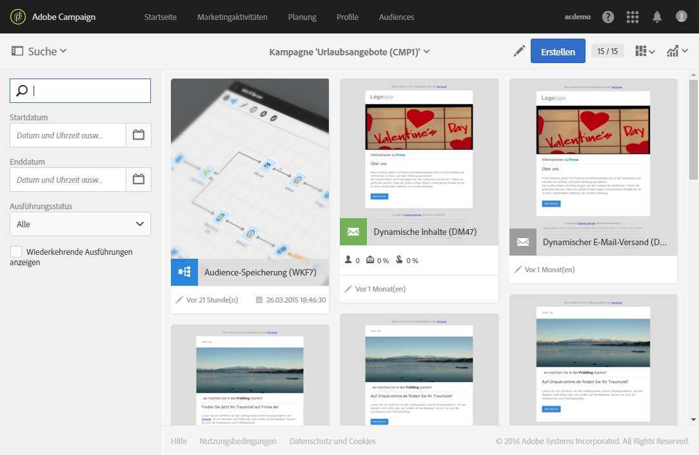
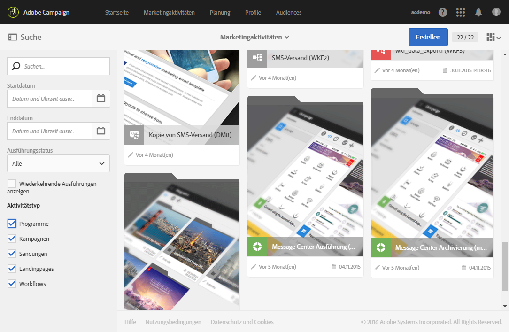

# Zugriff auf Nachrichten{#accessing-messages}

Hierzu bietet die Lösung weitreichende Funktionen, die von der Zielgruppenbestimmung über die Erstellung und Personalisierung von Nachrichten bis hin zur automatisierten Ausführung und detaillierten Analyse von Kampagnen reichen.

Der Zugriff auf Nachrichten erfolgt:

* innerhalb einer Kampagne,
* ausgehend von der Adobe-Campaign-Startseite,
* ausgehend von der Liste der Marketing-Aktivitäten.

## Zugriff auf Nachrichten in Kampagnen      {#accessing-messages-in-campaigns}

Um auf die Liste der Marketing-Aktivitäten einer Kampagne zuzugreifen, gehen Sie folgendermaßen vor:

1. Öffnen Sie in der Navigationsleiste am oberen Bildschirmrand die **[!UICONTROL Marketing-Aktivitäten]**.
1. Wählen Sie **[!UICONTROL Marketing-Aktivitäten > Marketing-Pläne > Programme &amp; Kampagnen aus]**.

   Sie können auch direkt von der Startseite aus auf die Karte **[!UICONTROL Programme &amp; Kampagnen]** zugreifen. Lesen Sie den Abschnitt [Programme und Kampagnen](../../start/using/programs-and-campaigns.md) für weiterführende Informationen.

1. Öffnen Sie dann das Programm und die Kampagne, die die gesuchten Aktivitäten enthält.

   

1. Öffnen Sie die Dropdown-Liste **[!UICONTROL Zusammenfassung]**.
1. Wählen Sie darin die Option **[!UICONTROL Suche]** aus, um die angezeigten Nachrichten nach Namen, Datum oder Status zu filtern.

   Um wiederkehrende Nachrichten zu filtern, aktivieren Sie die entsprechende Option.

## Zugriff auf die Nachrichtenliste      {#accessing-the-message-list}

Um auf die vollständige Liste der Marketing-Aktivitäten aller Kampagnen zuzugreifen, gehen Sie folgendermaßen vor:

1. Öffnen Sie in der Navigationsleiste am oberen Bildschirmrand die **[!UICONTROL Marketing-Aktivitäten]**.

   Sie können auch direkt über die Karte **[!UICONTROL Marketing-Aktivitäten]** auf der Startseite darauf zugreifen. Weiterführende Informationen zur Liste der Marketing-Aktivitäten finden Sie im Abschnitt [Marketing-Aktivitäten verwalten](../../start/using/marketing-activities.md#creating-a-marketing-activity).

1. Um die angezeigten Marketing-Aktivitäten nach Namen, Datum, Status oder Typ zu filtern, stehen links im Bildschirm verschiedene Felder zur **[!UICONTROL Suche]** zur Verfügung.

## Nachrichtenstatus {#message-life-cycle}

Der Status einer Nachricht wird auf ihrer Karte durch eine bestimmte Farbe symbolisiert. Folgende Status sind möglich:

* **[!UICONTROL In Bearbeitung]** (grau): Nachricht wurde noch nicht gesendet.
* **[!UICONTROL Gestartet]** (blau): Nachricht wird gesendet.
* **[!UICONTROL Abgeschlossen]** (grün): Versand wurde ohne Fehler beendet.
* **[!UICONTROL Mit Fehlern]** (rot): Versand wurde abgebrochen oder bei der Vorbereitung bzw. dem Versand ist ein Fehler aufgetreten.

  >[!NOTE]
  >
  >Oberhalb der Karte kann ein gelbes Banner erscheinen, wenn das Eingreifen eines Benutzers erforderlich ist, beispielsweise wenn eine Versandvalidierung aussteht.
