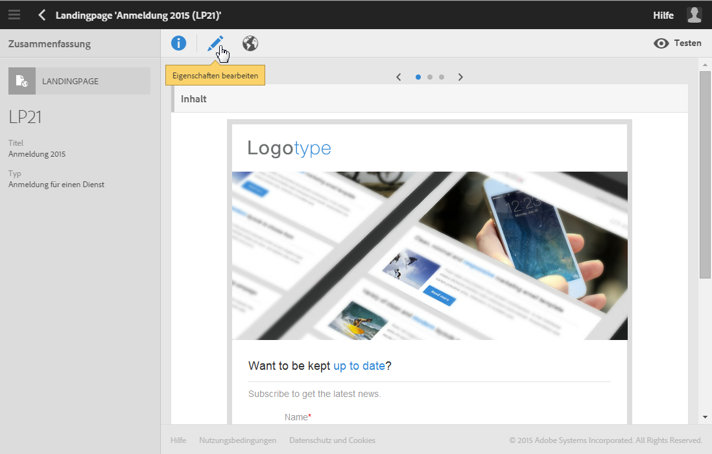
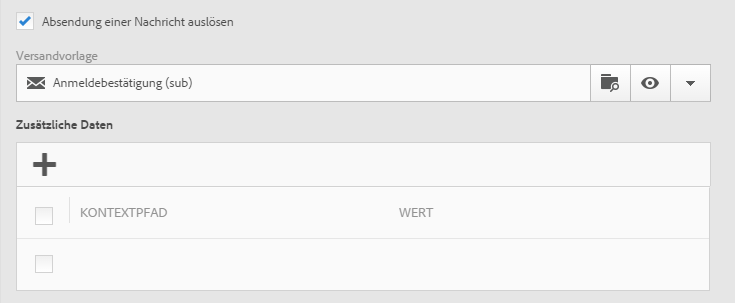
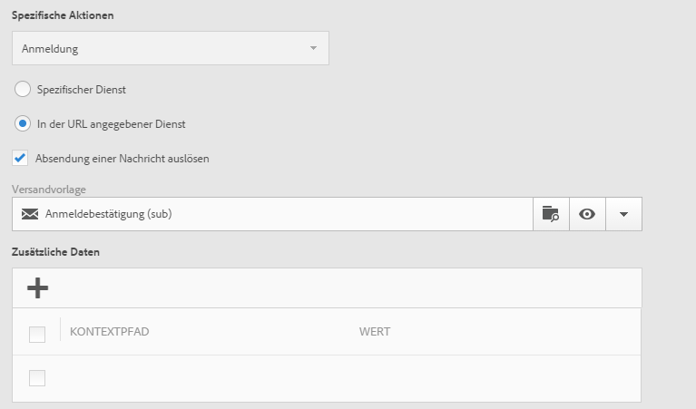
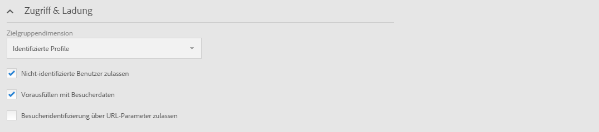
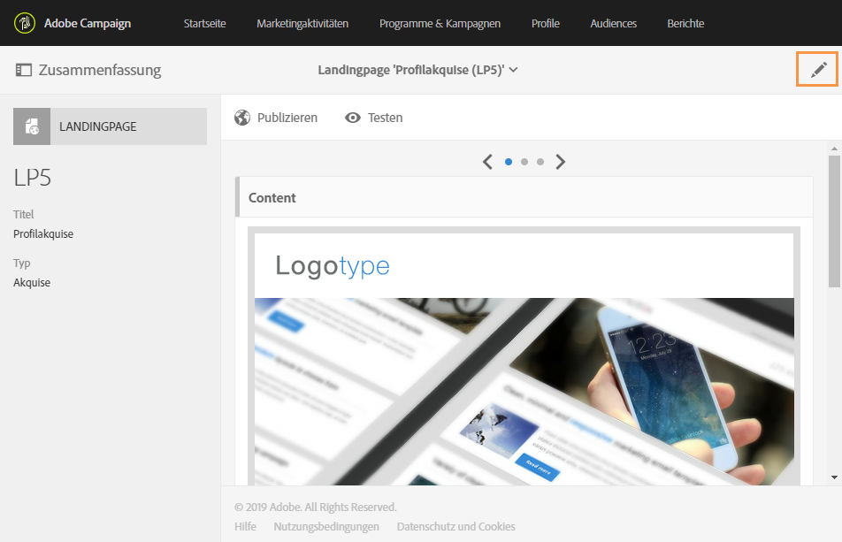
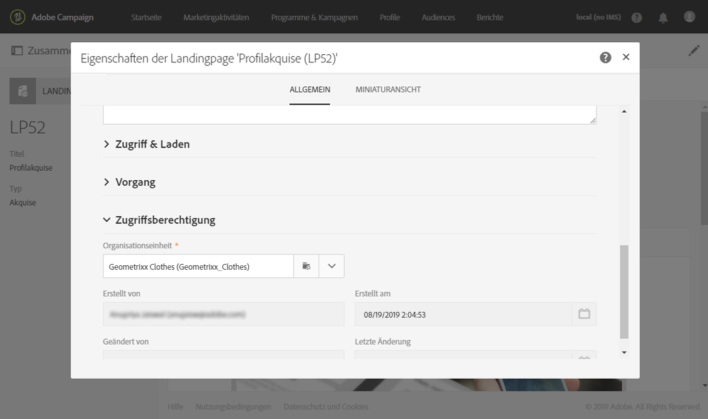
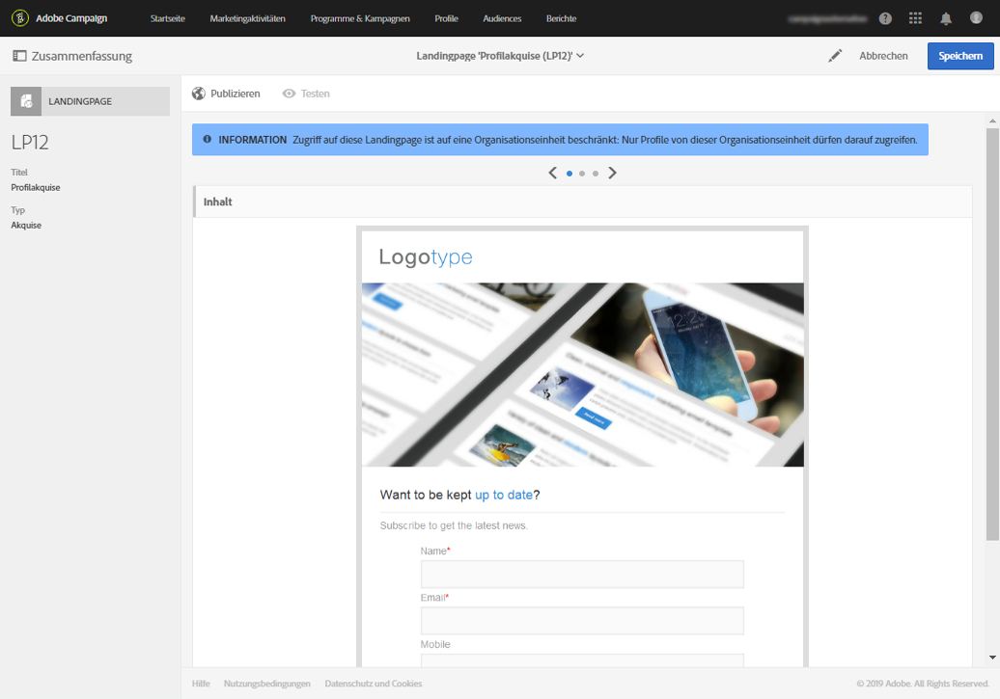
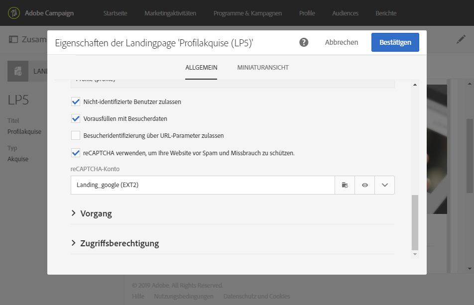
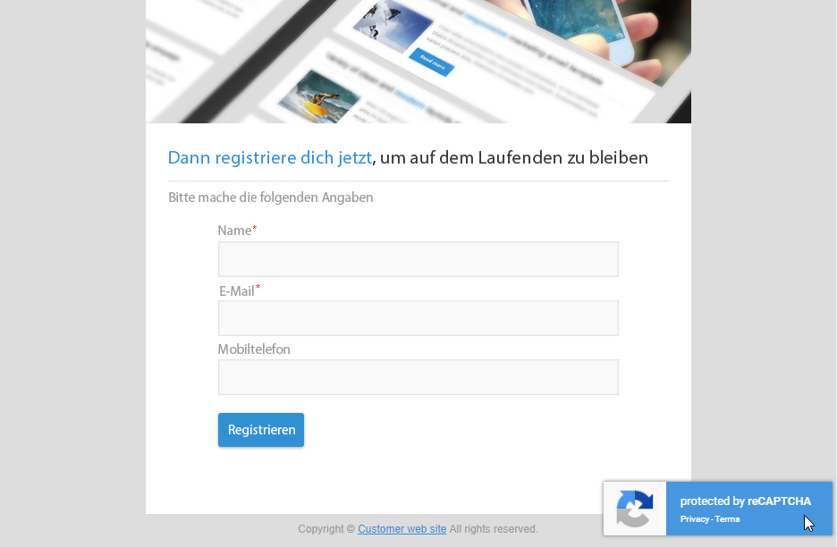

# Konfigurieren einer Landingpage {#configuring-landing-page}

## Versand einer Landingpage bestätigen   {#confirm-a-landing-page-submission}

Sie können auswählen, welche Aktion beim Absenden einer Landingpage durch einen Besucher ausgelöst werden soll. Gehen Sie wie folgt vor:

1. Bearbeiten Sie die Landingpage-Eigenschaften über das Symbol  im Landingpage-Dashboard und rufen Sie die Parameter **[!UICONTROL Vorgang]** auf.

   

1. Wählen Sie unter dem Abschnitt **[!UICONTROL Spezifische Aktionen]** die Option **[!UICONTROL Absendung einer Nachricht auslösen]** aus, um den automatischen Versand einer Nachricht auszulösen, z. B. einer Anmeldebestätigung. Wählen Sie anschließend eine E-Mail-Versandvorlage aus.

   Beachten Sie, dass Sie in diesem Bildschirm keine Bestätigungsnachricht auswählen sollten, falls bereits eine Bestätigungsnachricht auf Dienstebene konfiguriert ist, damit nicht mehrere Bestätigungsnachrichten gesendet werden. Lesen Sie diesbezüglich auch den Abschnitt [Dienst erstellen](../../audiences/using/creating-a-service.md).

1. Erstellen Sie **[!UICONTROL Zusatzdaten]**, um beim Senden der Landingpage ein Speichern von Zusatzdaten zu ermöglichen. Die Zusatzdaten sind für den Besucher nicht sichtbar. Nur konstante Werte werden berücksichtigt.

   

## Verknüpfen einer Landingpage mit einem Dienst {#linking-a-landing-page-to-a-service}

Sie können ein Formular mit einem Dienst verknüpfen, sodass sich Profile beim Besuch der Landingpage für einen spezifischen Dienst anmelden können, wenn sie auf die Senden-Schaltfläche des Formulars klicken.

In den Zuordnungsparametern wird die auszuführende Aktion definiert, je nachdem, ob eine Landingpage für einen spezifischen Dienst bestimmt ist oder ob sie für mehrere Dienste verwendet werden soll.

Gehen Sie folgendermaßen vor, um den Dienst auszuwählen, der verknüpft werden soll:

1. Bearbeiten Sie die Landingpage-Eigenschaften über das Symbol  im Landingpage-Dashboard und rufen Sie die Parameter **[!UICONTROL Vorgang]** auf.

   

1. Wählen Sie in der Dropdown-Liste **[!UICONTROL Spezifische Aktionen]** die Option **[!UICONTROL Anmeldung]**.

   

1. Wählen Sie **[!UICONTROL Spezifischer Dienst]** aus, um die Landingpage mit einem einzelnen Dienst zu verknüpfen. Diese Option ist nicht zu verwenden, wenn die Landingpage für verschiedene Dienste genutzt werden soll.

   Verwenden Sie in diesem Fall die Option **[!UICONTROL In der URL angegebener Dienst]**. Die Landingpage muss in den Parametern der jeweiligen Dienste referenziert werden.

## Berechtigungen einrichten und Daten vorausfüllen   {#setting-permissions-and-pre-loading-data}

Der Zugriff auf eine Landingpage kann beschränkt werden, um beispielsweise Besucher zu identifizieren, die von einem Link in einer Campaign-Nachricht auf die Landingpage gelangen oder zu einer bestimmten Organisationseinheit gehören.
Wurden die Besucher identifiziert, können ihre Daten vorab auf die Landingpage geladen werden. Gehen Sie dazu wie folgt vor:

1. Bearbeiten Sie die Landingpage-Eigenschaften über das Symbol  im Landingpage-Dashboard und rufen Sie die Parameter **[!UICONTROL Zugriff &amp; Ladung]** auf.

   

1. Wählen Sie **[!UICONTROL Vorausfüllen mit Besucherdaten]** aus.

   Wenn dem Besucher ein in der Datenbank gespeichertes Profil zugeordnet werden konnte, werden die mit der Datenbank übereinstimmenden Felder des Anmeldeformulars vorausgefüllt und die Landingpage entsprechend personalisiert.

   

Außerdem haben Sie folgende Möglichkeiten:

* Mithilfe der URL-Parameter können Sie über die Option **[!UICONTROL Besucheridentifizierung über URL-Parameter zulassen]** Besucher identifizieren. Wählen Sie dann den Ladeschlüssel aus und mappen Sie die Filterparameter mit den entsprechenden URL-Parametern.
* Gewähren Sie allen Besuchern Zugriff auf die Landingpage, indem Sie die Option **[!UICONTROL Nicht-identifizierte Benutzer zulassen]** auswählen.

Landingpages können auch mit einer Organisationseinheit verknüpft werden. Dadurch wird wird festgelegt, auf welche Landingpage ein Benutzer Zugriff hat. So weisen Sie eine Organisationseinheit zu:

1. Greifen Sie über das Symbol **[!UICONTROL Eigenschaften]** auf die Landingpage-Eigenschaften zu.

   

1. Erweitern Sie die **[!UICONTROL Zugriffsberechtigung]**.

1. Klicken Sie auf das Dropdown-Menü und wählen Sie Ihre Organisationseinheit aus. Weiterführende Informationen zum Erstellen einer Organisationseinheit finden Sie auf dieser [Seite](../../administration/using/organizational-units.md).

   

1. Die Felder **[!UICONTROL Erstellt von]**, **[!UICONTROL Erstellt am]**, **[!UICONTROL Zugriffsberechtigung]** und **[!UICONTROL Zuletzt geändert]** werden automatisch ausgefüllt.

1. Wählen Sie **[!UICONTROL Bestätigen]** und danach **[!UICONTROL Speichern]**.

Der Zugriff auf und die Verwaltung Ihrer Landingpage ist jetzt nur noch durch Benutzer innerhalb der ausgewählten Organisationseinheit möglich.

## Google reCAPTCHA einrichten {#setting-google-recaptcha}

Sie können Google reCAPTCHA V3 auf Ihrer Landingpage einrichten, um sie vor Spam und Missbrauch durch Bots zu schützen. Damit Sie reCAPTCHA auf Ihrer Landingpage verwenden können, müssen Sie zunächst ein externes Konto erstellen. Weiterführende Informationen zur Konfiguration finden Sie in [diesem Abschnitt](../../administration/using/external-accounts.md#google-recaptcha-external-account).

Nachdem Ihr externes Konto für Google reCAPTCHA V3 eingerichtet wurde, können Sie es zu Ihrer Landingpage hinzufügen:

1. Öffnen Sie vor dem Publizieren Ihrer Landingpage die Seiteneigenschaften über das Symbol  im Landingpage-Dashboard.

   

1. Öffnen Sie das Menü **[!UICONTROL Zugriff &amp; Laden]**.
1. Aktivieren Sie die Option **[!UICONTROL reCAPTCHA verwenden, um die Website vor Spam und Missbrauch zu schützen]**.
1. Wählen Sie das zuvor erstellte externe Google reCAPTCHA-Konto aus.

   

1. Wählen Sie **[!UICONTROL Bestätigen]** aus.

Auf Ihrer Landingpage ist jetzt Google reCAPTCHA eingerichtet, was am unteren Seitenrand angezeigt wird.

Je nach der Interaktion mit Ihrer Seite gibt Google reCAPTCHA eine Punktzahl zurück. Um diese Punktzahl zu überprüfen, stellen Sie eine Verbindung mit Ihrer [Google Admin-Konsole](https://g.co/recaptcha/admin) her.
