# Transaktionsereignis konfigurieren {#configuring-transactional-event}

Um eine Transaktionsnachricht mit Adobe Campaign zu senden, müssen Sie zunächst die Struktur der Ereignisdaten beschreiben, indem Sie ein Ereignis erstellen und konfigurieren.

>[!IMPORTANT]
>
>Nur [Funktionale Administratoren](../../administration/using/users-management.md#functional-administrators) <!--being part of the **[!UICONTROL All]** [organizational unit](../../administration/using/organizational-units.md) -->verfügen über die entsprechenden Berechtigungen zum Erstellen und Bearbeiten von Ereigniskonfigurationen.

Die Konfiguration variiert je nach dem zu sendenden [Typ der Transaktionsnachricht](../../channels/using/getting-started-with-transactional-msg.md#transactional-message-types) und dem zu verwendenden Kanal. Weitere Informationen hierzu finden Sie unter [Spezifische Konfigurationen](#transactional-event-specific-configurations).

Nach Abschluss der Konfiguration muss das Ereignis veröffentlicht werden. Siehe [Transaktionsereignisse veröffentlichen](../../channels/using/publishing-transactional-event.md).

## Ereignis erstellen          {#creating-an-event}

Erstellen Sie zunächst ein Ereignis, das Ihren Anforderungen entspricht.

1. Klicken Sie auf das **Adobe**-Logo oben links im Bildschirm und anschließend auf **[!UICONTROL Marketing-Pläne]** > **[!UICONTROL Transaktionsnachrichten]** > **[!UICONTROL Ereigniskonfiguration]**.
1. Klicken Sie auf die Schaltfläche **[!UICONTROL Erstellen]**.
1. Geben Sie für das Ereignis einen **[!UICONTROL Titel]** und eine **[!UICONTROL ID]** ein. Das Feld **[!UICONTROL ID]** ist ein Pflichtfeld und sollte mit dem Präfix &quot;EVT&quot; beginnen. Bei Nichtverwendung des EVT-Präfixes in Ihrer Kennung wird dieses automatisch hinzugefügt, sobald Sie die Schaltfläche **[!UICONTROL Erstellen verwenden]**.

   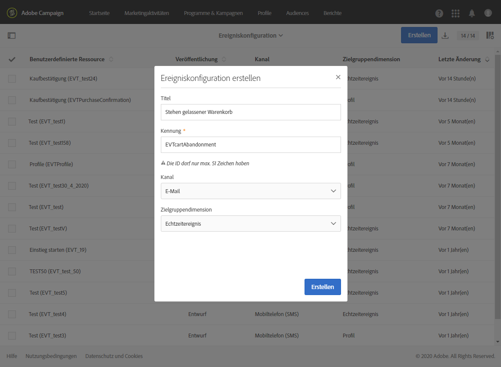

   >[!IMPORTANT]
   >
   >Die Kennung einschließlich des EVT-Präfixes darf maximal 64 Zeichen lang sein.

1. Wählen Sie den für den Versand Ihrer Transaktionsnachrichten verwendeten Kanal aus: **[!UICONTROL E-Mail]**, **[!UICONTROL Mobiltelefon (SMS)]** oder **[!UICONTROL Push-Benachrichtigung]**. Für jedes Ereignis kann nur ein Kanal verwendet werden und dieser kann nachträglich nicht mehr geändert werden.

1. Wählen Sie die passende Zielgruppendimension zur gewünschten Ereigniskonfiguration aus und danach **[!UICONTROL Erstellen]**.

   Bei ereignisbasierten Transaktionsnachrichten werden die im Ereignis selbst vorhandenen Daten verwendet, während bei profilbasierten Transaktionsnachrichten die in der Adobe Campaign-Datenbank verfügbaren Daten verwendet werden. Weitere Informationen hierzu finden Sie unter [Spezifische Konfigurationen](#transactional-event-specific-configurations).

>[!NOTE]
>
>Die Anzahl der Transaktionsereignisse kann sich auf Ihre Plattform auswirken. Um eine optimale Performance zu gewährleisten, müssen Sie sicherstellen, dass nicht verwendete Ereignisse gelöscht werden. Siehe [Ereignis löschen](../../channels/using/publishing-transactional-event.md#deleting-an-event).

## Ereignisattribute definieren          {#defining-the-event-attributes}

Definieren Sie im Bereich **[!UICONTROL Felder]** die Attribute, die in den Ereignisinhalt integriert werden und im Anschluss zur Personalisierung der Transaktionsnachricht verwendet werden können.

Alle das Hinzufügen oder Ändern von Feldern betreffenden Schritte folgen dem gleichen Prinzip wie für [benutzerdefinierte Ressourcen](../../developing/using/configuring-the-resource-s-data-structure.md#adding-fields-to-a-resource).

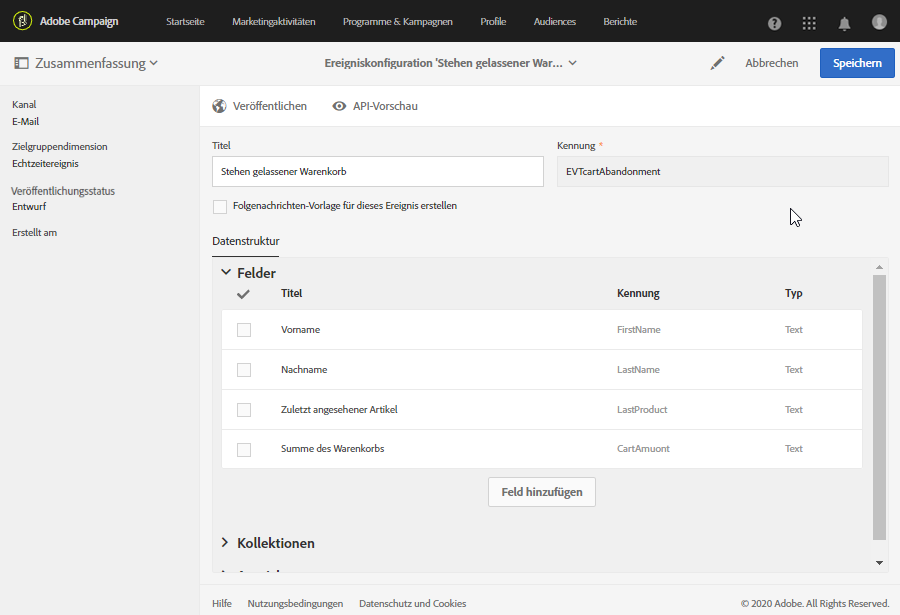

>[!NOTE]
>
>Wenn Sie eine mehrsprachige Transaktionsnachricht erstellen möchten, definieren Sie ein zusätzliches Ereignisattribut mit der ID **[!UICONTROL AC_language]**. Dies gilt nur für Ereignis-Transaktionsnachrichten. Nach der Veröffentlichung des Ereignisses sind die Schritte zur Bearbeitung des Inhalts einer mehrsprachigen Transaktionsnachricht dieselben wie für eine mehrsprachige Standard-E-Mail. Siehe [Mehrsprachige E-Mail erstellen](../../channels/using/creating-a-multilingual-email.md).

## Datenkollektionen definieren          {#defining-data-collections}

Sie können zum Ereignisinhalt eine Sammlung von Elementen hinzufügen, wobei jedes Element mehrere Attribute enthält.

Diese Sammlung kann in Transaktions-E-Mails verwendet werden, um [Produktlisten](../../designing/using/using-product-listings.md) zum Nachrichteninhalt hinzuzufügen, wie z. B. eine Liste mit Produkten einschließlich Preis, Referenznummer, Menge usw. für jedes Produkt auf der Liste.

1. Wählen Sie im Bereich **[!UICONTROL Sammlungen]** die Schaltfläche **[!UICONTROL Element erstellen]** aus.

   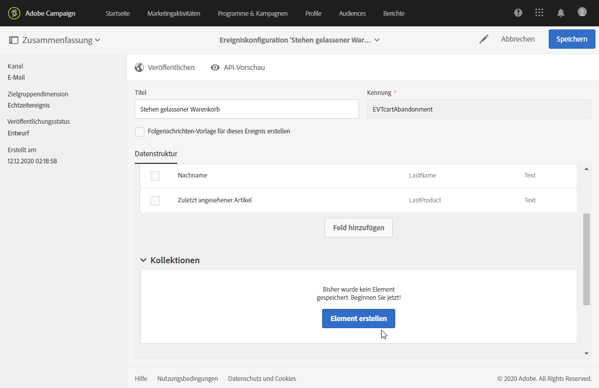

1. Fügen Sie Ihrer Sammlung einen Titel und eine Kennung hinzu.
1. Fügen Sie alle Felder hinzu, die Sie für jedes Produkt der Liste in der Transaktionsnachricht anzeigen möchten.

   Für dieses Beispiel haben wir folgende Felder hinzugefügt:

   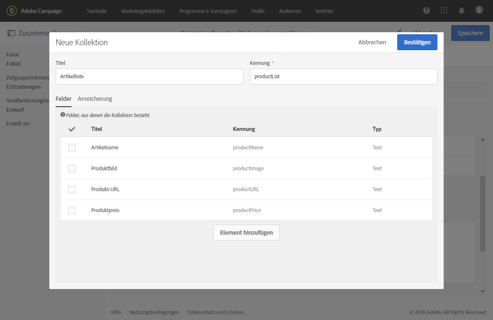

1. Auf dem Tab **[!UICONTROL Anreicherung]** können Sie die einzelnen Elemente der Sammlung anreichern. Auf diese Weise können Sie die Elemente der entsprechenden Produktliste mit Informationen aus der Adobe Campaign-Datenbank oder aus anderen von Ihnen erstellten Ressourcen personalisieren.

>[!NOTE]
>
>Die Anreicherungsschritte für die Elemente einer Sammlung entsprechen den Anweisungen im Abschnitt [Ereignis anreichern](#enriching-the-transactional-message-content). Beachten Sie, dass Sie beim Anreichern des Ereignisses keine Sammlung anreichern können: Dafür müssen Sie im Abschnitt **[!UICONTROL Sammlungen]** der Sammlung selbst eine Anreicherung hinzufügen.

Nach der Veröffentlichung des Ereignisses sowie der Nachricht lässt sich diese Sammlung in den Transaktionsnachrichten verwenden.

Dies ist die API-Vorschau für dieses Beispiel:

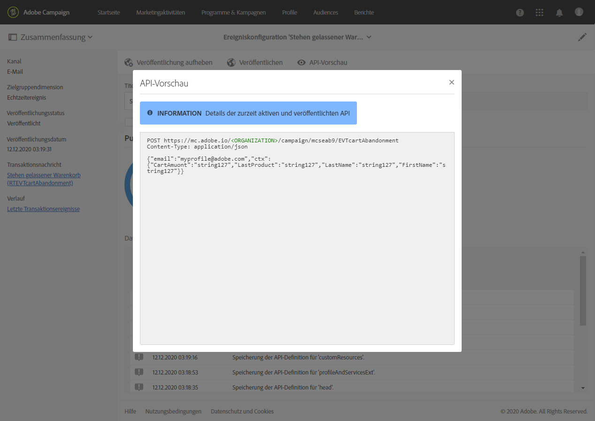

**Verwandte Themen:**

* [Vorschau erstellen und Ereignis veröffentlichen](../../channels/using/publishing-transactional-event.md#previewing-and-publishing-the-event)
* [Produktlisten in Transaktionsnachrichten verwenden](../../designing/using/using-product-listings.md)
* [Transaktionsnachricht veröffentlichen](../../channels/using/publishing-transactional-message.md#publishing-a-transactional-message)

## Ereignis anreichern {#enriching-the-transactional-message-content}

Sie können Transaktionsnachrichten mit Informationen aus der Adobe Campaign-Datenbank anreichern, um Ihre Nachrichten zu personalisieren. Ausgehend vom Nachnamen oder der CRM-ID eines jeden Empfängers können Sie beispielsweise Daten wie die jeweilige Adresse oder das Geburtsdatum oder jedes beliebige in der Profiltabelle hinzugefügte benutzerdefinierte Feld abrufen, um dem den Empfänger gesendeten Informationen zu personalisieren.

Sie können Transaktionsnachrichten mit Daten aus der erweiterten **[!UICONTROL externen API &quot;Profile und Dienste&quot;]** anreichern. Weiterführende Informationen finden Sie unter [API erweitern: Erweiterung veröffentlichen](../../developing/using/step-2-publish-the-extension.md).

Diese Informationen können auch in neuen Ressourcen gespeichert werden. In diesem Fall muss die Ressource mit den Ressourcen **[!UICONTROL Profil]** oder **[!UICONTROL Dienst]** entweder direkt oder über eine andere Tabelle verknüpft werden. Beispielweise können Sie in der folgenden Konfiguration die Transaktionsnachricht mit Informationen aus der Ressource **[!UICONTROL Produkt]** wie etwa einer Produktkategorie oder einer Kennung anreichern, wenn die Ressource **[!UICONTROL Produkt]** mit der Ressource **[!UICONTROL Profil]** verknüpft ist.

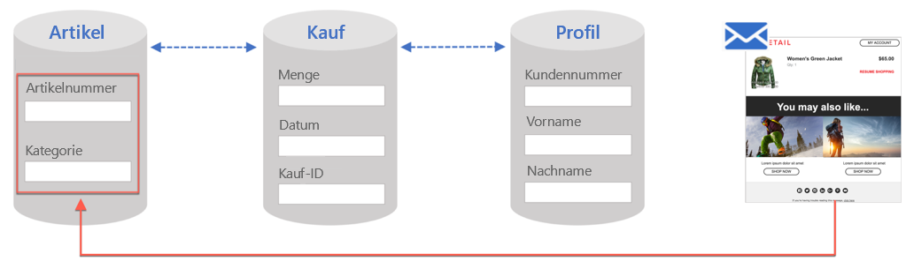

Weitere Informationen zum Erstellen und Veröffentlichen von Ressourcen finden Sie in [diesem Abschnitt](../../developing/using/key-steps-to-add-a-resource.md).

1. Wählen Sie im Bereich **[!UICONTROL Anreicherung]** die Schaltfläche **[!UICONTROL Element erstellen]** aus.

   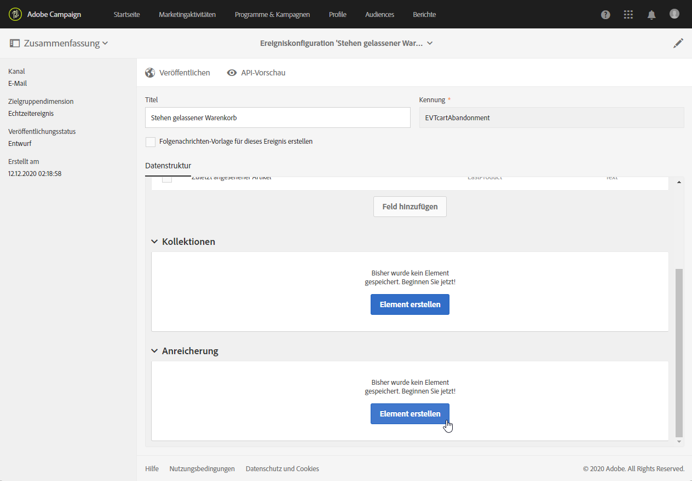

1. Wählen Sie die Ressource aus, mit der Sie Ihre Nachricht verknüpfen möchten. In unserem Fall ist das die Ressource **[!UICONTROL Profil]**.

   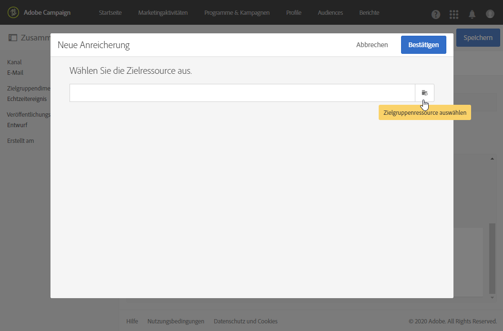

1. Verwenden Sie die Schaltfläche **[!UICONTROL Element erstellen]**, um ein Feld in der ausgewählten Ressource mit einem zuvor von Ihnen zum Ereignis hinzugefügten Feld zu verknüpfen (siehe [Ereignisattribute definieren](#defining-the-event-attributes)).

   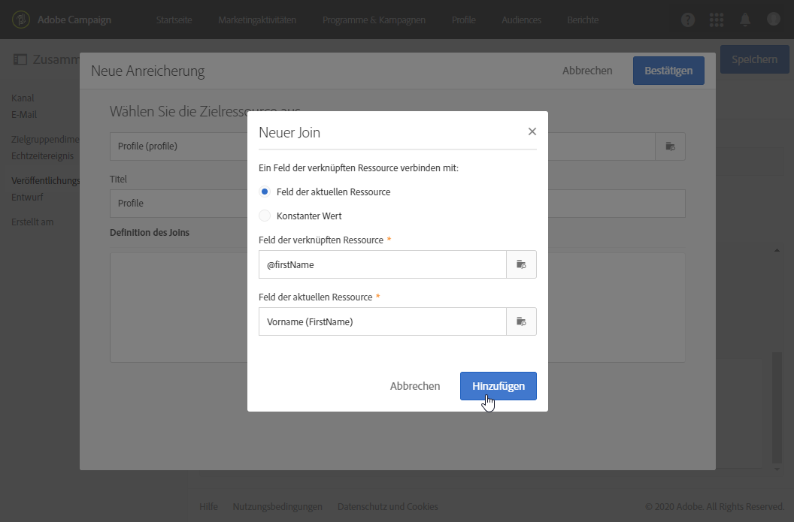

   >[!NOTE]
   >
   >Wenn Sie eine Bedingung definieren, mit der mehrere Empfänger ausgewählt werden können (z. B. ein Feld, das für mehrere Profile denselben Wert aufweisen kann), wird nur ein Profil ausgewählt.

1. In unserem Beispiel stimmen wir die Felder **[!UICONTROL Nachname]** und **[!UICONTROL Vorname]** mit den entsprechenden Feldern der Ressource **[!UICONTROL Profil]** ab.

   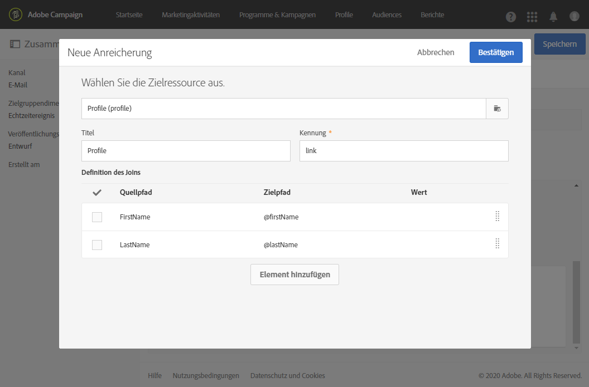

   Sie können den Inhalt der Transaktionsnachricht auch über die Ressource **[!UICONTROL Dienst]** anreichern. Weiterführende Informationen zu Diensten finden Sie in[diesem Abschnitt](../../audiences/using/creating-a-service.md).

1. Wenn Sie ein [profilbasiertes Ereignis](#profile-based-transactional-messages) erstellen oder bearbeiten, wählen Sie im Abschnitt **[!UICONTROL Zielgruppen-Anreicherung]** die Anreicherung aus, die beim Versand als Nachrichtenziel verwendet werden soll.

   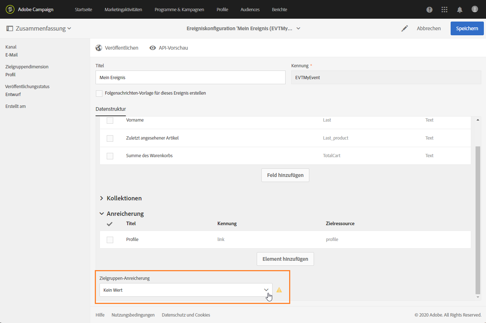

   >[!NOTE]
   >
   >Das Erstellen einer Anreicherung und das Auswählen einer Zielgruppen-Anreicherung basierend auf der **[!UICONTROL Profil]**-Ressource sind für profilbasierte Ereignis obligatorisch.

Nach der Veröffentlichung des Ereignisses sowie der Nachricht lässt sich der Inhalt der Transaktionsnachricht über den Link anreichern.

**Verwandte Themen:**

* [Vorschau erstellen und Ereignis veröffentlichen](../../channels/using/publishing-transactional-event.md#previewing-and-publishing-the-event)
* [Transaktionsnachricht personalisieren](../../channels/using/editing-transactional-message.md#personalizing-a-transactional-message)
* [Transaktionsnachricht veröffentlichen](../../channels/using/publishing-transactional-message.md#publishing-a-transactional-message)

## Durchsuchen von Transaktionsereignissen {#searching-transactional-events}

Gehen Sie wie unten beschrieben vor, um auf die bereits erstellten Transaktionsereignisse zuzugreifen und sie zu durchsuchen.

1. Klicken Sie auf das **Adobe**-Logo oben links im Bildschirm und anschließend auf **[!UICONTROL Marketing-Pläne]** > **[!UICONTROL Transaktionsnachrichten]** > **[!UICONTROL Ereigniskonfiguration]**.
1. Klicken Sie auf die Schaltfläche **[!UICONTROL Suche ein-/ausblenden]**.

   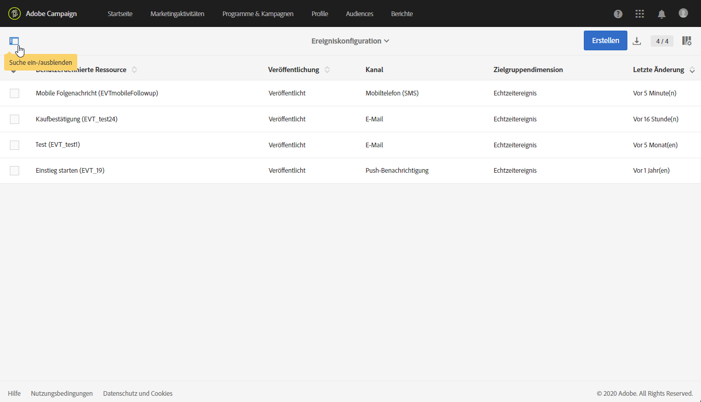

1. Sie können nach **[!UICONTROL Veröffentlichungsstatus]** filtern. Auf diese Weise können Sie beispielsweise nur die veröffentlichten Ereignisse anzeigen.
1. Sie können die Ereignisse auch nach **[!UICONTROL dem zuletzt erhaltenen Ereignis]** filtern. Wenn Sie z. B. 10 eingeben, werden nur die Ereigniskonfigurationen angezeigt, bei denen das letzte Ereignis vor 10 oder mehr Tagen eingegangen ist. Auf diese Weise können Sie anzeigen, welche Ereignisse während eines bestimmten Zeitraums inaktiv waren.

   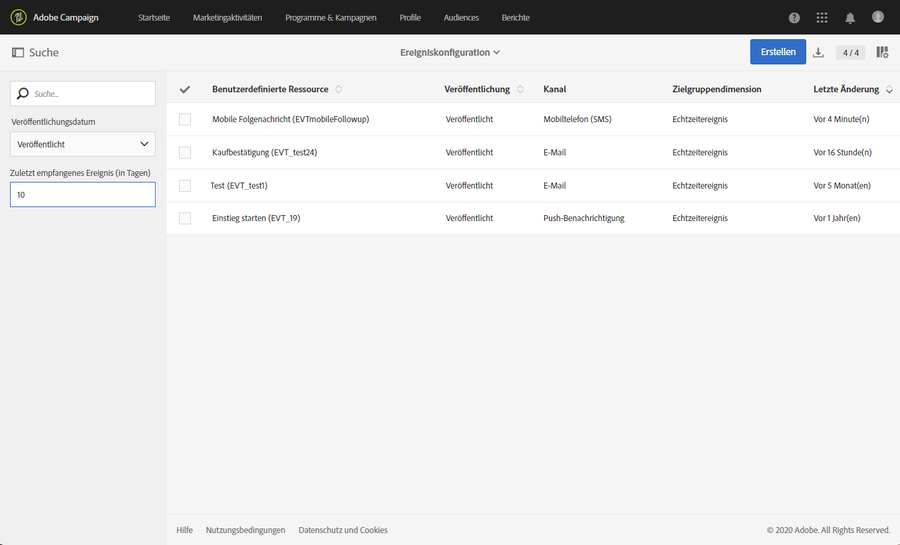

   >[!NOTE]
   >
   >Der Standardwert ist 0. Damit werden alle Ereignisse angezeigt.

## Spezifische Konfigurationen {#transactional-event-specific-configurations}

Die Konfiguration von Transaktionsereignissen variiert je nach dem [Typ der zu sendenden Transaktionsnachricht](../../channels/using/getting-started-with-transactional-msg.md#transactional-message-types) (Ereignis oder Profil) und dem verwendeten Kanal.

In den folgenden Abschnitten wird beschrieben, welche Konfiguration für die jeweilige Transaktionsnachricht festgelegt werden sollte. Weiterführende Informationen zu den allgemeinen Schritten bei der Konfiguration eines Ereignisses finden Sie unter [Erstellen eines Ereignisses](#creating-an-event).

### Ereignisbasierte Transaktionsnachrichten {#event-based-transactional-messages}

Sie können Ereignis-Transaktionsnachrichten senden, die auf der Basis eines Ereignisses ausgewählt werden. Diese Art von Transaktionsnachrichten enthält keine Profilinformationen: Die Versandzielgruppe wird durch Daten definiert, die im Ereignis selbst enthalten sind.

Um eine ereignisbasierte Transaktionsnachricht zu senden, erstellen und konfigurieren Sie zunächst ein Ereignis, bei dem **die im Ereignis selbst enthaltenen Daten** zur Zielgruppenbestimmung verwendet werden.

1. Wählen Sie bei der Erstellung der Ereigniskonfiguration die Zielgruppendimension **[!UICONTROL Echtzeit-Ereignis]** (siehe [Ereignis erstellen](#creating-an-event)).
1. Fügen Sie zum Ereignis Felder hinzu, damit Sie die Transaktionsnachricht personalisieren können (siehe [Ereignisattribute definieren](#defining-the-event-attributes)).
1. Beim ereignisbasierten Transaktionsnachrichtenversand sollen ausschließlich die Daten verwendet werden, die im gesendeten Ereignis der Personalisierung von Empfängern und Nachrichteninhalten dienen.

   Wenn Sie jedoch zusätzliche Informationen aus der Adobe Campaign-Datenbank verwenden möchten, können Sie den Inhalt der Transaktionsnachricht anreichern (siehe [Inhalt von Transaktionsnachrichten anreichern](#enriching-the-transactional-message-content)).

1. Erstellen Sie eine Vorschau und veröffentlichen Sie das Ereignis (siehe [Vorschau erstellen und Ereignis veröffentlichen](../../channels/using/publishing-transactional-event.md#previewing-and-publishing-the-event)).

   Bei der Vorschau des Ereignisses enthält die REST-API ein Attribut, mit dem entsprechend dem ausgewählten Kanal die E-Mail-Adresse, das Mobiltelefon oder die Push-Benachrichtigung spezifiziert wird.

   Mit Ausführung der Veröffentlichung wird automatisch eine dem neuen Ereignis entsprechende Transaktionsnachricht erzeugt. Damit das Ereignis den Versand der Transaktionsnachricht auslösen kann, muss die gerade erstellte Transaktionsnachricht [angepasst](../../channels/using/editing-transactional-message.md) und [veröffentlicht](../../channels/using/publishing-transactional-message.md) werden.

1. Integrieren Sie das Ereignis in Ihre Website (siehe [Ereignis-Aktivierung integrieren](../../channels/using/getting-started-with-transactional-msg.md#integrate-event-trigger)).

### Profilbasierte Transaktionsnachrichten          {#profile-based-transactional-messages}

Sie können Transaktionsnachrichten auf der Grundlage von Kundenprofilen versenden, was Ihnen die Anwendung von Marketing-Typologieregeln, das Einfügen eines „Abo stornieren“-Links, das Hinzufügen der Nachricht zu den globalen Versandberichten und die Nutzung der Nachricht in der Customer Journey ermöglicht.

Um eine profilbasierte Transaktionsnachricht zu senden, erstellen und konfigurieren Sie zunächst ein Ereignis, bei dem **Daten aus der Adobe Campaign-Datenbank** zur Zielgruppenbestimmung verwendet werden.

1. Wählen Sie bei der Erstellung der Ereigniskonfiguration die Zielgruppendimension **[!UICONTROL Profil-Ereignis]** (siehe [Ereignis erstellen](#creating-an-event)).
1. Fügen Sie zum Ereignis Felder hinzu, damit Sie die Transaktionsnachricht personalisieren können (siehe [Ereignisattribute definieren](#defining-the-event-attributes)). Für eine Anreicherung müssen Sie mindestens ein Feld hinzufügen. Sie müssen keine anderen Felder wie **Vorname** und **Nachname** erstellen, da Sie Personalisierungsfelder aus der Adobe-Campaign-Datenbank verwenden können.
1. Erstellen Sie eine Anreicherung, um das Ereignis mit der Ressource **[!UICONTROL Profil]** zu verknüpfen (siehe [Ereignisse anreichern](#enriching-the-transactional-message-content)) und wählen Sie diese Anreicherung als **[!UICONTROL Zielgruppen-Anreicherung]** aus.

   >[!IMPORTANT]
   >
   >Dieser Schritt ist bei profilbasierten Ereignissen obligatorisch.

1. Erstellen Sie eine Vorschau und veröffentlichen Sie das Ereignis (siehe [Vorschau erstellen und Ereignis veröffentlichen](../../channels/using/publishing-transactional-event.md#previewing-and-publishing-the-event)).

   Bei der Vorschau des Ereignisses enthält die REST-API kein Attribut, mit dem die E-Mail-Adresse, das Mobiltelefon oder die Push-Benachrichtigung spezifiziert wird, da diese Daten von der Ressource **[!UICONTROL Profil]** abgerufen werden.

   Mit Ausführung der Veröffentlichung wird automatisch eine dem neuen Ereignis entsprechende Transaktionsnachricht erzeugt. Damit das Ereignis den Versand der Transaktionsnachricht auslösen kann, muss die gerade erstellte Transaktionsnachricht [angepasst](../../channels/using/editing-transactional-message.md) und [veröffentlicht](../../channels/using/publishing-transactional-message.md) werden.

1. Integrieren Sie das Ereignis in Ihre Website (siehe [Ereignis-Aktivierung integrieren](../../channels/using/getting-started-with-transactional-msg.md#integrate-event-trigger)).

<!--### Transactional SMS messages {#transactional-sms}

The steps to configure an  event to send an SMS transactional message are the same as for the email channel. The only differences are as follows:

* When creating the corresponding event, you need to select the **[!UICONTROL Mobile (SMS)]** channel.

* When previewing the event corresponding to an event-based transactional SMS, the REST API contains an attribute specifying the mobile phone instead of the email address.

* The specificities to edit the content of an SMS transactional message are the same as for a [standard SMS](../../channels/using/about-sms-and-push-content-design.md).-->

### Transaktions-Push-Benachrichtigung {#transactional-push-notifications}

Sie können zwei Arten von Transaktions-Push-Benachrichtigungen versenden:
* Eine anonyme Transaktions-Push-Benachrichtigung an alle Benutzer, die sich für den Erhalt von Benachrichtigungen von Ihrer Mobile App angemeldet haben. Siehe [Ereignisbasierte Transaktions-Push-Benachrichtigungen konfigurieren](../../channels/using/transactional-push-notifications.md#event-based-transactional-push-notifications).
* Eine Transaktions-Push-Benachrichtigung an die Adobe Campaign-Profile, die Ihre Mobile App abonniert haben. Siehe [Profilbasierte Transaktions-Push-Benachrichtigungen konfigurieren](../../channels/using/transactional-push-notifications.md#profile-based-transactional-push-notifications).

>[!IMPORTANT]
>
>Für den Versand von Transaktions-Push-Benachrichtigungen müssen Sie Adobe Campaign entsprechend konfigurieren. Siehe [Mobile App konfigurieren](../../administration/using/configuring-a-mobile-application.md).

### Folgenachrichten {#follow-up-messages}

Sie haben die Möglichkeit, Folgenachrichten an Kunden zu senden, die zuvor eine spezifische Transaktionsnachricht erhalten haben.

Die Schritte zum Konfigurieren eines Ereignisses, das das Senden einer Folgenachricht ermöglicht, sind in [diesem Abschnitt ](../../channels/using/follow-up-messages.md#configuring-an-event-to-send-a-follow-up-message) beschrieben.
