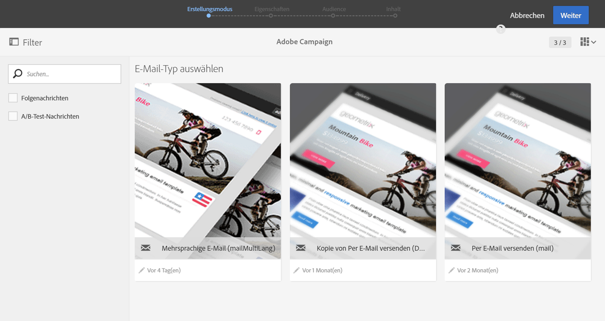
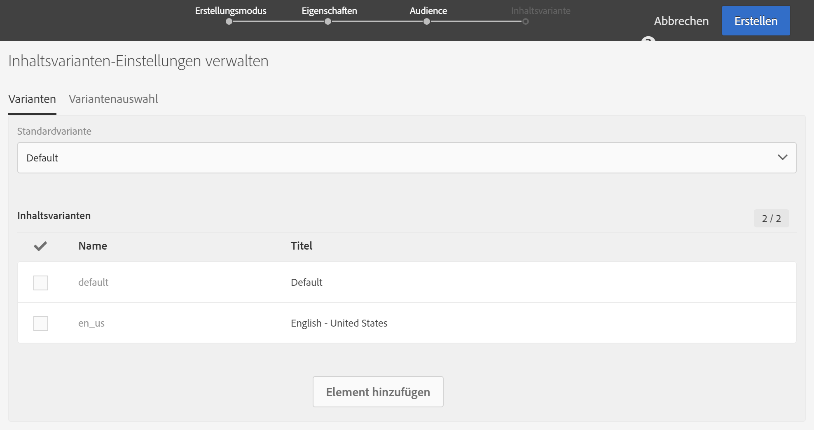
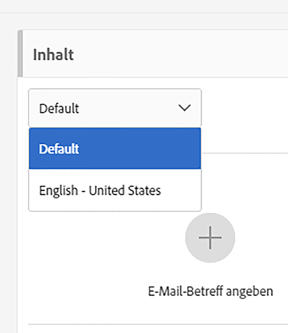

# Erstellen einer mehrsprachigen E-Mail{#creating-a-multilingual-email}

Sie können eine mehrsprachige E-Mail an Profile mit unterschiedlichen bevorzugten Sprachen senden: Jedes Profil erhält eine E-Mail-Variante in der jeweils bevorzugten Sprache.

Überprüfen Sie zunächst, ob eine mehrsprachige E-Mail-Vorlage verfügbar ist. Ist dies nicht der Fall, erfahren Sie in [diesem Abschnitt](../../channels/using/multilingual-messages-template.md), wie Sie eine erstellen können.

Die Audience besteht aus Profilen, in denen die bevorzugte Sprache angegeben ist.

1. Erstellen Sie eine neue E-Mail basierend auf einer [mehrsprachigen Vorlage](../../channels/using/multilingual-messages-template.md).

   

1. Definieren Sie die allgemeinen Eigenschaften sowie die Ziel-Audience der E-Mail auf die gleiche Weise wie für eine Standard-E-Mail. Lesen Sie diesbezüglich auch den Abschnitt [Erstellung von Audiences](../../audiences/using/creating-audiences.md).

1. Definieren Sie die Optionen der Variante im vierten Schritt des Erstellungsassistenten. Wenn die [mehrsprachige Vorlage](../../channels/using/multilingual-messages-template.md) bereits alle gewünschten Parameter enthält, können Sie gleich auf die Schaltfläche **[!UICONTROL Erstellen]** klicken.

   

   Fügen Sie bei Bedarf Varianten mit der Schaltfläche **[!UICONTROL Element hinzufügen]** hinzu. **[!UICONTROL Die Variante Standard]** darf nicht gelöscht werden. Mit der Auswahl **[!UICONTROL Standard]** [wird die bevorzugte Sprache des Profils ](../../audiences/using/creating-profiles.md) für die Auswahl der Variante herangezogen. Sie können für die Variante **[!UICONTROL Standard]** auch eine beliebige andere Sprache auswählen.

1. Bestätigen Sie die Erstellung der E-Mail: Daraufhin wird das Dashboard der E-Mail angezeigt.
1. Definieren Sie den E-Mail-Inhalt für jede Variante. Je nach zuvor ausgewählter Vorlage können Sie verschiedene Betreffe, verschiedene Absendernamen oder verschiedene Inhalte angeben. Über die Dropdown-Liste können Sie zwischen den verschiedenen Varianten hin und her wechseln. Lesen Sie für weiterführende Informationen den Abschnitt [Inhaltseditor](../../designing/using/designing-content-in-adobe-campaign.md).

   

1. Testen und validieren Sie Ihre Nachricht. Weiterführende Informationen finden Sie im Abschnitt [Testversand durchführen](../../sending/using/sending-proofs.md).
1. Planen Sie den Versand mit der Option **[!UICONTROL Versand nach Bestätigung]**.
1. Nachdem Ihre E-Mail gesendet wurde, können Sie Protokolle und Berichte aufrufen, um den Erfolg Ihrer Kampagne zu messen. Weiterführende Informationen zum Reporting finden Sie in [diesem Abschnitt](../../reporting/using/about-dynamic-reports.md).

