# Mehrsprachige Push-Benachrichtigungen erstellen{#creating-a-multilingual-push-notification}

## Über mehrsprachige Push-Benachrichtigungen {#about-multilingual-push-notification}

Personalisieren Sie den Inhalt Ihrer Push-Benachrichtigung, indem Sie Nachrichten senden, die in der bevorzugten Sprache des Empfängers verfasst sind und auf der jeweiligen Region basieren. Sie können mehrsprachige Inhaltsvarianten von Push-Benachrichtigungen direkt in den Inhaltseditor importieren und gleichzeitig versenden.

Diese Funktion verwendet je nach Auswahl der Versandvorlage für Push-Benachrichtigungen entweder die im Empfängerprofil spezifizierte Sprache oder die Spracheinstellung des Systems für Mobile-App-Abonnenten. Wenn die Spracheinstellung eines Benutzers nicht spezifiziert ist, wird die bei der Erstellung einer mehrsprachigen Push-Benachrichtigung definierte Standardvariante verwendet. Weiterführende Information zur Verwaltung Ihrer Profile und Abonnenten finden Sie in diesem [Handbuch](../../audiences/using/get-started-profiles-and-audiences.md).

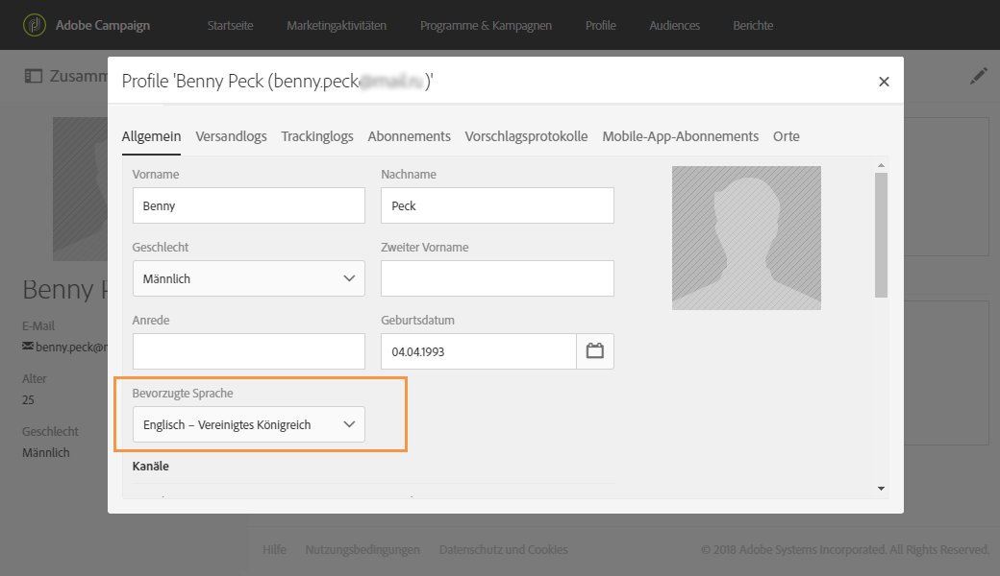

Gehen Sie folgendermaßen vor, um mehrsprachige Inhaltsvarianten für Ihre Push-Benachrichtigungen zu verwenden:

* [Schritt 1: Laden Sie die mehrsprachige Inhaltsvariante hoch.](#step-1--upload-multilingual-content-variant)
* [Schritt 2: Sehen Sie sich die Push-Benachrichtigung in der Vorschau an und stellen Sie sie mithilfe der mehrsprachigen Inhaltsvarianten fertig.](#step-2--preview-and-finalize-a-push-notification-using-multilingual-content-variants)
* [Schritt 3: Senden Sie eine mehrsprachige Push-Benachrichtigung und analysieren Sie den Versand.](#step-3--send-and-analyze-multilingual-push-notification-delivery)

## Schritt 1: Laden Sie die mehrsprachige Inhaltsvariante hoch.    {#step-1--upload-multilingual-content-variant}

Vor der Personalisierung der mehrsprachigen Push-Benachrichtigung müssen erst die Inhaltsvarianten in einer mehrsprachigen Versandvorlage hochgeladen und der Versand erstellt werden.

>[!NOTE]
>
>Sie können diesen Schritt überspringen, wenn Sie für jede Sprache manuell eine Variante erstellen möchten.

1. Wählen Sie in den **[!UICONTROL Marketingaktivitäten]** die Schaltfläche **[!UICONTROL Erstellen]** und danach **[!UICONTROL Push-Benachrichtigung]** aus.
1. Wählen Sie die Vorlage **[!UICONTROL Mehrsprachige Push-Benachrichtigungen an Campaign-Profile senden]** aus, wenn Sie die Adobe Campaign-Profile erfassen möchten, die sich für Ihre Mobile App oder die Vorlage **[!UICONTROL Mehrsprachige Push-Benachrichtigung an App-Abonnenten senden]** angemeldet haben. Auf diese Weise senden Sie allen Benutzern eine Push-Benachrichtigung, die sich für den Erhalt von Benachrichtigungen von Ihrer Mobile App angemeldet haben.

   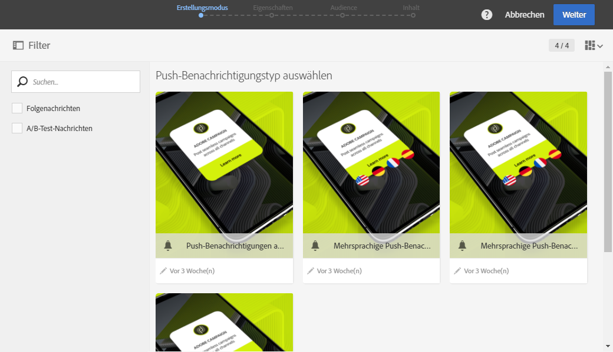

1. Geben Sie die Eigenschaften der Push-Benachrichtigung ein und wählen Sie im Feld **[!UICONTROL Mobile App einem Versand zuordnen]** die entsprechende Mobile App aus.

   Bitte beachten Sie, dass in der Dropdown-Liste sowohl SDK V4- als auch Adobe Experience Platform SDK-Anwendungen enthalten sind.

1. Ziehen Sie Abfragen in das Fenster **[!UICONTROL Audiences]**, um Ihre Audience anzupassen.

   Die hinzugefügten Abfragen hängen von der ausgewählten Vorlage ab: Wenn Sie die Vorlage **[!UICONTROL Mehrsprachige Push-Benachrichtigungen an Campaign-Profile senden]** auswählen, können Sie bekannte Empfänger Ihrer Mobile App abrufen. Wenn Sie jedoch die Vorlage **[!UICONTROL Mehrsprachige Push-Benachrichtigung an App-Abonnenten senden]** auswählen, können Sie alle angemeldeten Abonnenten einer bestimmten App abfragen.
   >[!NOTE]
   >
   >Wenn Sie Audiences mit unterschiedlichen Sprachen auswählen, müssen Sie jede Zielsprache in Ihrer CSV-Datei auflisten.

   

1. Ziehen Sie Ihre Datei in das Fenster **[!UICONTROL Inhaltsvarianten verwalten]** oder wählen Sie eine Datei auf Ihrem Computer aus.

   Die Datei muss im UTF-8-Format kodiert sein und ein bestimmtes Layout aufweisen, das Sie sich durch Auswahl der Option **[!UICONTROL Download der Beispielsdatei]** ansehen können. Achten Sie außerdem auf die Verwendung der richtigen Syntax für die Sprachen. Weiterführende Informationen zum Dateiformat und zu den unterstützten Sprachen finden Sie in dieser [Technote](https://helpx.adobe.com/de/campaign/kb/acs-generate-csv-multilingual-push.html).

   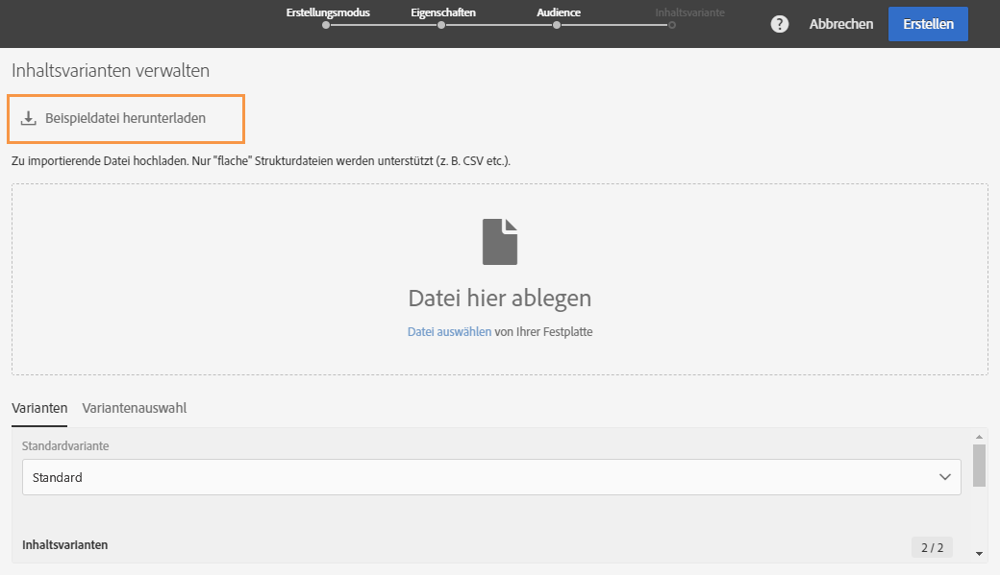

1. Nach dem Hochladen Ihrer Datei werden die Sprachvarianten automatisch in den Tab **[!UICONTROL Varianten]** geladen. Sie können in der Datei auch eine **[!UICONTROL Standardvariante]** bereitstellen, die Ihre standardmäßige Inhaltsvariante ist, wenn für den jeweiligen Benutzer keine bevorzugte Sprache definiert ist.

   

1. Im Tab **[!UICONTROL Variantenauswahl]** wird ein Script zur Verfügung gestellt, in dem Sie auswählen können, welche Sprachen für welche Versandvorlage berücksichtigt werden sollen. Dies ist ein vordefiniertes Script, das Sie nicht mehr ändern müssen.
1. Wenn Sie zusätzliche Varianten hinzufügen möchten, die in der importierten Datei nicht enthalten sind, wählen Sie die Schaltfläche **[!UICONTROL Element hinzufügen]** und fügen Sie beliebig viele neue Sprachvarianten hinzu.

   Beim Hinzufügen weiterer Varianten, die nicht bereits über die Datei hochgeladen wurden, wird kein Inhalt mit diesen Sprachen verknüpft. Deshalb müssen Sie den Inhalt direkt im Versand-Dashboard bearbeiten.

   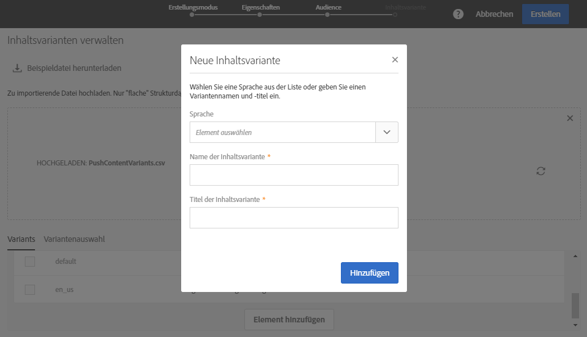

1. Wählen Sie **[!UICONTROL Erstellen]**, wenn die Konfiguration abgeschlossen ist. Sie können jederzeit zur **[!UICONTROL Inhaltsvariante]** zurückkehren und im Versand-Dashboard Änderungen daran vornehmen.

   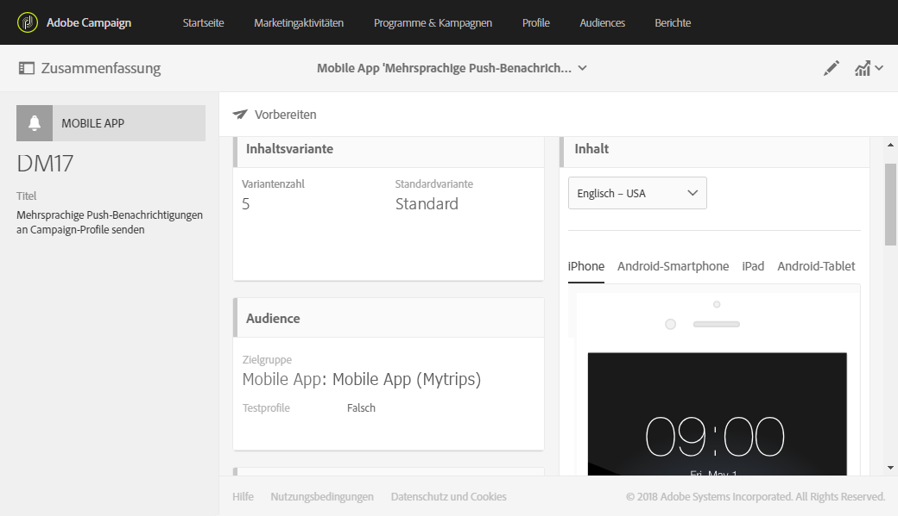

Jetzt können Sie mit der Personalisierung Ihrer mehrsprachigen Push-Benachrichtigung beginnen.

## Schritt 2: Sehen Sie sich die Push-Benachrichtigung in der Vorschau an und stellen Sie sie mithilfe der mehrsprachigen Inhaltsvarianten fertig.    {#step-2--preview-and-finalize-a-push-notification-using-multilingual-content-variants}

Nach dem Hochladen der Datei mit den Inhaltsvarianten können Sie sich jetzt die verschiedenen Varianten über den Push-Benachrichtigungsversand in der Vorschau ansehen.

Zusätzlich zu den von der Datei hochgeladenen Varianten können Sie auch weitere erstellen und bearbeiten.

1. Um eine Vorschau Ihres Push-Benachrichtigungs-Inhalts mit den unterschiedlichen Sprachen anzuzeigen, öffnen Sie im Versand-Dashboard im Fenster **[!UICONTROL Inhalt]** die Dropdown-Liste.

   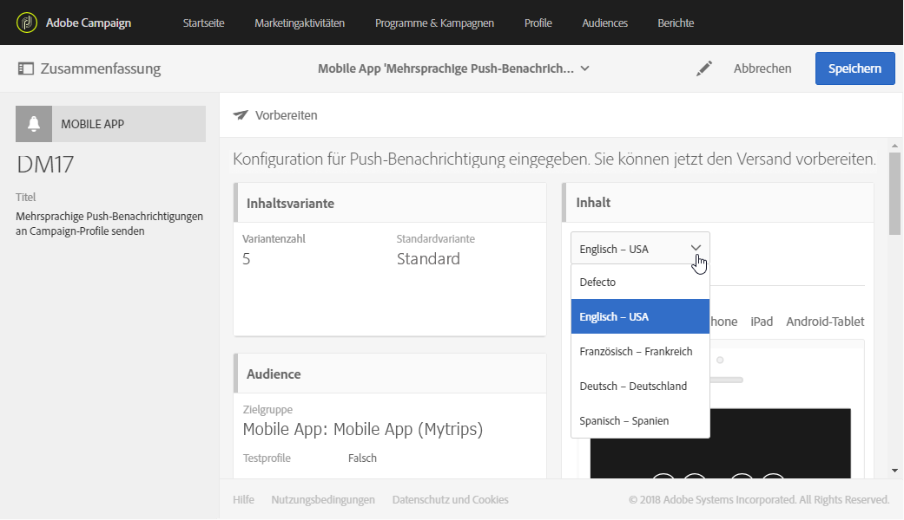

1. Wenn für eine Sprache keine Inhaltsvariante spezifiziert ist, wählen Sie das Glockensymbol unter der Vorschau aus, um Inhalt zu dieser Sprachvariante hinzuzufügen.

   Durch Auswahl des Fensters **[!UICONTROL Inhalt]** wird der Inhalt der Push-Benachrichtigung in der Sprache angezeigt, die in der Dropdown-Liste ausgewählt wurde. Änderungen in diesem Fenster betreffen nur die jeweilige Sprache.

1. Sie können auch eine Inhaltsvariante weiter anpassen, z. B. durch Personalisierungsfelder, indem Sie sie auswählen.

   Weiterführende Information zum Anpassen einer Push-Benachrichtigung finden Sie in diesem [Abschnitt](../../channels/using/customizing-a-push-notification.md).

   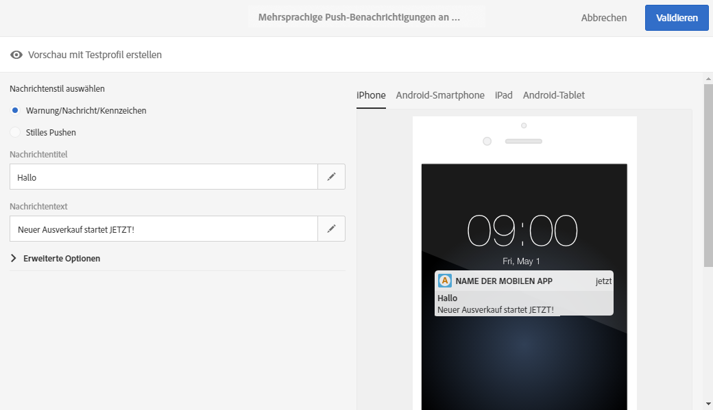

1. Wenn Sie Sprachvarianten hinzufügen oder löschen möchten, wählen Sie das Fenster **[!UICONTROL Inhaltsvariante]** aus.

   Beachten Sie bitte, dass Sie durch das Hinzufügen einer neuen Sprache Inhalt manuell zu der entsprechenden Push-Benachrichtigung hinzufügen müssen.

   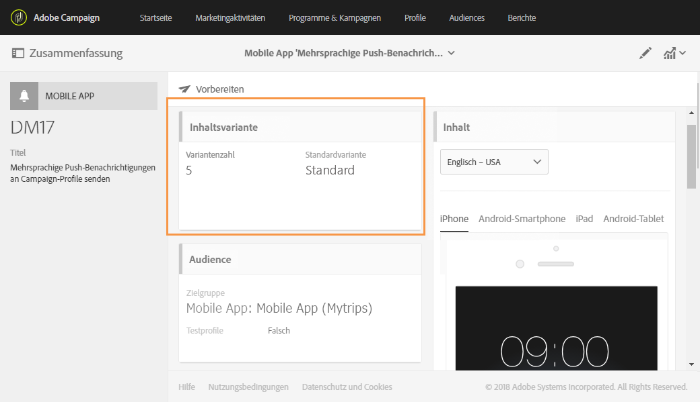

Ihre mehrsprachige Push-Benachrichtigung kann jetzt gesendet werden.

## Schritt 3: Senden Sie eine mehrsprachige Push-Benachrichtigung und analysieren Sie den Versand.    {#step-3--send-and-analyze-multilingual-push-notification-delivery}

Ihre mehrsprachigen Push-Benachrichtigungen mit Inhaltsvarianten sind jetzt bereit zum Versenden.

1. Um den Versand vorzubereiten, wählen Sie die Schaltfläche **[!UICONTROL Vorbereiten]** aus.
1. Wenn die Vorbereitung ohne Warnungen beendet wird, wählen Sie die Schaltfläche **[!UICONTROL Bestätigen]** aus, um mit dem Versand der mehrsprachigen Push-Benachrichtigung zu beginnen.

   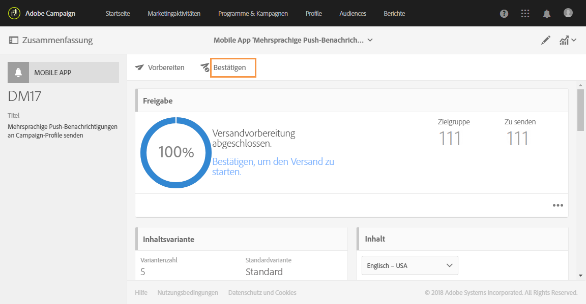

1. Nach Abschluss des Versands können Sie durch Auswahl des Symbols **[!UICONTROL Berichte]** und der Option **[!UICONTROL Dynamische Berichte]** die Wirkung des Versands analysieren.

   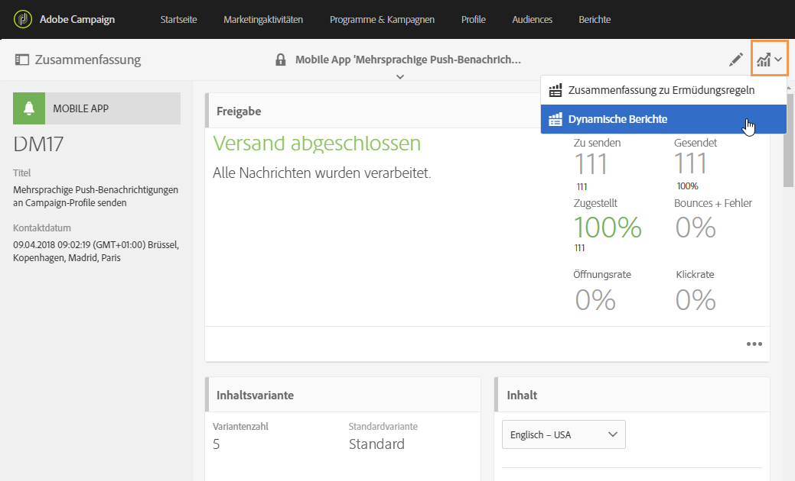

1. Wählen Sie **[!UICONTROL Bericht zu Push-Benachrichtigungen]** aus.
1. Ziehen Sie die Dimension **[!UICONTROL Variante]** in Ihr Bedienfeld, um die Daten zu filtern.

   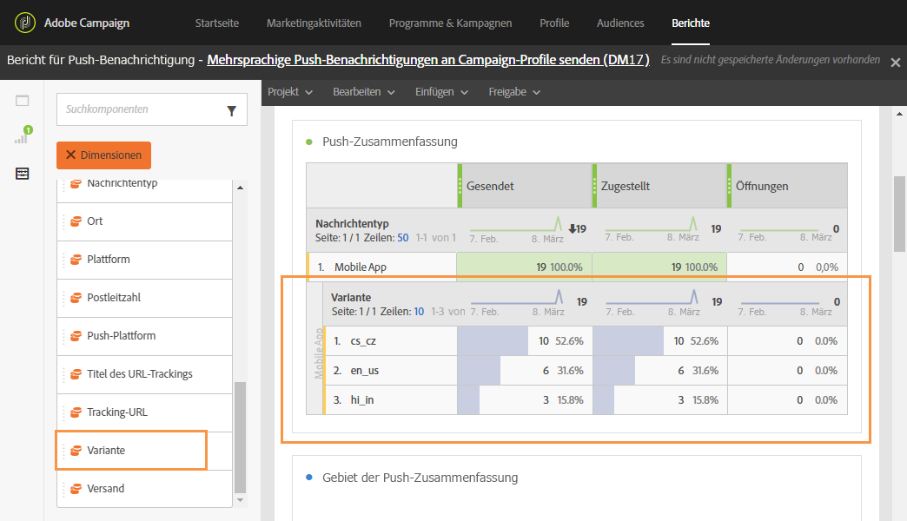

Jetzt können Sie die Wirkung Ihres mehrsprachigen Push-Benachrichtigungs-Versands auf Ihre Empfänger ermitteln.

**Verwandte Themen:**

* [Bericht zu Push-Benachrichtigungen](../../reporting/using/push-notification-report.md)
* [Push-Benachrichtigungen in einem Workflow versenden](../../automating/using/push-notification-delivery.md)
* [Mehrsprachige Zielgruppen mit einem einzigen Workflow ansprechen](https://helpx.adobe.com/de/campaign/kb/simplify-campaign-management.html#Engageyourcustomersateverystep)
