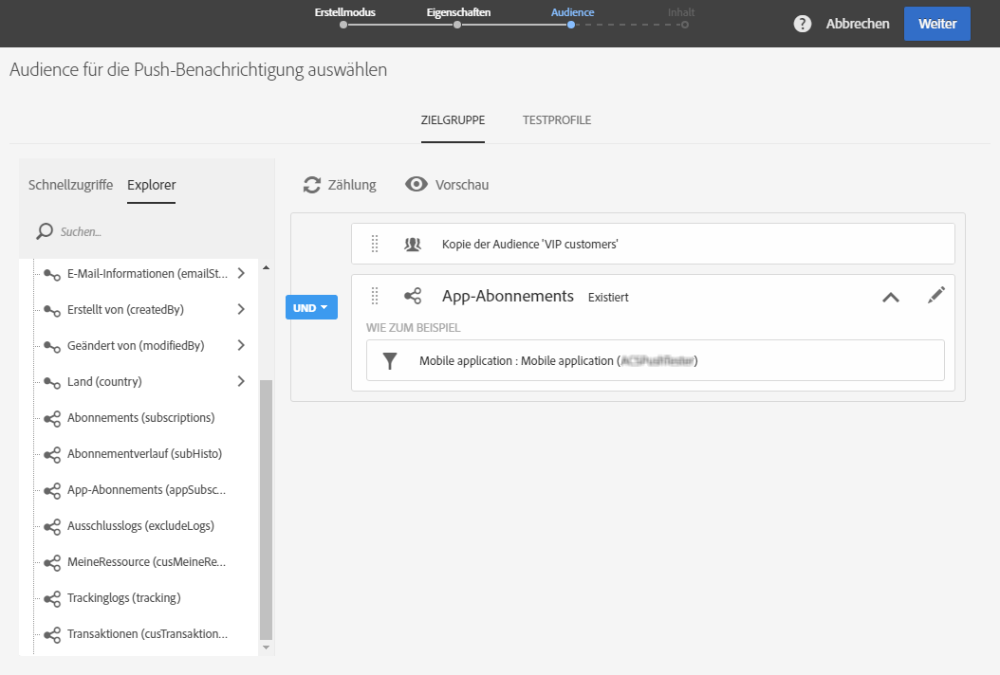
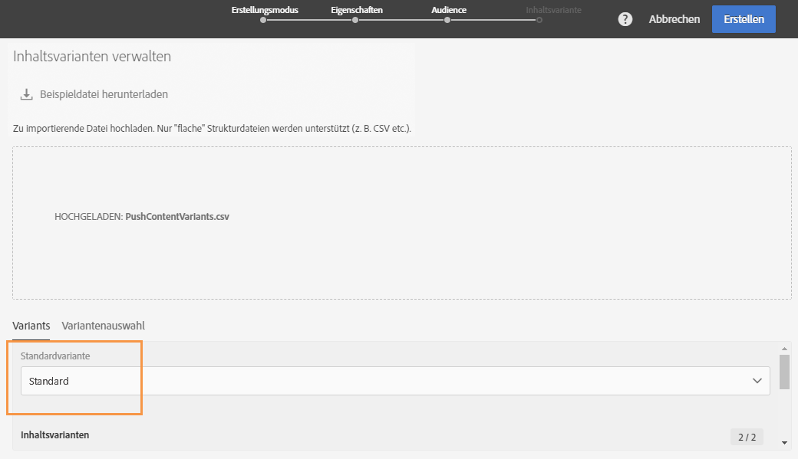

# Mehrsprachige Push-Benachrichtigungen erstellen{#creating-a-multilingual-push-notification}

## Über mehrsprachige Push-Benachrichtigungen {#about-multilingual-push-notification}

Personalisieren Sie den Inhalt Ihrer Push-Benachrichtigung, indem Sie Nachrichten senden, die in der bevorzugten Sprache des Empfängers verfasst sind und auf der jeweiligen Region basieren. Sie können mehrsprachige Inhaltsvarianten von Push-Benachrichtigungen direkt in den Inhaltseditor importieren und gleichzeitig versenden.

Diese Funktion verwendet je nach Auswahl der Versandvorlage für Push-Benachrichtigungen entweder die im Empfängerprofil spezifizierte Sprache oder die Spracheinstellung des Systems für Mobile-App-Abonnenten. Wenn die Spracheinstellung eines Benutzers nicht spezifiziert ist, wird die bei der Erstellung einer mehrsprachigen Push-Benachrichtigung definierte Standardvariante verwendet. Weiterführende Information zur Verwaltung Ihrer Profile und Abonnenten finden Sie in diesem [Handbuch](../../audiences/using/get-started-profiles-and-audiences.md).

Gehen Sie folgendermaßen vor, um mehrsprachige Inhaltsvarianten für Ihre Push-Benachrichtigungen zu verwenden:

* [Schritt 1: Laden Sie die mehrsprachige Inhaltsvariante hoch.](#step-1--upload-multilingual-content-variant)
* [Schritt 2: Sehen Sie sich die Push-Benachrichtigung in der Vorschau an und stellen Sie sie mithilfe der mehrsprachigen Inhaltsvarianten fertig.](#step-2--preview-and-finalize-a-push-notification-using-multilingual-content-variants)
* [Schritt 3: Senden Sie eine mehrsprachige Push-Benachrichtigung und analysieren Sie den Versand.](#step-3--send-and-analyze-multilingual-push-notification-delivery)

## Schritt 1: Laden Sie die mehrsprachige Inhaltsvariante hoch.  {#step-1--upload-multilingual-content-variant}

Vor der Personalisierung der mehrsprachigen Push-Benachrichtigung müssen erst die Inhaltsvarianten in einer mehrsprachigen Versandvorlage hochgeladen und der Versand erstellt werden.

>[!NOTE]
>
>Sie können diesen Schritt überspringen, wenn Sie für jede Sprache manuell eine Variante erstellen möchten.

1. Klicken Sie im **[!UICONTROL Marketing activities]** Fenster auf die **[!UICONTROL Create]** Schaltfläche und wählen Sie **[!UICONTROL Push notification]**.
1. Select the template **[!UICONTROL Send multilingual push to Campaign profiles]** if you want to target the Adobe Campaign profiles who have subscribed to your mobile application or the template **[!UICONTROL Send multilingual push to app subscriber]** to send a push notification to all users who have opted in to receive notifications from your mobile application.

   

1. Geben Sie Ihre Push-Benachrichtigungseigenschaften ein und wählen Sie die mobile App im **[!UICONTROL Associate a Mobile App to a delivery]** Feld aus.

   Bitte beachten Sie, dass in der Dropdown-Liste sowohl SDK V4- als auch Adobe Experience Platform SDK-Anwendungen enthalten sind.

1. Ziehen Sie Abfragen in das Fenster **[!UICONTROL Audiences]**, um Ihre Audience anzupassen.

   The queries added depend on the chosen template: if you chose the **[!UICONTROL Send multilingual push to Campaign profiles]** template you can query known recipients of your mobile application. Whereas if you chose the **[!UICONTROL Send multilingual push to app subscriber]** template, you can query all subscribers of a particular app who have opted in.
   >[!NOTE]
   >
   >Wenn Sie Audiences mit unterschiedlichen Sprachen auswählen, müssen Sie jede Zielsprache in Ihrer CSV-Datei auflisten.

   

1. In the **[!UICONTROL Manage Content Variants]** window, drag and drop your file or select a file from your computer.

   The file has to be UTF8 encoded and must have a specific layout which can be found by clicking the **[!UICONTROL Download the sample file]** option. Achten Sie außerdem auf die Verwendung der richtigen Syntax für die Sprachen. Weiterführende Informationen zum Dateiformat und zu den unterstützten Sprachen finden Sie in dieser [Technote](https://helpx.adobe.com/de/campaign/kb/acs-generate-csv-multilingual-push.html).

   

1. After uploading your file, the language variants are automatically populated in the **[!UICONTROL Variants]** tab. Note that you can provide a **[!UICONTROL Default variant]** in the file which will be your default content variant if no preferred language is specified for the targeted user.

   

1. The **[!UICONTROL Variant selection]** tab will provide a script to determine which language preference to take into account depending on the delivery template. Dies ist ein vordefiniertes Script, das Sie nicht mehr ändern müssen.
1. If you want to add more variants not present in the imported file, you can do so by clicking the **[!UICONTROL Add an element]** button and add as many new language variants as needed.

   Beim Hinzufügen weiterer Varianten, die nicht bereits über die Datei hochgeladen wurden, wird kein Inhalt mit diesen Sprachen verknüpft. Deshalb müssen Sie den Inhalt direkt im Versand-Dashboard bearbeiten.

   

1. Click **[!UICONTROL Create]** when the configuration is done. You can always come back to the **[!UICONTROL Content variant]** window and make some changes from your delivery dashboard.

   

Jetzt können Sie mit der Personalisierung Ihrer mehrsprachigen Push-Benachrichtigung beginnen.

## Schritt 2: Sehen Sie sich die Push-Benachrichtigung in der Vorschau an und stellen Sie sie mithilfe der mehrsprachigen Inhaltsvarianten fertig.  {#step-2--preview-and-finalize-a-push-notification-using-multilingual-content-variants}

Nach dem Hochladen der Datei mit den Inhaltsvarianten können Sie sich jetzt die verschiedenen Varianten über den Push-Benachrichtigungsversand in der Vorschau ansehen.

Zusätzlich zu den von der Datei hochgeladenen Varianten können Sie auch weitere erstellen und bearbeiten.

1. In the **[!UICONTROL Content]** window from the delivery dashboard, the drop-down allows you to preview your push notification content depending on the chosen language.

   

1. Wenn für eine Sprache keine Inhaltsvariante spezifiziert ist, wählen Sie das Glockensymbol unter der Vorschau aus, um Inhalt zu dieser Sprachvariante hinzuzufügen.

   By clicking the **[!UICONTROL Content]** window, the push notification represents the content from the language selected in the drop down. Änderungen in diesem Fenster betreffen nur die jeweilige Sprache.

1. Sie können auch eine Inhaltsvariante weiter anpassen, z. B. durch Personalisierungsfelder, indem Sie sie auswählen.

   Weiterführende Information zum Anpassen einer Push-Benachrichtigung finden Sie in diesem [Abschnitt](../../channels/using/customizing-a-push-notification.md).

   

1. Click the **[!UICONTROL Content variant]** window if you want to add or delete language variants.

   Beachten Sie bitte, dass Sie durch das Hinzufügen einer neuen Sprache Inhalt manuell zu der entsprechenden Push-Benachrichtigung hinzufügen müssen.

   

Ihre mehrsprachige Push-Benachrichtigung kann jetzt gesendet werden.

## Schritt 3: Senden Sie eine mehrsprachige Push-Benachrichtigung und analysieren Sie den Versand.  {#step-3--send-and-analyze-multilingual-push-notification-delivery}

Ihre mehrsprachigen Push-Benachrichtigungen mit Inhaltsvarianten sind jetzt bereit zum Versenden.

1. To start preparing the send, click the **[!UICONTROL Prepare]** button.
1. When the preparation is finished with no warnings, you can click the **[!UICONTROL Confirm]** button to start sending your multilingual push.

   

1. After successfully sending your push notification, click the **[!UICONTROL Reports]** icon then **[!UICONTROL Dynamic reports]** to analyze the success of your delivery.

   

1. Auswählen **[!UICONTROL Push notification report]**.
1. Drag and drop the **[!UICONTROL Variant]** dimension to your panel to start filtering your data.

   

Jetzt können Sie die Wirkung Ihres mehrsprachigen Push-Benachrichtigungs-Versands auf Ihre Empfänger ermitteln.

**Verwandte Themen:**

* [Bericht zu Push-Benachrichtigungen](../../reporting/using/push-notification-report.md)
* [Push-Benachrichtigungen in einem Workflow versenden](../../automating/using/push-notification-delivery.md)
* [Mehrsprachige Zielgruppen mit einem einzigen Workflow ansprechen](https://helpx.adobe.com/de/campaign/kb/simplify-campaign-management.html#Engageyourcustomersateverystep)
