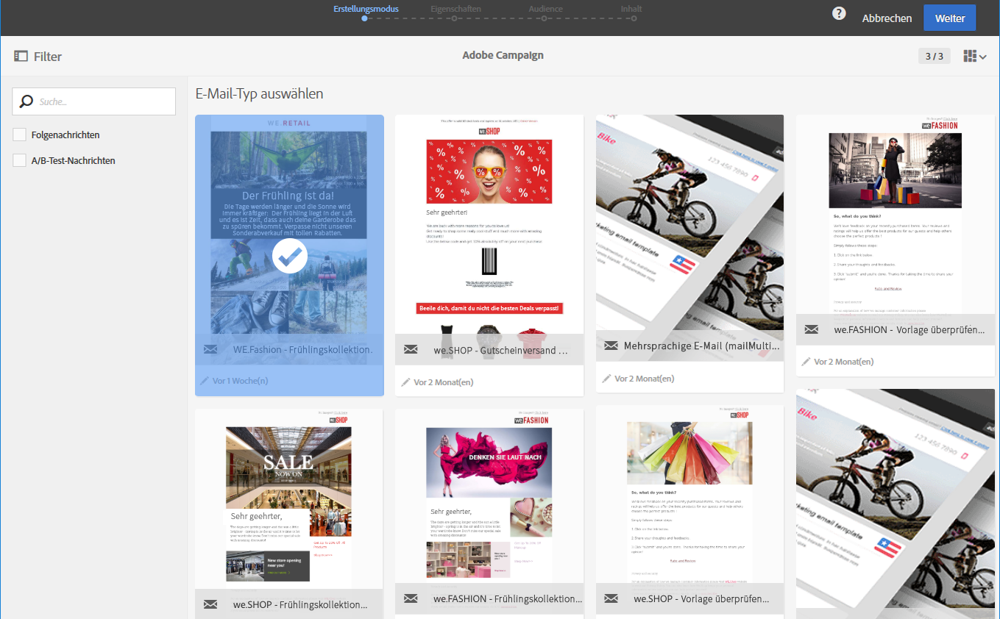
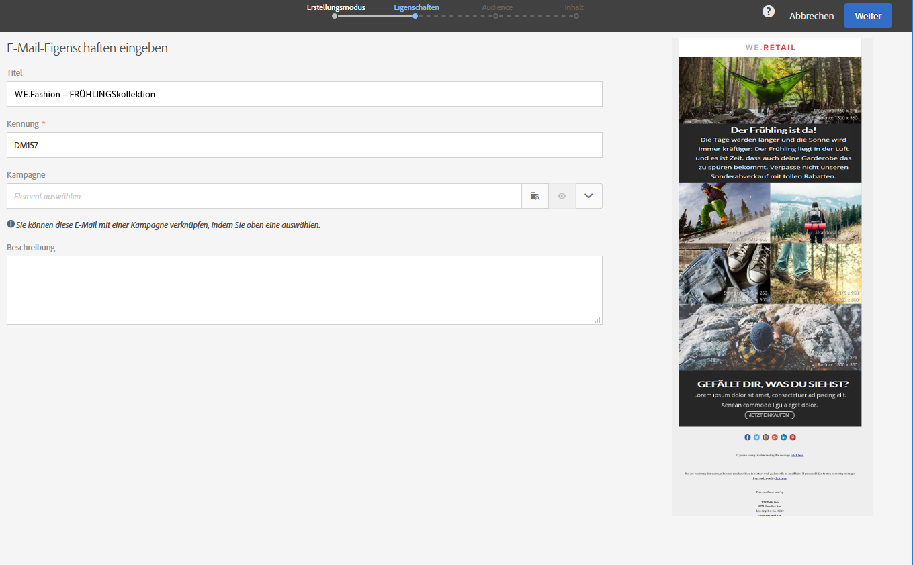
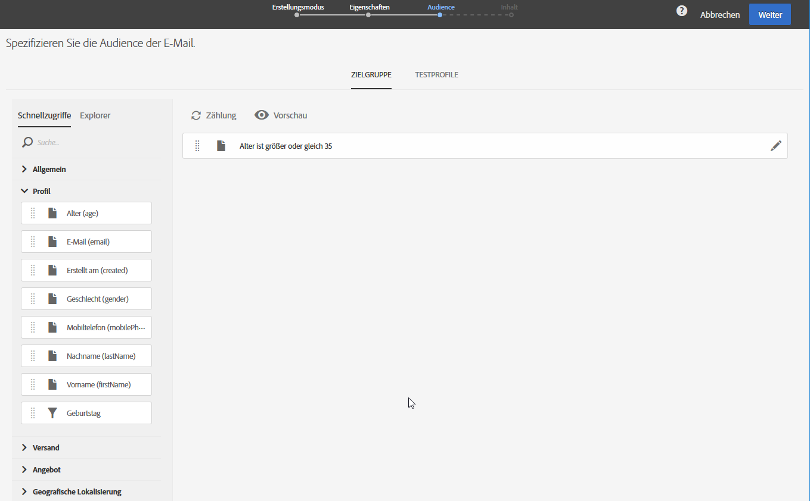
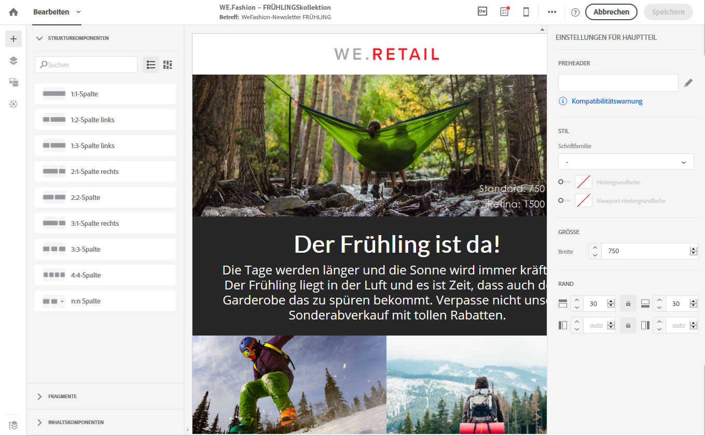
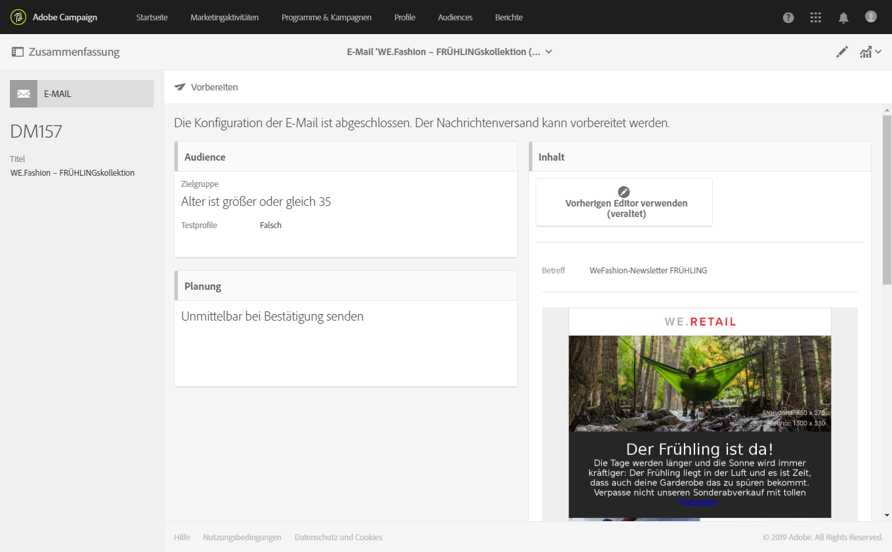
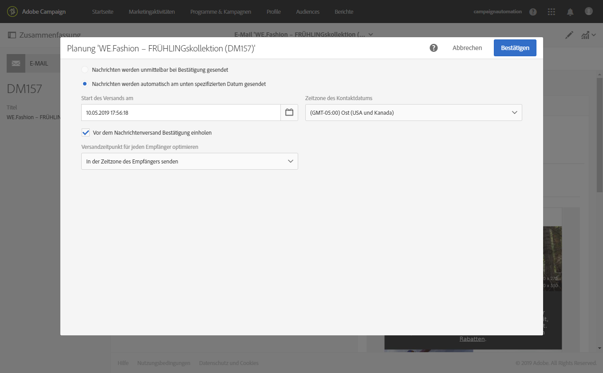
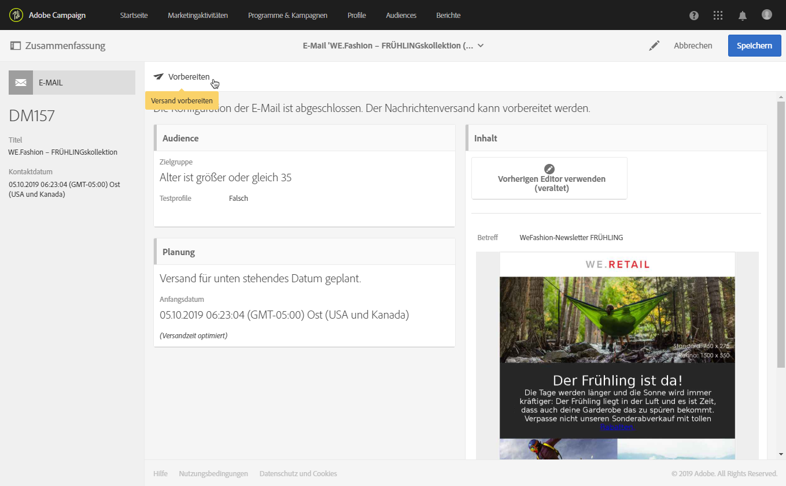
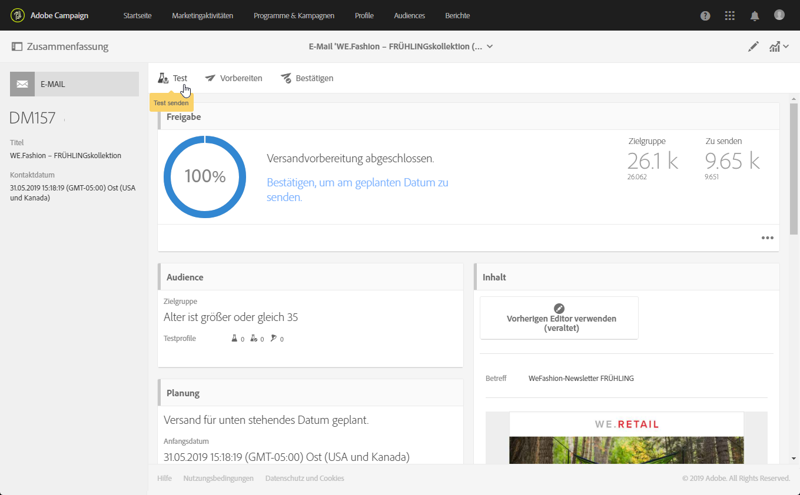
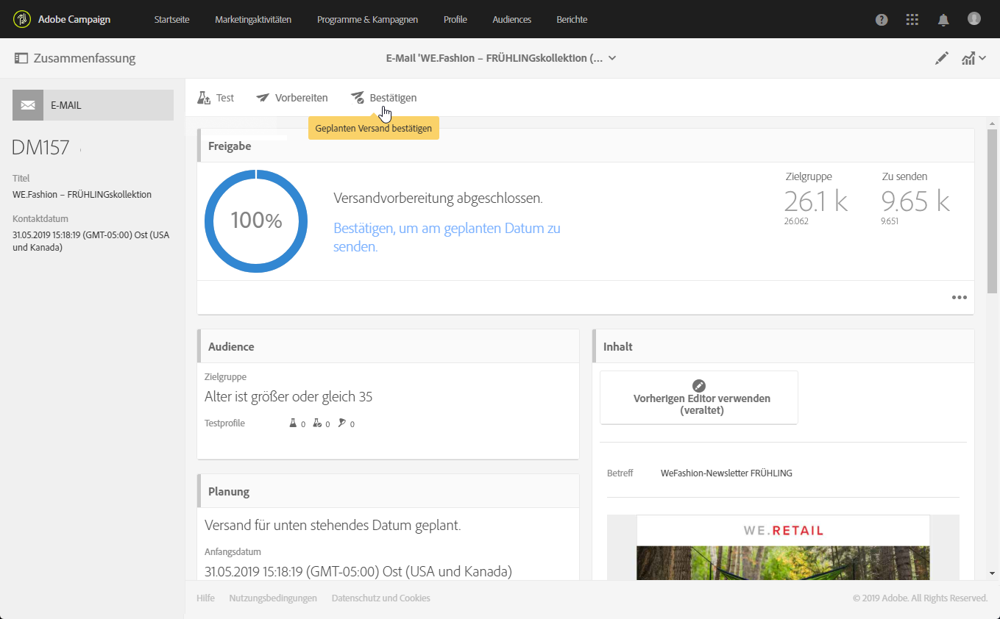

# E-Mails erstellen{#creating-an-email}

Die Erstellung von E-Mails erfolgt im Rahmen von [Kampagnen](../../start/using/marketing-activities.md#creating-a-marketing-activity), ausgehend von der [Adobe Campaign-Startseite](../../start/using/interface-description.md#home-page) oder in der [Liste der Marketing-Aktivitäten](../../start/using/marketing-activities.md#about-marketing-activities). In Workflows lassen sich ebenfalls E-Mails zum einmaligen oder zum wiederkehrenden Versand erstellen.

 [Entdecken Sie diese Funktion im Video](#video).

1. Erstellen Sie eine neue Marketing-Aktivität vom Typ E-Mail und wählen Sie die E-Mail-Vorlage aus, die Sie verwenden möchten.

   Für jede Marketing-Aktivität werden mehrere Standardvorlagen angeboten. Dadurch können Sie bestimmte Parameter nach Bedarf vorkonfigurieren und Ihrem Versand eine Marke zuweisen. Weiterführende Informationen dazu finden Sie im Abschnitt [Marketingaktivitäten-Vorlagen](../../start/using/marketing-activity-templates.md).

   

   >[!NOTE]
   >
   >Vorlagen für Folgenachrichten und A/B-Tests werden standardmäßig verborgen. Aktivieren Sie die Optionen auf der linken Seite (seitliches Fenster **[!UICONTROL Filter]**), um sie anzuzeigen.

1. Geben Sie die allgemeinen E-Mail-Eigenschaften an. Geben Sie im Feld **Titel** einen Namen ein und passen Sie gegebenenfalls die Kennung an.

   >[!NOTE]
   >
   >Name und Kennung der Aktivität erscheinen in der Benutzeroberfläche, sind jedoch für die Nachrichtenempfangenden nicht sichtbar.
   >
   >Achten Sie darauf, dass das ID-Feld kein Leerzeichen enthält, um Unstimmigkeiten zu vermeiden, z. B. bei der Integration mit Adobe Analytics.

   Fügen Sie bei Bedarf eine Beschreibung hinzu. Diese ist im Kampagneninhalt sichtbar.

   

   >[!NOTE]
   >
   >Wenn Sie eine E-Mail von der Startseite oder der Marketing-Aktivitätenliste ausgehend erstellen, können Sie sie einer bereits existierenden übergeordneten Kampagne zuordnen. Wählen Sie diese unter den bereits existierenden Kampagnen aus.

1. Definieren Sie die Zielgruppe Ihrer Nachricht auf der Basis Ihrer betrieblichen Bedingungen. Siehe [Über Profile](../../audiences/using/about-profiles.md).

   Außerdem können Sie die Testprofile zur Validierung der Nachricht definieren. Siehe [Verwaltung von Testprofilen](../../audiences/using/managing-test-profiles.md).

   

1. Definieren und personalisieren Sie mithilfe von [Email Designer](../../designing/using/designing-content-in-adobe-campaign.md) den Nachrichteninhalt, den Namen des Absenders und den Betreff. Weiterführende Informationen dazu finden Sie im Abschnitt [Über die Inhaltserstellung in E-Mails](../../designing/using/designing-content-in-adobe-campaign.md).

   

   Die können Ihre Nachricht mit einer vordefinierten Inhaltsvorlage gestalten oder Dreamweaver oder Adobe Experience Manager verwenden. Sie können auch für Sie vorbereitete Inhalte hochladen oder einen vorhandenen Inhalt aus einer URL importieren. Siehe [Existierenden Inhalt auswählen](../../designing/using/using-existing-content.md).

1. Sehen Sie sich Ihre Nachricht in der Vorschau an. Siehe [Vorschau der Nachricht erzeugen](../../sending/using/previewing-messages.md).
1. Validieren Sie die Erstellung der E-Mail.

   >[!NOTE]
   >
   >Um Ihre E-Mail speichern zu können, müssen Sie zunächst den Inhalt bearbeiten. Wenn Sie jetzt **[!UICONTROL Abbrechen]** auswählen, wird der Assistent nicht zu Ende geführt und Ihre E-Mail wird nicht erstellt.

   Daraufhin wird das Dashboard der E-Mail angezeigt. Dort können Sie Ihre Nachricht überprüfen und [den Versand vorbereiten](../../sending/using/preparing-the-send.md).

   Mit der Schaltfläche **[!UICONTROL Eigenschaften bearbeiten]** in der rechten oberen Ecke können Sie die Eigenschaften der E-Mail bearbeiten. Sie können beispielsweise die E-Mail so konfigurieren, dass ihr Titel zum Zeitpunkt der Versandvorbereitung berechnet wird. Die verfügbaren Parameter werden in [diesem Abschnitt](../../administration/using/configuring-email-channel.md#list-of-email-properties) aufgeführt.

   

1. Terminieren Sie den Versand. Siehe [Versandplanung](../../sending/using/about-scheduling-messages.md).

   

1. Bereiten Sie Ihre Nachricht vor, um ihre Zielgruppe zu analysieren. Siehe [Versandvorbereitung](../../sending/using/confirming-the-send.md).

   

   >[!NOTE]
   >
   >Sie können globale, kanalübergreifende Ermüdungsregeln festlegen, mit denen Profile, die bereits zu oft angesprochen wurden, automatisch von Kampagnen ausgeschlossen werden. Weiterführende Informationen hierzu finden Sie in den [Ermüdungsregeln](../../sending/using/fatigue-rules.md).

1. Führen Sie Testsendungen durch, um Ihre Nachricht zu überprüfen und zu validieren und das Inbox-Rendering zu überprüfen. Siehe [Testversand durchführen](../../sending/using/sending-proofs.md).

   

1. Senden Sie die Nachricht und prüfen Sie die Zustellung über das Nachrichten-Dashboard und die entsprechenden Protokolle. Siehe [Nachrichten senden](../../sending/using/confirming-the-send.md).

   

1. Messen Sie die Wirksamkeit Ihrer Nachricht mit Versandberichten. Weiterführende Informationen zum Reporting finden Sie in [diesem Abschnitt](../../reporting/using/about-dynamic-reports.md).

**Verwandte Themen**:

* Schrittweise Anleitung zum [Erstellen einer personalisierten E-Mail](../../channels/using/key-steps-to-send-a-message.md)
* [ Integration von Adobe Campaign und Dreamweaver](../../designing/using/using-integrations.md#editing-content-in-dreamweaver)
* [Integration mit Adobe Experience Manager](../../integrating/using/integrating-with-experience-manager.md)

## Anleitungsvideo {#video}

In diesem Video wird gezeigt, wie man eine E-Mail erstellt.

>[!VIDEO](https://video.tv.adobe.com/v/23721?quality=12)

Weitere Anleitungsvideos zu Campaign Standard finden Sie [hier](https://experienceleague.adobe.com/docs/campaign-standard-learn/tutorials/overview.html?lang=de).
