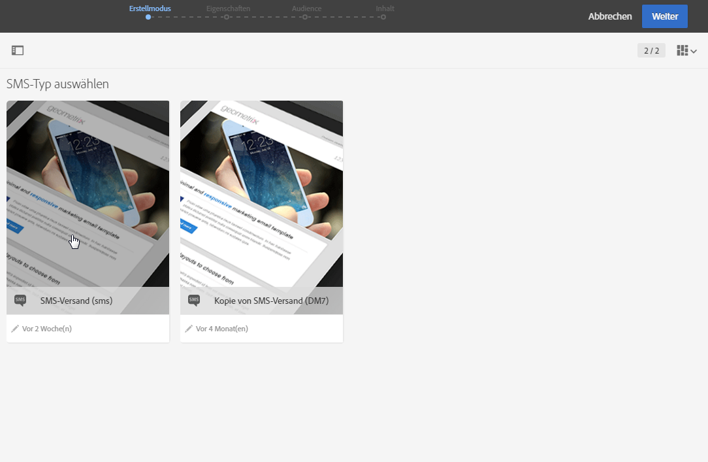
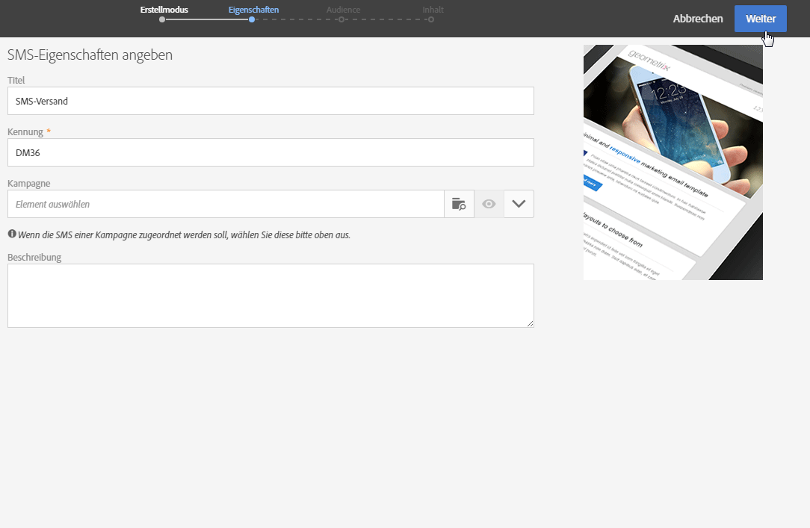
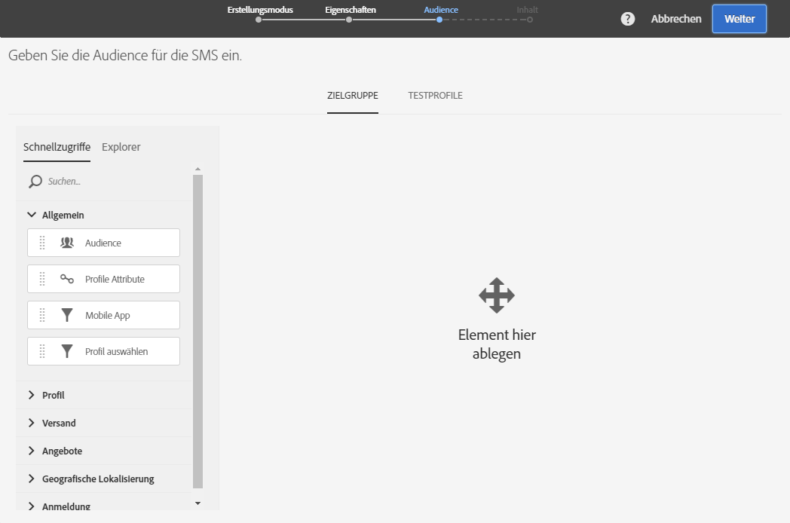
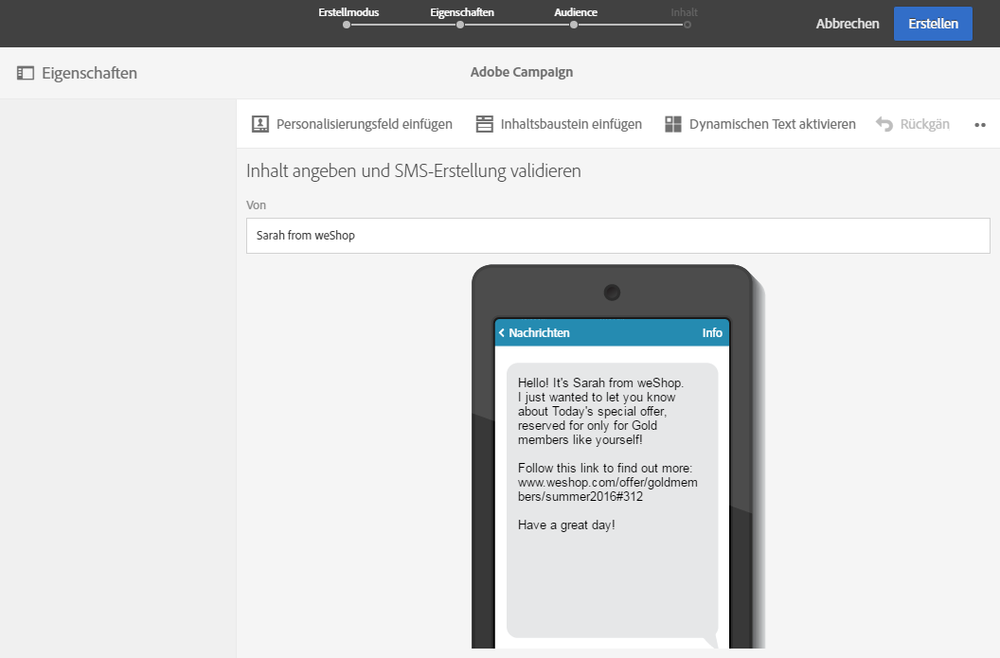
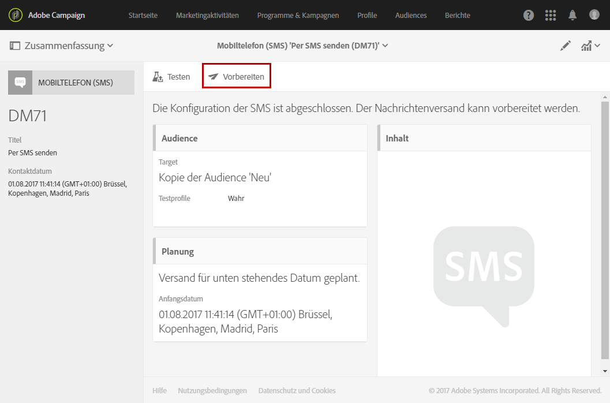
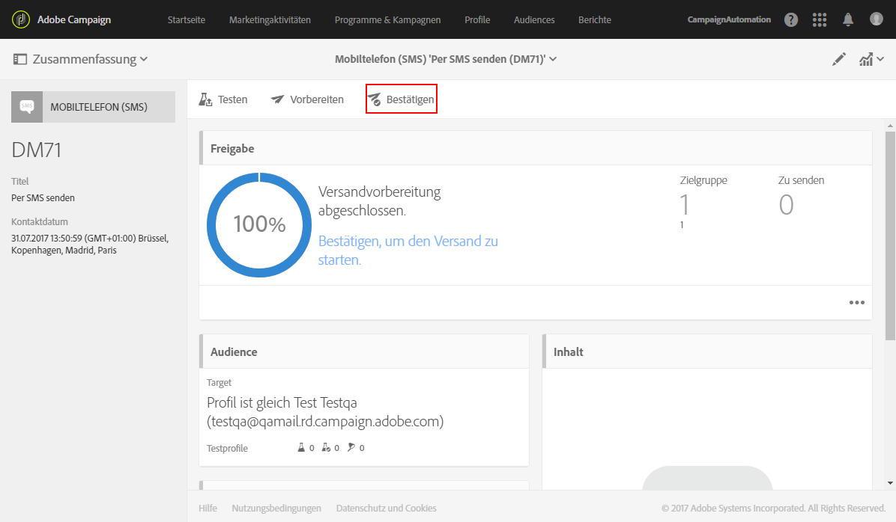

# SMS erstellen{#creating-an-sms-message}

Die Erstellung eines SMS-Versands ist der Erstellung einer üblichen E-Mail sehr ähnlich. Im Folgenden werden die Konfigurationsschritte für diesen Kanal beschrieben. Weiterführende Informationen zu anderen Optionen finden Sie in [E-Mails erstellen](../../channels/using/creating-an-email.md).

Informationen zu erweiterten SMS-Parametern finden Sie im Abschnitt [SMS-Konfiguration](../../administration/using/configuring-sms-channel.md).

 [Funktion im Video kennenlernen](#video).

Folgende Voraussetzungen müssen gegeben sein, um SMS-Nachrichten an Mobiltelefone senden zu können:

* ein externes Konto vom Typ **[!UICONTROL Routing]**, das für den Kanal **[!UICONTROL Mobiltelefon (SMS)]** mit dem Versandmodus **[!UICONTROL Gebündelter Versand]** konfiguriert wurde. Lesen Sie diesbezüglich auch den Abschnitt [Routing](../../administration/using/configuring-sms-channel.md#defining-an-sms-routing).
* Eine Versandvorlage, die auf das externe Konto Bezug nimmt

1. Erstellen Sie einen SMS-Versand. Ein Versand kann über die Adobe Campaign-[Startseite](../../start/using/interface-description.md#home-page), im Rahmen einer [Kampagne](../../start/using/marketing-activities.md#creating-a-marketing-activity) oder in der [Liste der Marketing-Aktivitäten](../../start/using/programs-and-campaigns.md#creating-a-campaign) erstellt werden.

   Es besteht außerdem die Möglichkeit, eine SMS-Aktivität in einem Workflow hinzuzufügen. Weitere Informationen hierzu finden Sie im [Workflow](../../automating/using/sms-delivery.md)-Handbuch.

   Bei der Erstellung einer Nachricht öffnet sich ein Assistent, der Sie durch die wichtigsten Schritte führt. Die im Assistenten vorgenommenen Definitionen können später im Nachrichten-Dashboard geändert werden.

1. Wählen Sie die gewünschte Vorlage aus. Verwenden Sie entweder die Standardvorlage für SMS oder eine Ihrer eigenen Vorlagen.

   

   Um Nachrichten an Mobiltelefone senden zu können, muss die verwendete Versandvorlage auf das externe SMS-Routing-Konto Bezug nehmen.

1. Geben Sie die allgemeinen Eigenschaften der SMS an.

   

   >[!NOTE]
   >
   >Name und Kennung der Aktivität erscheinen in der Benutzeroberfläche, sind jedoch für die Nachrichtenempfangenden nicht sichtbar.
   >
   >Achten Sie darauf, dass das ID-Feld kein Leerzeichen enthält, um Unstimmigkeiten zu vermeiden, z. B. bei der Integration mit Adobe Analytics.

1. Wählen Sie die zu kontaktierende Audience aus. Sie können eine bestehende Audience auswählen oder direkt eine Population erstellen, indem Sie Regeln definieren und kombinieren.

   

1. Fügen Sie Ihrer SMS Inhalt hinzu. Sie können den Inhalt auch definieren, indem Sie nach Abschluss der SMS-Erstellung den Bereich **[!UICONTROL Inhalt]** des Versand-Dashboards auswählen. Siehe [Über die SMS-Inhaltserstellung](../../channels/using/about-sms-and-push-content-design.md).

   Die Verwendung von Personalisierungsfeldern oder bedingten Texten im SMS-Inhalt kann dazu führen, dass die Nachrichtenlänge je nach Empfänger variiert und dass u. U. nicht von GSM unterstützte Zeichen eingefügt werden. Die Nachrichtenlänge kann daher erst nach erfolgter Personalisierung korrekt eingeschätzt werden. Siehe [SMS personalisieren](../../channels/using/personalizing-sms-messages.md).

   

1. Validieren Sie die Erstellung der Nachricht. Das Dashboard wird daraufhin angezeigt.
1. Terminieren Sie den Versand. Die SMS kann manuell unmittelbar nach der Vorbereitung der Nachricht oder automatisch zu einem festgelegten Zeitpunkt gesendet werden. Siehe [Versandplanung](../../sending/using/about-scheduling-messages.md).
1. Bereiten Sie die Nachricht vor, um ihre Gültigkeit, Personalisierung und Zielgruppe zu prüfen.

   

   >[!NOTE]
   >
   >Sie können globale, kanalübergreifende Ermüdungsregeln festlegen, mit denen Profile, die bereits zu oft angesprochen wurden, automatisch von Kampagnen ausgeschlossen werden. Näheres dazu finden Sie unter [Ermüdungsregeln](../../sending/using/fatigue-rules.md).

1. Führen Sie Testsendungen durch, um Ihre Nachricht zu überprüfen und zu validieren und das Inbox-Rendering zu überprüfen; siehe auch den Abschnitt [Testversand durchführen](../../sending/using/sending-proofs.md).
1. Bestätigen Sie den Versand der Nachricht. Der Versand erfolgt an dem von Ihnen festgelegten Zeitpunkt.

   

Die Nachricht wird gesendet. Sie können die Zustellung über das Nachrichten-Dashboard und die entsprechenden Protokolle prüfen.

Nach Abschluss des Versands können Sie die Wirkung der Nachricht mithilfe integrierter oder benutzerdefinierter Versandberichte messen.

**Verwandte Themen:**

* [Über die Bearbeitung von SMS und Push-Benachrichtigungen](../../channels/using/about-sms-and-push-content-design.md)
* [Vorlagen verwalten](../../start/using/marketing-activity-templates.md)

## Anleitungsvideo {#video}

In diesem Video wird gezeigt, wie man einen SMS-Versand erstellt.

>[!VIDEO](https://video.tv.adobe.com/v/25265/?quality=12)

Weitere Anleitungsvideos zu Campaign Standard finden Sie [hier](https://experienceleague.adobe.com/docs/campaign-standard-learn/tutorials/overview.html?lang=de).
