# Briefpost erstellen{#creating-the-direct-mail}

Die Erstellung eines Briefpost-Versands ist der Erstellung einer üblichen E-Mail sehr ähnlich. Im Folgenden werden die Konfigurationsschritte für diesen Kanal beschrieben. Weiterführende Informationen zu anderen Optionen finden Sie in [E-Mails erstellen](../../channels/using/creating-an-email.md).

1. Erstellen Sie einen neuen Briefpost-Versand. Ein Versand kann über die Adobe-Campaign-[Startseite](../../start/using/interface-description.md#home-page), im Rahmen einer [Kampagne](../../start/using/marketing-activities.md#creating-a-marketing-activity) oder in der [Liste der Marketingaktivitäten](../../start/using/programs-and-campaigns.md#creating-a-campaign) erstellt werden.

   >[!NOTE]
   >
   >Es besteht außerdem die Möglichkeit, eine Briefpost-Aktivität in einem Workflow hinzuzufügen. Weitere Informationen hierzu finden Sie im [Workflow](../../automating/using/direct-mail-delivery.md)-Handbuch.

   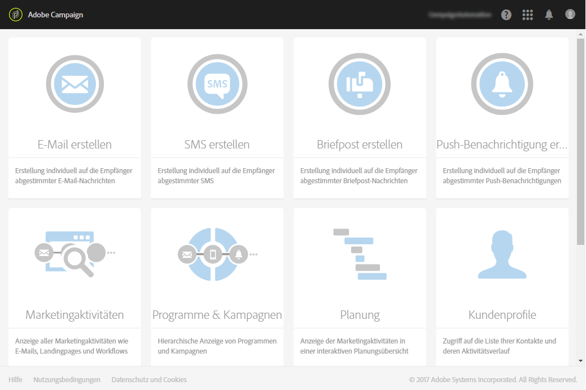

1. Choose either the out-of-the-box **[!UICONTROL Direct mail]** template or one of your own templates. Weiterführende Informationen zu Vorlagen finden Sie im Abschnitt [Marketingaktivitäten-Vorlagen](../../start/using/marketing-activity-templates.md).

   

1. Geben Sie die allgemeinen Eigenschaften des Versands ein.

   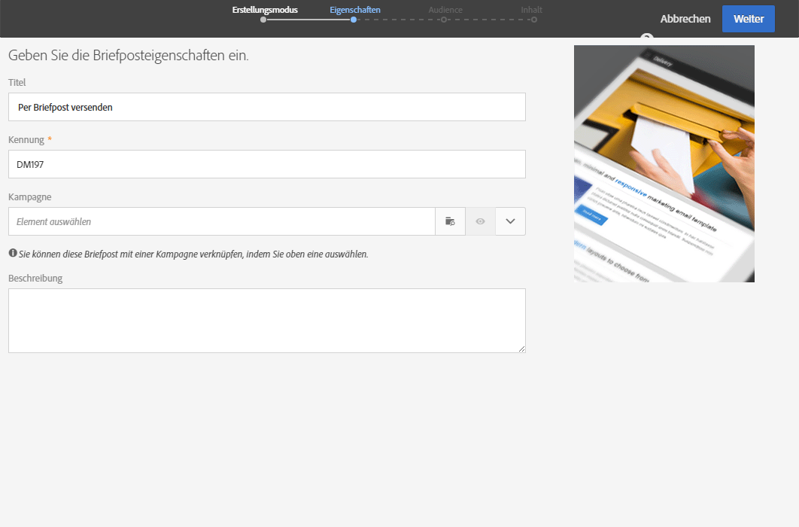

1. Definieren Sie die Audience, die in der Extraktionsdatei enthalten sein soll, sowie die Profile, die getestet und mit Fallen versehen werden sollen. Siehe [Briefpost-Audience definieren](../../channels/using/defining-the-direct-mail-audience.md).

   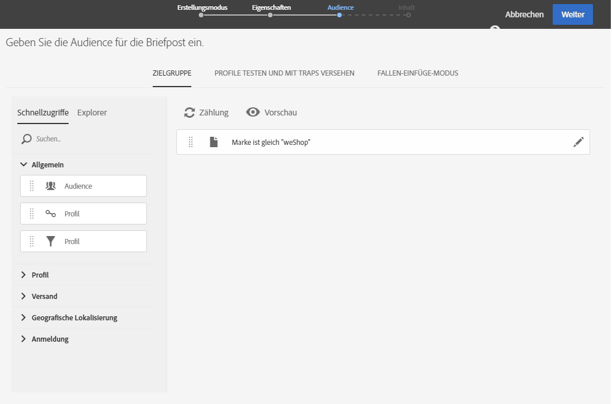

   >[!NOTE]
   >
   >Die Definition der Audience erfolgt ähnlich der Definition einer gewöhnlichen E-Mail-Audience. Weiterführende Informationen dazu finden Sie im Abschnitt [Erstellung von Audiences](../../audiences/using/creating-audiences.md).

1. Bearbeiten Sie den Inhalt Ihrer Datei: die Spalten für jedes Profil, Dateistruktur, Kopf- und Fußzeile. Siehe [Briefpost-Inhalt definieren](../../channels/using/defining-the-direct-mail-content.md).

   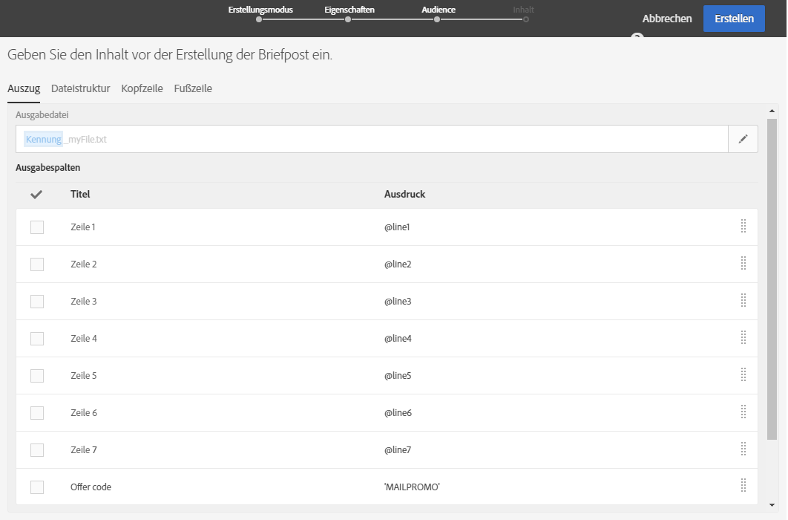

1. Click on the **[!UICONTROL Schedule]** section of the delivery dashboard to define the contact date. Für Briefpost ist die Angabe des Kontaktdatums erforderlich. Weiterführende Informationen finden Sie unter [Versanddatum planen](../../sending/using/about-scheduling-messages.md).

   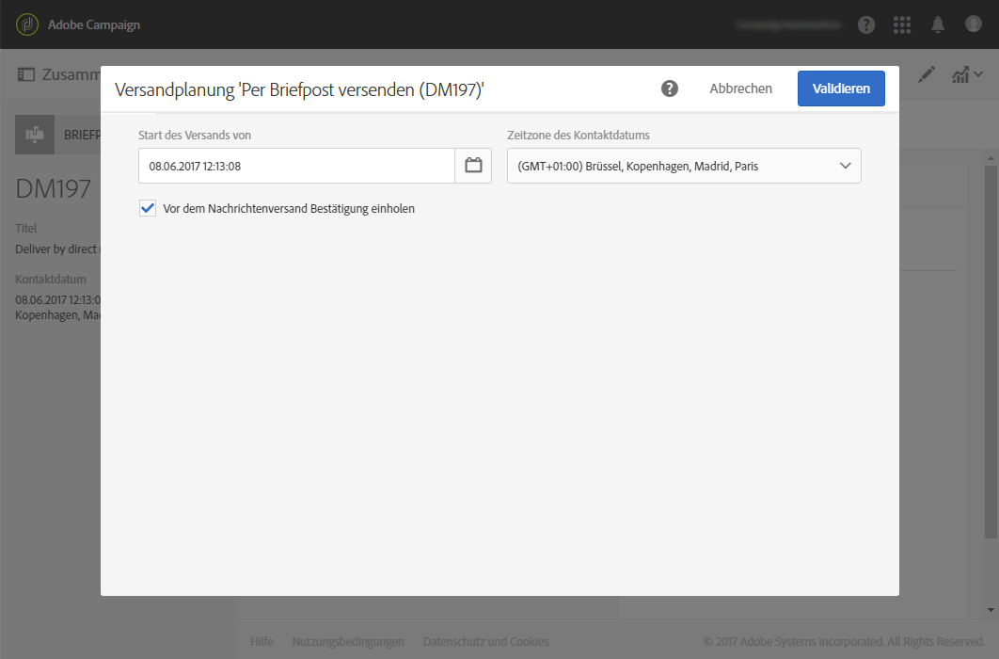

1. Wenn Sie Testprofile hinzufügen (siehe [Test- und Fallen-Profile hinzufügen](../../channels/using/defining-the-direct-mail-audience.md#adding-test-and-trap-profiles)), können Sie Ihren Versand testen, bevor Sie die endgültige Datei fertigstellen. Dadurch können Sie eine Beispieldatei erstellen, die nur die ausgewählten Testprofile enthält.

   Klicken Sie auf **[!UICONTROL Test]**, um die Beispieldatei zu erstellen. Click on **[!UICONTROL Summary]**, in the top left corner, then select **[!UICONTROL Proofs]**. On the left part of the screen, select the proof and click on **[!UICONTROL Download file]**.

   >[!NOTE]
   >
   >Die **[!UICONTROL Export]**-Rolle ist erforderlich, um Adobe Campaign zu ermöglichen, die Datei zu exportieren und für den Download verfügbar zu machen. Kontaktieren Sie diesbezüglich Ihren Administrator.

   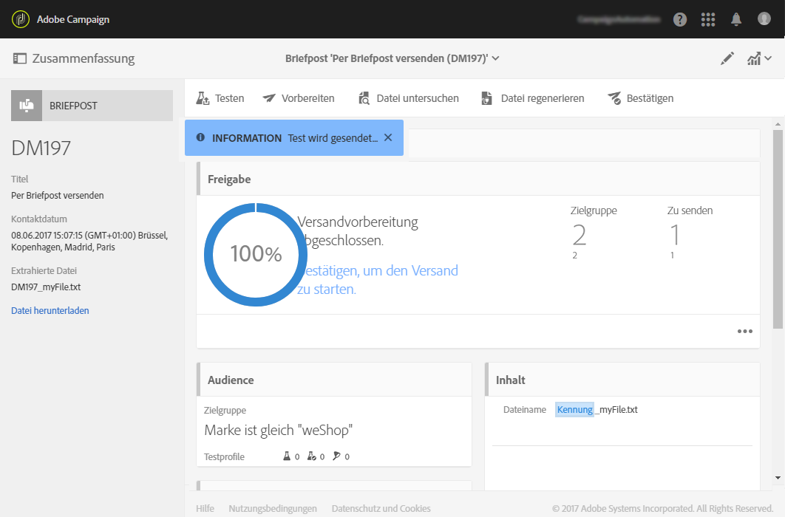

1. Once you have defined your delivery content, audience and contact date, click on the **[!UICONTROL Prepare]** button, on the delivery dashboard.

   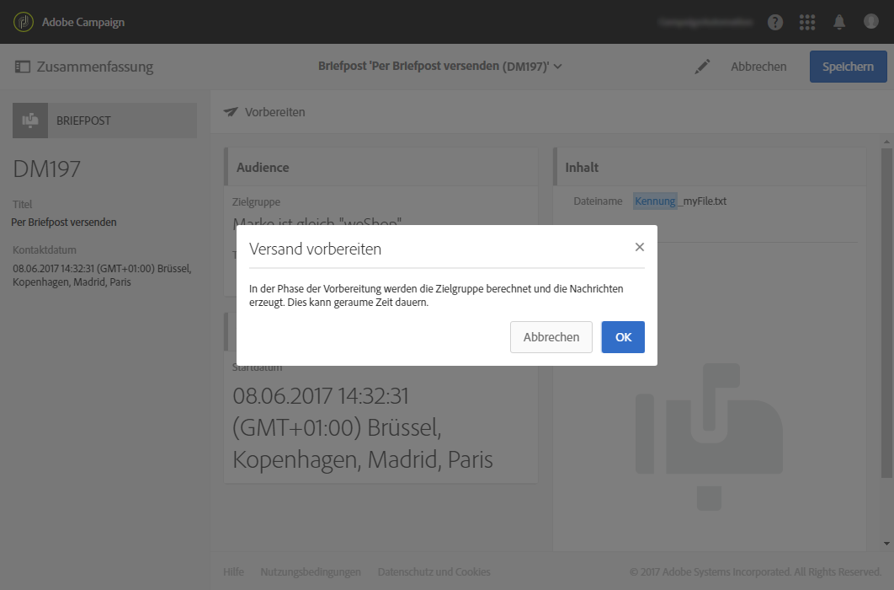

   Typologieregeln wurden angewendet. So werden beispielsweise alle nicht angegebenen Anschriften aus der Zielgruppe ausgeschlossen. This is why you need to make sure you have checked the **[!UICONTROL Address specified]** box in your profiles&#39; information (see [Recommendations](../../channels/using/about-direct-mail.md#recommendations)). If you have defined a **[!UICONTROL Maximum volume of message]** in the direct mail properties or at the template level, it will also be applied here.

   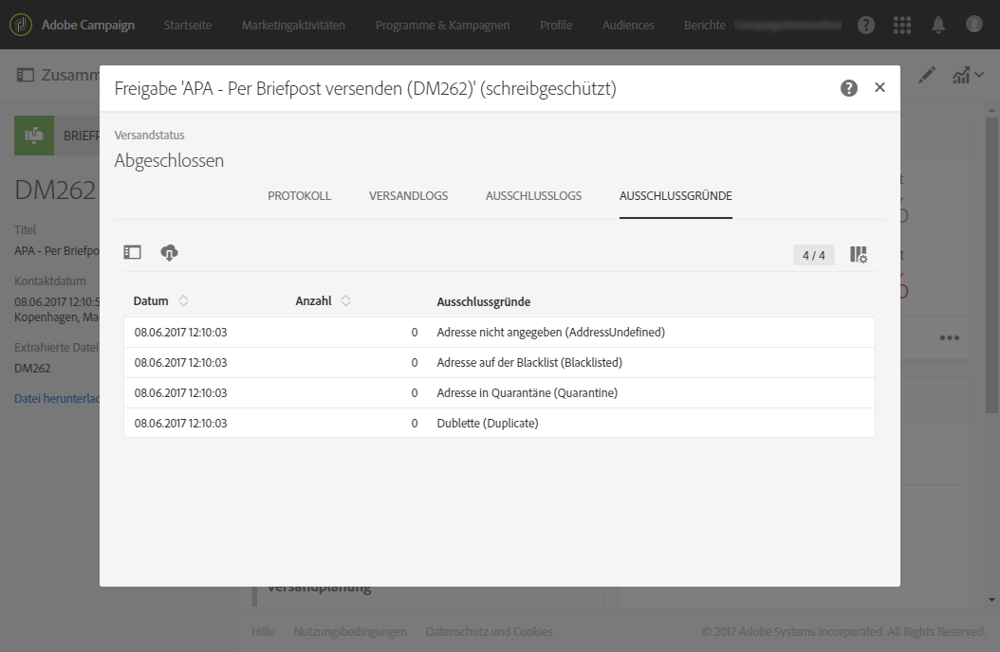

   >[!NOTE]
   >
   >Sie können globale, kanalübergreifende Ermüdungsregeln festlegen, mit denen Profile, die bereits zu oft angesprochen wurden, automatisch von Kampagnen ausgeschlossen werden. Näheres dazu finden Sie unter [Ermüdungsregeln](../../sending/using/fatigue-rules.md).

1. Click on **[!UICONTROL Explore file]** to preview the first 100 lines of the file.

   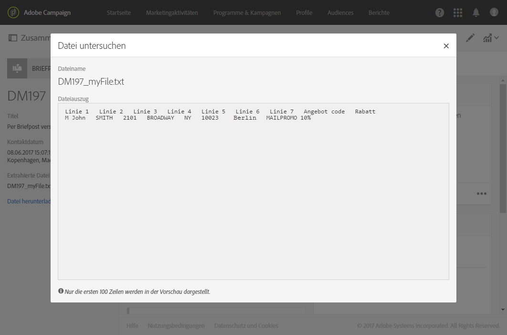

   Die komplette Datei kann auf der linken Bildschirmseite heruntergeladen werden. Downloading the file generates a log entry in the **[!UICONTROL Export audits]** menu. Weiterführende Informationen zu Export-Audits finden Sie im Abschnitt [Log-Exporte überprüfen](../../administration/using/auditing-export-logs.md).

   >[!NOTE]
   >
   >Die **[!UICONTROL Export]**-Rolle ist erforderlich, um Adobe Campaign zu ermöglichen, die Datei zu exportieren und für den Download verfügbar zu machen. Kontaktieren Sie diesbezüglich Ihren Administrator.

   If you need to change the delivery content, you only have to click on the **[!UICONTROL Regenerate file]** button to take the change into account. Die Vorbereitung muss nicht wiederholt werden.

   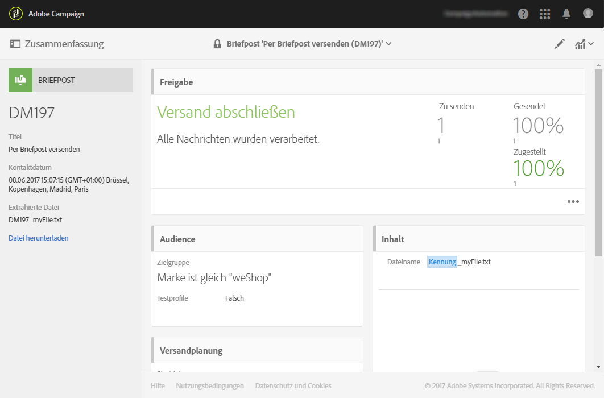

1. To confirm that the file is final, click on **[!UICONTROL Confirm]** in the delivery dashboard.

   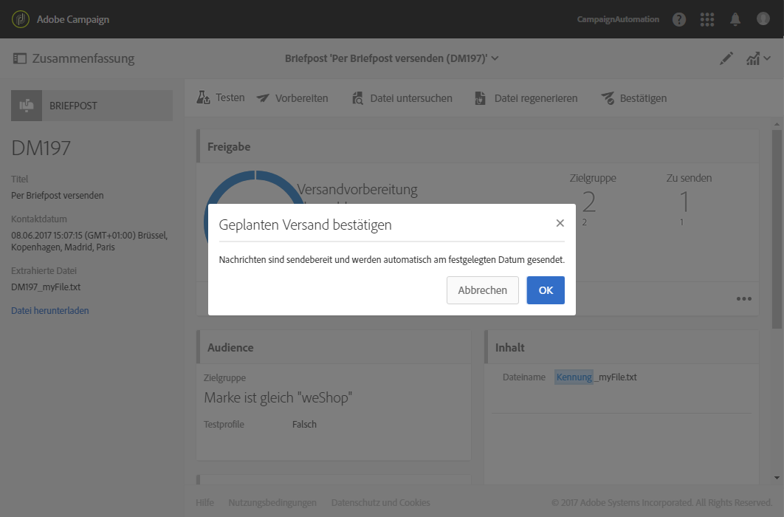

Jetzt können Sie die Extraktionsdatei an Ihren Briefpost-Dienstleister senden. Dafür haben Sie mehrere Möglichkeiten:

* Senden Sie mit regulärer E-Mail und einem Dateianhang.
* Send it via Campaign: perform your direct mail within a campaign [workflow](../../automating/using/direct-mail-delivery.md) and add a **[!UICONTROL Transfer file]** to send the file via FTP for example. Siehe [Dateiübertragung](../../automating/using/transfer-file.md).

Der Provider ruft die Liste mit fehlerhaften Adressen ab und sendet diese Informationen an Adobe Campaign, wo die fehlerhaften Adressen automatisch auf die Blacklist gesetzt werden. Siehe [Rücksendungen an den Absender](../../channels/using/return-to-sender.md).
