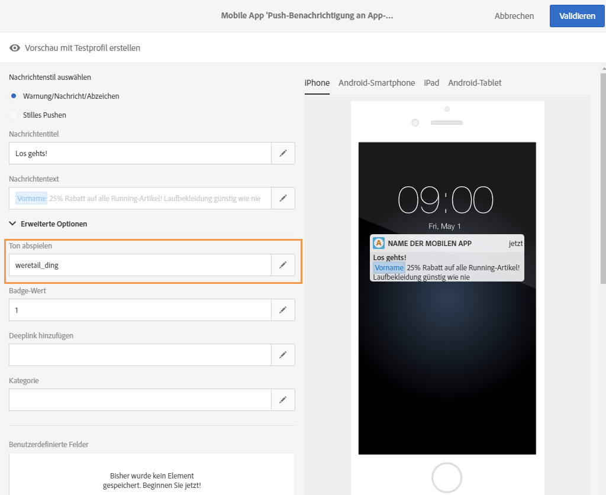

# Push-Benachrichtigung anpassen{#customizing-a-push-notification}

In Adobe Campaign stehen Ihnen zur Anpassung von Push-Benachrichtigungen bei deren Erstellung eine Reihe erweiterter Optionen zur Verfügung.

Erfahrene Benutzer können bezüglich der Konfiguration von Mobile Apps in Adobe Campaign folgende TechNote zu Rate ziehen: [Understanding Campaign Standard Push Notifications Payload Structure](https://helpx.adobe.com/de/campaign/kb/understanding-campaign-standard-push-notifications-payload-struc.html).

**Verwandte Inhalte:**

* [Bericht zu Push-Benachrichtigungen](../../reporting/using/push-notification-report.md)
* [Push-Benachrichtigungen in einem Workflow versenden](../../automating/using/push-notification-delivery.md)

## Ton abspielen {#play-a-sound}

Mit der Funktion **[!UICONTROL Ton abspielen]** wird bei der Zustellung einer Push-Benachrichtigung auf dem Gerät ein Ton abgespielt, auch wenn die App deaktiviert ist.

Benutzer werden durch den Ton auf den Empfang einer Push-Benachrichtigung hingewiesen, die dadurch mehr Aufmerksamkeit erhält. So aktivieren Sie den Ton in Ihrer Mobile App:

1. Öffnen Sie die Push-Benachrichtigung und greifen Sie auf den Bereich **[!UICONTROL Erweiterte Optionen]** zu.
1. Geben Sie im Feld **[!UICONTROL Ton abspielen]** den Namen der Tondatei ein (ohne Erweiterung), die bei Erhalt einer Benachrichtigung vom Mobilgerät abgespielt werden soll.

   Weiterführende Informationen zu unterstützten Medienformaten finden Sie in der [Apple](https://support.apple.com/kb/PH16864?locale=de_DE)- und [Android](https://developer.android.com/guide/topics/media/media-formats)-Dokumentation.

   

1. Die Tondatei wird bei der Zustellung der Benachrichtigung abgespielt, wenn die Datei im Package der Mobile App definiert ist. Andernfalls wird der Standardton des Geräts verwendet.

Der Benutzer erhält die Push-Benachrichtigung und den Ton nur, wenn sein Telefon nicht stummgeschaltet ist.

## Badge-Wert aktualisieren  {#refresh-the-badge-value}

Mit einem Badge wird die Anzahl der neuen ungelesenen Nachrichten direkt auf dem App-Symbol angezeigt. Der Badge-Wert verschwindet, sobald der Benutzer den neuen Inhalt in der Anwendung öffnet oder liest.

Wenn eine Benachrichtigung auf einem Gerät empfangen wird, kann der Badge-Wert für die entsprechende App aktualisiert oder hinzugefügt werden. So senden Sie einen Badge-Wert vom Server:

1. Öffnen Sie die Push-Benachrichtigung und greifen Sie auf den Bereich **[!UICONTROL Erweiterte Optionen]** zu.
1. Der Badge-Wert muss eine Integer sein und kann auf unterschiedliche Weise aktualisiert werden:

   * Um den Badge zu aktualisieren, geben Sie 0 in das Feld **[!UICONTROL Badge-Wert]** ein. Dadurch wird der Badge vom Anwendungssymbol entfernt.
   * Um einen Badge hinzuzufügen, geben Sie in das Feld **[!UICONTROL Badge-Wert]** eine beliebige Zahl ein. Diese Zahl erscheint automatisch im Badge, sobald der Benutzer eine Push-Benachrichtigung erhält.
   * Wenn das Feld leer ist oder keine ganze Zahl enthält, ändert sich der Badge-Wert nicht.

   In unserem Beispiel haben wir in das Feld **[!UICONTROL Badge-Wert]** 1 eingegeben, sodass Benutzern der Empfang eines neuen Inhalts angezeigt wird.

   

1. Nach dem Versand Ihrer Nachricht erhalten Benutzer die Push-Benachrichtigung und in ihrer Anwendung wird automatisch der neue Badge-Wert angezeigt.

   

## Deeplink hinzufügen  {#add-a-deeplink}

Mit einem Deeplink gelangen Benutzer direkt zu Inhalten, die in der Anwendung enthalten sind (anstatt eine Webseite zu öffnen).

Ein Deeplink kann Personalisierungsdaten für ein benutzerdefiniertes In-App-Erlebnis enthalten. Beispielsweise kann der Vorname eines Empfängers automatisch in die Seite eingefügt werden, auf die er von der Anwendung weitergeleitet wird.

Gehen Sie folgendermaßen vor, um einen Deeplink zu einer Push-Benachrichtigung hinzuzufügen:

1. Öffnen Sie die Push-Benachrichtigung und greifen Sie auf den Bereich **[!UICONTROL Erweiterte Optionen]** zu.
1. Geben Sie im Feld **[!UICONTROL Deeplink hinzufügen]** den Link ein.

   

1. Nach dem Versand Ihrer Nachricht erhalten die Benutzer die Push-Benachrichtigung und können durch die Interaktion mit der Benachrichtigung auf die entsprechende Seite zugreifen, z. B. durch Antippen oder Anklicken der Aktionsschaltfläche.

   

## Aktion definieren  {#define-an-action}

Sie können eine Kategorie-Kennung hinzufügen, sofern eine in der Mobile App verfügbar ist, und dann Aktionsschaltflächen anzeigen. Mit diesen Benachrichtigungen können Benutzer rascher unterschiedliche Aufgaben ausführen, ohne die Anwendung öffnen oder darin navigieren zu müssen.

Der Benutzer muss im auf dem Telefon erscheinenden Dialogfenster eine Entscheidung eingeben, damit er fortfahren kann. Wenn der Benutzer eine Aktion auswählt, wird die Anwendung vom System benachrichtigt, sodass die entsprechenden Aufgaben ausgeführt werden können.

Gehen Sie folgendermaßen vor, um eine Kategorie zu einer Push-Benachrichtigung hinzuzufügen:

1. Öffnen Sie die Push-Benachrichtigung und greifen Sie auf den Bereich **[!UICONTROL Erweiterte Optionen]** zu.
1. Geben Sie im Feld **[!UICONTROL Kategorie]** einen vordefinierten Kategorienamen ein, um beim Empfang einer Push-Benachrichtigung gewisse Schaltflächen anzuzeigen.

   Die Kategorie-Kennung und das erwartete Verhalten der Schaltflächen in der Anwendung müssen vom Entwickler der Mobile App definiert werden. Weiterführende Informationen finden Sie im [Handbuch für Apple-Entwickler](https://developer.apple.com/library/content/documentation/NetworkingInternet/Conceptual/RemoteNotificationsPG/SupportingNotificationsinYourApp.html) (Abschnitt zum **Konfigurieren von Kategorien und zu Benachrichtigungen - Configuring Categories and Actionable Notifications**) oder im [Handbuch für Android-Entwickler](https://developer.android.com/guide/topics/ui/notifiers/notifications.html).

   

1. Nach dem Versand einer Push-Benachrichtigung wird sie von Benutzern empfangen, die eine der zuvor konfigurierten Aktionsschaltflächen auswählen müssen.

   

Abhängig von der Aktion der Benutzer wird die Anwendung benachrichtigt, sodass etwaige damit verbundene Aufgaben ausgeführt werden.

## Ablaufdatum hinzufügen {#add-expiration-date}

Durch das Festlegen eines Ablaufdatums für eine Push-Benachrichtigung wird diese Nachricht von Apple ([APNS](https://developer.apple.com/documentation/usernotifications/setting_up_a_remote_notification_server/sending_notification_requests_to_apns)) oder Android ([FCM](https://firebase.google.com/docs/cloud-messaging/concept-options)) nach diesem Datum nicht mehr gesendet.

So fügen Sie Ihrer Push-Benachrichtigung ein Ablaufdatum hinzu:

1. Aktivieren Sie die Option für den **[!UICONTROL Ablauf der Nachricht]**.

   >[!NOTE]
   >
   >Durch die Auswahl der Option **[!UICONTROL Ablauf der Nachricht]** wird die Dauer automatisch auf 0 eingestellt. Wenn Sie den Wert nicht ändern, versuchen sowohl APNS als auch FCM, die Nachricht sofort zu senden. Wenn der Versand fehlschlägt, wird die Nachricht nicht erneut gesendet.

1. Wählen Sie im Feld **[!UICONTROL Dauer]** die Gültigkeitsdauer Ihrer Push-Benachrichtigung aus.

   

1. Wenn der Benutzer die Push-Benachrichtigung nach dem Senden nicht sofort erhalten hat, weil das Telefon nicht eingeschaltet war oder er keinen Empfang hatte, wird die Push-Benachrichtigung dennoch innerhalb der Gültigkeitsdauer gesendet.

Wenn die Push-Benachrichtigung aber nicht vor dem Ende der Gültigkeitsdauer gesendet werden kann, wird sie verworfen.

## Benutzerdefinierte Felder hinzufügen  {#add-custom-fields}

Mit benutzerdefinierten Feldern können Sie benutzerdefinierte Daten in der Payload in Form eines Schlüssel-/Werte-Paares übermitteln. Mit dieser Option haben Sie die Möglichkeit, neben den vordefinierten Schlüsseln auch Zusatzdaten an die Anwendung zu senden.

Gehen Sie dabei folgendermaßen vor:

1. Öffnen Sie die Push-Benachrichtigung und greifen Sie auf den Bereich **[!UICONTROL Erweiterte Optionen]** zu.
1. Wählen Sie in der Kategorie **[!UICONTROL Benutzerdefinierte Felder]** die Schaltfläche **[!UICONTROL Element hinzufügen]** aus.
1. Geben Sie Ihre **[!UICONTROL Schlüssel]** und danach die mit jedem Schlüssel verknüpften **[!UICONTROL Werte]** ein.

   

1. Die Handhabung und der Zweck von benutzerdefinierten Feldern wird von der Mobile App bestimmt. In der unten stehenden Push-Benachrichtigung wurden die benutzerdefinierten Felder von der App verwendet, um Schaltflächenbeschriftungen für die Push-Benachrichtigung anzuzeigen.

   

## Rich-Media-Inhalte hinzufügen {#add-rich-media-content}

Rich-Media-Inhalte fördern die Interaktion mit Benutzern. Die Wahrscheinlichkeit, dass Benutzer Ihre Push-Benachrichtigung öffnen, ist also größer.

Sie können eine Bild-, GIF-, Audio- und Videodatei einfügen, die direkt in der Benachrichtigung abgespielt bzw. gezeigt wird. Ihre App-Benutzer müssen zum Ansehen die App nicht öffnen.

Gehen Sie folgendermaßen vor, um Rich-Media-Inhalte in Push-Benachrichtigungen einzufügen:

1. Öffnen Sie die Push-Benachrichtigung und greifen Sie auf den Bereich **[!UICONTROL Erweiterte Optionen]** zu.
1. Geben Sie für jedes Format – iOS und Android – die URL Ihrer Datei in das Feld **[!UICONTROL URL für Rich-Media-Daten]** ein.

   Unter iOS 10 oder höher können Sie Bild-, GIF-, Audio- und Videodateien einfügen. Bei früheren iOS-Versionen wird die Push-Benachrichtigung ohne Rich-Inhalte angezeigt. Eine detaillierte Anleitung zum Anzeigen von Bildern in einer Push-Benachrichtigung in Adobe Campaign auf einem iOS-Gerät finden Sie auf dieser [Seite](https://helpx.adobe.com/de/campaign/kb/display-image-push.html).

   Unter Android können Sie nur Bilder einfügen.

   

1. Nach dem Versand erhält der Benutzer Ihre Push-Benachrichtigung und kann sich den Rich-Media-Inhalt ansehen.

   

## Verhalten von Benachrichtigungen für iOS ändern  {#change-the-notification-behavior-for-ios}

Bei iOS 10 oder höher sind für Push-Benachrichtigungen im Bereich **[!UICONTROL Erweiterte Optionen]** zwei zusätzliche Optionen verfügbar: **[!UICONTROL Veränderlicher Inhalt]** und **[!UICONTROL Inhalt verfügbar]**.

Wenn die Option **[!UICONTROL Veränderlicher Inhalt]** aktiviert ist und/oder eine URL für Rich-Media-Daten hinzugefügt wird, wird das Flag für veränderlichen Inhalt in der Push-Payload gesendet. Dadurch kann der Inhalt der Push-Benachrichtigung durch eine im iOS SDK enthaltene Erweiterung verändert werden. Weiterführende Informationen dazu finden Sie im [Handbuch für Apple-Entwickler](https://developer.apple.com/library/content/documentation/NetworkingInternet/Conceptual/RemoteNotificationsPG/ModifyingNotifications.html).

Danach können Sie mithilfe Ihrer Mobile-App-Erweiterungen den Inhalt oder die Darstellung von Push-Benachrichtigungen, die über Adobe Campaign gesendet werden, weiter verändern. Mit dieser Option haben Sie beispielsweise folgende Möglichkeiten:

* In einem verschlüsselten Format gesendete Daten entschlüsseln
* Bilder oder andere Mediendateien herunterladen und als Anhänge zu einer Benachrichtigung hinzufügen
* Den Text oder Titel einer Benachrichtigung ändern
* Eine Thread-Id zur einer Benachrichtigung hinzufügen

Wenn **[!UICONTROL Inhalt verfügbar]** aktiviert ist, wird das Inhalt-verfügbar-Flag in der Push-Payload gesendet. Dadurch wird die App sofort beim Empfang der Push-Benachrichtigung aktiviert, wodurch die App auf die Payload-Daten zugreifen kann. Dies ist möglich, auch wenn die App im Hintergrund läuft und ohne dass der Benutzer eingreifen muss (z. B. durch Antippen der Push-Benachrichtigung). Dies ist jedoch nicht möglich, wenn die App nicht läuft. Weiterführende Informationen dazu finden Sie im [Handbuch für Apple-Entwickler](https://developer.apple.com/library/content/documentation/NetworkingInternet/Conceptual/RemoteNotificationsPG/CreatingtheNotificationPayload.html).

## Verhalten von Benachrichtigungen für Android ändern {#change-the-notification-behavior-for-android}

Geben Sie für Android im Feld **URL für Rich-Media-Daten** die URL Ihrer Datei ein. Im Gegensatz zur iOS-Version können Sie unter Android nur Bilddateien, nicht aber GIF-, Audio- oder Videodateien einfügen.

Mit der Option **[!UICONTROL Hohe Priorität]** können Sie für eine Push-Benachrichtigung hohe oder normale Priorität festlegen. Weiterführende Informationen zur Priorität von Nachrichten finden Sie im [Handbuch für Google-Entwickler](https://firebase.google.com/docs/cloud-messaging/concept-options#setting-the-priority-of-a-message).

