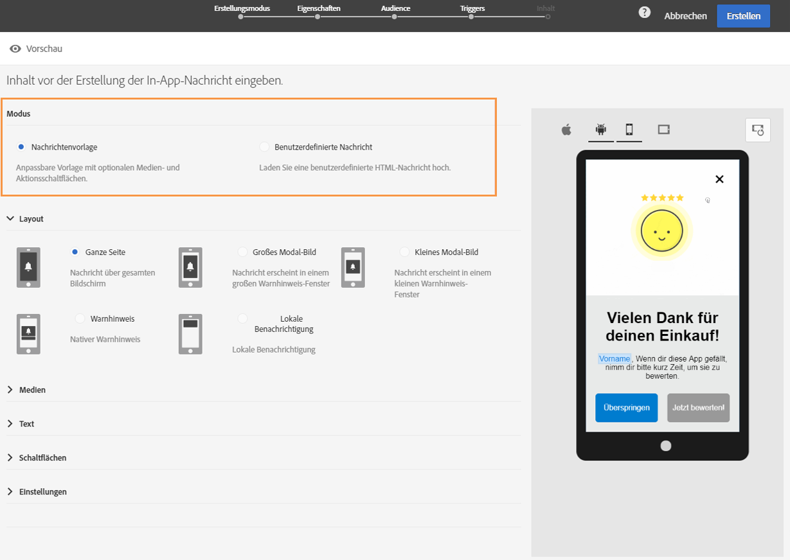
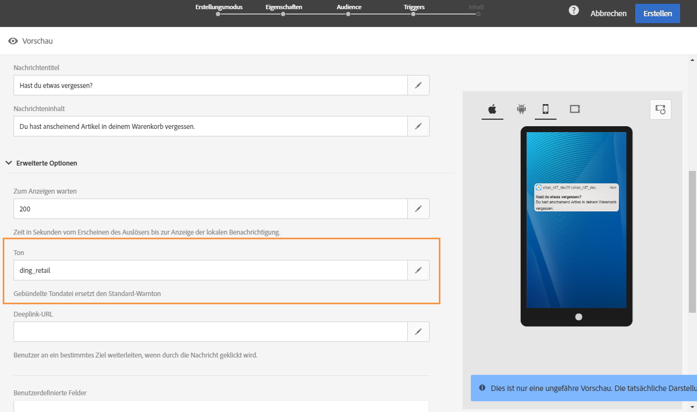

# In-App-Nachricht anpassen{#customizing-an-in-app-message}

In Adobe Campaign stehen Ihnen zur Anpassung von In-App-Nachrichten bei deren Erstellung eine Reihe erweiterter Optionen zur Verfügung.

Über den In-App-Inhaltseditor können Sie zwischen zwei In-App-Nachrichtenmodi auswählen:

* [Nachrichtenvorlage](#customizing-with-a-message-template): Mit dieser Vorlage können Sie zu Ihrer In-App-Nachricht beliebig Bilder, Videos und Aktionsschaltflächen hinzufügen.
* [Benutzerdefinierte Nachricht](#customizing-with-a-custom-html-message): Mit dieser Vorlage können Sie eine benutzerdefinierte HTML-Datei importieren.

>[!NOTE]
>
> Das Rendering von In-App-Nachrichten wird nur bei Android API 19 und höher unterstützt.

**Verwandte Themen:**

* [In-App-Nachricht senden](../../channels/using/preparing-and-sending-an-in-app-message.md#sending-your-in-app-message)
* [Berichte zum In-App-Nachrichtenversand](../../reporting/using/in-app-report.md)
* [Lokales Benachrichtigungs-Tracking implementieren](../../administration/using/local-tracking.md)

## Mit einer Nachrichtenvorlage anpassen {#customizing-with-a-message-template}

### Layout {#layout}

In der Dropdown-Liste **[!UICONTROL Layout]** können Sie je nach Anforderungen aus vier Optionen wählen:

* **[!UICONTROL Ganze Seite]**: Mit dieser Einstellung ist der gesamte Bildschirm ausgefüllt.

  Unterstützt werden Medien- (Bild, Video), Text- und Schaltflächenkomponenten.

* **[!UICONTROL Großes Modal-Bild]**: Mit dieser Einstellung wird ein großes Fenster im Stil eines Warnhinweises angezeigt, wobei Ihre Anwendung noch im Hintergrund sichtbar ist.

  Unterstützt werden Medien- (Bild, Video), Text- und Schaltflächenkomponenten.

* **[!UICONTROL Kleines Modal-Bild]**: Mit dieser Einstellung wird ein kleines Fenster im Stil eines Warnhinweises angezeigt, wobei Ihre Anwendung noch im Hintergrund sichtbar ist.

  Unterstützt werden Medien- (Bild, Video), Text- und Schaltflächenkomponenten.

* **[!UICONTROL Warnhinweis]**: Mit dieser Einstellung wird ein Warnhinweis gemäß dem jeweiligen Betriebssystem angezeigt.

  Von diesem Layout werden nur Text- und Schaltflächenkomponenten unterstützt.

* **[!UICONTROL Lokale Benachrichtigung]**: Dieser Layouttyp wird als Bannernachricht angezeigt.

  Sie unterstützt nur Ton, Text und Ziel. Weiterführende Informationen zur lokalen Benachrichtigung finden Sie in [Nachricht vom Typ &quot;Lokale Benachrichtigung&quot; anpassen](#customizing-a-local-notification-message-type).

Die Vorschau eines jeden Layout-Typs kann im rechten Fenster des Inhaltseditors auf verschiedenen Geräten, wie Smartphones und Tablets, unterschiedlichen Plattformen, z. B. Android oder iOS, und in unterschiedlichen Ausrichtungen, wie Hoch- oder Querformat, angesehen werden.

### Medien        {#media}

Über die Dropdown-Liste **[!UICONTROL Medien]** können Sie Medien zu Ihrer In-App-Nachricht hinzufügen, um das Erlebnis für den Endnutzer attraktiv zu gestalten.

1. Wählen Sie für den **[!UICONTROL Medientyp]** Bild oder Video aus.
1. Geben Sie für den Medientyp **[!UICONTROL Bild]** auf der Basis der unterstützten Formate im Feld **[!UICONTROL Medien-URL]** Ihre URL ein.

   Sie können bei Bedarf auch den Pfad zu einem **[!UICONTROL gebündelten Bild]** eingeben, das verwendet werden soll, wenn das Gerät offline ist.

   

1. Geben Sie für den Medientyp **[!UICONTROL Video]** im Feld **[!UICONTROL Medien-URL]** Ihre URL ein.

   Geben Sie dann ein, welches **[!UICONTROL Videobild]** verwendet werden soll, während das Video heruntergeladen wird oder bis der Benutzer auf die Wiedergabe-Schaltfläche tippt.

   

### Text {#text}

Sie können bei Bedarf zu Ihrer In-App-Nachricht auch einen Nachrichtentitel und Inhalt hinzufügen. Um Ihre In-App-Nachricht besser zu personalisieren, können Sie zu Ihrem Inhalt unterschiedliche Personalisierungsfelder, Inhaltsbausteine und dynamischen Text hinzufügen.

1. Fügen Sie in der Dropdown-Liste **[!UICONTROL Text]** im Feld **[!UICONTROL Nachrichtentitel]** einen Titel hinzu.

   

1. Fügen Sie im Feld **[!UICONTROL Nachrichteninhalt]** Inhalt hinzu.
1. Um den Text weiter zu personalisieren, klicken Sie auf das Symbol , über das Sie Personalisierungsfelder hinzufügen können.

   

1. Geben Sie den Nachrichteninhalt ein und fügen Sie bei Bedarf Personalisierungsfelder hinzu.

   Weiterführende Informationen zu Personalisierungsfeldern erhalten Sie in [diesem Abschnitt](../../designing/using/personalization.md#inserting-a-personalization-field).

   

1. Überprüfen Sie den Nachrichteninhalt im Vorschaufenster.

   

### Schaltflächen        {#buttons}

Sie können maximal zwei Schaltflächen zu Ihrer In-App-Nachricht hinzufügen.

1. Geben Sie in der Dropdown-Liste **[!UICONTROL Schaltflächen]** in der Kategorie **[!UICONTROL Primär]** den Text Ihrer ersten Schaltfläche ein.

   

1. Wählen Sie aus, welche der zwei Aktionen mit Ihrer primären Schaltfläche verbunden werden soll: **[!UICONTROL Beenden]** und **[!UICONTROL Umleiten]**.
1. Geben Sie bei Bedarf in der Kategorie **[!UICONTROL Sekundär]** Text für eine zweite Schaltfläche in Ihrer In-App-Nachricht ein.
1. Wählen Sie die mit der zweiten Schaltfläche verbundene Aktion aus.
1. Wenn Sie die Aktion **[!UICONTROL Umleiten]** auswählen, geben Sie Ihre Web-URL oder Ihren Deeplink im Feld **[!UICONTROL Ziel-URL]** ein.

   

1. Geben Sie Ihre Web-URL oder Ihren Deeplink im Feld **[!UICONTROL Ziel-URL]** ein, wenn Sie die Aktion **[!UICONTROL Umleiten]** auswählen.
1. Überprüfen Sie den Inhalt Ihrer Nachricht im Vorschaufenster oder durch Anklicken der Vorschau-Schaltfläche.

   Weiterführende Informationen dazu finden Sie auf der Seite [Vorschau einer In-App-Nachricht erstellen](../../channels/using/preparing-and-sending-an-in-app-message.md#previewing-the-in-app-message).

   

### Einstellungen        {#settings}

1. Wählen Sie in der Kategorie **[!UICONTROL Einstellungen]** eine helle oder dunkle Hintergrundfarbe aus.
1. Wählen Sie über die Option **[!UICONTROL Schließen-Schaltfläche zeigen]** aus, ob eine Schließen-Schaltfläche angezeigt werden soll, mit der Benutzer die In-App-Nachricht entfernen können.
1. Wählen Sie mit der Option **[!UICONTROL Ausrichtung der Schaltflächen]** die horizontale oder vertikale Ausrichtung der Schaltfläche aus.
1. Wählen Sie aus, ob Ihre In-App-Nachricht nach ein paar Sekunden automatisch entfernt wird oder nicht.

   

## Nachricht vom Typ &quot;Lokale Benachrichtigung&quot; anpassen {#customizing-a-local-notification-message-type}

Lokale Benachrichtigungen können nur von einer App zu einer bestimmten Zeit und abhängig von einem Ereignis ausgelöst werden. Mit lokalen Benachrichtigungen werden Benutzer über Prozesse in der App informiert, auch wenn kein Internetzugang vorhanden ist.
Auf dieser [Seite](../../administration/using/local-tracking.md) erfahren Sie, wie Sie lokale Benachrichtigungen tracken.

So passen Sie lokale Benachrichtigungen an:

1. Wählen Sie auf der **[!UICONTROL Inhalt]**-Seite die Option **[!UICONTROL Lokale Benachrichtigung]** in der Kategorie **[!UICONTROL Layout]** aus.

   

1. Geben Sie unter der Kategorie **[!UICONTROL Text]** den **[!UICONTROL Nachrichtentitel]** und den **[!UICONTROL Nachrichteninhalt]** ein.

   

1. Wählen Sie in der Kategorie **[!UICONTROL Erweiterte Optionen]** im Feld **[!UICONTROL Wartezeit bis zur Anzeige]** aus, wie lange Ihre lokale Benachrichtigung in Sekunden auf dem Bildschirm angezeigt werden soll, nachdem das Ereignis ausgelöst wurde.
1. Geben Sie im Feld **[!UICONTROL Ton]** den Namen der Tondatei ein (mit Erweiterung), die bei Erhalt einer lokalen Benachrichtigung vom Mobilgerät abgespielt werden soll.

   Die Tondatei wird bei der Zustellung der Benachrichtigung abgespielt, wenn die Datei im Package der Mobile App definiert ist. Andernfalls wird der Standardton des Geräts verwendet.

   

1. Geben Sie im Feld **[!UICONTROL Deeplink-URL]** ein Ziel an, zu dem Ihre Benutzer umgeleitet werden sollen, wenn sie mit Ihrer lokalen Benachrichtigung interagieren.
1. Wenn Sie benutzerdefinierte Daten in der Payload in Form eines Schlüssel-Wert-Paares senden möchten, fügen Sie benutzerdefinierte Felder zu Ihrer lokalen Benachrichtigung hinzu. Wählen Sie in der Kategorie **[!UICONTROL Benutzerdefinierte Felder]** die Schaltfläche **[!UICONTROL Element erstellen]** aus.
1. Geben Sie Ihre **[!UICONTROL Schlüssel]** und danach die mit jedem Schlüssel verknüpften **[!UICONTROL Werte]** ein.

   Beachten Sie, dass die Handhabung und der Zweck von benutzerdefinierten Feldern von der App abhängen.

1. Füllen Sie in der Kategorie **[!UICONTROL Apple-Optionen]** die **[!UICONTROL Kategorie]**-Felder aus, um eine Kategorie-ID für benutzerdefinierte Aktionen hinzuzufügen, sofern eine in Ihrer mobilen Apple-App verfügbar ist.

## Benutzerdefinierte HTML-Nachricht anpassen {#customizing-with-a-custom-html-message}

>[!NOTE]
>
>Benutzerdefinierte HTML-Nachrichten unterstützen nicht die Personalisierung von Inhalten.

Im Modus **[!UICONTROL Benutzerdefinierte Nachricht]** können Sie eine vorkonfigurierte HTML-Nachricht direkt importieren.

Das ist per Drag &amp; Drop oder durch die Auswahl der Datei auf dem Computer möglich.

Die Datei muss ein bestimmtes Layout aufweisen, das Sie sich durch die Auswahl der Option **Download der Beispielsdatei** ansehen können.

Hier finden Sie auch eine Liste mit Anforderungen an benutzerdefinierte HTML-Dateien für einen erfolgreichen Import in Adobe Campaign.

Nach dem Import Ihrer HTML-Datei können Sie sich im Vorschau-Fenster eine Vorschau Ihrer Datei auf unterschiedlichen Geräten ansehen.
