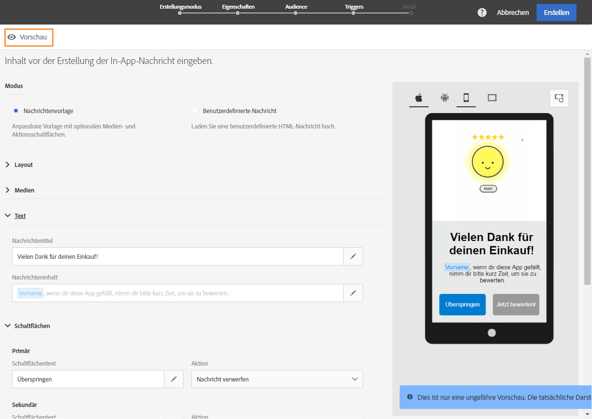
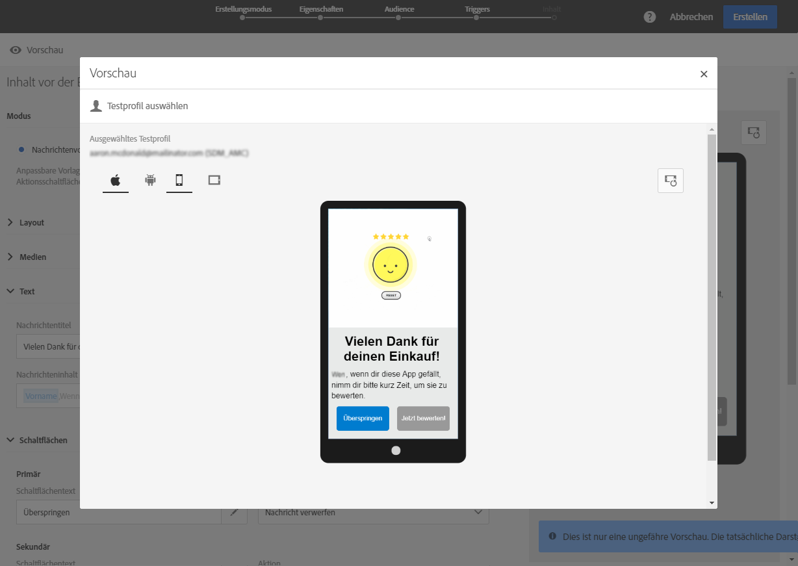

# In-App-Nachricht anpassen{#customizing-an-in-app-message}

In Adobe Campaign stehen Ihnen zur Anpassung von In-App-Nachrichten bei deren Erstellung eine Reihe erweiterter Optionen zur Verfügung.

Über den In-App-Inhaltseditor können Sie zwischen zwei In-App-Nachrichtenmodi auswählen:

* [Nachrichtenvorlage](#customizing-with-a-message-template): Mit dieser Vorlage können Sie zu Ihrer In-App-Nachricht beliebig Bilder, Videos und Aktionsschaltflächen hinzufügen.
* [Benutzerdefinierte Nachricht](#customizing-with-a-custom-html-message): Mit dieser Vorlage können Sie eine benutzerdefinierte HTML-Datei importieren.

>[!NOTE]
>
> Das Rendering von In-App-Nachrichten wird nur für Android API 19 und höher unterstützt.

**Verwandte Themen:**

* [In-App-Nachricht senden](../../channels/using/preparing-and-sending-an-in-app-message.md#sending-your-in-app-message)
* [Berichte zum In-App-Nachrichtenversand](../../reporting/using/in-app-report.md)
* [Lokales Benachrichtigungs-Tracking implementieren](https://helpx.adobe.com/campaign/kb/local-notification-tracking.html)

## Mit einer Nachrichtenvorlage anpassen {#customizing-with-a-message-template}

### Layout {#layout}

In der Dropdown-Liste **[!UICONTROL Layout]** können Sie je nach Anforderungen aus vier Optionen wählen:

* **[!UICONTROL Full page]**: Diese Layoutart deckt den gesamten Bildschirm Ihrer Audience ab.

   Unterstützt werden Medien- (Bild, Video), Text- und Schaltflächenkomponenten.

* **[!UICONTROL Large modal]**: Dieses Layout wird in einem großen Fenster im Warnhinweisstil angezeigt. Ihre Anwendung ist weiterhin im Hintergrund sichtbar.

   Unterstützt werden Medien- (Bild, Video), Text- und Schaltflächenkomponenten.

* **[!UICONTROL Small modal]**: Dieses Layout wird als kleines Warnhinweistypfenster angezeigt. Ihre Anwendung ist weiterhin im Hintergrund sichtbar.

   Unterstützt werden Medien- (Bild, Video), Text- und Schaltflächenkomponenten.

* **[!UICONTROL Alert]**: Dieser Layouttyp wird als native Betriebssystemwarnmeldung angezeigt.

   Von diesem Layout werden nur Text- und Schaltflächenkomponenten unterstützt.

* **[!UICONTROL Local notification]**: Dieser Layouttyp wird als Bannermeldung angezeigt.

   Sie unterstützt nur Ton, Text und Ziel. Weiterführende Informationen zur lokalen Benachrichtigung finden Sie in [Nachricht vom Typ &quot;Lokale Benachrichtigung&quot; anpassen](#customizing-a-local-notification-message-type).

Die Vorschau eines jeden Layout-Typs kann im rechten Fenster des Inhaltseditors auf verschiedenen Geräten, wie Smartphones und Tablets, unterschiedlichen Plattformen, z. B. Android oder iOS, und in unterschiedlichen Ausrichtungen, wie Hoch- oder Querformat, angesehen werden.

### Medien  {#media}

The **[!UICONTROL Media]** drop-down allows you to add media to your In-App message to create a compelling experience for end user.

1. Wählen Sie Ihr Bild **[!UICONTROL Media Type]** zwischen Bild und Video aus.
1. For the **[!UICONTROL Image]** media type, enter your URL in the **[!UICONTROL Media URL]** field based on the supported formats.

   If needed, you can also enter the path to a **[!UICONTROL Bundled image]** which can be used if the device is offline.

   

1. For the **[!UICONTROL Video]** media type, enter your URL in the **[!UICONTROL Media URL]** field.

   Then, enter your **[!UICONTROL Video poster]** to be used while the video is downloading on the audience devices or until users tap the play button.

   

### Text {#text}

Sie können bei Bedarf zu Ihrer In-App-Nachricht auch einen Nachrichtentitel und Inhalt hinzufügen. Um Ihre In-App-Nachricht besser zu personalisieren, können Sie zu Ihrem Inhalt unterschiedliche Personalisierungsfelder, Inhaltsbausteine und dynamischen Text hinzufügen.

1. In the **[!UICONTROL Text]** drop-down, add a title in the **[!UICONTROL Message title]** field.

   

1. Hinzufügen Sie Ihre Inhalte im **[!UICONTROL Message content]** Feld.
1. Um den Text weiter zu personalisieren, klicken Sie auf das Symbol , über das Sie Personalisierungsfelder hinzufügen können.

   

1. Geben Sie den Nachrichteninhalt ein und fügen Sie bei Bedarf Personalisierungsfelder hinzu.

   Weiterführende Informationen zu Personalisierungsfeldern erhalten Sie in [diesem Abschnitt](../../designing/using/personalization.md#inserting-a-personalization-field).

   

1. Überprüfen Sie den Nachrichteninhalt im Vorschaufenster.

   

### Schaltflächen  {#buttons}

Sie können maximal zwei Schaltflächen zu Ihrer In-App-Nachricht hinzufügen.

1. In the **[!UICONTROL Buttons]** drop-down, enter the text of your first button in the **[!UICONTROL Primary]** category.

   

1. Choose which of the two actions **[!UICONTROL Dismiss]** and **[!UICONTROL Redirect]** will be assigned to your primary button.
1. In the **[!UICONTROL Secondary]** category, add a second button to your In-App if needed by entering your text.
1. Wählen Sie die mit der zweiten Schaltfläche verbundene Aktion aus.
1. If you chose the **[!UICONTROL Redirect]** action, enter your web URL or deeplink in the **[!UICONTROL Destination URL]** field.

   

1. Enter your web URL or deeplink in the **[!UICONTROL Destination URL]** field, if you chose the **[!UICONTROL Redirect]** action,
1. Überprüfen Sie den Inhalt Ihrer Nachricht im Vorschaufenster oder durch Anklicken der Vorschau-Schaltfläche.

   Weiterführende Informationen dazu finden Sie auf der Seite [Vorschau einer In-App-Nachricht erstellen](#previewing-the-in-app-message).

   

### Einstellungen  {#settings}

1. In the **[!UICONTROL Settings]** category, select your background color between light and dark.
1. Choose to display or not a close button with the **[!UICONTROL Show close button]** option to provide users a way to dismiss the In-App message.
1. Select if your button alignment will be horizontal or vertical with the **[!UICONTROL Button alignment]** option.
1. Wählen Sie aus, ob Ihre In-App-Nachricht nach ein paar Sekunden automatisch entfernt wird oder nicht.

   

## Nachricht vom Typ &quot;Lokale Benachrichtigung&quot; anpassen  {#customizing-a-local-notification-message-type}

Lokale Benachrichtigungen können nur von einer App zu einer bestimmten Zeit und abhängig von einem Ereignis ausgelöst werden. Mit lokalen Benachrichtigungen werden Benutzer über Prozesse in der App informiert, auch wenn kein Internetzugang vorhanden ist.
Auf dieser [Seite](https://helpx.adobe.com/campaign/kb/local-notification-tracking.html) erfahren Sie, wie Sie lokale Benachrichtigungen tracken.

So passen Sie lokale Benachrichtigungen an:

1. Wählen Sie auf Ihrer **[!UICONTROL Content]** Seite **[!UICONTROL Local notification]** in der **[!UICONTROL Layout]** Kategorie

   

1. Geben Sie unter der **[!UICONTROL Text]** Kategorie Ihren **[!UICONTROL Message title]** und **[!UICONTROL Message content]** ein.

   

1. Under the **[!UICONTROL Advanced option]** category, in the **[!UICONTROL Wait to display]** field, choose how long in seconds your local notification will be displayed on screen once your event is triggered.
1. In the **[!UICONTROL Sound]** field, enter the filename of the sound file, with the extension, to be played by the mobile device when the local notification is received.

   Die Tondatei wird bei der Zustellung der Benachrichtigung abgespielt, wenn die Datei im Package der Mobile App definiert ist. Andernfalls wird der Standardton des Geräts verwendet.

   

1. Specify a destination to redirect your users when they interact with your local notification in the **[!UICONTROL Deeplink URL]** field.
1. Wenn Sie benutzerdefinierte Daten in der Payload in Form eines Schlüssel-Wert-Paares senden möchten, fügen Sie benutzerdefinierte Felder zu Ihrer lokalen Benachrichtigung hinzu. In the **[!UICONTROL Custom fields]** category, click the **[!UICONTROL Create an element]** button.
1. Enter your **[!UICONTROL Keys]** then the **[!UICONTROL Values]** associated with each key.

   Beachten Sie, dass die Handhabung und der Zweck von benutzerdefinierten Feldern von der App abhängen.

1. In the **[!UICONTROL Apple options]** category, fill in the **[!UICONTROL Category]** fields to add a category ID for custom actions if available in your Apple mobile application.

## Benutzerdefinierte HTML-Nachricht anpassen {#customizing-with-a-custom-html-message}

>[!NOTE]
>
>Benutzerdefinierte HTML-Nachrichten unterstützen nicht die Personalisierung von Inhalten.

The **[!UICONTROL Custom message]** mode allows you to directly import one of your pre-configured HTML message.

Das ist per Drag &amp; Drop oder durch die Auswahl der Datei auf dem Computer möglich.

Die Datei muss ein bestimmtes Layout aufweisen, das Sie sich durch die Auswahl der Option **Download der Beispielsdatei** ansehen können.

Hier finden Sie auch eine Liste mit Anforderungen an benutzerdefinierte HTML-Dateien für einen erfolgreichen Import in Adobe Campaign.

Nach dem Import Ihrer HTML-Datei können Sie sich im Vorschau-Fenster eine Vorschau Ihrer Datei auf unterschiedlichen Geräten ansehen.

## Vorschau einer In-App-Nachricht erstellen {#previewing-the-in-app-message}

Bevor Sie eine In-App-Nachricht senden, können Sie sie an Testprofilen testen, um zu sehen, wie die Nachricht beim Empfang dargestellt wird.

1. Click the **[!UICONTROL Preview]** button.

   

1. Click the **[!UICONTROL Select a test profile]** button and select one of your test profiles to start previewing your delivery. Weiterführende Informationen zu Testprofilen erhalten Sie in [diesem Abschnitt](../../audiences/using/managing-test-profiles.md).
1. Sehen Sie sich Ihre Nachricht auf verschiedenen Geräten an, wie Android-Geräten, iPhones und Tablets. Sie können dabei auch feststellen, ob in Ihre Personalisierungsfelder die richtigen Daten geladen werden.

   

1. Jetzt können Sie Ihre Nachricht senden und ihre Wirkung mit Versandberichten messen. Weiterführende Informationen zum Reporting finden Sie in [diesem Abschnitt](../../reporting/using/in-app-report.md).

