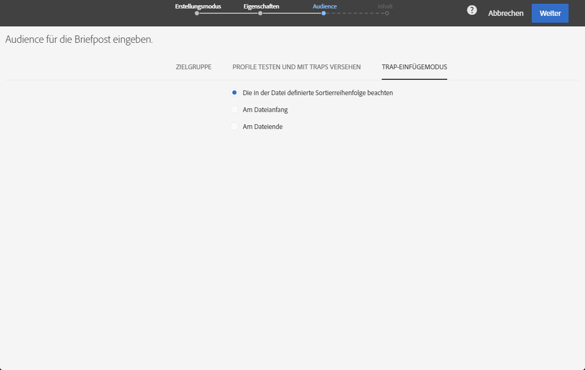

# Briefpost-Audience definieren{#defining-the-direct-mail-audience}

Sie können die Audience entweder im Erstellungsassistenten oder durch Klicken in den Bereich **Audience** im Versand-Dashboard festlegen.

## Hauptzielgruppe definieren  {#defining-the-main-target}

Bei Briefpost werden die Zielgruppenprofile in die Extraktionsdatei eingefügt, die Sie an Ihren Briefpost-Dienstleister senden.

Für jedes Zielgruppenprofil wird eine neue Zeile der Extraktionsdatei hinzugefügt. Die Menge der für jeden Empfänger hinzugefügten Profilinformationen wird im Bildschirm [Extraktion definieren](../../channels/using/defining-the-direct-mail-content.md#defining-the-extraction) definiert.

>[!CAUTION]
>
>Achten Sie darauf, dass Ihre Profile eine Anschrift enthalten, da diese Information für den Briefpost-Dienstleister wesentlich ist. Also make sure you have checked the **[!UICONTROL Address specified]** box in your profiles&#39; information. Siehe [Empfehlungen](../../channels/using/about-direct-mail.md#recommendations).

## Hinzufügen von Test- und Fallen-Profilen  {#adding-test-and-trap-profiles}

Fügen Sie Testprofile hinzu, sodass Sie Ihre Datei mit einer kleinen Anzahl von Profilen testen können. Dadurch können Sie rasch eine Beispieldatei erstellen, um ihren Aufbau zu testen und zu validieren, bevor Sie die eigentliche Datei vorbereiten. Siehe [Verwaltung von Testprofilen](../../audiences/using/managing-test-profiles.md).

Die Verwendung von Traps (Fallen) ist für den Briefpost-Versand besonders wichtig. Sie können damit überprüfen, ob Ihr Direkt-Mail-Anbieter die Kommunikation tatsächlich versendet, und Sie stellen sicher, dass er Ihre Kundenliste an keinen anderen Provider weiterleitet. Siehe [Verwenden von Traps](../../sending/using/using-traps.md).

Für den Briefpost-Versand werden Traps während der Extraktion hinzugefügt und im Ausgabedokument unter die restlichen Informationen gemischt. Standardmäßig werden Trap-Ausgaben in die Sortierreihenfolge der Ausgabedatei eingefügt. Sie können jedoch auch angeben, dass sie am Anfang oder Ende der Datei aufgeführt werden. When defining the audience, select the desired option from the **[!UICONTROL Trap insertion mode]** tab.

