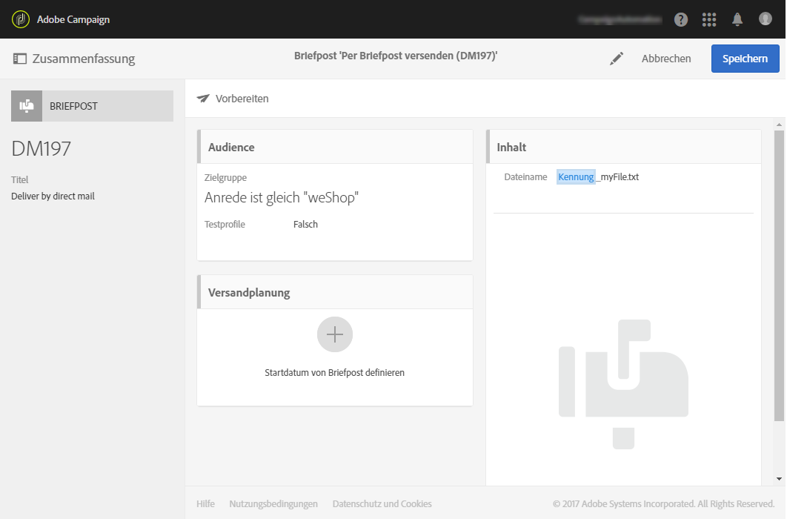
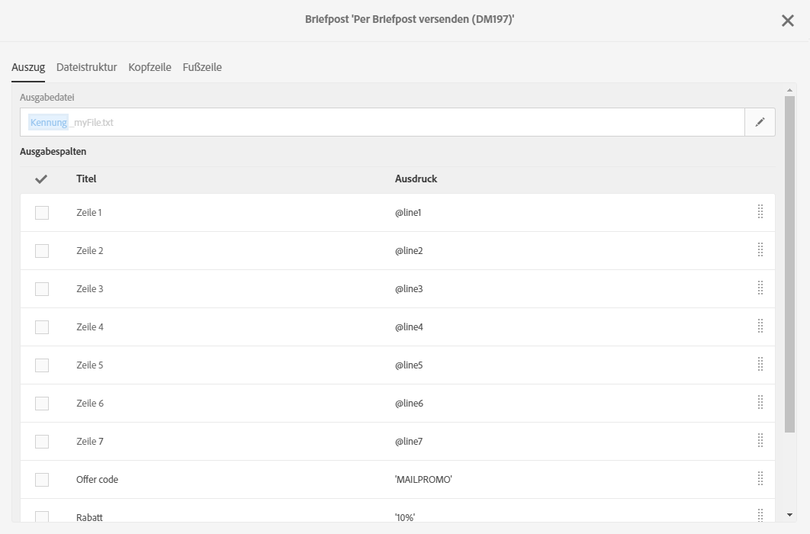
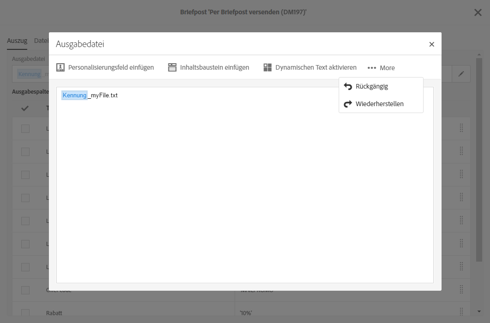
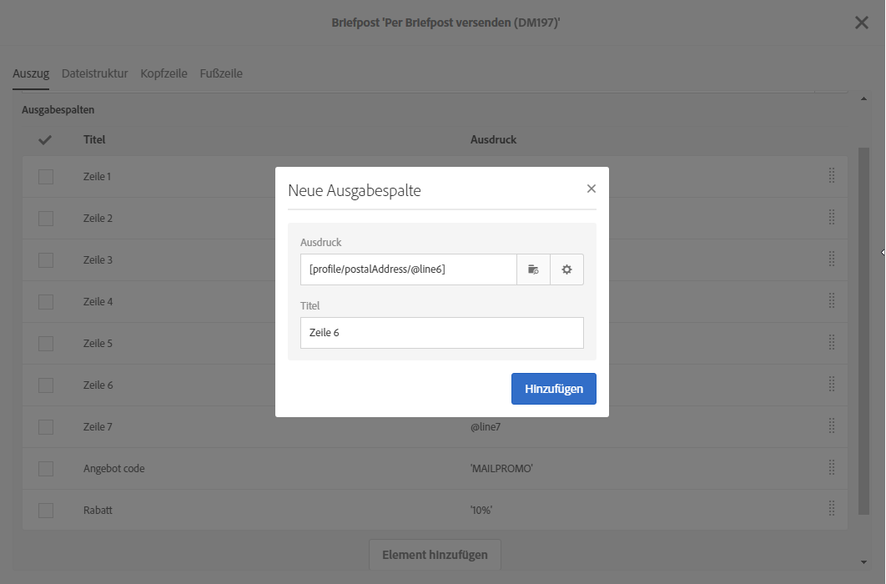
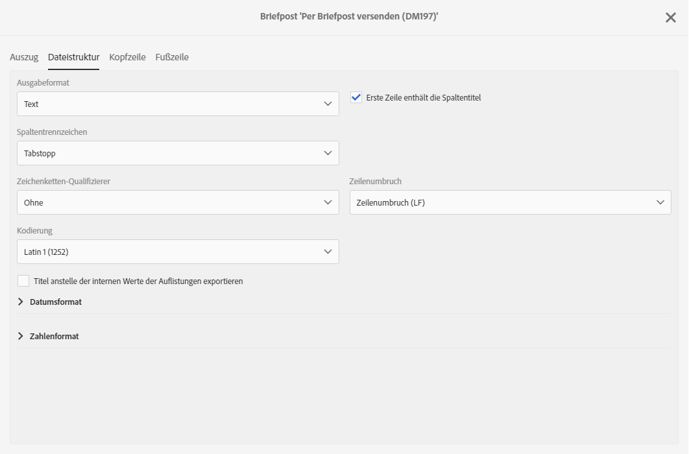
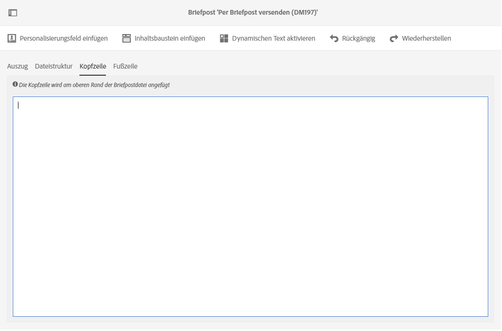
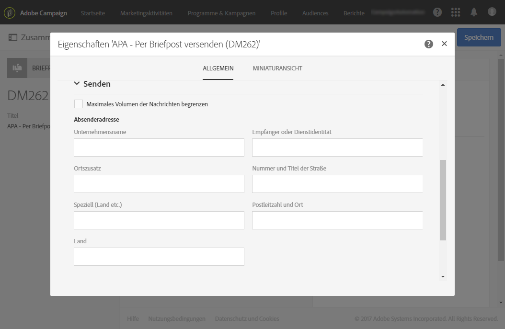

# Briefpost-Inhalt definieren{#defining-the-direct-mail-content}

Sie können den Inhalt entweder im letzten Bildschirm des Erstellungsassistenten oder durch Klicken auf den Bereich **Inhalt** im Versand-Dashboard festlegen.

Der Bildschirm für die Definition von **[!UICONTROL Inhalt]ist nur für den Brief-Kanal verfügbar.** It is divided into four tabs: **[!UICONTROL Extraction]**, **[!UICONTROL File structure]**, **[!UICONTROL Header]** and **[!UICONTROL Footer]**.

## Extraktion definieren {#defining-the-extraction}

1. Definieren Sie zunächst den Namen der Extraktionsdatei. Klicken Sie auf die Schaltfläche rechts neben dem Feld **[!UICONTROL Ausgabedatei]und geben Sie den gewünschten Titel ein.** Sie können Personalisierungsfelder, Inhaltsbausteine und dynamischen Text verwenden (siehe [Inhalte erstellen](../../designing/using/example--email-personalization.md)). Beispielsweise können Sie den Titel mit der Versandkennung oder dem Extraktionsdatum versehen.

   

1. Click the **[!UICONTROL +]** or **[!UICONTROL Add an element]** button to add an output column. In den **[!UICONTROL Ausgabespalten]können Sie festlegen, welche Profilinformationen (Spalten) in die Ausgabedatei exportiert werden.**

   >[!CAUTION]
   >
   >Achten Sie darauf, dass Ihre Profile eine Anschrift enthalten, da diese Information für den Briefpost-Dienstleister wesentlich ist. Beachten Sie außerdem, dass in der Profilinformation die Option **[!UICONTROL Anschrift angegeben]aktiviert ist.** Siehe [Empfehlungen](../../channels/using/about-direct-mail.md#recommendations).

   

1. Erstellen Sie so viele Spalten wie nötig. Klicken Sie zur Bearbeitung der Spalten auf deren Ausdruck oder Titel.

>[!NOTE]
>
>Weiterführende Informationen zur Definition von Ausgabespalten finden Sie im Abschnitt zur Workflow-Aktivität [Dateiextraktion](../../automating/using/extract-file.md).

## Dateistruktur definieren {#defining-the-file-structure}

Im **Dateistruktur**-Tab können Sie das Ausgabe-, Datums- und Zahlenformat der zu exportierenden Datei konfigurieren.

>[!NOTE]
>
>Die verfügbaren Optionen finden Sie im Abschnitt zur Workflow-Aktivität [Dateiextraktion](../../automating/using/extract-file.md).

## Kopf- und Fußzeile definieren {#defining-the-header-and-footer}

Hin und wieder müssen Sie vielleicht Informationen am Beginn oder am Ende der Extraktionsdatei hinzufügen. Verwenden Sie dazu die Tabs **[!UICONTROL Header]** und **[!UICONTROL Footer]im Konfigurationsbildschirm** Inhalt **.**

So können Sie beispielsweise bei Briefpost die Absenderinformationen im Header der Datei einfügen. Footer und Header können mit den für den Versand verfügbaren Informationen personalisiert werden. Lesen Sie diesbezüglich den Abschnitt [Inhalte erstellen](../../designing/using/example--email-personalization.md).

Die Absenderadresse wird im Bereich **[!UICONTROL Senden]der Briefposteigenschaften oder auf Vorlagenebene definiert.**

