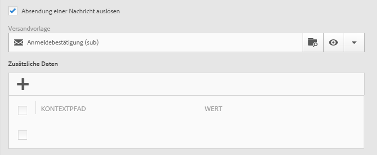
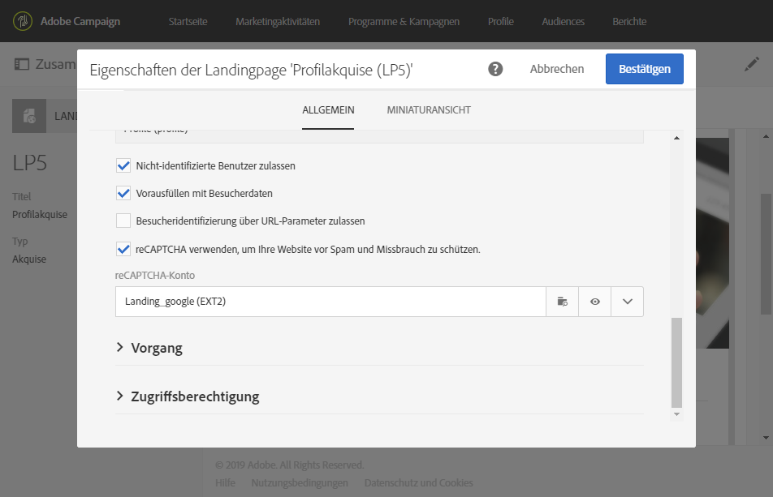

# Landingpage erstellen{#designing-a-landing-page}

## Über die Inhaltserstellung für Landingpages{#about-content-design}

Landingpages werden auf dieselbe Weise erstellt wie [Marketingaktivitäten](../../start/using/marketing-activities.md#about-marketing-activities).

Zur Erstellung einer Landingpage müssen Sie den Inhalt der Seite selbst, der Bestätigungsseite und der Fehlerseite definieren. Mithilfe des Schalters unter der Symbolleiste können Sie jede dieser Seiten anzeigen und konfigurieren.

Der Inhalt der Landingpages wird im Campaign-Inhaltseditor erstellt.

>[!NOTE]
>
>Wenn Ihre Instanz vor der Adobe-Campaign-Standard-Version 19.0 installiert wurde, haben Sie noch Zugriff auf den Legacy-E-Mail-Inhaltseditor. Die Benutzeroberfläche, Verwendung und Konfiguration entsprechen größtenteils der für Landingpages geltenden unten stehenden Beschreibung. Es kann jedoch sein, dass nicht alle Funktionen im Legacy-E-Mail-Inhaltseditor verfügbar oder auf dem aktuellen Stand sind, da er ab der Version 19.0 eingestellt wird. Wenn Sie Ihren E-Mail-Inhalt rasch auf einer Drag &amp; Drop-Benutzeroberfläche mithilfe einer Fülle von Funktionen bearbeiten möchten, verwenden Sie [Email Designer](../../designing/using/overview.md).

Auf dieser Seite erfahren Sie die wichtigsten Informationen zum Inhaltseditor für Landingpages: Weiterführende Informationen zu den Aktionen, die häufig bei Marketingaktivitäten eingesetzt werden, finden Sie in den folgenden Abschnitten des Handbuchs zum **Entwerfen von E-Mail-Inhalten**:

* [Personalisierungsfeld einfügen](../../designing/using/personalization.md#inserting-a-personalization-field)
* [Inhaltsbausteine](../../designing/using/personalization.md#adding-a-content-block).
* [Link einfügen](../../designing/using/links.md#inserting-a-link).
* [Bilder einfügen](../../designing/using/images.md).
* [Allgemeine Best Practices bei der Inhaltserstellung](../../designing/using/overview.md#content-design-best-practices).

>[!NOTE]
>Sollten Sie bereits über eine vordefinierte Landingpage im HTML-Format verfügen, können Sie sie direkt mittels der Schaltfläche **[!UICONTROL Inhalt ändern]** importieren.
>
>Bevor Sie in Adobe Campaign eine HTML-Seite importieren, ist sicherzustellen, dass sie in unterschiedlichen Browsern korrekt geöffnet und angezeigt werden kann. Wenn die HTML-Seite JavaScript-Elemente enthält, müssen diese außerhalb des Editors fehlerfrei ausführbar sein. Vermeiden Sie im Allgemeinen die Verwendung von Scripts in Nachrichten, um die korrekte Verarbeitung durch E-Mail-Clients zu gewährleisten.

## Benutzeroberfläche des Inhaltseditors für Landingpages{#landing-page-content-editor-interface}

Mit dem Landingpage-Inhaltseditor können Sie mühelos Inhalte in Adobe Campaign definieren, ändern und personalisieren. Um ihn zu öffnen, klicken Sie in den **[!UICONTROL Inhaltsbaustein]** in einem Landingpage-Dashboard.

Der Inhaltseditor besteht aus drei Bereichen. In diesen Bereichen können Sie den Inhalt ansehen und bearbeiten.

1. Die **Palette** links im Bildschirm ermöglicht die Bearbeitung der Eigenschaften des markierten Blocks, wie z. B. Hintergrundfarbe, Rahmen, Ausrichtung, Sichtbarkeitsbedingungen etc. Siehe [Personalisierungsfelder einfügen](../../designing/using/personalization.md#inserting-a-personalization-field).
1. In der **Symbolleiste** bieten Schaltflächen Zugriff auf die verfügbaren Aktionen. Sie können eine Vorlage auswählen und den Anzeigemodus wechseln.
1. Im **Hauptarbeitsbereich** ermöglicht eine kontextabhängige Symbolleiste die direkte Bearbeitung des Inhalts. Sie können beispielsweise ein Bild mit einem Link belegen, die Schriftart anpassen, ein Feld löschen etc.

Die **Symbolleiste** enthält Schaltflächen, die die Bearbeitung des angezeigten Inhalts ermöglichen.

<table> 
 <thead> 
  <tr> 
   <th> Symbol  </th> 
   <th> Schaltflächenname  </th> 
   <th> Kanal  </th> 
   <th> Beschreibung  </th> 
  </tr> 
 </thead> 
 <tbody> 
  <tr> 
   <td>    </td> 
   <td> Inhalt wechseln   </td> 
   <td> Landingpage und E-Mail  </td> 
   <td> Ermöglicht die Auswahl einer nativen Inhaltsvorlage oder den Import eines anderweitig erstellten HTML-Inhalts. Lesen Sie diesbezüglich auch den Abschnitt <a href="../../designing/using/using-existing-content.md">Existierenden Inhalt laden</a>.  </td> 
  </tr> 
  <tr> 
   <td>    </td> 
   <td> Rückgängig   </td> 
   <td> Alle  </td> 
   <td> Macht die letzte Aktion rückgängig.  </td> 
  </tr> 
  <tr> 
   <td>    </td> 
   <td> Wiederherstellen   </td> 
   <td> Alle  </td> 
   <td> Stellt die letzte rückgängig gemachte Aktion wieder her.  </td> 
  </tr> 
  <tr> 
   <td>    </td> 
   <td> Blöcke anzeigen   </td> 
   <td> Landingpage und E-Mail  </td> 
   <td> Umrandet alle Inhaltsblöcke (entspricht in HTML dem <strong>&lt;div&gt;</strong>-Tag).  </td> 
  </tr> 
  <tr> 
   <td>    </td> 
   <td> Quelle ansehen   </td> 
   <td> Landingpage und E-Mail  </td> 
   <td> Zeigt den HTML-Quellcode der Seite an.  </td> 
  </tr> 
 </tbody> 
</table>

Die dedizierte **Symbolleiste** ist ein kontextuelles Element der Editor-Oberfläche. Je nach markiertem Bereich sind unterschiedliche Schaltflächen verfügbar. Sie enthält Aktionsschaltflächen sowie Schaltflächen zur Anpassung des Textstils. Alle Änderungen beziehen sich somit jeweils nur auf das ausgewählte Element. Wenn Sie beispielsweise einen Block markieren, können Sie diesen löschen oder duplizieren. Wenn Sie Text innerhalb eines Blocks markieren, können Sie ihn in einen Link verwandeln oder die Formatierung anpassen.

>[!CAUTION]
>
>Gewisse Funktionen der Schaltfläche betreffen die Formatierung des HTML-Inhalts. Wenn die betroffene Seite jedoch ein CSS-Stylesheet enthält, können sich die **Anweisungen** des Stylesheets als **vorrangig** erweisen.

<table> 
 <thead> 
  <tr> 
   <th> Symbol  </th> 
   <th> Schaltflächenname  </th> 
   <th> Kontext  </th> 
   <th> Beschreibung  </th> 
  </tr> 
 </thead> 
 <tbody> 
  <tr> 
   <td>    </td> 
   <td> Link zu einer externen URL   </td> 
   <td> Jegliches Element  </td> 
   <td> Verlinkt mit einer URL. Weiterführende Informationen zur Konfiguration eines Links finden Sie im Abschnitt <a href="../../designing/using/links.md#inserting-a-link">Link einfügen</a>.  </td> 
  </tr> 
  <tr> 
   <td>    </td> 
   <td> Link zu einer Landingpage   </td> 
   <td> Jegliches Element  </td> 
   <td> Ermöglicht den Zugriff auf eine Adobe-Campaign-Landingpage. Weiterführende Informationen zur Konfiguration eines Links finden Sie im Abschnitt <a href="../../designing/using/links.md#inserting-a-link">Link einfügen</a>.  </td> 
  </tr> 
  <tr> 
   <td>    </td> 
   <td> Anmelde-Link   </td> 
   <td> Jegliches Element  </td> 
   <td> Fügt einen Link zur Anmeldung für einen Dienst hinzu. Weiterführende Informationen zur Konfiguration eines Links finden Sie im Abschnitt <a href="../../designing/using/links.md#inserting-a-link">Link einfügen</a>.  </td> 
  </tr> 
  <tr> 
   <td>    </td> 
   <td> Abmelde-Link   </td> 
   <td> Jegliches Element  </td> 
   <td> Fügt einen Link zur Abmeldung von einem Dienst hinzu. Weiterführende Informationen zur Konfiguration eines Links finden Sie im Abschnitt <a href="../../designing/using/links.md#inserting-a-link">Link einfügen</a>.  </td> 
  </tr> 
  <tr> 
   <td>    </td> 
   <td> Link entfernen   </td> 
   <td> Link  </td> 
   <td> Löscht (nach Bestätigung) den Link sowie alle verknüpften Konfigurationen.  </td> 
  </tr> 
  <tr> 
   <td>    </td> 
   <td> Personalisierungsfeld einfügen   </td> 
   <td> Textelement  </td> 
   <td> Fügt den Wert eines Datenbankfelds in den Inhalt ein. Siehe <a href="../../designing/using/personalization.md#inserting-a-personalization-field">Personalisierungsfelder einfügen</a>.  </td> 
  </tr> 
  <tr> 
   <td>    </td> 
   <td> Inhaltsbaustein einfügen   </td> 
   <td> Textelement  </td> 
   <td> Fügt einen personalisierten Inhaltsbaustein ein. Siehe <a href="../../designing/using/personalization.md#adding-a-content-block">Inhaltsbausteine</a>.  </td> 
  </tr> 
  <tr> 
   <td>    </td> 
   <td> Dynamischen Inhalt aktivieren   </td> 
   <td> Textelement  </td> 
   <td> Ermöglicht das Einfügen von dynamischen Inhalten in den Nachrichtenkörper. Siehe <a href="../../channels/using/designing-a-landing-page.md#defining-dynamic-content-in-a-landing-page">Dynamische Inhalte definieren</a>.  </td> 
  </tr> 
  <tr> 
   <td>    </td> 
   <td> Dynamischen Inhalt deaktivieren   </td> 
   <td> Textelement  </td> 
   <td> Ermöglicht das Löschen eines dynamischen Inhalts.  </td> 
  </tr> 
  <tr> 
   <td>    </td> 
   <td> Schriftgröße vergrößern   </td> 
   <td> Textelement  </td> 
   <td> Vergrößert den ausgewählten Text (Hinzufügung von <strong>&lt;span style="font-size:"&gt;</strong> im HTML-Code).  </td> 
  </tr> 
  <tr> 
   <td>    </td> 
   <td> Schriftgröße verkleinern   </td> 
   <td> Textelement  </td> 
   <td> Verkleinert den ausgewählten Text (Hinzufügung von <strong>&lt;span style="font-size:"&gt;</strong>).  </td> 
  </tr> 
  <tr> 
   <td>    </td> 
   <td> Fett   </td> 
   <td> Textelement  </td> 
   <td> Formatiert den ausgewählten Text fett (Text wird von den Tags <strong>&lt;strong&gt;</strong><strong>&lt;/strong&gt;</strong> umschlossen).   </td> 
  </tr> 
  <tr> 
   <td>    </td> 
   <td> Kursiv   </td> 
   <td> Textelement  </td> 
   <td> Formatiert den ausgewählten Text kursiv (Text wird von den Tags <strong>&lt;em&gt;</strong><strong>&lt;/em&gt;</strong> umschlossen).   </td> 
  </tr> 
  <tr> 
   <td>    </td> 
   <td> Unterstreichen   </td> 
   <td> Textelement  </td> 
   <td> Unterstreicht den ausgewählten Text (Hinzufügung von <strong>&lt;span style="text-decoration: underline;"&gt;</strong> im HTML-Code).  </td> 
  </tr> 
  <tr> 
   <td>    </td> 
   <td> Hintergrundfarbe ändern   </td> 
   <td> Textelement  </td> 
   <td> Ändert die Hintergrundfarbe des markierten Blocks (Hinzufügung von style="background-color: rgba(170, 86, 255, 0.87)).  </td> 
  </tr> 
  <tr> 
   <td>    </td> 
   <td> Textfarbe ändern   </td> 
   <td> Textelement  </td> 
   <td> Ändert die Farbe des ganzen Texts innerhalb eines Blocks oder nur des markierten Texts (<strong>&lt;span style="color: #56ff56;"&gt;</strong>).  </td> 
  </tr> 
  <tr> 
   <td>    </td> 
   <td> Bild   </td> 
   <td> Block mit einem Bild  </td> 
   <td> Fügt ein Bild aus einer lokalen Datei ein.  </td> 
  </tr> 
  <tr> 
   <td>    </td> 
   <td> Löschen   </td> 
   <td> Jegliche Blöcke  </td> 
   <td> Löscht den Block und seinen Inhalt.  </td> 
  </tr> 
  <tr> 
   <td>    </td> 
   <td> Dublette   </td> 
   <td> Jegliche Blöcke  </td> 
   <td> Dupliziert den Block und alle ihn betreffenden Stilmerkmale.  </td> 
  </tr> 
 </tbody> 
</table>

## Struktur und Stil von Landingpages verwalten{#managing-landing-page-structure-and-style}

### Bausteine im Inhaltseditor verwalten {#managing-blocks-in-the-content-editor}

Die verschiedenen Elemente des HTML-Inhalts werden auf der Landingpage in Form von Blöcken angezeigt, die in HTML dem **&lt;div&gt;** **&lt;/div&gt;**-Tag entsprechen. Zur Bearbeitung eines Blocks ist dieser zu markieren. Dies wird durch eine blaue Umrandung angezeigt.

Wenn ein Block markiert ist, werden die übergeordneten Objekte des entsprechenden HTML-Elements in einer Breadcrumb-Leiste im unteren Teil des Arbeitsbereichs eingeblendet.

Beim Überfahren eines Elements mit der Maus wird dieses farblich unterlegt. Auf diese Weise können Sie leicht von einem Block zum anderen wechseln und das anzupassende HTML-Element präzise auswählen.

Anhand der verschiedenen in der Palette oder der dedizierten Symbolleiste zur Verfügung stehenden Schaltflächen kann der Block dann geändert, dupliziert oder gelöscht werden.

Aktivieren Sie die Textbearbeitung durch einen zweiten Klick in den Block. Der Rahmen um den Block verfärbt sich grün. Danach können Sie Text auswählen oder eingeben. Anhand der verfügbaren Optionen in der Palette und der dedizierten Symbolleiste können Sie beispielsweise Links hinzufügen oder die Textformatierung anpassen.

Die für ein Blockelement (Link, Personalisierungsfeld, Inhaltsbaustein etc.) definierten Parameter können jederzeit über die Palette angepasst werden.

### Rahmen und Hintergrund im Inhaltseditor hinzufügen {#adding-a-border-and-a-background-in-the-content-editor}

Es besteht die Möglichkeit, verschiedene **Hintergrundfarben** aus der Farbpalette für die einzelnen Blöcke auszuwählen. Die Farbe wird jeweils auf den gesamten Block angewendet.

Außerdem können die einzelnen Blöcke mit verschiedenen **Rahmen** versehen werden.

### Textstil im Inhaltseditor ändern {#changing-the-text-style-in-the-content-editor}

Um einen Textstil zu ändern, muss sich der Cursor innerhalb eines Textblocks befinden.

Die Textausrichtung kann mit einer der drei Schaltflächen in der Palette links angepasst werden:

* **Linksbündig ausrichten** - richtet den Text am linken Rand des markierten Blocks aus (fügt style="text-align: left;" in den HTML-Code ein).
* **Zentrieren** - richtet den Text im markierten Block mittig aus (fügt style="text-align: center;" in den HTML-Code ein).
* **Rechtsbündig ausrichten** - richtet den Text am rechten Rand des markierten Blocks aus (fügt style="text-align: right;" in den HTML-Code ein).

Mithilfe der dedizierten Symbolleiste können darüber hinaus die Schriftattribute wie Schriftgröße, Schriftauszeichnung (fett, kursiv oder unterstrichen) und die Schriftfarbe geändert werden. Siehe [diesen Abschnitt](../../channels/using/designing-a-landing-page.md#landing-page-content-editor-interface).

### Bilder in eine Landingpage einfügen {#inserting-images-in-a-landing-page}

1. Wählen Sie im Inhalt der Landingpage einen Baustein aus, der ein Bild enthält.
1. Verwenden Sie die Schaltfläche **[!UICONTROL Einfügen]**.

   

1. Wählen Sie in der dedizierten Symbolleiste die Option **[!UICONTROL Lokales Bild]**.

   

1. Wählen Sie eine Datei aus.

   

1. Passen Sie die Bildeigenschaften nach Bedarf an.

   

## Dynamische Inhalte in einer Landingpage definieren{#defining-dynamic-content-in-a-landing-page}

Wenn Sie dynamischen Inhalt in einer Landingpage definieren möchten, verwenden Sie den Breadcrumb-Pfad zur Auswahl eines Bausteins oder wählen Sie direkt ein Element aus.

Gewisse Blöcke, beispielsweise Bilder, können nicht direkt ausgewählt werden. Markieren Sie in diesem Fall den übergeordneten Block im Breadcrumb. Dadurch können alle in diesem Block enthaltenen Elemente einschließlich der Bilder bearbeitet werden. Die definierte Bedingung bezieht sich in diesem Fall auf alle Elemente des übergeordneten Blocks.

Die Breadcrumb-Leiste des Inhaltseditors wird im Abschnitt [Verwaltung der Blöcke](../../channels/using/designing-a-landing-page.md#managing-landing-page-structure-and-style) beschrieben.

Die nächsten Schritte zur Definition von dynamischem Inhalt für Landingpages erfolgen analog zu denen für E-Mails. Siehe [diesen Abschnitt](../../designing/using/personalization.md#defining-dynamic-content-in-an-email).

>[!NOTE]
>
>Die rote Umrandung einer Variante eines Elements zeigt an, dass für diese noch kein Ausdruck definiert wurde.

Sie haben die Möglichkeit, zwischen den verschiedenen dynamischen Inhalten eines Bausteins zu wechseln. Gehen Sie wie folgt vor:

1. Wählen Sie einen Baustein aus.

   Am linken und rechten Bildrand werden Pfeile angezeigt.

1. Benutzen Sie die Pfeile, um zwischen den verfügbaren Inhalten zu wechseln.

   

   Der Pfeil verblasst, sobald Sie beim letzten (bzw. bei Verwendung des linken Pfeils beim ersten) dynamischen Inhalt angelangt sind.

   

1. Um alle für einen Baustein definierten Bedingungen zu löschen, markieren Sie diesen und klicken Sie erneut auf das Symbol **[!UICONTROL Dynamischen Inhalt deaktivieren]**.
1. Wählen Sie den beizubehaltenden dynamischen Inhalt aus.

   

In der Palette:

* Inhalte, für die ein Ausdruck definiert wurde, sind nicht mehr rot umrandet; sie werden in Grautönen angezeigt.
* Der aktuell ausgewählte Inhalt wird in Blautönen angezeigt.

## Versand einer Landingpage bestätigen {#confirm-a-landing-page-submission}

Sie können auswählen, welche Aktion beim Absenden einer Landingpage durch einen Besucher ausgelöst werden soll. Gehen Sie wie folgt vor:

1. Bearbeiten Sie die Landingpage-Eigenschaften über das Symbol  im Landingpage-Dashboard und rufen Sie die Parameter **[!UICONTROL Vorgang]** auf.

   

1. Wählen Sie unter dem Abschnitt **[!UICONTROL Spezifische Aktionen]** die Option **[!UICONTROL Absendung einer Nachricht auslösen]** aus, um den automatischen Versand einer Nachricht auszulösen, z. B. einer Anmeldebestätigung. Wählen Sie anschließend eine E-Mail-Versandvorlage aus.

   Beachten Sie, dass Sie in diesem Bildschirm keine Bestätigungsnachricht auswählen sollten, falls bereits eine Bestätigungsnachricht auf Dienstebene konfiguriert ist, damit nicht mehrere Bestätigungsnachrichten gesendet werden. Lesen Sie diesbezüglich auch den Abschnitt [Dienst erstellen](../../audiences/using/creating-a-service.md).

1. Erstellen Sie **[!UICONTROL Zusatzdaten]**, um das Speichern von Zusatzdaten beim Senden des Formular auf der Landingpage zu ermöglichen. Die Zusatzdaten sind für den Besucher nicht sichtbar. Nur konstante Werte werden berücksichtigt.

   

## Berechtigungen einrichten und Daten vorausfüllen {#setting-permissions-and-pre-loading-data}

Der Zugriff auf eine Landingpage kann beschränkt werden, um beispielsweise Besucher zu identifizieren, die von einem Link in einer Campaign-Nachricht auf die Landingpage gelangen oder zu einer bestimmten Organisationseinheit gehören.
Wurden die Besucher identifiziert, können ihre Daten vorab auf die Landingpage geladen werden. Gehen Sie wie folgt vor:

1. Bearbeiten Sie die Landingpage-Eigenschaften über das Symbol  im Landingpage-Dashboard und rufen Sie die Parameter **[!UICONTROL Zugriff &amp; Ladung]** auf.

   

1. Wählen Sie **[!UICONTROL Vorausfüllen mit Besucherdaten aus]**.

   Wenn dem Besucher ein in der Datenbank gespeichertes Profil zugeordnet werden konnte, werden die mit der Datenbank übereinstimmenden Felder des Anmeldeformulars vorausgefüllt und die Landingpage entsprechend personalisiert.

   

Außerdem haben Sie folgende Möglichkeiten:

* Mithilfe der URL-Parameter können Sie über die Option **[!UICONTROL Besucheridentifizierung über URL-Parameter zulassen]** die Besucher identifizieren. Wählen Sie dann den Ladeschlüssel aus und mappen Sie die Filterparameter mit den entsprechenden URL-Parametern.
* Gewähren Sie allen Besuchern Zugriff auf die Landingpage, indem Sie die Option **[!UICONTROL Nicht-identifizierte Benutzer zulassen]** auswählen.

Landingpages können auch mit einer Organisationseinheit verknüpft werden. Dadurch wird wird festgelegt, auf welche Landingpage ein Benutzer Zugriff hat. So weisen Sie eine Organisationseinheit zu:

1. Greifen Sie über das Symbol **[!UICONTROL Eigenschaften]** auf die Landingpage-Eigenschaften zu.

   

1. Erweitern Sie die **[!UICONTROL Zugriffsberechtigung]**.

1. Klicken Sie auf das Dropdown-Menü und wählen Sie Ihre Organisationseinheit aus. Weiterführende Informationen zum Erstellen einer Organisationseinheit finden Sie auf dieser [Seite](../../administration/using/organizational-units.md).

   

1. Die Felder **[!UICONTROL Erstellt von]**, **[!UICONTROL Erstellt am]**, **[!UICONTROL Zugriffsberechtigung]** und **[!UICONTROL Zuletzt geändert]** werden automatisch ausgefüllt.

1. Wählen Sie **[!UICONTROL Bestätigen]** und danach **[!UICONTROL Speichern]**.

Der Zugriff auf und die Verwaltung Ihrer Landingpage ist jetzt nur noch durch Benutzer innerhalb der ausgewählten Organisationseinheit möglich.

## Google reCAPTCHA einrichten {#setting-google-recaptcha}

Sie können Google reCAPTCHA V3 auf Ihrer Landingpage einrichten, um sie vor Spam und Missbrauch durch Bots zu schützen. Damit Sie reCAPTCHA auf Ihrer Landingpage verwenden können, müssen Sie zunächst ein externes Konto erstellen. Weiterführende Informationen zur Konfiguration finden Sie in [diesem Abschnitt](../../administration/using/external-accounts.md#google-recaptcha-external-account).

Nachdem Ihr externes Konto für Google reCAPTCHA V3 eingerichtet wurde, können Sie es zu Ihrer Landingpage hinzufügen:

1. Öffnen Sie vor dem Publizieren Ihrer Landingpage die Seiteneigenschaften über das Symbol  im Landingpage-Dashboard.

   

1. Öffnen Sie das Menü **[!UICONTROL Zugriff &amp; Laden]**.
1. Aktivieren Sie die Option **[!UICONTROL reCAPTCHA verwenden, um die Website vor Spam und Missbrauch zu schützen]**.
1. Wählen Sie das zuvor erstellte externe Google reCAPTCHA-Konto aus.

   

1. Wählen Sie **[!UICONTROL Bestätigen]**.

Auf Ihrer Landingpage ist jetzt Google reCAPTCHA eingerichtet, was am unteren Seitenrand angezeigt wird.

Je nach der Interaktion mit Ihrer Seite gibt Google reCAPTCHA eine Punktzahl zurück. Um diese Punktzahl zu überprüfen, stellen Sie eine Verbindung mit Ihrer [Google Admin-Konsole](https://g.co/recaptcha/admin) her.
