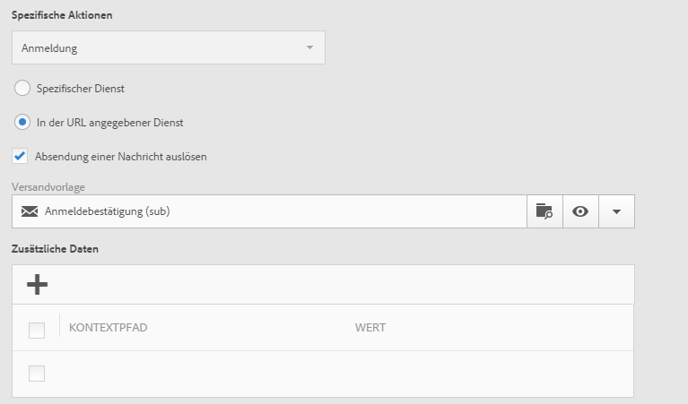

# Landingpage erstellen{#designing-a-landing-page}

## Über die Inhaltserstellung {#about-content-design}

Landingpages werden auf dieselbe Weise erstellt wie [Marketingaktivitäten](../../start/using/marketing-activities.md#about-marketing-activities).

Bei der Erstellung einer Landingpage müssen folgende Inhalte definiert werden:

* die Seite selbst,
* die Bestätigungsseite,
* die Fehlerseite.

Mithilfe des Schalters unter der Symbolleiste können Sie jede dieser Seiten anzeigen und konfigurieren.

Der Inhalt dieser Seiten wird im Campaign-Inhaltseditor erstellt. Lesen Sie diesbezüglich auch den Abschnitt [Inhaltserstellung](../../channels/using/about-landing-page-content-design.md).

## Mapping der Formularfelder   {#mapping-form-fields}

Über Eingabefelder können Daten in der Campaign-Datenbank gespeichert bzw. dort aktualisiert werden. Dazu müssen Sie Blöcken wie Eingabe- oder Auswahlfeldern Datenbankfelder zuordnen. Gehen Sie wie folgt vor:

1. Wählen Sie in der Landingpage einen Block aus.
1. Füllen Sie in der Palette die **[!UICONTROL Formulardaten]** aus.

   

1. Geben Sie bei **[!UICONTROL Feld]** das Datenbankfeld an, das dem Formularfeld zugeordnet werden soll.

   Wenn ein Formularfeld als **[!UICONTROL Pflichtfeld]** gekennzeichnet ist, kann ein Benutzer das Formular nur absenden, nachdem das Feld ausgefüllt wurde. Wenn ein Pflichtfeld nicht ausgefüllt wurde, erscheint eine Fehlermeldung bei der Validierung der Seite.

   >[!NOTE]
   >
   >Landingpages können nur mit **Profilen** gemappt werden.

1. Im Feld **[!UICONTROL HTML-Typ des Felds]** können Sie darüber hinaus angeben, ob es sich beispielsweise um **[!UICONTROL Text]**, **[!UICONTROL Zahl]** oder **[!UICONTROL Datum]** etc. handelt.

>[!NOTE]
>
>Die Standardfelder der nativen Landingpages sind bereits ausgefüllt. Sie können sie nach Bedarf ändern.

## Formular übermitteln   {#submitting-the-form}

Sie können festlegen, was passieren soll, wenn der Besucher die Bestätigungsschaltfläche drückt. Gehen Sie wie folgt vor:

1. Wählen Sie die Bestätigungsschaltfläche der Landingpage aus.
1. Wählen Sie eine Aktion in der Dropdown-Liste im linken Bereich. Diese Aktionen sind verfügbar: **[!UICONTROL Aktualisieren]** (die Seite wird aktualisiert) und **[!UICONTROL Weiter]** (die Bestätigungsseite wird angezeigt).

   

Zusätzlich können Sie den Titel der Schaltfläche ändern oder einen Link konfigurieren. Gehen Sie wie folgt vor:

1. Wählen Sie die Bestätigungsschaltfläche aus.
1. Wählen Sie die 
1. Geben Sie den Titel der Schaltfläche ein und wählen Sie den Typ des Links, seine Eigenschaften und die Zielgruppe aus.

   

## Formular mit einem Dienst verknüpfen   {#linking-a-form-to-a-service}

Sie können ein Formular mit einem Dienst verknüpfen, sodass sich Profile beim Besuch der Landingpage für einen spezifischen Dienst anmelden können, wenn sie auf die Senden-Schaltfläche des Formulars klicken.

In den Zuordnungsparametern wird die auszuführende Aktion definiert, je nachdem, ob eine Landingpage für einen spezifischen Dienst bestimmt ist oder ob sie für mehrere Dienste verwendet werden soll.

Gehen Sie folgendermaßen vor, um den Dienst auszuwählen, der verknüpft werden soll:

1. Bearbeiten Sie die Landingpage-Eigenschaften über das Symbol  im Landingpage-Dashboard und rufen Sie die Parameter **[!UICONTROL Vorgang]** auf.

   

1. Wählen Sie in der Dropdown-Liste **[!UICONTROL Spezifische Aktionen]** die Option **[!UICONTROL Anmeldung]**.

   

1. Wählen Sie **[!UICONTROL Spezifischer Dienst]** aus, um die Landingpage mit einem einzelnen Dienst zu verknüpfen. Diese Option ist nicht zu verwenden, wenn die Landingpage für verschiedene Dienste genutzt werden soll.

   Verwenden Sie in diesem Fall die Option **[!UICONTROL In der URL angegebener Dienst]**. Die Landingpage muss in den Parametern der jeweiligen Dienste referenziert werden.

### Versand einer Landingpage bestätigen   {#confirm-a-landing-page-submission}

Sie können auswählen, welche Aktion beim Absenden einer Landingpage durch einen Besucher ausgelöst werden soll. Gehen Sie wie folgt vor:

1. Bearbeiten Sie die Landingpage-Eigenschaften über das Symbol  im Landingpage-Dashboard und rufen Sie die Parameter **[!UICONTROL Vorgang]** auf.

   

1. Wählen Sie unter dem Abschnitt **[!UICONTROL Spezifische Aktionen]** die Option **[!UICONTROL Absendung einer Nachricht auslösen]** aus, um den automatischen Versand einer Nachricht auszulösen, z. B. einer Anmeldebestätigung. Wählen Sie anschließend eine E-Mail-Versandvorlage aus.

   Beachten Sie, dass Sie in diesem Bildschirm keine Bestätigungsnachricht auswählen sollten, falls bereits eine Bestätigungsnachricht auf Dienstebene konfiguriert ist, damit nicht mehrere Bestätigungsnachrichten gesendet werden. Lesen Sie diesbezüglich auch den Abschnitt [Dienst erstellen](../../audiences/using/creating-a-service.md).

1. Erstellen Sie **[!UICONTROL Zusatzdaten]**, um das Speichern von Zusatzdaten beim Senden des Formular auf der Landingpage zu ermöglichen. Die Zusatzdaten sind für den Besucher nicht sichtbar. Nur konstante Werte werden berücksichtigt.

   

## Berechtigungen einrichten und Daten vorausfüllen   {#setting-permissions-and-pre-loading-data}

Der Zugriff auf eine Landingpage kann beschränkt werden, um beispielsweise Besucher zu identifizieren, die von einem Link in einer Campaign-Nachricht auf die Landingpage gelangen. In diesem Fall können Sie ihre Daten auf der Landingpage schon vorab ausfüllen. Gehen Sie wie folgt vor:

1. Bearbeiten Sie die Landingpage-Eigenschaften über das Symbol  im Landingpage-Dashboard und rufen Sie die Parameter **[!UICONTROL Zugriff &amp; Ladung]** auf.

   

1. Wählen Sie **[!UICONTROL Vorausfüllen mit Besucherdaten aus]**.

   Wenn dem Besucher ein in der Datenbank gespeichertes Profil zugeordnet werden konnte, werden die mit der Datenbank übereinstimmenden Felder des Anmeldeformulars vorausgefüllt und die Landingpage entsprechend personalisiert.

   

Außerdem haben Sie folgende Möglichkeiten:

* Mithilfe der URL-Parameter können Sie über die Option **[!UICONTROL Besucheridentifizierung über URL-Parameter zulassen]** die Besucher identifizieren. Wählen Sie dann den Ladeschlüssel aus und mappen Sie die Filterparameter mit den entsprechenden URL-Parametern.
* Gewähren Sie allen Besuchern Zugriff auf die Landingpage, indem Sie die Option **[!UICONTROL Nicht-identifizierte Benutzer zulassen]** auswählen.

## Google reCAPTCHA einrichten {#setting-google-recaptcha}

Sie können Google reCAPTCHA V3 auf Ihrer Landingpage einrichten, um sie vor Spam und Missbrauch durch Bots zu schützen. Damit Sie reCAPTCHA auf Ihrer Landingpage verwenden können, müssen Sie zunächst ein externes Konto erstellen. Weiterführende Informationen zur Konfiguration finden Sie in [diesem Abschnitt](../../administration/using/external-accounts.md#google-recaptcha-external-account).

Nachdem Ihr externes Konto für Google reCAPTCHA V3 eingerichtet wurde, können Sie es zu Ihrer Landingpage hinzufügen:

1. Öffnen Sie vor dem Publizieren Ihrer Landingpage die Seiteneigenschaften über das Symbol  im Landingpage-Dashboard.

   

1. Öffnen Sie das Menü **[!UICONTROL Zugriff &amp; Laden]**.
1. Aktivieren Sie die Option **[!UICONTROL reCAPTCHA verwenden, um die Website vor Spam und Missbrauch zu schützen]**.
1. Wählen Sie das zuvor erstellte externe Google reCAPTCHA-Konto aus.

   

1. Wählen Sie **[!UICONTROL Bestätigen]**.

Auf Ihrer Landingpage ist jetzt Google reCAPTCHA eingerichtet, was am unteren Seitenrand angezeigt wird.

Je nach der Interaktion mit Ihrer Seite gibt Google reCAPTCHA eine Punktzahl zurück. Um diese Punktzahl zu überprüfen, stellen Sie eine Verbindung mit Ihrer [Google Admin-Konsole](https://g.co/recaptcha/admin) her.
