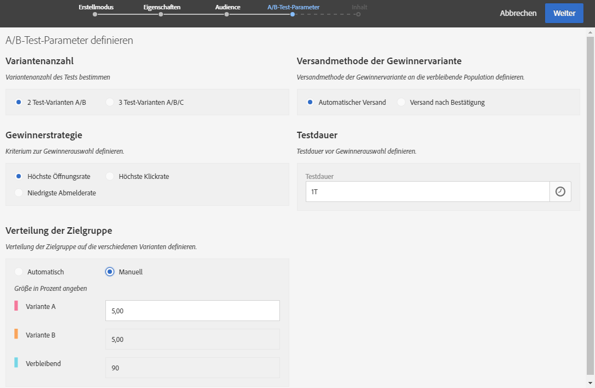

# A/B-Tests durchführen{#designing-an-a-b-test-email}

Die A/B-Test-Funktion in Adobe Campaign ermöglicht es Ihnen, zwei bis drei Varianten einer E-Mail zu definieren. Jede Variante wird an einen bestimmten Anteil der Zielpopulation gesendet, um die Variante zu bestimmen, welche die besten Ergebnisse erzielt. Sobald die Gewinnervariante feststeht, wird sie an die verbleibende Zielpopulation gesendet.

Sie haben die Möglichkeit, Inhalt, Betreff oder Absender der E-Mail zu variieren.

>[!NOTE]
>
>In Adobe Experience Manager können keine A/B-Tests für E-Mails erstellt werden.

## A/B-Test-E-Mail erstellen  {#creating-an-a-b-test-email}

Die Erstellung eines A/B-Tests erfolgt mithilfe des um eine Etappe erweiterten E-Mail-Erstellungsassistenten. Weiterführende Informationen zur Erstellung einer Standard-E-Mail finden Sie im Abschnitt [E-Mails erstellen](../../channels/using/creating-an-email.md).

Gehen Sie zur Erstellung eines A/B-Tests wie folgt vor:

1. Wählen Sie die Ihrem Test entsprechende E-Mail-Vorlage aus:

   * A/B-Test zum Absender
   * A/B-Test zum Inhalt
   * A/B-Test zum Betreff
   

   >[!NOTE]
   >
   >Vorlagen für Folgenachrichten und A/B-Tests werden standardmäßig verborgen. Aktivieren Sie die Option für A/B-Tests auf der linken Seite (seitliches Fenster **[!UICONTROL Filter]**), um sie anzuzeigen.

1. Definieren Sie die allgemeinen Eigenschaften sowie die Ziel-Audience der E-Mail auf die gleiche Weise wie für eine Standard-E-Mail. Lesen Sie diesbezüglich auch den Abschnitt [Erstellung von Audiences](../../audiences/using/creating-audiences.md).
1. Definieren Sie die A/B-Test-Parameter in der vierten Etappe des Erstellungsassistenten:

   * **[!UICONTROL Variantenanzahl]**: Sie haben die Wahl zwischen zwei oder drei Varianten. Wenn Sie drei Varianten wählen, lässt sich Ihre Entscheidung nach der Validierung dieser Etappe des Assistenten nicht mehr abändern.
   * **[!UICONTROL Gewinnerstrategie]**: Definieren Sie das Kriterium zur Auswahl der Gewinnervariante.
   * **[!UICONTROL Verteilung der Zielgruppe]**: Legen Sie fest, zu welchem Anteil die Zielgruppe auf die verschiedenen Varianten verteilt werden soll. Der verbleibende Anteil erhält die Gewinnervariante, sobald diese feststeht. Dabei erfolgt die Auswahl aus den Profilen der Zielgruppe nach dem Zufallsprinzip.
   * **[!UICONTROL Versandmethode der Gewinnervariante]**: Entscheiden Sie, ob der Versand der Gewinnervariante automatisch ausgelöst werden soll, sobald diese feststeht, oder ob Sie den Versand an die verbleibende Population manuell bestätigen möchten.
   * **[!UICONTROL Testdauer]**: Geben Sie die Dauer des Tests an. Die Gewinnervariante wird nach Ablauf dieser Dauer automatisch bestimmt. Es besteht die Möglichkeit, die Gewinnervariante vor Ablauf des Tests manuell im E-Mail-Dashboard auszuwählen.

      Der Test muss mindestens eine Stunde dauern, damit die Trackingdaten gesammelt und korrekt für die Auswahl der Gewinnervariante berücksichtigt werden können.
   

1. Gehen Sie nach der Definition der A/B-Test-Parameter zur nächsten Etappe des Assistenten über und definieren Sie den E-Mail-Inhalt. Je nach zuvor ausgewählter Vorlage können Sie verschiedene Betreffe, verschiedene Absendernamen oder verschiedene Inhalte angeben. Bedienen Sie sich des Karussels, um zwischen den verschiedenen Varianten hin und her zu wechseln. Lesen Sie für weiterführende Informationen den Abschnitt [Inhaltseditor](../../designing/using/designing-content-in-adobe-campaign.md).

   

1. Validieren Sie die Erstellung der E-Mail. Daraufhin wird das Dashboard der E-Mail angezeigt.
1. Planen Sie den Versand. Das angegebene Datum markiert den Beginn des A/B-Tests.
1. Überprüfen Sie die in der gleichnamigen Kachel angezeigten **[!UICONTROL A/B-Test-Parameter]**. Diese lassen sich bis zur Bestätigung des Teststarts (Schritt 9) abändern, indem Sie in die Kachel klicken.

   

1. Bereiten Sie den Versand der E-Mail vor, um die Zielgruppe sowie die Anzahl zu sendender Nachrichten zu analysieren. Lesen Sie diesbezüglich auch den Abschnitt [Versandvorbereitung](../../sending/using/preparing-the-send.md).
1. Prüfen Sie Ihre E-Mail dem A/B-Test durch den Versand von Testsendungen.
1. Bestätigen Sie nach Abschluss der Vorbereitung den Start des A/B-Tests. Nach der Bestätigung lassen sich die A/B-Test-Parameter nicht mehr abändern.

   Der A/B-Test beginnt am dem Tag, der in der **[!UICONTROL Planung]**definiert ist. Sie können den Fortschritt anhand der Kacheln**[!UICONTROL  A/B-Test]** und **[!UICONTROL Freigabe]**verfolgen.

   Sollten Sie die Testdauer verkürzen wollen, können Sie jederzeit manuell die Gewinnervariante auswählen.

   Nach Beendigung des Tests bietet die Kachel **[!UICONTROL A/B-Test]**Zugriff auf eine Übersichtstabelle, die verschiedene auf die getesteten Varianten bezogene Indikatoren enthält.

1. Sollten Sie als Versandmethode **[!UICONTROL Versand nach Bestätigung]**ausgewählt haben, müssen Sie den Versand der Gewinnervariante manuell auswählen, um den Versand an die verbleibende Population zu starten. Wenn Sie**[!UICONTROL  Automatisch]** ausgewählt haben, wird die Gewinnervariante automatisch an die verbleibende Population gesendet, sobald sie vom System ermittelt wurde.

   >[!NOTE]
   >
   >Bei Gleichstand muss die Gewinnervariante manuell ausgewählt werden. Sie können eine Benachrichtigung für den Autor und den/die Bearbeiter einer E-Mail einrichten, wenn eine Variante ausgewählt wurde oder ausgewählt werden muss. Weiterführende Informationen dazu finden Sie im Abschnitt [Benachrichtigungen in Adobe Campaign](../../administration/using/sending-internal-notifications.md).

Ihre E-Mail ist jetzt definiert und kann gesendet werden. Sie können Protokolle und Berichte aufrufen, um den Erfolg Ihrer Kampagne zu messen.

**Verwandtes Thema**:

Video zur [E-Mail-Erstellung](https://docs.adobe.com/content/help/en/campaign-learn/campaign-standard-tutorials/getting-started/create-email-from-homepage.html)

## Über A/B-Test-Indikatoren {#about-a-b-test-indicators}

Im E-Mail-Dashboard sind mehrere Indikatoren verfügbar, mit denen Sie Ihren A/B-Test auswerten können: Anzahl der Klicks, Öffnungen, Bounces usw.

Der Indikator **[!UICONTROL Geschätzte Empfänger-Reaktivität]**vergleicht die Anzahl der Empfänger, die auf die E-Mail geklickt haben, mit der Anzahl der Empfänger, die die E-Mail geöffnet haben. Beispiel: Zehn Empfänger haben die E-Mail geöffnet und fünf Empfänger haben darauf geklickt. Die Reaktionsrate beträgt somit 50 %.
