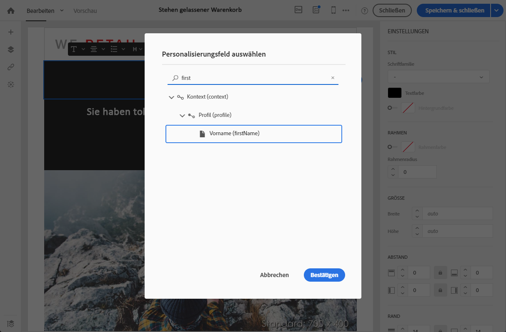
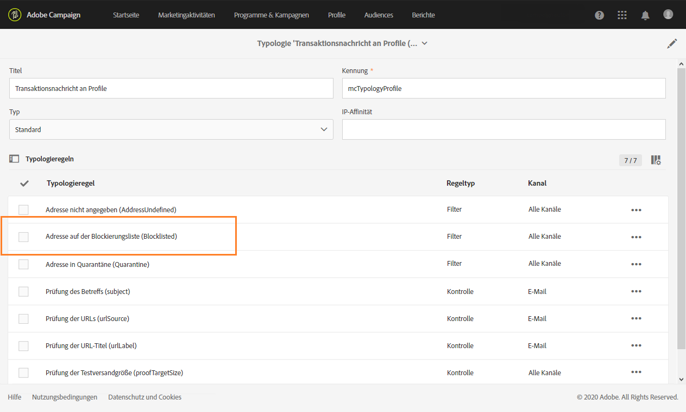

# Transaktionsnachricht bearbeiten {#editing-transactional-message}

Nachdem Sie ein Ereignis<!--(the cart abandonment example as explained in [this section](../../channels/using/getting-started-with-transactional-msg.md#transactional-messaging-operating-principle))--> erstellt und veröffentlicht haben, wird die entsprechende Transaktionsnachricht automatisch erstellt.

Die Schritte zum Konfigurieren und Veröffentlichen des Ereignisses finden Sie in den Abschnitten [Transaktionsereignisse konfigurieren](../../channels/using/configuring-transactional-event.md) und [Transaktionsereignisse veröffentlichen](../../channels/using/publishing-transactional-event.md).

Die Schritte zum Aufrufen, Bearbeiten und Personalisieren dieser Nachricht werden nachfolgend beschrieben.

>[!IMPORTANT]
>
>Nur Benutzer mit der Rolle [Administration](../../administration/using/users-management.md#functional-administrators) können auf Transaktionsnachrichten zugreifen und sie bearbeiten.

Sobald Ihre Nachricht fertig ist, kann sie getestet und veröffentlicht werden. Siehe [Transaktionsnachrichten testen](../../channels/using/testing-transactional-message.md) und [Lebenszyklus von Transaktionsnachrichten](../../channels/using/publishing-transactional-message.md).

## Transaktionsnachrichten aufrufen {#accessing-transactional-messages}

Aufrufen der erstellten Transaktionsnachricht:

1. Klicken Sie oben links auf das **Adobe**-Logo.
1. Wählen Sie **[!UICONTROL Marketing-Pläne]** > **[!UICONTROL Transaktionsnachrichten]** > **[!UICONTROL Transaktionsnachrichten]** aus.

   

1. Klicken Sie auf die Nachricht Ihrer Wahl, um sie zu bearbeiten.

   

Sie können auch direkt über den Link im linken Bereich des entsprechenden Ereigniskonfigurationsbildschirms auf eine Transaktionsnachricht zugreifen. Siehe [Vorschau erstellen und Ereignis veröffentlichen](../../channels/using/publishing-transactional-event.md#previewing-and-publishing-the-event).

## Transaktionsnachricht personalisieren {#personalizing-a-transactional-message}

Gehen Sie wie folgt vor, um eine Transaktionsnachricht zu bearbeiten und zu personalisieren.

>[!NOTE]
>
>In diesem Abschnitt wird beschrieben, wie Sie eine **ereignisbasierte** Transaktionsnachricht bearbeiten. Die Besonderheiten **profilbasierter** Transaktionsnachrichten sind [unten](#profile-transactional-message-specificities) beschrieben.
>
>Die Konfigurationsschritte zum Erstellen einer ereignisbasierten Transaktionsnachricht finden Sie in [diesem Abschnitt](../../channels/using/configuring-transactional-event.md#event-based-transactional-messages).

Sie möchten z. B. eine Benachrichtigung an Ihre Website-Benutzer senden, die Produkte in den Warenkorb gelegt haben und die Website verlassen, ohne ihren Einkauf zu beenden. Dieses Beispiel wird im Abschnitt [Funktionsweise der Transaktionsnachrichten](../../channels/using/getting-started-with-transactional-msg.md#transactional-messaging-operating-principle) vorgestellt.

1. Öffnen Sie mithilfe der gleichnamigen Kachel den **[!UICONTROL Inhalt]** der Nachricht, um den Betreff und den Inhalt anzupassen. Wählen Sie für dieses Beispiel eine Vorlage aus, die Bilder und Text enthält. Weitere Informationen zu E-Mail-Inhaltsvorlagen finden Sie unter [E-Mails mit Vorlagen erstellen](../../designing/using/using-reusable-content.md#designing-templates).

   

1. Fügen Sie einen Betreff hinzu und bearbeiten Sie den Inhalt Ihrer Nachricht entsprechend Ihren Anforderungen.

   >[!NOTE]
   >
   >Bei dem Link zum stehen gelassenen Warenkorb handelt es sich um einen Link auf eine externe URL, die den Kunden zu seinem Warenkorb weiterleitet. Diese Konfiguration wird außerhalb von Adobe Campaign vorgenommen.

1. In unserem Beispiel möchten Sie drei Felder hinzufügen, die Sie beim [Erstellen des Ereignisses](../../channels/using/configuring-transactional-event.md) definiert haben: Vorname, letztes angesehenes Produkt, Gesamtbetrag des Warenkorbs. Fügen Sie dazu ein [Personalisierungsfeld](../../designing/using/personalization.md#inserting-a-personalization-field) in den Nachrichteninhalt ein.

1. Gehen Sie zu diesen Feldern über **[!UICONTROL Kontext]** > **[!UICONTROL Echtzeit-Ereignis]** > **[!UICONTROL Ereigniskontext]**.

   

1. Sie können auch den Inhalt Ihrer Nachricht anreichern. Fügen Sie dazu Felder aus der Tabelle hinzu, die Sie mit Ihrer Ereigniskonfiguration verknüpft haben (siehe [Ereignis anreichern](../../channels/using/configuring-transactional-event.md#enriching-the-transactional-message-content)). Wählen Sie für unser Beispiel das Feld **[!UICONTROL Titel (Anrede)]** aus der Tabelle **[!UICONTROL Profil]** über **[!UICONTROL Kontext]** > **[!UICONTROL Echtzeit-Ereignis]** > **[!UICONTROL Ereigniskontext]** aus.

   

1. Fügen Sie alle erforderlichen Felder ein.

   

1. Erzeugen Sie die Vorschau Ihrer Nachricht unter Verwendung des für dieses Ereignis konfigurierten Testprofils.

   Weiterführende Informationen zur Vorschauerzeugung finden Sie im Abschnitt [Vorschau der Nachricht erzeugen](../../sending/using/previewing-messages.md).

   

   Die Vorschau zeigt, dass die Personalisierungsfelder wie gewünscht die im Testprofil angegebenen Informationen wiedergeben. Weitere Informationen hierzu finden Sie unter [Spezifische Testprofile definieren](../../channels/using/testing-transactional-message.md#defining-specific-test-profile).

<!--## Using product listings in a transactional message {#using-product-listings-in-a-transactional-message}

When editing the content of a transactional email, you can create product listings referencing one or more data collections. For example, in a cart abandonment email, you can include a list of all products that were in the users' carts when they left your website, with an image, the price, and a link to each product.

>[!IMPORTANT]
>
>Product listings are only available for the email channel, when editing transactional email content through the [Email Designer](../../designing/using/designing-content-in-adobe-campaign.md#email-designer-interface) interface.

To add a list of abandoned products in a transactional message, follow the steps below.

You can also watch [this set of videos](https://experienceleague.adobe.com/docs/campaign-standard-learn/tutorials/designing-content/product-listings-in-transactional-email.html#configure-product-listings-in-transactional-emails) explaining the steps that are required to configure product listings in a transactional email.

>[!NOTE]
>
>Adobe Campaign does not support nested product listings, meaning that you cannot include a product listing inside another one.

### Defining a product listing {#defining-a-product-listing}

Before being able to use a product listing in a transactional message, you need to define at the event level the list of products and the fields for each product of the list you want to display. For more on this, see [Defining data collections](../../channels/using/configuring-transactional-event.md#defining-data-collections).

1. In the transactional message, click the **[!UICONTROL Content]** block to modify the email content.
1. Drag and drop a structure component to the workspace. For more on this, see [Defining the email structure](../../designing/using/designing-from-scratch.md#defining-the-email-structure).

   For example, select a one-column structure component and add a text component, an image component and a button component. For more on this, see [Using content components](../../designing/using/designing-from-scratch.md#about-content-components).

1. Select the structure component you just created and click the **[!UICONTROL Enable product listing]** icon from the contextual toolbar.

   

   The structure component is highlighted with an orange frame and the **[!UICONTROL Product listing]** settings are displayed in the left palette.

   

1. Select how the elements of the collection will be displayed:

    * **[!UICONTROL Row]**: horizontally, meaning each element on one row under the other.
    * **[!UICONTROL Column]**: vertically, meaning each element next to the other on the same row.

   >[!NOTE]
   >
   >The **[!UICONTROL Column]** option is only available when using a multicolumn structure component ( **[!UICONTROL 2:2 column]**, **[!UICONTROL 3:3 column]** and **[!UICONTROL 4:4 column]** ). When editing the product listing, only fill in the first column: the other columns will not be taken into account. For more on selecting structure components, see [Defining the email structure](../../designing/using/designing-from-scratch.md#defining-the-email-structure).

1. Select the data collection you created when configuring the event related to the transactional message. You can find it under the **[!UICONTROL Context]** > **[!UICONTROL Real-time event]** > **[!UICONTROL Event context]** node.

   

   For more on configuring the event, see [Defining data collections](../../channels/using/configuring-transactional-event.md#defining-data-collections).

1. Use the **[!UICONTROL First item]** drop-down list to select which element will start the list displayed in the email.

   For example, if you select 2, the first item of the collection will not be displayed in the email. The product listing will start on the second item.

1. Select the maximum number of items to display in the list.

   >[!NOTE]
   >
   >If you want the elements of your list to be displayed vertically ( **[!UICONTROL Column]** ), the maximum number of items is limited according to the selected structure component (2, 3 or 4 columns). For more on selecting structure components, see [Editing the email structure](../../designing/using/designing-from-scratch.md#defining-the-email-structure).

### Populating the product listing {#populating-the-product-listing}

To display a list of products coming from the event linked to the transactional email, follow the steps below.

For more on creating a collection and related fields when configuring the event, see [Defining data collections](../../channels/using/configuring-transactional-event.md#defining-data-collections).

1. Select the image component you inserted, select **[!UICONTROL Enable personalization]** and click the pencil in the Settings pane.

   

1. Select **[!UICONTROL Add personalization field]** in the **[!UICONTROL Image source URL]** window that opens.

   From the **[!UICONTROL Context]** > **[!UICONTROL Real-time event]** > **[!UICONTROL Event context]** node, open the node corresponding to the collection that you created (here **[!UICONTROL Product list]** ) and select the image field that you defined (here **[!UICONTROL Product image]** ). Click **[!UICONTROL Save]**.

   

   The personalization field that you selected is now displayed in the Settings pane.

1. At the desired position, select **[!UICONTROL Insert personalization field]** from the contextual toolbar.

   

1. From the **[!UICONTROL Context]** > **[!UICONTROL Real-time event]** > **[!UICONTROL Event context]** node, open the node corresponding to the collection that you created (here **[!UICONTROL Product list]** ) and select the field that you created (here **[!UICONTROL Product name]** ). Click **[!UICONTROL Confirm]**.

   

   The personalization field that you selected is now displayed at the desired position in the email content.

1. Proceed similarly to insert the price.
1. Select some text and select **[!UICONTROL Insert link]** from the contextual toolbar.

   

1. Select **[!UICONTROL Add personalization field]** in the **[!UICONTROL Insert link]** window that opens.

   From the **[!UICONTROL Context]** > **[!UICONTROL Real-time event]** > **[!UICONTROL Event context]** node, open the node corresponding to the collection that you created (here **[!UICONTROL Product list]** ) and select the URL field that you created (here **[!UICONTROL Product URL]** ). Click **[!UICONTROL Save]**.

   >[!IMPORTANT]
   >
   >For security reasons, make sure you insert the personalization field inside a link starting with a proper static domain name.

   

   The personalization field that you selected is now displayed in the Settings pane.

1. Select the structure component on which the product listing is applied and select **[!UICONTROL Show fallback]** to define a default content.

   

1. Drag one or more content components and edit them as needed.

   

   The fallback content will be displayed if the collection is empty when the event is triggered, for example if a customer has nothing in his cart.

1. From the Settings pane, edit the styles for the product listing. For more on this, see [Managing email styles](../../designing/using/styles.md).
1. Preview the email using a test profile linked to the relevant transactional event and for which you defined collection data. For example, add the following information in the **[!UICONTROL Event data]** section for the test profile you want to use:

   

   For more on defining a test profile in a transactional message, see [this section](../../channels/using/testing-transactional-message.md#defining-specific-test-profile).-->

## Besonderheiten profilbasierter Transaktionsnachrichten {#profile-transactional-message-specificities}

Sie können Transaktionsnachrichten auf Grundlage von Kunden-Marketing-Profilen senden, mit denen Sie alle Profilinformationen nutzen können, um den Nachrichteninhalt zu personalisieren, den Abmelde-Link zu verwenden und Marketing-Typologieregeln wie [Ermüdungsregeln](../../sending/using/fatigue-rules.md) anzuwenden.

* Weitere Informationen zu den Unterschieden zwischen ereignis- und profilbasierten Transaktionsnachrichten finden Sie in [diesem Abschnitt](../../channels/using/getting-started-with-transactional-msg.md#transactional-message-types).

* Die Konfigurationsschritte zum Erstellen einer profilbasierten Transaktionsnachricht sind in [diesem Abschnitt ](../../channels/using/configuring-transactional-event.md#profile-based-transactional-messages) beschrieben.

Die Schritte zum Erstellen, Bearbeiten und Personalisieren einer Profil-Transaktionsnachricht sind mit denen einer Ereignis-Transaktionsnachricht weitgehend identisch.

Die Unterschiede sind unten aufgeführt.

1. [Rufen Sie die erstellte Transaktionsnachricht auf, um sie zu bearbeiten.](#accessing-transactional-messages)
1. Wählen Sie in der Transaktionsnachricht den Bereich **[!UICONTROL Inhalt]** aus. Anstelle der Transaktions-E-Mail-Vorlage können Sie auch eine beliebige E-Mail-Vorlage auswählen, die auf die Ressource **[!UICONTROL Profil]** ausgerichtet ist.

   

1. Wählen Sie die Standard-E-Mail-Vorlage aus. Wie alle Marketing-E-Mails enthält sie einen **Abmelde-Link**.

   

   Weitere Informationen zu Vorlagen finden Sie in [diesem Abschnitt](../../designing/using/using-reusable-content.md#content-templates).

1. Außerdem haben Sie im Gegensatz zu auf Echtzeit-Ereignissen basierenden Konfigurationen **direkten Zugriff auf alle Profilinformationen**, um die Nachricht zu personalisieren. Sie können [Personalisierungsfelder](../../designing/using/personalization.md#inserting-a-personalization-field) wie bei jeder anderen Standard-Marketing-E-Mail hinzufügen.

1. Speichern Sie Ihre Änderungen, bevor Sie die Nachricht veröffentlichen. Weiterführende Informationen dazu finden Sie unter [Transaktionsnachricht veröffentlichen](../../channels/using/publishing-transactional-message.md#publishing-a-transactional-message).

<!--### Monitoring a profile transactional message delivery {#monitoring-a-profile-transactional-message-delivery}

Once the message is published and your site integration is done, you can monitor the delivery.

1. To view the message delivery log, click the icon at the bottom right of the **[!UICONTROL Deployment]** block.

1. Click the **[!UICONTROL Execution list]** tab.

   

1. Select the latest execution delivery.

   An **execution delivery** is a non-actionable and non-functional technical message created once a month for each transactional message, and each time a transactional message is edited and published again

1. Select the **[!UICONTROL Sending logs]** tab. In the **[!UICONTROL Status]** column, **[!UICONTROL Sent]** indicates that a profile has opted in.

   

1. Select the **[!UICONTROL Exclusions logs]** tab to view recipients who have been excluded from the message target, such as addresses on denylist.

   

>[!NOTE]
>
>For more information on accessing and using the logs, see [Monitoring a delivery](../../sending/using/monitoring-a-delivery.md).

For any profile that has opted out, the **[!UICONTROL Address on denylist]** typology rule excluded the corresponding recipient.

This rule is part of a specific typology that applies to all transactional messages based on the **[!UICONTROL Profile]** table.

**Related topics**:

* [Integrate the event triggering](../../channels/using/getting-started-with-transactional-msg.md#integrate-event-trigger)
* [About typologies and typology rules](../../sending/using/about-typology-rules.md)-->
