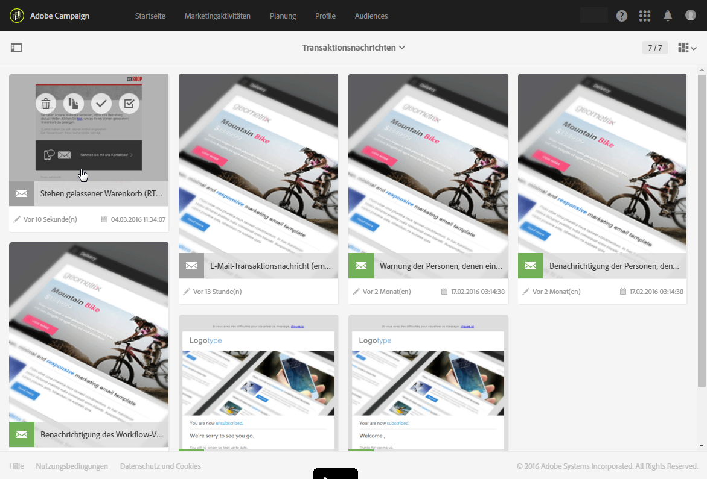
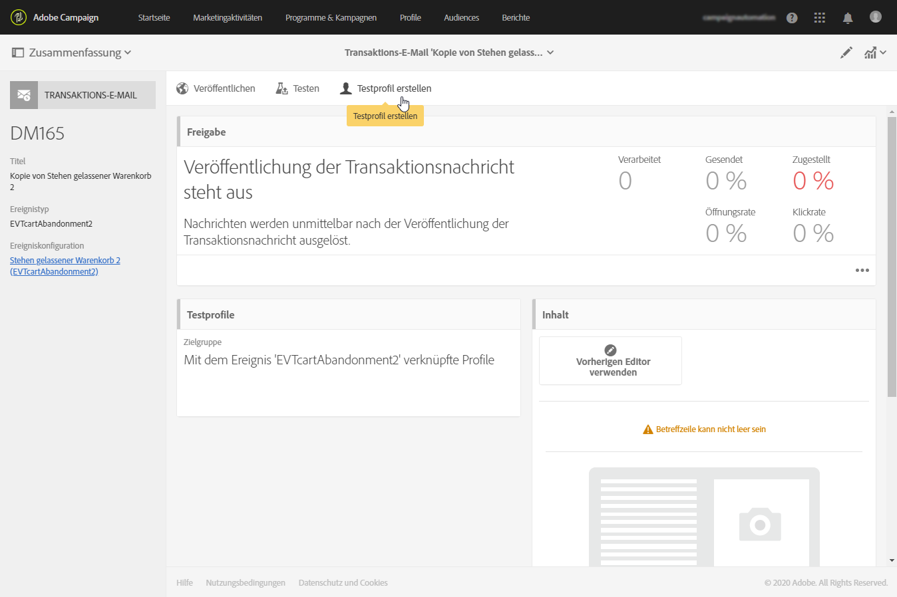
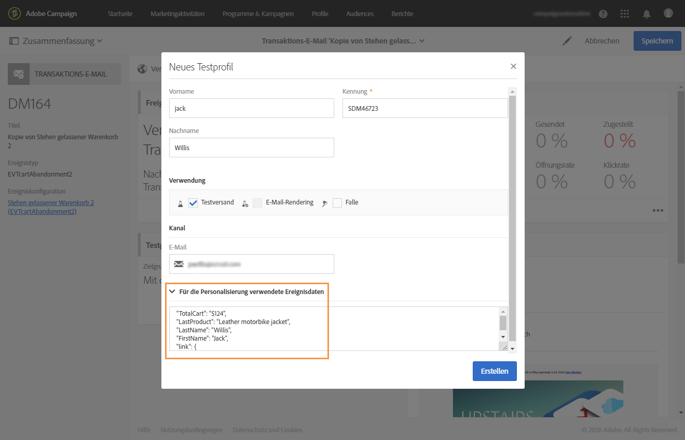
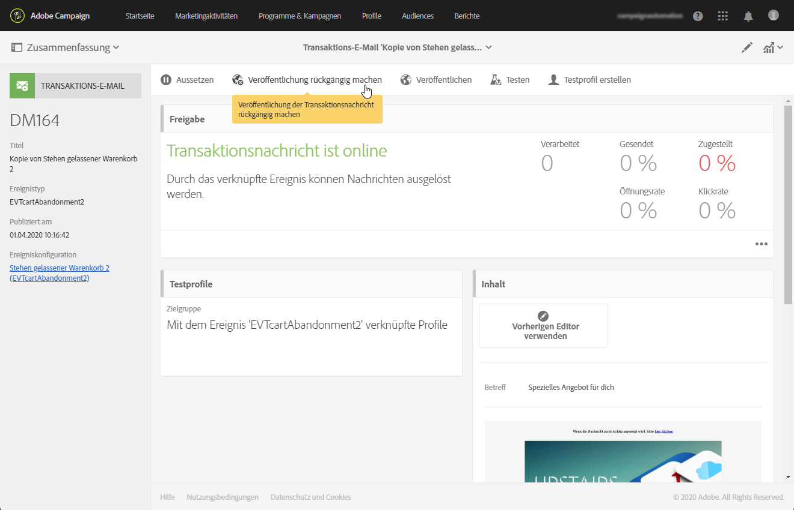

# Ereignis-Transaktionsnachrichten{#event-transactional-messages}

Sie können Ereignis-Transaktionsnachrichten senden, die auf der Basis eines Ereignisses ausgewählt werden. Diese Art von Transaktionsnachrichten enthält keine Profilinformationen: Die Versandzielgruppe wird durch Daten definiert, die im Ereignis selbst enthalten sind.

Nach der Erstellung und Publikation des gewünschten Ereignisses (&quot;Stehen gelassener Warenkorb&quot; wie in [diesem Abschnitt](../../channels/using/about-transactional-messaging.md#transactional-messaging-operating-principle) beschrieben) wird die entsprechende Transaktionsnachricht automatisch erstellt.

Die Konfigurationsschritte finden Sie im Abschnitt [Ereignis konfigurieren, um eine Transaktionsnachricht zu senden](../../administration/using/configuring-transactional-messaging.md#use-case--configuring-an-event-to-send-a-transactional-message).

Damit das Ereignis mit dem Versand einer Transaktionsnachricht einhergeht, muss diese Nachricht personalisiert, getestet und dann publiziert werden.

>[!NOTE]
>
>To access transactional messages, you must be part of the **[!UICONTROL Administrators (all units)]** security group.
>
>Ereignis-Transaktionsnachrichten enthalten keine Profilinformationen, weshalb sie nicht mit Ermüdungsregeln kompatibel sind (auch nicht, wenn sie mit Profilen angereichert werden). Näheres dazu finden Sie unter [Ermüdungsregeln](../../sending/using/fatigue-rules.md#choosing-the-channel).

## Testprofil in einer Transaktionsnachricht definieren    {#defining-a-test-profile-in-a-transactional-message}

Konfigurieren Sie ein entsprechendes Testprofil, mit dem Sie zum Zweck der Validierung eine Vorschau Ihrer Nachricht sowie einen Testversand erzeugen können.

### Testprofil in einer Transaktionsnachricht erstellen    {#creating-a-test-profile-within-the-transactional-----------message}

1. Um auf die erstellte Nachricht zuzugreifen, klicken Sie auf das **[!UICONTROL Adobe Campaign]** Logo in der oberen linken Ecke und wählen Sie dann **[!UICONTROL Marketing plans]** > **[!UICONTROL Transactional messages]** > **[!UICONTROL Transactional messages]**.

   

1. Erstellen Sie ein Testprofil, das mit Ihrem Ereignis verknüpft wird.

   

1. Geben Sie die im JSON-Format zu sendenden Informationen im **[!UICONTROL Event data used for personalization]** Abschnitt an. Bei den angegebenen Daten handelt es sich um den Inhalt, der in der Vorschau verwendet und dem Testprofil im Testversand übermittelt wird.

   

   >[!NOTE]
   >
   >Sie können auch die Information von der Profiltabelle eingeben. Siehe [Inhalt der Transaktionsnachricht anreichern](../../administration/using/configuring-transactional-messaging.md#enriching-the-transactional-message-content).

1. Nach seiner Erstellung ist das Testprofil in der Transaktionsnachricht vorausgefüllt. Click the **[!UICONTROL Test profiles]** block of the message to check the target of your proof.

   

### Testprofil außerhalb einer Transaktionsnachricht erstellen {#creating-a-test-profile-outside-the-transactional-----------message}

You can also create a new test profile or use one that already exists in the **[!UICONTROL Test profiles]** menu.

1. Klicken Sie auf das **[!UICONTROL Adobe Campaign]** Logo in der oberen linken Ecke und wählen Sie dann **[!UICONTROL Profiles & audiences]** > **[!UICONTROL Test profiles]**.
1. In the **[!UICONTROL Event]** section of the page of the test profile that you have chosen, select the event that you have just created. Im vorliegenden Beispiel handelt es sich um &quot;Warenkorbabbruch (EVTcartAbandonment)&quot;.
1. Specify the information to send in JSON format in the **[!UICONTROL Event data]** text box.

   

1. Speichern Sie Ihre Änderungen.

Jetzt können Sie auf die von Ihnen erstellte Nachricht zugreifen und das aktualisierte Testprofil auswählen.

**Verwandte Themen:**

* [Verwaltung von Testprofilen](../../audiences/using/managing-test-profiles.md)
* [Audiences bestimmen](../../audiences/using/creating-audiences.md)

## Transaktionsnachricht personalisieren    {#personalizing-a-transactional-message}

Gehen Sie folgendermaßen vor, um für eine Transaktionsnachricht eine Personalisierung einzurichten:

1. Click the **[!UICONTROL Content]** block to modify your message&#39;s subject and content. Wählen Sie für dieses Beispiel eine Vorlage aus, die Bilder und Text enthält. Weiterführende Informationen zu E-Mail-Inhaltsvorlagen finden Sie unter [Erstellen mit Vorlagen](../../designing/using/using-reusable-content.md#designing-templates).

   

1. Fügen Sie einen Betreff hinzu und bearbeiten Sie den Inhalt Ihrer Nachricht entsprechend Ihren Anforderungen.

   >[HINWEIS]
   >
   >Bei dem Link zum stehen gelassenen Warenkorb handelt es sich um einen Link auf eine externe URL, die den Kunden zu seinem Warenkorb weiterleitet. Diese Konfiguration wird außerhalb von Adobe Campaign vorgenommen.

1. In unserem Beispiel möchten Sie drei Felder hinzufügen, die Sie beim [Erstellen des Ereignisses](../../administration/using/configuring-transactional-messaging.md#use-case--configuring-an-event-to-send-a-transactional-message) definiert haben: Vorname, letztes angesehenes Produkt, Gesamtbetrag des Warenkorbs. Fügen Sie dazu ein [Personalisierungsfeld](../../designing/using/personalization.md#inserting-a-personalization-field) in den Nachrichteninhalt ein.

1. Navigieren Sie zu diesen Feldern über **[!UICONTROL Context]** > **[!UICONTROL Real-time event]** > **[!UICONTROL Event context]**.

   

1. Fügen Sie dann zur Anreicherung Ihres Nachrichteninhalts die gewünschten Felder hinzu, indem Sie diese in der Tabelle auswählen, mit der Sie Ihr Ereignis verknüpft haben. Wählen Sie in unserem Beispiel das **[!UICONTROL Title (salutation)]** Feld in der **[!UICONTROL Profile]** Tabelle über **[!UICONTROL Context]** > **[!UICONTROL Real-time event]** > **[!UICONTROL Event context]**.

   

1. Fügen Sie alle erforderlichen Felder ein.

   

1. Erzeugen Sie die Vorschau Ihrer Nachricht unter Verwendung des für dieses Ereignis konfigurierten Testprofils.

   Weiterführende Informationen zur Vorschauerzeugung finden Sie im Abschnitt [Vorschau der Nachricht erzeugen](../../sending/using/previewing-messages.md).

   

   Die Vorschau zeigt, dass die Personalisierungsfelder wie gewünscht die im Testprofil angegebenen Informationen wiedergeben. Weiterführende Informationen hierzu finden Sie im Abschnitt [Testprofil in einer Transaktionsnachricht definieren](#defining-a-test-profile-in-a-transactional-message).

## Produktlisten in Transaktionsnachrichten verwenden    {#using-product-listings-in-a-transactional-message}

Sie können Produktlisten erstellen, die eine oder mehrere Datenkollektionen im Inhalt einer Transaktions-E-Mail referenzieren. Beispielsweise können Sie bei einem abgebrochenen Einkauf eine E-Mail versenden, in der alle Produkte samt Bild, Preis und Link aufgelistet sind, die sich beim Verlassen der Website im Warenkorb des Benutzers befanden.

>[!IMPORTANT]
>
>Produktlisten sind nur während der Bearbeitung von Transaktions-E-Mails in der Benutzeroberfläche von [Email Designer](../../designing/using/designing-content-in-adobe-campaign.md#email-designer-interface) verfügbar.

Um eine Liste mit Produkten aus einem abgebrochenen Einkauf in eine Transaktionsnachricht einzufügen, folgen Sie den unten stehenden Schritten.

Sie können sich die erforderlichen Schritte zur Konfiguration von Produktlisten in einer Transaktions-E-Mail auch in Videos ansehen. Weiterführende Informationen hierzu finden Sie auf [dieser Seite](https://docs.adobe.com/content/help/en/campaign-learn/campaign-standard-tutorials/designing-content/product-listings-in-transactional-email.html).

>[!NOTE]
>
>Adobe Campaign unterstützt keine verschachtelten Produktlisten, was bedeutet, dass Sie keine Produktliste in eine andere einfügen können.

### Produktliste definieren    {#defining-a-product-listing}

Damit Sie eine Produktliste in einer Transaktionsnachricht verwenden können, müssen Sie zuerst auf Ereignisebene die Liste der Produkte und die Felder für jedes Produkt der Liste definieren, die angezeigt werden sollen. Weiterführende Informationen dazu finden Sie im Abschnitt [Datenkollektionen definieren](../../administration/using/configuring-transactional-messaging.md#defining-data-collections).

1. In the transactional message, click the **[!UICONTROL Content]** block to modify the email content.
1. Fügen Sie mit Drag &amp; Drop eine Strukturkomponente in den Arbeitsbereich ein. Weiterführende Informationen dazu finden Sie im Abschnitt zum [Bearbeiten des E-Mail-Aufbaus](../../designing/using/designing-from-scratch.md#defining-the-email-structure).

   Wählen Sie beispielsweise den einspaltigen Aufbau aus und fügen Sie eine Textkomponente, eine Bildkomponente und eine Schaltflächen-Komponente hinzu. Weiterführende Informationen dazu finden Sie im Abschnitt [Fragmente und Inhaltskomponenten hinzufügen](../../designing/using/designing-from-scratch.md#defining-the-email-structure).

1. Select the structure component you just created and click the **[!UICONTROL Enable product listing]** icon from the contextual toolbar.

   

   The structure component is highlighted with an orange frame and the **[!UICONTROL Product listing]** settings are displayed in the left palette.

   

1. Wählen Sie aus, wie die Elemente der Kollektion dargestellt werden sollen:

   * **[!UICONTROL Row]**: horizontal, d. h. jedes Element in einer Zeile unter der anderen.
   * **[!UICONTROL Column]**: vertikal, d. h. jedes Element neben dem anderen in derselben Zeile.
   >[!NOTE]
   >
   >Die **[!UICONTROL Column]** Option ist nur verfügbar, wenn eine mehrspaltige Strukturkomponente ( **[!UICONTROL 2:2 column]**, **[!UICONTROL 3:3 column]** und **[!UICONTROL 4:4 column]** ) verwendet wird. Füllen Sie bei der Bearbeitung der Produktliste nur die erste Spalte aus. Die anderen Spalten werden nicht berücksichtigt. Weiterführende Informationen zur Auswahl von Strukturkomponenten finden Sie im Abschnitt zum [Bearbeiten des E-Mail-Aufbaus](../../designing/using/designing-from-scratch.md#defining-the-email-structure).

1. Wählen Sie die Datenkollektion aus, die Sie erstellt haben, als Sie das mit der Transaktionsnachricht in Verbindung stehende Ereignis konfiguriert haben. Sie finden sie unter dem Knoten **[!UICONTROL Context]** > **[!UICONTROL Real-time event]** > **[!UICONTROL Event context]** .

   

   Weiterführende Informationen zur Konfiguration des Ereignisses finden Sie im Abschnitt [Datenkollektionen definieren](../../administration/using/configuring-transactional-messaging.md#defining-data-collections).

1. Use the **[!UICONTROL First item]** drop-down list to select which element will start the list displayed in the email.

   Wenn Sie z. B. &quot;2&quot; auswählen, wird das erste Element der Kollektion nicht in der E-Mail angezeigt. Die Produktliste beginnt in diesem Fall mit dem zweiten Element.

1. Wählen Sie die Höchstzahl der Elemente aus, die in der Liste angezeigt werden sollen.

   >[!NOTE]
   >
   >If you want the elements of your list to be displayed vertically ( **[!UICONTROL Column]** ), the maximum number of items is limited according to the selected structure component (2, 3 or 4 columns). Weiterführende Informationen zur Auswahl von Strukturkomponenten finden Sie im Abschnitt zum [Bearbeiten des E-Mail-Aufbaus](../../designing/using/designing-from-scratch.md#defining-the-email-structure).

### Produktliste befüllen    {#populating-the-product-listing}

Gehen Sie folgendermaßen vor, um eine Liste mit Produkten darzustellen, die von dem Ereignis stammen, das mit der Transaktions-E-Mail verknüpft ist.

Weiterführende Informationen zur Erstellung einer Kollektion und der entsprechenden Felder bei der Konfiguration des Ereignisses finden Sie unter [Datenkollektionen definieren](../../administration/using/configuring-transactional-messaging.md#defining-data-collections).

1. Select the image component you inserted, select **[!UICONTROL Enable personalization]** and click the pencil in the Settings pane.

   

1. Wählen Sie **[!UICONTROL Add personalization field]** im sich öffnenden **[!UICONTROL Image source URL]** Fenster aus.

   Öffnen Sie im Knoten **[!UICONTROL Context]** > **[!UICONTROL Real-time event]** > **[!UICONTROL Event context]** den Knoten, der der erstellten Sammlung entspricht (hier **[!UICONTROL Product list]** ), und wählen Sie das Bildfeld aus, das Sie definiert haben (hier **[!UICONTROL Product image]** ). Klicks **[!UICONTROL Save]**.

   

   Das von Ihnen ausgewählte Personalisierungsfeld wird jetzt im Einstellungsbereich angezeigt.

1. Wählen Sie an der gewünschten Position **[!UICONTROL Insert personalization field]** in der Kontextsymbolleiste aus.

   

1. Öffnen Sie unter **[!UICONTROL Context]** > **[!UICONTROL Real-time event]** > **[!UICONTROL Event context]** -Knoten den Knoten, der der erstellten Sammlung entspricht (hier **[!UICONTROL Product list]** ), und wählen Sie das erstellte Feld (hier **[!UICONTROL Product name]** ) aus. Klicks **[!UICONTROL Confirm]**.

   

   Das von Ihnen ausgewählte Personalisierungsfeld wird jetzt an der gewünschten Position im E-Mail-Inhalt dargestellt.

1. Gehen Sie beim Einfügen des Preises analog vor.
1. Select some text and select **[!UICONTROL Insert link]** from the contextual toolbar.

   

1. Wählen Sie **[!UICONTROL Add personalization field]** im sich öffnenden **[!UICONTROL Insert link]** Fenster aus.

   Öffnen Sie unter **[!UICONTROL Context]** > **[!UICONTROL Real-time event]** > **[!UICONTROL Event context]** -Knoten den Knoten, der der erstellten Sammlung entspricht (hier **[!UICONTROL Product list]** ), und wählen Sie das URL-Feld aus, das Sie erstellt haben (hier **[!UICONTROL Product URL]** ). Klicks **[!UICONTROL Save]**.

   >[!IMPORTANT]
   >
   >Achten Sie aus Sicherheitsgründen darauf, dass Sie das Personalisierungsfeld in einen Link einfügen, der mit einem statischen Domain-Namen beginnt.

   

   Das von Ihnen ausgewählte Personalisierungsfeld wird jetzt im Einstellungsbereich angezeigt.

1. Select the structure component on which the product listing is applied and select **[!UICONTROL Show fallback]** to define a default content.

   

1. Ziehen Sie eine oder mehrere Inhaltskomponenten in den Arbeitsbereich und bearbeiten Sie sie nach Bedarf.

   

   Der Fallback-Inhalt wird angezeigt, wenn die Kollektion beim Auslösen des Triggers leer ist. Das ist beispielsweise dann der Fall, wenn ein Kunde nichts im Warenkorb liegen hat.

1. Bearbeiten Sie im Einstellungsbereich den Stil der Produktliste. Weiterführende Informationen dazu finden Sie im Abschnitt [E-Mail-Stile bearbeiten](../../designing/using/styles.md).
1. Sehen Sie sich die E-Mail in der Vorschau an, indem Sie ein Testprofil verwenden, das mit dem entsprechenden Transaktionsereignis verknüpft ist und für das Sie Kollektionsdaten definiert haben. For example, add the following information in the **[!UICONTROL Event data]** section for the test profile you want to use:

   

   Weiterführende Informationen zur Definition eines Testprofils in einer Transaktionsnachricht finden Sie in [diesem Abschnitt](#defining-a-test-profile-in-a-transactional-message).

## Transaktionsnachricht testen {#testing-a-transactional-message}

Nach Speicherung der Transaktionsnachricht können Sie nun einen Test senden.

Lesen Sie diesbezüglich auch den Abschnitt [Testversand erzeugen](../../sending/using/sending-proofs.md).

## Transaktionsnachricht publizieren    {#publishing-a-transactional-message}

Nach Validierung der Transaktionsnachricht kann diese publiziert werden.

Bei jeder Auslösung des Ereignisses &quot;Stehen gelassener Warenkorb&quot; wird nun automatisch eine Nachricht hinzugefügt, die die Anrede und den Namen des Empfängers, die URL des Warenkorbs, den zuletzt hinzugefügten Artikel bzw. eine Produktliste, falls eine Produktliste definiert wurde, sowie den Gesamtbetrag des Warenkorbs enthält.

To access reports concerning your transactional message, use the **[!UICONTROL Reports]** button. Siehe [Berichte](../../reporting/using/about-dynamic-reports.md).

## Publikation einer Transaktionsnachricht aussetzen    {#suspending-a-transactional-message-publication}

You can suspend publishing your transactional message by using the **[!UICONTROL Pause]** button, for example, to modify the data contained in the message. Die Ereignisse werden so nicht länger verarbeitet, sondern stattdessen in einer Warteschlange der Adobe Campaign-Datenbank aufbewahrt.

Die in der Warteschlange befindlichen Ereignisse werden für einen Zeitraum aufbewahrt, der in der REST-API (siehe [REST-API-Dokumentation](../../api/using/about-campaign-standard-apis.md)) oder im Trigger-Ereignis definiert ist, wenn Sie den Triggers Core Service verwenden (siehe [Campaign- und Experience Cloud-Triggers verwenden](../../integrating/using/about-adobe-experience-cloud-triggers.md)).

When clicking **[!UICONTROL Resume]**, all of the queued events (provided that they are not expired) are processed. Diese Nachrichten beinhalten nun die während der Aussetzung der Vorlagenpublikation vorgenommenen Änderungen.

## Transaktionsnachricht depublizieren    {#unpublishing-a-transactional-message}

Clicking **[!UICONTROL Unpublish]** allows you to cancel the transactional message publication, but also the publication of the corresponding event, which deletes from the REST API the resource corresponding to the event that you previously created.

Selbst wenn das Ereignis auf Ihrer Webseite ausgelöst wird, werden die entsprechenden Nachrichten nun nicht mehr gesendet und auch nicht in der Datenbank gespeichert.

>[!NOTE]
>
>Zur erneuten Publikation der Nachricht müssen Sie zunächst zur entsprechenden Ereigniskonfiguration zurückkehren und diese veröffentlichen, bevor Sie die Nachricht veröffentlichen. Weiterführende Informationen dazu finden Sie unter [Transaktionsnachricht publizieren](#publishing-a-transactional-message).

Wenn Sie eine ausgesetzte Transaktionsnachricht depublizieren, müssen Sie ggf. bis zu 24 Stunden warten, bevor Sie sie erneut publizieren können. This is to let the **[!UICONTROL Database cleanup]** workflow clean all the events that were sent to the queue.

Die Vorgehensweise zum Aussetzen einer Nachricht wird im Abschnitt [Publikation einer Transaktionsnachricht aussetzen](#suspending-a-transactional-message-publication) beschrieben.

Der **[!UICONTROL Database cleanup]** Arbeitsablauf, der täglich um 4 Uhr ausgeführt wird, kann über **[!UICONTROL Administration]** > **[!UICONTROL Application settings]** > **[!UICONTROL Workflows]**.

## Transaktionsnachricht löschen {#deleting-a-transactional-message}

Nachdem die Veröffentlichung einer Transaktionsnachricht rückgängig gemacht wurde oder eine Transaktionsnachricht noch nicht veröffentlicht wurde, können Sie sie aus der Liste &quot;Transaktionsnachricht&quot;löschen. Gehen Sie dazu wie folgt vor:

1. Klicken Sie auf das **[!UICONTROL Adobe Campaign]** Logo in der oberen linken Ecke und wählen Sie dann **[!UICONTROL Marketing plans]** > **[!UICONTROL Transactional messages]** > **[!UICONTROL Transactional messages]**.
1. Bewegen Sie die Maus über die Nachricht Ihrer Wahl.
1. Click the **[!UICONTROL Delete element]** button.

Transaktionsnachrichten können jedoch nur unter gewissen Voraussetzungen gelöscht werden:

* Vergewissern Sie sich, dass die Transaktionsnachricht den **[!UICONTROL Draft]** Status hat. Andernfalls können Sie sie nicht löschen. Der **[!UICONTROL Draft]** Status gilt für eine Nachricht, die noch nicht veröffentlicht wurde oder die [unveröffentlicht](#unpublishing-a-transactional-message) (und nicht [angehalten](#suspending-a-transactional-message-publication)) wurde.

* **Transaktionsnachrichten**: Wenn keine andere Transaktionsnachricht mit dem entsprechenden Ereignis verknüpft ist und die Veröffentlichung der Transaktionsnachricht rückgängig gemacht wird, muss auch die Veröffentlichung der Ereignis-Konfiguration rückgängig gemacht werden, damit die Transaktionsnachricht erfolgreich gelöscht werden kann. Weitere Informationen finden Sie unter [Rückgängigmachen der Veröffentlichung eines Ereignisses](../../administration/using/configuring-transactional-messaging.md#unpublishing-an-event).

   >[!IMPORTANT]
   >
   >Durch das Löschen einer Transaktionsnachricht, über die bereits Benachrichtigungen versendet wurden, werden auch ihre Versand- und Trackinglogs gelöscht.

* **Transaktionsnachrichten aus einer vordefinierten Ereignis-Vorlage (interne Transaktionsnachrichten)**: Ist eine interne Transaktionsnachricht die einzige, die mit dem entsprechenden internen Ereignis verknüpft ist, kann sie nicht gelöscht werden. Sie müssen zuerst eine andere Transaktionsnachricht erstellen, indem Sie sie duplizieren oder über das Menü **[!UICONTROL Resources]** > **[!UICONTROL Templates]** > **[!UICONTROL Transactional message templates]** .

## Transaktionsnachricht erneut versenden    {#transactional-message-retry-process}

Vorläufig nicht zugestellte Transaktionsnachrichten werden so lange automatisch erneut versendet, bis ihre Gültigkeit abgelaufen ist. Weiterführende Informationen zur Versandlaufzeit finden Sie in Abschnitt [Parameter für den Gültigkeitszeitraum](../../administration/using/configuring-email-channel.md#validity-period-parameters).

Wenn eine Transaktionsnachricht nicht gesendet werden kann, gibt es zwei Systeme, durch die erneute Zustellversuche unternommen werden.

* Auf der Ebene der Transaktionsnachrichten kann eine Transaktionsnachricht fehlschlagen, bevor das Ereignis einem Ausführungsversand zugewiesen wurde, d. h. zwischen dem Ereignisempfang und der Versandvorbereitung. Siehe [Wiederholungsverfahren bei der Ereignisverarbeitung](#event-processing-retry-process).
* Auf der Ebene des Versandverfahrens kann die Transaktionsnachricht nach der Zuweisung des Ereignisses zu einem Ausführungsversand wegen eines temporären Fehlers fehlschlagen. Siehe [Wiederholungsverfahren beim Nachrichtenversand](#message-sending-retry-process).

### Wiederholungsverfahren bei der Ereignisverarbeitung    {#event-processing-retry-process}

Wenn ein Ereignis keinem Ausführungsversand zugewiesen werden kann, wird die Ereignisverarbeitung verschoben. Wiederholungen werden dann durchgeführt, bis das Ereignis einem neuen Ausführungsversand zugewiesen wird.

>[!NOTE]
>
>Ein verschobenes Ereignis wird nicht in den Versandlogs für Transaktionsnachrichten angezeigt, weil das Ereignis noch keinem Ausführungsversand zugeordnet ist.

Beispielsweise kann es sein, dass das Ereignis keinem Ausführungsversand zugewiesen werden konnte, weil der Inhalt nicht korrekt war, es ein Problem mit den Zugriffsrechten oder dem Branding gab oder ein Fehler beim Anwenden von Typologieregeln erkannt wurde. In diesem Fall können Sie die Nachricht vorläufig anhalten, bearbeiten, um den Fehler zu beheben, und erneut publizieren. Das Wiederholungssystem weist die Nachricht daraufhin einem neuen Ausführungsversand zu.

### Wiederholungsverfahren beim Nachrichtenversand    {#message-sending-retry-process}

Nachdem das Ereignis einem Ausführungsversand zugewiesen wurde, kann die Transaktionsnachricht aufgrund eines temporären Fehlers fehlschlagen, z. B. falls das Postfach des Empfängers voll ist. Weiterführende Informationen dazu finden Sie in Abschnitt [Weitere Zustellversuche nach einem vorübergehend fehlgeschlagenen Versand](../../sending/using/understanding-delivery-failures.md#retries-after-a-delivery-temporary-failure).

>[!NOTE]
>
>Wenn ein Ereignis einem Ausführungsversand zugewiesen wird, wird es nur dieses eine Mal in den Versandlogs dieses Ausführungsversands angezeigt. The failed deliveries are displayed in the **[!UICONTROL Execution list]** tab of the transactional message.

### Einschränkungen {#limitations}

**Aktualisierung der Versandlogs**

Im Wiederholungsvorgang werden die Versandlogs des neuen Ausführungsversands nicht sofort aktualisiert (die Aktualisierung erfolgt über einen zeitversetzten Workflow). It means that the message could be in **[!UICONTROL Pending]** status even if the transactional event has been processed by the new execution delivery.

**Fehlgeschlagener Ausführungsversand**

Ein Ausführungsversand kann nicht angehalten werden. Wenn jedoch ein aktueller Ausführungsversand fehlschlägt, wird ein neuer erstellt, sobald ein neues Ereignis empfangen wird, und alle neuen Ereignisse werden von diesem neuen Ausführungsversand verarbeitet. Vom fehlgeschlagenen Ausführungsversand werden keine neuen Ereignisse verarbeitet.

Wenn manche, einem Ausführungsversand bereits zugewiesenen Ereignisse verschoben wurden und dieser Ausführungsversand fehlschlägt, weist das Wiederholungssystem dem neuen Ausführungsversand nicht die verschobenen Ereignisse zu. Diese Ereignisse gehen verloren.
