# Folgenachrichten {#follow-up-messages}

Eine Folgenachricht ist eine vordefinierte Marketing-Versandvorlage, die in einem Workflow verwendet werden kann, um andere Mitteilungen an die Empfänger einer spezifischen Transaktionsnachricht zu senden.

Greifen wir hierfür das im Abschnitt [Funktionsweise von Transaktionsnachrichten](../../channels/using/getting-started-with-transactional-msg.md#transactional-messaging-operating-principle) beschriebene Beispiel wieder auf: eine E-Mail-Benachrichtigung, die an Besucher Ihrer Webseite gesendet wird, die Artikel in ihrem Warenkorb hinzugefügt, aber die Webseite verlassen haben, ohne den Kauf abzuschließen.

Sie möchten eine höfliche Erinnerung an alle Kunden senden, die vor drei Tagen die Benachrichtigung über einen stehen gelassenen Warenkorb erhalten, aber nicht geöffnet haben. Sie erhalten eine Folgenachricht, die auf denselben Daten basiert, die schon in der ersten gesendeten E-Mail verwendet wurden.

## Ereignis konfigurieren, um eine Folgenachricht zu senden            {#configuring-an-event-to-send-a-follow-up-message}

Um eine Folgenachricht zu senden, müssen Sie zunächst das Ereignis entsprechend der bereits erhaltenen Transaktionsnachricht konfigurieren.

1. Verwenden Sie dieselbe Ereigniskonfiguration wie für den Versand einer Ereignis-Transaktionsnachricht. Siehe [Transaktionsereignisse konfigurieren](../../channels/using/configuring-transactional-event.md).
1. Aktivieren Sie bei der Konfiguration Ihres Ereignisses und vor seiner Veröffentlichung die Option **[!UICONTROL Folgenachrichten-Vorlage für dieses Ereignis erstellen]**.

   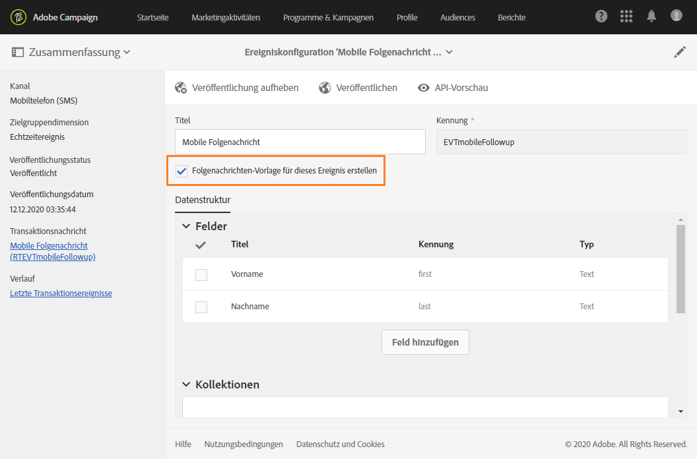

1. [Erstellen Sie eine Vorschau und veröffentlichen Sie das Ereignis](../../channels/using/publishing-transactional-event.md#previewing-and-publishing-the-event).

Mit Ausführung der Veröffentlichung werden automatisch eine dem neuen Ereignis entsprechende Transaktionsnachricht und eine Folgenachricht aus einer Versandvorlage erzeugt. Die Schritte zum Senden der Folgenachricht sind in [diesem Abschnitt](#sending-a-follow-up-message) beschrieben.

## Zugriff auf die Folgenachrichten         {#accessing-the-follow-up-messages}

Zur Verwaltung eines Ereignisses innerhalb eines Workflows ist eine Versandvorlage notwendig. Allerdings kann die bei der Veröffentlichung des Ereignisses erstellte [Transaktionsnachricht](../../channels/using/editing-transactional-message.md) nicht als Vorlage verwendet werden. Hierfür müssen Sie eine spezifische Versandvorlage für Folgenachrichten erstellen, die diesen Ereignistyp und die Verwendung als Vorlage in Workflows unterstützt.

So greifen Sie auf diese Vorlage zu:

1. Klicken Sie oben links auf das **Adobe**-Logo.
1. Wählen Sie dann **[!UICONTROL Ressourcen]** > **[!UICONTROL Vorlagen]** > **[!UICONTROL Versandvorlagen]**.
1. Aktivieren Sie im linken Bereich die Option **[!UICONTROL Folgenachrichten]**.

   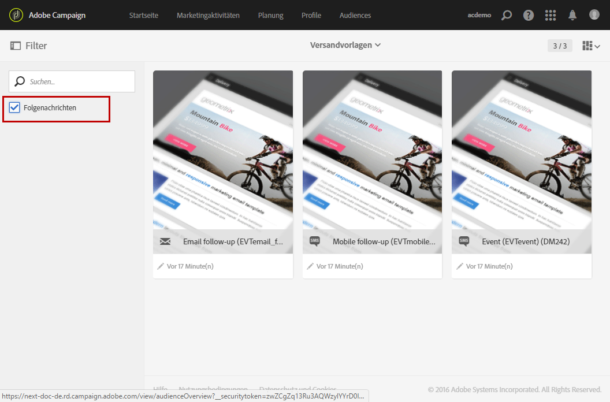

Nur die Folgenachrichten werden angezeigt.

>[!IMPORTANT]
>
>Nur Benutzer mit der Rolle [Administration](../../administration/using/users-management.md#functional-administrators) können Transaktionsnachrichten aufrufen und bearbeiten.

## Folgenachrichten senden {#sending-a-follow-up-message}

Nachdem Sie die Folgenachrichten-Versandvorlage erstellt haben, können Sie sie in einem Workflow zum Versenden einer Folgenachricht verwenden.

<!--You need to set up a workflow targeting the event corresponding to the transactional message that was already received.-->

1. Gehen Sie in die Liste der Marketing-Aktivitäten und erstellen Sie einen neuen Workflow.

   Siehe [Workflow erstellen](../../automating/using/building-a-workflow.md#creating-a-workflow).

1. Ziehen Sie eine **[!UICONTROL Planung]** in den Workflow und öffnen Sie sie. Wählen Sie für die Ausführungshäufigkeit einmal pro Tag aus.

   Weiterführende Informationen zur Aktivität &quot;Planung&quot; finden Sie im Abschnitt [Planung](../../automating/using/scheduler.md).

1. Ziehen Sie eine **[!UICONTROL Abfrage]** in den Workflow-Arbeitsbereich und öffnen Sie sie.

   Weiterführende Informationen zur Abfrage-Aktivität finden Sie im Abschnitt [Abfrage](../../automating/using/query.md).

1. Damit sich Ihre Abfrage auf eine andere als die Profil-Ressource bezieht, gehen Sie in den **[!UICONTROL Eigenschaften]**-Tab der Aktivität und wählen Sie die entsprechende **[!UICONTROL Ressource]** aus der Dropdown-Liste aus.

   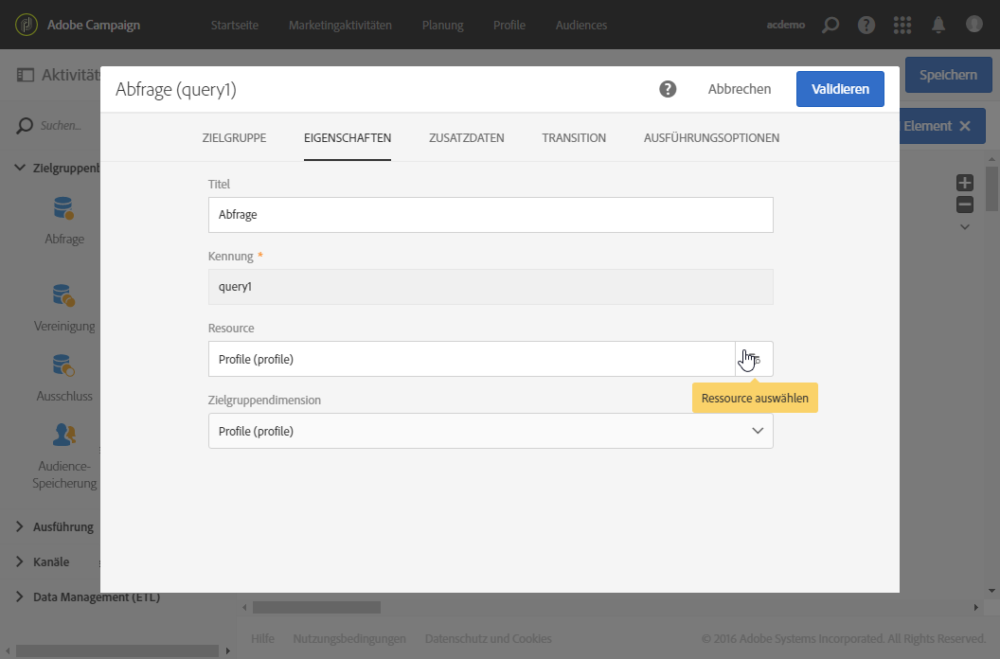

   >[!NOTE]
   >
   >Die Standardkonfiguration der Aktivität sieht die Suche nach Profilen vor.

1. Wählen Sie das Ereignis aus, auf das Ihr Workflow abzielen soll, sodass Sie ausschließlich auf zu diesem Ereignis gehörende Daten zugreifen.

   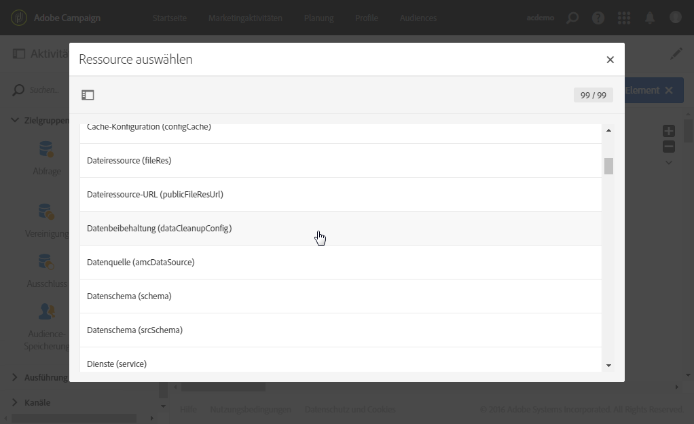

1. Navigieren Sie zum Tab **[!UICONTROL Zielgruppe]** der Aktivität und ziehen Sie das Element **[!UICONTROL Versandlogs (logs)]** aus der Palette in den Arbeitsbereich.

   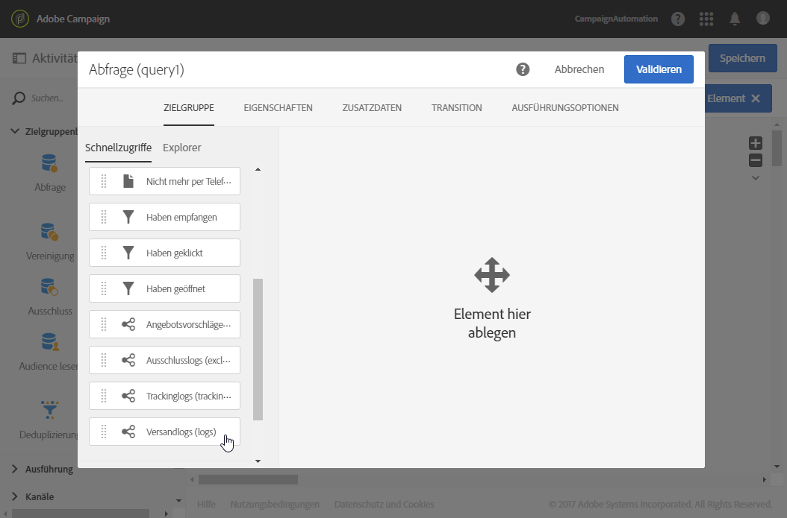

   Wählen Sie **[!UICONTROL Existiert]** aus, um alle Kunden in Ihre Zielgruppe einzubeziehen, die die E-Mail erhalten haben.

   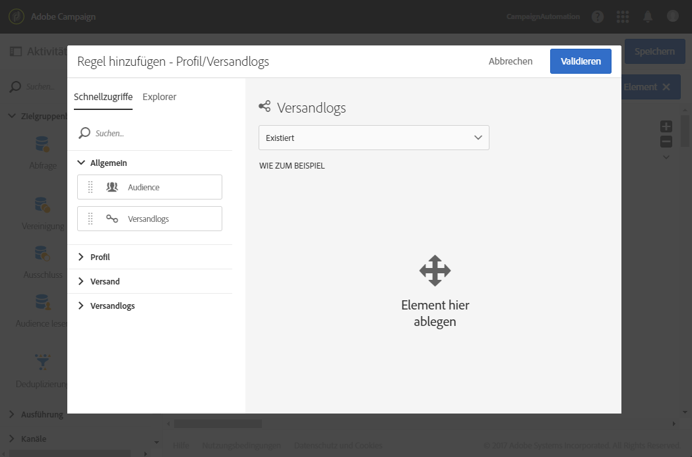

1. Ziehen Sie das Element **[!UICONTROL Trackinglogs (tracking)]** aus der Palette in den Arbeitsbereich und wählen Sie **[!UICONTROL Existiert nicht]** aus, um alle Kunden in Ihre Zielgruppe einzubeziehen, die die E-Mail nicht geöffnet haben.

   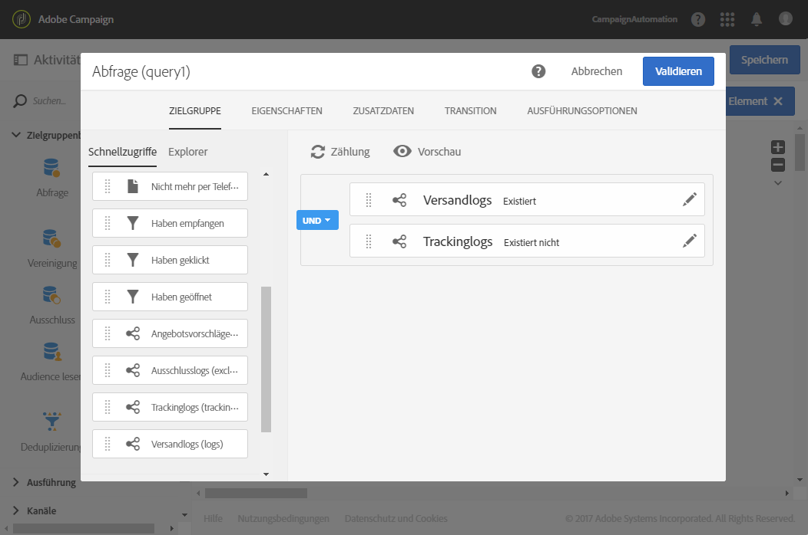

1. Ziehen Sie das Ereignis, für das Sie eine Zielgruppe bestimmen (in diesem Beispiel **Stehen gelassener Warenkorb**), von der Palette in den Arbeitsbereich. Definieren Sie dann eine Regel, um alle Nachrichten einzuschließen, die vor drei Tagen gesendet wurden.

   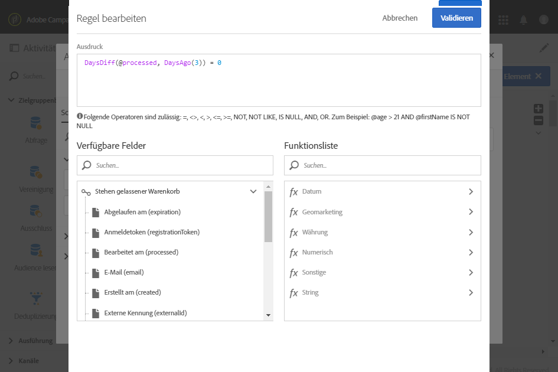

   Dadurch sind alle Empfänger in der Zielgruppe enthalten, die die Transaktionsnachricht drei Tage vor der Ausführung des Workflows erhalten und noch nicht geöffnet haben.

   Speichern Sie die Abfrage mithilfe der Schaltfläche **[!UICONTROL Bestätigen]**.

1. Ziehen Sie einen **E-Mail-Versand** in den Workflow-Arbeitsbereich.

   Weiterführende Informationen zu dieser Aktivität finden Sie im Abschnitt [E-Mail-Versand](../../automating/using/email-delivery.md).

   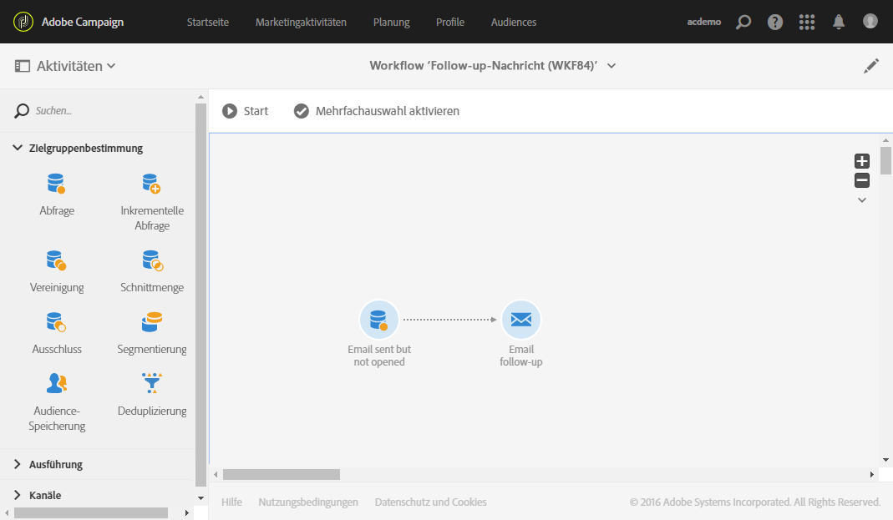

   Sie können alternativ auch einen [SMS-Versand](../../automating/using/sms-delivery.md) oder die Aktivität [Push-Benachrichtigungs-Versand](../../automating/using/push-notification-delivery.md) verwenden. Stellen Sie in diesem Fall sicher, dass Sie, während Sie Ihre Ereigniskonfiguration vornehmen, den Kanal **[!UICONTROL Mobiltelefon (SMS)]** oder **[!UICONTROL Mobile App]** auswählen. Siehe [Ereignis erstellen](../../channels/using/configuring-transactional-event.md#creating-an-event).

1. Öffnen Sie die Aktivität **E-Mail-Versand.** Aktivieren Sie im Erstellungsassistenten die Option **[!UICONTROL Folgenachrichten]** und wählen Sie die Folgenachrichten-Versandvorlage aus, die nach dem Veröffentlichen des Ereignisses erstellt wurde.

   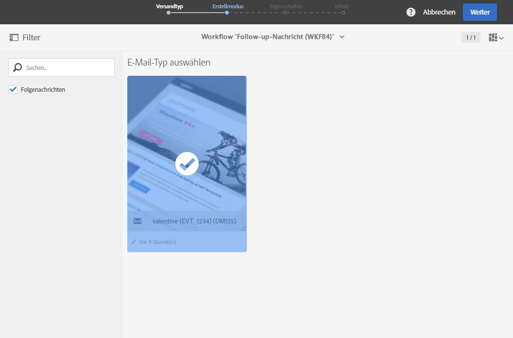

1. Sie können den Inhalt Ihres Ereignisses im Inhalt der Folgenachricht übernehmen, indem Sie Personalisierungsfelder hinzufügen.

   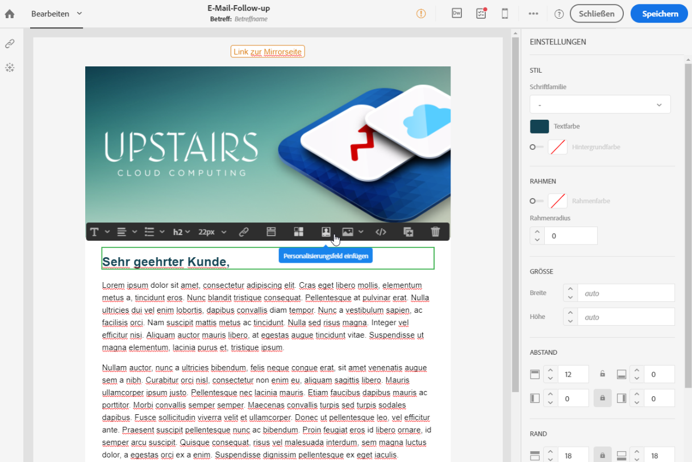

1. Die von Ihnen bei der Erstellung des Ereignisses definierten Felder finden Sie durch die Auswahl von **[!UICONTROL Kontext]** > **[!UICONTROL Echtzeit-Ereignis]** > **[!UICONTROL Ereigniskontext]**. Siehe [Transaktionsnachricht personalisieren](../../channels/using/editing-transactional-message.md#personalizing-a-transactional-message).

   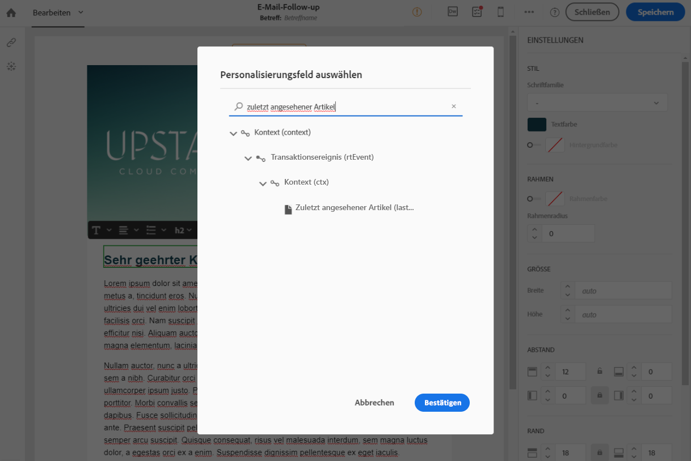

   Das bedeutet, dass Sie denselben Inhalt, der beim ersten Versand des Ereignisses benutzt wurde, einschließlich angereicherter Daten für die Erstellung einer höflichen personalisierten Erinnerung verwenden können.

1. Speichern Sie die Aktivität und starten Sie den Workflow.

Nach dem Start des Workflows erhalten alle Kunden, die drei Tage zuvor Ihre Benachrichtigung über den stehen gelassenen Warenkorb empfangen, aber nicht geöffnet haben, eine auf denselben Daten basierende Folgenachricht.

>[!NOTE]
>
>Wenn Sie die Zielgruppendimension **[!UICONTROL Profil]** bei der Erstellung der Ereigniskonfiguration ausgewählt haben, nutzt die Folgenachricht zudem die Marketing-Datenbank von Adobe Campaign. Siehe [Profil-Transaktionsnachrichten](../../channels/using/editing-transactional-message.md#profile-transactional-message-specificities).
