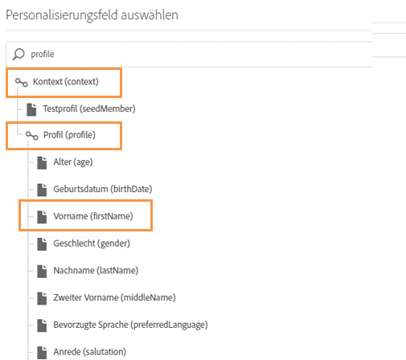

# CSV-Datei für mehrsprachige Push-Benachrichtigungen erstellen{#generating-csv-multilingual-push}

Durch das Hochladen einer CSV-Datei zum Generieren von Inhalten für den Versand werden mehrsprachige Push-Benachrichtigungen unterstützt. Das Format der CSV-Datei muss bestimmten Richtlinien entsprechen, damit der Datei-Upload erfolgreich und eine Versanderstellung möglich ist. In den folgenden Abschnitten werden das Dateiformat und die damit verbundenen Überlegungen beschrieben.

## Dateiformat {#file-format}

Mehrsprachige Push-Benachrichtigungen erfordern 14 Spalten in der CSV-Datei:

1. title
1. messageBody
1. sound
1. badge
1. deeplinkURI
1. category
1. iosMediaAttachmentURL
1. androidMediaAttachmentURL
1. isContentAvailable
1. isMutableContent
1. customFields
1. locale
1. language
1. silentPush

Sie können sich das CSV-Beispiel ansehen, indem Sie auf **[!UICONTROL Beispieldatei herunterladen]** im Fenster **[!UICONTROL Inhaltsvarianten verwalten]** klicken. Weitere Informationen finden Sie in diesem [Abschnitt](../../channels/using/creating-a-multilingual-push-notification.md).

* **title, messageBody, sound, badge, deeplinkURI, category, iosMediaAttachmentURL, androidMediaAttachmentURL**: Standardmäßige Push-Payload-Inhalte. Sie müssen diese Informationen auf ähnliche Weise bereitstellen wie beim Erstellen von Push-Sendungen.
* **Benutzerdefinierte Felder**: Verwenden Sie das JSON-Format für die benutzerdefinierten Felder, z. B. `{"key1":"value1","key2":"value2"}`. In der obigen Beispieldatei finden Sie ein Beispiel für benutzerdefinierte Felder.
* **isContentAvailable**: Markierung für Prüfung &quot;Inhalt verfügbar&quot;, Wert 1 bedeutet &quot;wahr&quot;, Wert 0 bedeutet &quot;falsch&quot;. Der Standardwert ist 0. Wenn Sie diese Spalte leer lassen, wird der Wert als 0 betrachtet.
* **isMutableContent**: Markierung für &quot;Veränderlicher Inhalt&quot;, Wert 1 bedeutet &quot;wahr&quot;, Wert 0 bedeutet &quot;falsch&quot;. Der Standardwert ist 0. Wenn Sie diese Spalte leer lassen, wird der Wert 0 angenommen.
* **locale**: &quot;locale&quot; (Gebietsschema) ist das Feld für Sprachvarianten, z. B. &quot;en_us&quot; für US-Englisch und &quot;fr_fr&quot; für Frankreich-Französisch.
* **language**: Name der Sprache, die mit dem Gebietsschema verknüpft ist. Wenn das Gebietsschema beispielsweise &quot;en_us&quot; lautet, sollte der Name der Sprache &quot;Englisch – USA&quot; lauten.
* **silentPush**: Markierung für den Push-Benachrichtigungstyp. Wenn es sich um eine reguläre Push-Benachrichtigung handelt, sollte der Wert 0 betragen. Wenn es sich um stilles Pushen handelt, sollte der Wert 1 betragen. Der Standardwert ist 0. Wenn Sie diese Spalte leer lassen, wird der Wert als 0 betrachtet.

## Einschränkungen und Richtlinien für die Erstellung von CSV-Dateien {#constraints-guideline-csv}

**Der Name jeder Spalte ist festgesetzt**.
Sie sollten die Namen der einzelnen Spalten in der CSV-Datei angeben. Wenn Sie für den Inhalt keine Spalten verwenden, geben Sie nichts an.

**Die Spalten &quot;locale&quot; und &quot;language&quot; sind zwingend erforderlich und der Wert ist für jede Zeile eindeutig.**
Wenn der Wert in einer dieser Spalte fehlt, tritt beim Hochladen der Datei ein Fehler auf.

**Die Reihenfolge der Spalten ist wichtig**. Die Reihenfolge der Spalten in der hochgeladenen Datei muss das Format der Beispieldatei aufweisen.

**Spalteninhalt in Anführungszeichen setzen**. Da es sich um eine CSV-Datei (d. h. Comma-Separated Values) handelt, muss jeder Spalteninhalt, der ein Komma (,) enthält, in Anführungszeichen gesetzt werden. Beispiel: &quot;Hallo, Tom!&quot;

**Für internationale Zeichen ist die UTF-8-Kodierung erforderlich.**

**Wenn Sie die Datei im Klartext generieren, trennen Sie jede Spalte durch &quot;,&quot;.**

**Varianten stimmen nicht überein.** Wenn Sie einen Inhaltsbaustein und Ziel-Audiences mit unterschiedlichen Sprachen verwenden, müssen Sie jede Zielsprache in Ihrer CSV-Datei auflisten. Andernfalls wird beim Versand ein Fehler ausgegeben.

## Personalisierungsfelder in die CSV-Datei einfügen {#personalization-field-csv}

Wenn Sie Personalisierungsfelder verwenden möchten, sollten Sie den <span>-Tag in die Datei aufnehmen.

Um das Personalisierungsfeld &quot;firstName&quot; in messageBody einzufügen, muss die Nachricht wie folgt lauten:

```
 "Hello <span class="nl-dce-field nl-dce-done"  data-nl-expr="/context/profile/firstName">First name</span>, this is message".
```

Das Feld &quot;firstName&quot; wird wie folgt dargestellt:

```
 <span class="nl-dce-field nl-dce-done" data-nl-expr="/context/profile/firstName">First name</span>
```

Im Bereich gibt es zwei obligatorische Attribute:

* Das erste Attribut ist &quot;class&quot;; es ist statisch. Unabhängig davon, welches Personalisierungsfeld Sie verwenden möchten, gilt immer class=&quot;nl-dce-field nl-dce-done&quot;.

* Das zweite Attribut ist &quot;data-nl-expr&quot;, der Pfad des Personalisierungsfelds. Wenn Sie z. B. das Personalisierungsfeld &quot;firstName&quot; aus der Benutzeroberfläche einfügen, lautet der Navigationspfad **[!UICONTROL Kontext (context)]** > **[!UICONTROL Profil (profile)]** > **[!UICONTROL Vorname (firstname)]** (wie in der Abbildung unten gezeigt). In diesem Fall lautet der Pfad

   ```
   /context/profile/firstName. data-nl-expr="/context/profile/firstName".
   ```



## Gebietsschema und Sprachnamen {#locale-language-names}

Folgende Sprachen werden unterstützt:

| Gebietsschema | Sprache |
|:-:|:-:|
| af_za | Afrikaans – Südafrika |
| sq_al | Albanisch – Albanien |
| ar_dz | Arabisch – Algerien |
| ar_bh | Arabisch – Bahrain |
| ar_iq | Arabisch – Irak |
| ar_il | Arabisch – Israel |
| ar_jo | Arabisch – Jordanien |
| ar_kw | Arabisch – Kuwait |
| ar_lb | Arabisch – Libanon |
| ar_ma | Arabisch – Marokko |
| ar_om | Arabisch – Oman |
| ar_qa | Arabisch – Katar |
| ar_sa | Arabisch – Saudi-Arabien |
| ar_sy | Arabisch – Syrien |
| ar_tn | Arabisch – Tunesien |
| ar_ae | Arabisch – Vereinigte Arab. Emirate |
| ar_ye | Arabisch – Jemen |
| hy_am | Armenisch – Armenien |
| az_az | Aserbaidschanisch – Aserbaidschan |
| be_by | Weißrussisch – Weißrussland |
| bs_ba | Bosnisch – Bosnien |
| bg_bg | Bulgarisch – Bulgarien |
| ca_es | Katalanisch – Spanien |
| zh_cn | Chinesisch (vereinfacht) – China |
| zh_sg | Chinesisch (vereinfacht) – Singapur |
| zh_hk | Chinesisch (traditionell) – Hongkong, SAR China |
| zh_tw | Chinesisch (traditionell) – Region Taiwan |
| hr_hr | Kroatisch – Kroatien |
| cs_cz | Tschechisch – Tschechien |
| da_dk | Dänisch – Dänemark |
| nl_be | Niederländisch – Belgien |
| nl_nl | Holländisch – Niederlande |
| en_au | Englisch – Australien |
| en_bz | Englisch – Belize |
| en_ca | Englisch – Kanada |
| en_in | Englisch – Indien |
| en_ie | Englisch – Irland |
| en_jm | Englisch – Jamaika |
| en_nz | Englisch – Neuseeland |
| en_ph | Englisch – Philippinen |
| en_za | Englisch – Südafrika |
| en_tt | Englisch – Trinidad und Tobago |
| en_gb | Englisch – Vereinigtes Königreich |
| en_us | Englisch – USA |
| en_zw | Englisch – Simbabwe |
| et_ee | Estnisch –Estland |
| fi_fi | Finnisch – Finnland |
| fr_be | Französisch – Belgien |
| fr_ca | Französisch – Kanada |
| fr_fr | Französisch – Frankreich |
| fr_lu | Französisch – Luxemburg |
| fr_ch | Französisch – Schweiz |
| de_at | Deutsch – Österreich |
| de_de | Deutsch – Deutschland |
| de_lu | Deutsch – Luxemburg |
| de_ch | Deutsch – Schweiz |
| el_cy | Griechisch – Zypern |
| el_gr | Griechisch – Griechenland |
| gu_in | Gujarati – Indien |
| he_il | Hebräisch –Israel |
| hi_in | Hindi – Indien |
| hu_hu | Ungarisch – Ungarn |
| is_is | Isländisch – Island |
| id_id | Indonesisch – Indonesien |
| it_it | Italienisch – Italien |
| it_ch | Italienisch – Schweiz |
| ja_jp | Japanisch – Japan |
| kn_in | Kannada – Indien |
| kk_kz | Kasachisch – Kasachstan |
| ko_kr | Koreanisch – Südkorea |
| lv_lv | Lettisch – Lettland |
| lt_lt | Litauisch – Litauen |
| mk_mk | Mazedonisch – Mazedonien |
| ms_my | Malaiisch – Malaysia |
| mr_in | Marathi – Indien |
| no_no | Norwegisch – Norwegen |
| pl_pl | Polnisch – Polen |
| pt_br | Portugiesisch – Brasilien |
| pt_pt | Portugiesisch – Portugal |
| pa_in | Pandschabi – Indien |
| ro_md | Rumänisch – Moldawien |
| ro_ro | Rumänisch – Rumänien |
| ru_kz | Russisch – Kasachstan |
| ru_ru | Russisch – Russland |
| ru_ua | Russisch – Ukraine |
| a_in | Sanskrit – Indien |
| sr_ba | Serbisch – Bosnien |
| sr_rs | Serbisch – Serbien |
| sk_sk | Slowakisch – Slowakei |
| sl_si | Slowenisch – Slowenien |
| es_ar | Spanisch – Argentinien |
| es_bo | Spanisch – Bolivien |
| es_cl | Spanisch – Chile |
| es_co | Spanisch – Kolumbien |
| es_cr | Spanisch – Costa Rica |
| es_do | Spanisch – Dominikanische Republik |
| es_ec | Spanisch – Ecuador |
| es_sv | Spanisch – El Salvador |
| es_gt | Spanisch – Guatemala |
| es_hn | Spanisch – Honduras |
| es_mx | Spanisch – Mexiko |
| es_ni | Spanisch – Nicaragua |
| es_pa | Spanisch – Panama |
| es_py | Spanisch – Paraguay |
| es_pe | Spanisch – Peru |
| es_pr | Spanisch – Puerto Rico |
| es_es | Spanisch – Spanien |
| es_uy | Spanisch – Uruguay |
| es_ve | Spanisch – Venezuela |
| sw_ke | Swahili – Kenia |
| sv_fi | Schwedisch – Finnland |
| sv_se | Schwedisch – Schweden |
| ta_in | Tamil – Indien |
| tt_ru | Tatarisch – Russland |
| te_in | Telugu – Indien |
| th_th | Thai – Thailand |
| tr_cy | Türkisch – Zypern |
| tr_tr | Türkisch – Türkei |
| uk_ua | Ukrainisch – Ukraine |
| ur_in | Urdu – Indien |
| ur_pk | Urdu – Pakistan |
| vi_vn | Vietnamesisch – Vietnam |
