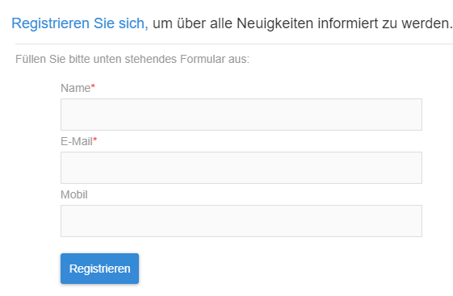
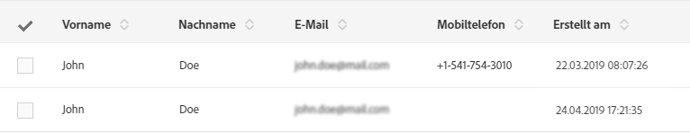
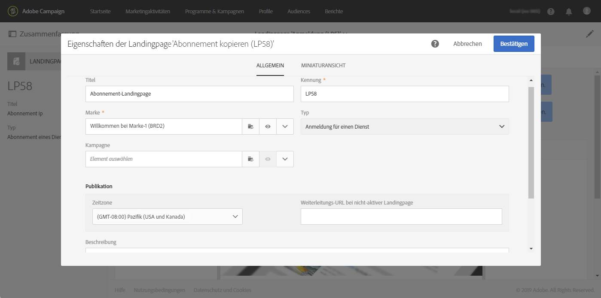
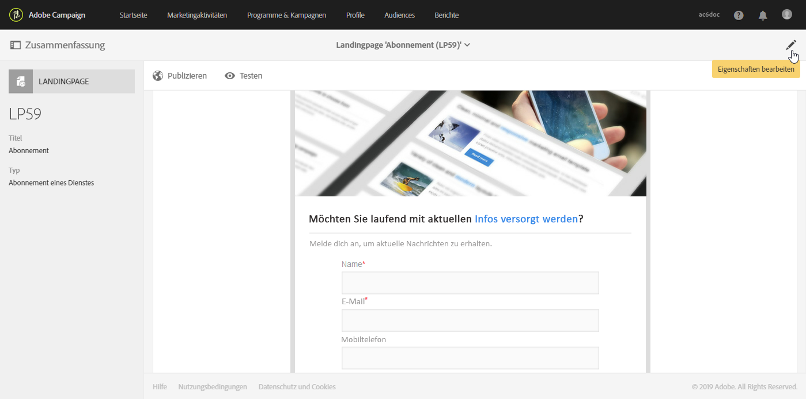
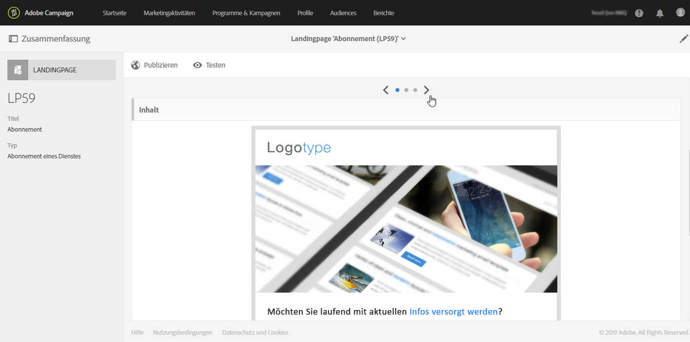
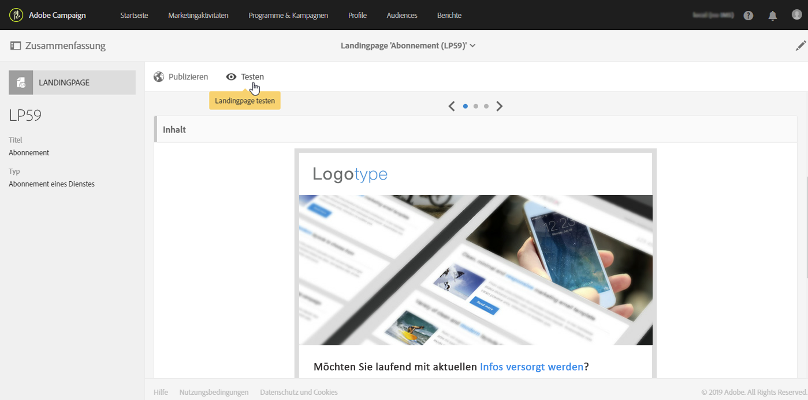
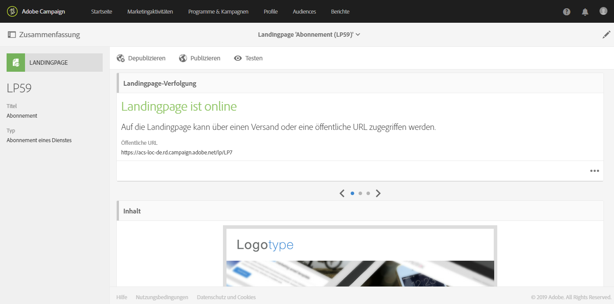

# Erste Schritte mit Landingpages {#getting-started-with-landing-pages}

## Über Landingpages {#about-landing-pages}

Campaign bietet eine Landingpage-Funktion an. Landingpages sind Webformulare, mit denen Sie Informationen zu Ihren Audiences erfassen, Abonnements für einen Dienst anbieten, Daten darstellen und Ihre Datenbank erweitern können. Landingpages können außerdem zur Akquise oder Aktualisierung bestehender Profile verwendet werden.

Darüber hinaus können Sie über Landingpages eine Anmeldung mit zweifacher Bestätigung einrichten, sodass Sie Ihre Plattform vor falschen oder ungültigen E-Mail-Adressen bzw. Spambots schützen können. Weiterführende Informationen dazu finden Sie im [entsprechenden Anwendungsbeispiel](../../channels/using/setting-up-a-double-opt-in-process.md).

Dies sind die wichtigsten Schritte zum Einrichten einer Landingpage:

Auf dieser Seite finden Sie Informationen zu den einzelnen Schritten sowie Hinweise zu den jeweiligen Dokumentationen, denen Sie weitere Details entnehmen können.

**Verwandte Themen:**

* [Anleitungsvideo zum Erstellen einer Landingpage](https://docs.adobe.com/content/help/en/campaign-learn/campaign-standard-tutorials/communication-channels/landing-pages/landing-page-create-and-edit.html)
* [Dienst erstellen](../../audiences/using/creating-a-service.md)
* [Anmeldung mit zweifacher Bestätigung einrichten](setting-up-a-double-opt-in-process.md)

## Einschränkungen bei Landingpages{#landing-page-limitations}

Im folgenden Abschnitt finden Sie die Einschränkungen, die Sie kennen sollten, bevor Sie mit dem Einrichten von Landingpages beginnen.

**Schreiben und Aktualisieren von Daten**

* Landing pages are limited to **[!UICONTROL Profile]** and **[!UICONTROL Subscription]** resources only. Record can be saved and updated from **[!UICONTROL Profile]** and a subscription/unsubscription to a **[!UICONTROL Service]**.
Weiterführende Informationen zur Ressourcenkonfiguration finden Sie im Abschnitt [Datenstruktur der Ressource konfigurieren](../../developing/using/configuring-the-resource-s-data-structure.md).

>[!CAUTION]
>
>A landing page cannot display or update data from any other resource than **[!UICONTROL Profile]** and **[!UICONTROL Subscription]**.

**Vorausfüllen**

* Auf einer Landingpage ist keine automatische Anzeige von Daten möglich. Außerdem können keine Dienste angezeigt werden, für die Profile bereits ein Abonnement besitzen. Weiterführende Informationen zu Diensten finden Sie auf dieser [Seite](../../audiences/using/creating-a-service.md).

* Der Zugriff auf eine Landingpage mit einem vorausgefüllten Formular (Daten werden bereits mit der Seite geladen) kann ausschließlich über eine Adobe Campaign-E-Mail erfolgen. Über eine Seite einer Website ist der Zugriff auf ein derartiges Formular nicht möglich.

**Abstimmung**

* Das Abstimmungsverhalten sieht folgendermaßen aus: Sobald eine Übereinstimmung gefunden wird, endet der Abstimmungsprozess. Dies bedeutet, dass die Abstimmung nur für einen Profildatensatz durchgeführt werden kann und nicht für mehrere Datensätze, falls Duplikate vorhanden sind.

Sie möchten beispielsweise die folgende Akquise-Landingpage an Ihre Profile senden, um Ihre Campaign-Datenbank mit den Mobiltelefonnummern der Profile zu aktualisieren.

Wenn eines Ihrer Profile auf Ihrer Landingpage neue Daten eingibt, aber bereits ein dupliziertes Profil vorhanden ist, wird das passende Profil mit dem frühesten Erstellungsdatum aktualisiert, da Profile nach ihrem Erstellungsdatum priorisiert werden.

Hier wurde nur das erste Profil aktualisiert, da dessen Eintrag früher erfolgte.

**Testen von Landingpages**

* Landingpages funktionieren nur mit Profilen, nicht aber mit Testprofilen, weshalb Landingpages nicht im Zuge eines E-Mail-Testversands getestet werden können.

## Schritt 1 – Landingpage-Vorlage konfigurieren{#configure-the-landing-page-template}

Bevor Sie eine Landingpage einrichten, müssen Sie zunächst eine Landingpage-Vorlage entsprechend Ihren Anforderungen konfigurieren. Alle auf dieser Vorlage basierenden Landingpages werden dadurch mit den gewünschten Parametern vorkonfiguriert.

1. From the advanced menu, via the Adobe Campaign logo, select **[!UICONTROL Resources]** / **[!UICONTROL Templates]** / **[!UICONTROL Landing page templates]**, then duplicate the template that you want to use.
1. Geben Sie in den Vorlageneigenschaften die Parameter an, die alle Ihre Landingpages haben müssen. Beispiel: die Zielgruppendimension, die Seitenzugriffsparameter für identifizierte oder nicht identifizierte Besucher, Aktionen, die spezifisch für die Formularüberprüfung durch einen Besucher sind, die im Inhalt zu verwendende Marke/das Logo usw. Weiterführende Informationen zu den Landingpage-Eigenschaften finden Sie in [diesem Abschnitt](../../channels/using/configuring-landing-page.md).
1. Speichern Sie Ihre Änderungen.

Weiterführende Informationen zu Landingpage-Vorlagen finden Sie in [diesem Abschnitt](../../channels/using/getting-started-with-landing-pages.md).

## Schritt 2 – Landingpage erstellen und konfigurieren {#create-and-configure-the-landing-page}

Erstellen Sie ausgehend von der im vorangehenden Schritt definierten Vorlage eine neue Landingpage innerhalb des Programms oder der Kampagne Ihrer Wahl.

1. Erstellen Sie die Landingpage auf der Basis der gewünschten Vorlage.
1. Geben Sie die allgemeinen Parameter der Landingpage ein (Titel, Beschreibung usw.).
1. Sie werden anschließend zum Landingpage-Dashboard weitergeleitet. Bearbeiten Sie bei Bedarf die Eigenschaften der Landingpage (siehe [Landingpage konfigurieren](../../channels/using/configuring-landing-page.md)). Standardmäßig sind die Eigenschaften diejenigen, die in der Landingpage-Vorlage konfiguriert wurden.
Wir empfehlen dringend, aus Gründen der Sicherheit und der Plattform-Leistung in den Eigenschaften der Landingpage ein Ablaufdatum einzurichten. Die Landingpage wird dadurch automatisch am ausgewählten Datum depubliziert. Weiterführende Informationen zu Gültigkeitsparametern finden Sie in [diesem Abschnitt](../../channels/using/testing-publishing-landing-page.md#setting-up-validity-parameters).

   

   >[!NOTE]
   >
   >Sollten Sie Änderungen vornehmen, gelten diese nur für die in Bearbeitung befindliche Landingpage. Wenn Sie die Änderungen auf andere Landingpages anwenden möchten, können Sie sie in einer dedizierten Vorlage vornehmen und von dieser Vorlage ausgehend andere Landingpages erstellen.

## Schritt 3 – Landingpage gestalten {#design-the-landing-page}

Jetzt können Sie den Inhalt der Landingpage definieren. Standardmäßig umfasst die Landingpage drei Seiten, auf die mithilfe der Scroll-Funktion zugegriffen werden kann: die Hauptseite mit dem Inhalt, eine Bestätigungsseite und eine Fehlerseite.

Auf jeder Seite sind standardmäßig mehrere Felder konfiguriert. Bei Bedarf können Sie deren Eigenschaften und Zuordnung bearbeiten.

Sie können auch festlegen, wie sich die Bestätigungsschaltfläche verhält, wenn ein Profil darauf klickt, und den Inhalt entsprechend Ihren Anforderungen personalisieren (Bild, Personalisierungsfelder usw.). So können Sie den Vornamen eines Profils auf der Bestätigungsseite der Landingpage einfügen, um sich für die Registrierung zu bedanken.

Weiterführende Informationen zum Entwurf der Landingpage finden Sie in [diesem Abschnitt](../../channels/using/designing-a-landing-page.md).

## Schritt 4 – Landingpage testen {#test-the-landing-page}

Wenn die Landingpage fertig ist, können Sie simulieren, wie sie ausgeführt wird und sich verhält, wenn online auf sie zugegriffen wird.

>[!CAUTION]
>
>Landingpage-Tests können nur mit Profilen und nicht mit Testprofilen durchgeführt werden. Wenn das Formular gesendet wird, werden die Daten des ausgewählten Profils aktualisiert. Um zu verhindern, dass echte Profile verändert werden, verwenden Sie ein erfundenes Kundenprofil.

Sollte das während des Tests beobachtete Verhalten zufriedenstellend sein, können Sie nun die Landingpage publizieren und sie damit online verfügbar machen.

Weiterführende Informationen zum Testen einer Landingpage finden Sie in [diesem Abschnitt](../../channels/using/testing-publishing-landing-page.md#testing-the-landing-page-).

## Schritt 5 – Landingpage publizieren {#publish-the-landing-page}

Once the tests are successful, you can publish the landing page using the **[!UICONTROL Publish]** button from the action bar in the dashboard. Die Kachel &quot;Landingpage-Verfolgung&quot; gibt Ihnen Auskunft über Fortschritt und Status der Publikation.

Durch die Publikation der Landingpage wird diese online verfügbar. Nach ihrer Publikation lässt sich die Landingpage weiterhin aktualisieren: Hierzu müssen Sie sie nach jeder Änderung erneut publizieren. Sie haben außerdem die Möglichkeit, Ihre Landingpage jederzeit zu depublizieren, damit sie nicht länger verfügbar ist.

Nach der Publikation ist Ihre Landingpage zur Nutzung bereit. Sie können nun verschiedene Zugriffsmechanismen definieren, um entweder neue Profile für Ihre Datenbank oder zusätzliche Informationen zu bereits existierenden Profilen hinzuzugewinnen.

Weiterführende Informationen zum Publizieren von Landingpages finden Sie in [diesem Abschnitt](../../channels/using/testing-publishing-landing-page.md#publishing-a-landing-page).
