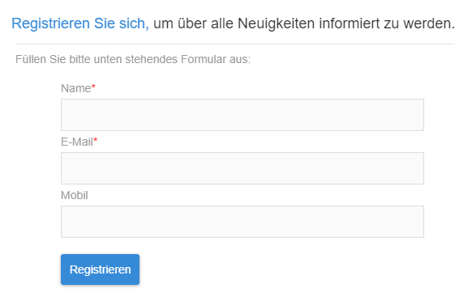
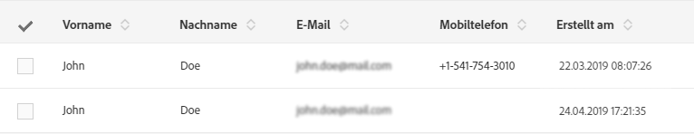
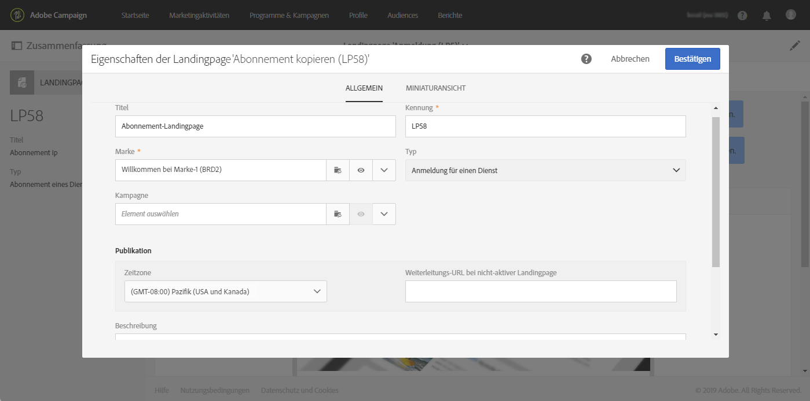
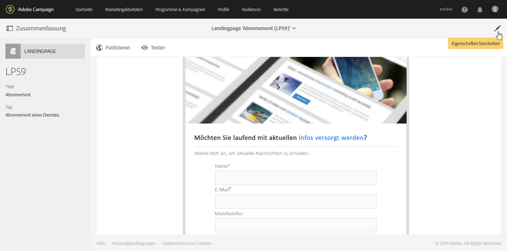
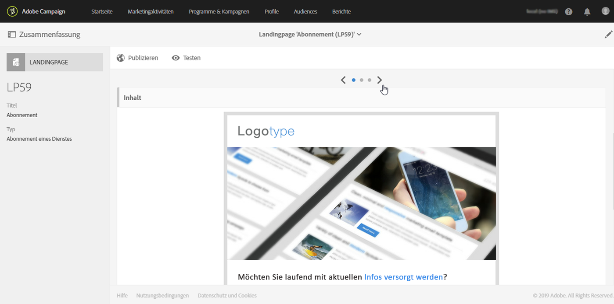
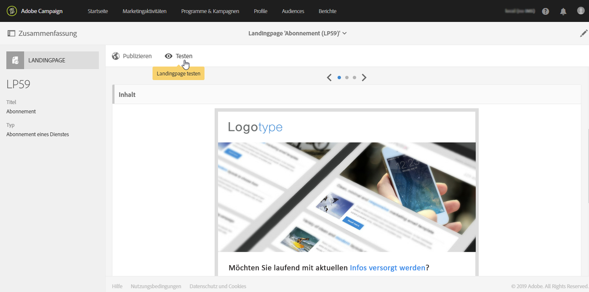
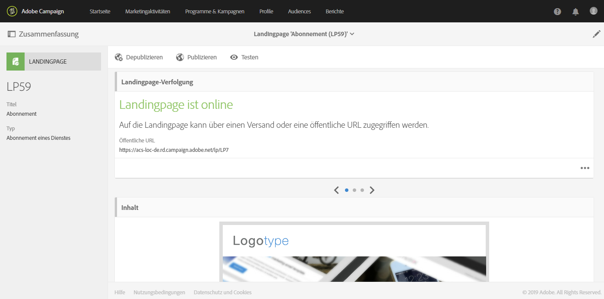

# Erste Schritte mit Landingpages {#getting-started-with-landing-pages}

Dies sind die wichtigsten Schritte zum Einrichten einer Landingpage:

Auf dieser Seite finden Sie Informationen zu den einzelnen Schritten sowie Hinweise zu den jeweiligen Dokumentationen, denen Sie weitere Details entnehmen können.

 [Erfahren Sie im Video, wie Sie Landingpages erstellen](#video)

**Verwandte Themen:**

* [Service erstellen](../../audiences/using/creating-a-service.md)
* [Anmeldung mit zweifacher Bestätigung einrichten](setting-up-a-double-opt-in-process.md)

## Einschränkungen bei Landingpages{#landing-page-limitations}

Im folgenden Abschnitt finden Sie die Einschränkungen, die Sie kennen sollten, bevor Sie mit dem Einrichten von Landingpages beginnen.

**Schreiben und Aktualisieren von Daten**

* Landingpages sind auf **[!UICONTROL Profil]** und **[!UICONTROL Abonnement]**-Ressourcen beschränkt. Die Speicherung und Aktualisierung von Datensätzen ist im **[!UICONTROL Profil]** und über die Anmeldung zu/Abmeldung von einem **[!UICONTROL Dienst]** möglich.
Weiterführende Informationen zur Ressourcenkonfiguration finden Sie im Abschnitt [Datenstruktur der Ressource konfigurieren](../../developing/using/configuring-the-resource-s-data-structure.md).

>[!IMPORTANT]
>
>Die Ansicht oder Aktualisierung von auf einer Landingpage eingegebenen Daten ist nur über die Ressourcen **[!UICONTROL Profil]** und **[!UICONTROL Abonnement]** möglich.

**Vorausfüllen**

* Auf einer Landingpage ist keine automatische Anzeige von Daten möglich. Außerdem können keine Dienste angezeigt werden, für die Profile bereits ein Abonnement besitzen. Weiterführende Informationen zu Diensten finden Sie auf dieser [Seite](../../audiences/using/creating-a-service.md).

* Der Zugriff auf eine Landingpage mit einem vorausgefüllten Formular (Daten werden bereits mit der Seite geladen) kann ausschließlich über eine Adobe Campaign-E-Mail erfolgen. Über eine Seite einer Website ist der Zugriff auf ein derartiges Formular nicht möglich.

**Abstimmung**

* Das Abstimmungsverhalten sieht folgendermaßen aus: Sobald eine Übereinstimmung gefunden wird, wird der Abstimmungsprozess gestoppt. Dies bedeutet, dass die Abstimmung nur für einen Profildatensatz durchgeführt werden kann und nicht für mehrere Datensätze, falls Duplikate vorhanden sind.

Sie möchten beispielsweise die folgende Akquise-Landingpage an Ihre Profile senden, um Ihre Campaign-Datenbank mit den Mobiltelefonnummern der Profile zu aktualisieren.

Wenn eines Ihrer Profile auf Ihrer Landingpage neue Daten eingibt, aber bereits ein dupliziertes Profil vorhanden ist, wird das passende Profil mit dem frühesten Erstellungsdatum aktualisiert, da Profile nach ihrem Erstellungsdatum priorisiert werden.

Hier wurde nur das erste Profil aktualisiert, da dessen Eintrag früher erfolgte.

**Testen von Landingpages**

* Landingpages funktionieren nur mit Profilen, nicht aber mit Testprofilen, weshalb Landingpages nicht im Zuge eines E-Mail-Testversands getestet werden können.

## Schritt 1 – Landingpage-Vorlage konfigurieren {#configure-the-landing-page-template}

Bevor Sie eine Landingpage einrichten, müssen Sie zunächst eine Landingpage-Vorlage entsprechend Ihren Anforderungen konfigurieren. Alle auf dieser Vorlage basierenden Landingpages werden dadurch mit den gewünschten Parametern vorkonfiguriert.

1. Greifen Sie mithilfe des Adobe Campaign-Logos oben links im Bildschirm auf das erweiterte Menü **[!UICONTROL Ressourcen]** > **[!UICONTROL Vorlagen]** > **[!UICONTROL Landingpage-Vorlagen]** zu und duplizieren Sie die gewünschte Vorlage.
1. Geben Sie in den Vorlageneigenschaften die Parameter an, die alle Ihre Landingpages haben müssen. Beispielsweise die Zielgruppendimension, die Seitenzugriffsparameter für identifizierte oder nicht identifizierte Besucher, Aktionen, die für die Formularvalidierung durch einen Besucher spezifisch sind, die Marke/das Logo, die/das im Inhalt verwendet werden soll usw. Weiterführende Informationen zu den Eigenschaften von Landingpages finden Sie in [diesem Abschnitt](../../channels/using/configuring-landing-page.md)
1. Speichern Sie Ihre Änderungen.

Weiterführende Informationen zu Landingpage-Vorlagen finden Sie in [diesem Abschnitt](../../channels/using/getting-started-with-landing-pages.md).

## Schritt 2 – Landingpage erstellen und konfigurieren {#create-and-configure-the-landing-page}

Erstellen Sie ausgehend von der im vorangehenden Schritt definierten Vorlage eine neue Landingpage innerhalb des Programms oder der Kampagne Ihrer Wahl.

1. Erstellen Sie die Landingpage auf der Basis der gewünschten Vorlage.
1. Geben Sie die allgemeinen Parameter der Landingpage ein (Titel, Beschreibung usw.).
1. Sie werden anschließend zum Landingpage-Dashboard weitergeleitet. Bearbeiten Sie bei Bedarf die Eigenschaften der Landingpage (siehe [Landingpage konfigurieren](../../channels/using/configuring-landing-page.md)). Standardmäßig sind die Eigenschaften diejenigen, die in der Landingpage-Vorlage konfiguriert wurden.
Wir empfehlen dringend, aus Gründen der Sicherheit und der Plattform-Performance in den Eigenschaften der Landingpage ein Ablaufdatum einzurichten. Die Veröffentlichung der Landingpage wird dadurch automatisch am ausgewählten Datum aufgehoben. Weiterführende Informationen zu Gültigkeitsparametern finden Sie in [diesem Abschnitt](../../channels/using/testing-publishing-landing-page.md#setting-up-validity-parameters).

   

>[!NOTE]
>
>Ihre Änderungen gelten nur für die Landingpage, die bearbeitet wird. Wenn Sie diese Änderungen auf andere Landingpages anwenden möchten, können Sie sie in einer dedizierten Vorlage durchführen und dann andere Landingpages aus dieser Vorlage erstellen.

## Schritt 3 – Landingpage gestalten {#design-the-landing-page}

Jetzt können Sie den Inhalt der Landingpage definieren. Standardmäßig umfasst die Landingpage drei Seiten, auf die mithilfe der Scroll-Funktion zugegriffen werden kann: die Hauptseite mit dem Inhalt, eine Bestätigungsseite und eine Fehlerseite.

Auf jeder Seite sind standardmäßig mehrere Felder konfiguriert. Bei Bedarf können Sie deren Eigenschaften und Zuordnung bearbeiten.

Sie können auch festlegen, wie sich die Bestätigungsschaltfläche verhält, wenn ein Profil darauf klickt, und den Inhalt entsprechend Ihren Anforderungen personalisieren (Bild, Personalisierungsfelder usw.). So können Sie den Vornamen eines Profils auf der Bestätigungsseite der Landingpage einfügen, um sich für die Registrierung zu bedanken.

Weiterführende Informationen zum Entwurf der Landingpage finden Sie in [diesem Abschnitt](../../channels/using/designing-a-landing-page.md).

## Schritt 4 – Landingpage testen {#test-the-landing-page}

Wenn die Landingpage fertig ist, können Sie simulieren, wie sie ausgeführt wird und sich verhält, wenn online auf sie zugegriffen wird.

>[!IMPORTANT]
>
>Landingpage-Tests können nur mit Profilen und nicht mit Testprofilen durchgeführt werden. Wenn das Formular gesendet wird, werden die Daten des ausgewählten Profils aktualisiert. Um zu verhindern, dass echte Profile verändert werden, verwenden Sie ein erfundenes Kundenprofil.

Sollte das während des Tests beobachtete Verhalten zufriedenstellend sein, können Sie nun die Landingpage veröffentlichen und sie damit online verfügbar machen.

Weiterführende Informationen zum Testen einer Landingpage finden Sie in [diesem Abschnitt](../../channels/using/testing-publishing-landing-page.md#testing-the-landing-page-).

## Schritt 5 – Landingpage veröffentlichen {#publish-the-landing-page}

Nach zufriedenstellender Ausführung der Tests können Sie unter Verwendung der Schaltfläche **[!UICONTROL Veröffentlichen]** in der Aktionsleiste des Dashboards die Landingpage online stellen. Die Kachel &quot;Landingpage-Verfolgung&quot; gibt Ihnen Auskunft über Fortschritt und Status der Veröffentlichung.

Durch das Veröffentlichen der Landingpage ist sie online verfügbar. Nach der Veröffentlichung können Sie sie jederzeit aktualisieren. Dazu müssen Sie sie nach jeder Änderung erneut veröffentlichen. Sie haben außerdem die Möglichkeit, die Veröffentlichung Ihrer Landingpage jederzeit aufzuheben, damit sie nicht länger verfügbar ist.

Nach der Veröffentlichung kann Ihre Landingpage verwendet werden. Anschließend können Sie verschiedene Mechanismen einrichten, mit denen Sie darauf zugreifen können, um neue Profile in Ihrer Datenbank zu erwerben oder zusätzliche Informationen zu vorhandenen Profilen zu erhalten.

Weiterführende Informationen zum Veröffentlichen von Landingpages finden Sie in [diesem Abschnitt](../../channels/using/testing-publishing-landing-page.md#publishing-a-landing-page).

## Anleitungsvideo {#video}

In diesem Video wird gezeigt, wie man eine Landingpage erstellt und bearbeitet.

>[!VIDEO](https://video.tv.adobe.com/v/24093?quality=12)

Weitere Anleitungsvideos zu Campaign Standard finden Sie [hier](https://experienceleague.adobe.com/docs/campaign-standard-learn/tutorials/overview.html?lang=de).
