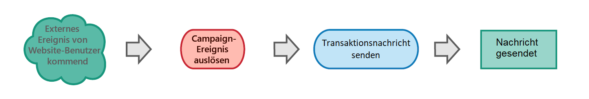

# Erste Schritte mit Transaktionsnachrichten {#getting-started-with-transactional-messaging}

Bei einer Transaktionsnachricht handelt es sich um eine individuell zugeschnittene, eindeutige Mitteilung, die beispielsweise über eine Website in Echtzeit übermittelt wird. Sie wird erwartet, weil sie wichtige Informationen enthält, die der Empfänger überprüfen oder bestätigen möchte.

* **Wann wird diese Nachricht gesendet?** Da diese Nachricht wichtige Informationen enthält, erwartet der Benutzer, dass sie in Echtzeit gesendet wird. Folglich muss die Verzögerung zwischen der Auslösung des Ereignisses und dem Eintreffen der Nachricht sehr kurz sein.

* **Warum ist das wichtig?** Im Allgemeinen hat eine Transaktionsnachricht hohe Öffnungsraten. Sie sollte daher sorgfältig gestaltet werden, da sie einen starken Einfluss auf das Kundenverhalten und die Kundenbeziehung im Allgemeinen haben kann.

* **Beispiel?** Es kann sich um eine Begrüßungsnachricht nach der Erstellung eines Kontos, eine Bestätigung, dass eine Bestellung versandt wurde, eine Rechnung, eine Nachricht zur Bestätigung einer Passwortänderung oder eine Benachrichtigung nach dem Besuch einer Website durch einen Kunden usw. handeln.

In Adobe Campaign empfängt die entsprechende Funktion Ereignisse von einem Informationssystem, auf die sie mit personalisierten Transaktionsnachrichten reagiert.

Transaktionsnachrichten können je nach Ihren Optionen per E-Mail, SMS oder [Push-Benachrichtigung](../../channels/using/transactional-push-notifications.md) versendet werden. Prüfen Sie diesbezüglich Ihren Lizenzvertrag.

>[!NOTE]
>
>In Adobe Campaign hat die Verarbeitung von Transaktionsnachrichten Priorität vor allen anderen Sendungen.

<!--Guidelines to implement transactional messaging capabilities in your website are detailed in [this section](../../api/using/managing-transactional-messages.md).-->

Bevor Sie mit Transaktionsnachrichten beginnen, sollten Sie die entsprechenden [Best Practices und Einschränkungen](../../channels/using/transactional-messaging-limitations.md) lesen.

## Funktionsweise von Transaktionsnachrichten {#transactional-messaging-operating-principle}

Der gesamte Prozess der Transaktionsnachrichten kann wie folgt beschrieben werden:

Angenommen, Sie sind eine Firma mit einer Website, auf der Ihre Kunden Produkte kaufen können.

Mit Adobe Campaign können Sie eine Benachrichtigungs-E-Mail an Kunden senden, die ihrem Warenkorb Produkte hinzugefügt haben. Wenn ein Kunde Ihre Website verlässt, ohne seine Einkäufe zu tätigen (externes Ereignis, das ein Campaign-Ereignis auslöst), wird automatisch eine Warenkorbabbruchs-E-Mail an ihn gesendet (Versand einer Transaktionsnachricht).

Die wichtigsten Schritte für die Einrichtung sind nachfolgend in [diesem Abschnitt](#key-steps) beschrieben.

## Transaktionsnachrichtentypen {#transactional-message-types}

In Adobe Campaign sind zwei Arten von Transaktionsnachrichten verfügbar.

**Ereignis-Transaktionsnachrichten** beziehen sich auf Daten, die im Ereignis selbst enthalten sind. Für diese Nachrichten gilt:
* Sie enthalten keine Profilinformationen und können daher keine Abmelde-Links enthalten.
* Sie sind nicht mit Ermüdungsregeln kompatibel (auch nicht im Falle einer Anreicherung mit Profilen).
* Die Zielgruppe des Versands wird durch die Daten definiert, die im Ereignis selbst enthalten sind.

Möglicherweise möchten Sie eine Ereignis-Transaktionsnachricht an einen Kunden senden, der zum Beispiel ein vergessenes Passwort abrufen oder eine Bestellung bestätigen muss. Sie möchten nicht, dass Ihr Empfänger sich von dieser Art von Mitteilungen abmeldet, und diese Benachrichtigung sollte nicht im Rahmen einer Ermüdungsregel zum Zähler der Marketing-Meldungen hinzugefügt werden.

**Profil-Transaktionsnachrichten** beziehen sich auf Profile in der Marketing-Datenbank von Campaign. Mit dieser Art von Nachrichten können Sie:
* die in der Adobe Campaign-Datenbank enthaltenen Daten nutzen.
* Ihre Nachricht mit Profilinformationen personalisieren, indem Sie der Ereigniskonfiguration eine [Anreicherung](../../channels/using/configuring-transactional-event.md#enriching-the-transactional-message-content) hinzufügen.
* [Marketing-Typologieregeln](../../sending/using/managing-typology-rules.md) oder [Ermüdungsregeln](../../sending/using/fatigue-rules.md) anwenden.
* einen Abmelde-Link in die Nachricht einfügen
* die Transaktionsnachrichten zur allgemeinen Versandberichterstattung hinzufügen
* die Transaktionsnachrichten für die Customer Journey nutzen

Beispielsweise können Sie diese Art von Nachrichten verwenden, wenn Sie Ihre Kunden kontaktieren, nachdem sie ihren Warenkorb auf Ihrer Website verlassen haben, um sie zu ermutigen, mit ihrem Kauf fortzufahren. Auf diese Weise können Sie Ihre Nachricht einfacher personalisieren, indem Sie direkt auf alle Informationen aus Ihrer Profildatenbank zugreifen, Marketing-Regeln anwenden und diese Nachricht in die globale Customer Journey und Berichte einbinden, um einen besseren Überblick über Ihr Kundenverhalten zu erhalten.

Der Nachrichtentyp wird bei der Konfiguration des Ereignisses definiert, das eine Transaktionsnachricht auslösen soll. Weitere Informationen finden Sie in den Abschnitten zur Konfiguration [ereignisbasierter Transaktionsnachrichten](../../channels/using/configuring-transactional-event.md#event-based-transactional-messages) und [profilbasierter Transaktionsnachrichten](../../channels/using/configuring-transactional-event.md#profile-based-transactional-messages).

## Die wichtigsten Schritte {#key-steps}

Die wichtigsten Schritte beim Erstellen und Verwalten personalisierter Transaktionsnachrichten in Adobe Campaign sind im folgenden Schema zusammengefasst.

Jeder dieser Schritte wird im Folgenden näher erläutert.

>[!IMPORTANT]
>
>Nur Benutzer mit der Rolle [Administration](../../administration/using/users-management.md#functional-administrators) können Transaktionsereignisse konfigurieren und auf Transaktionsnachrichten zugreifen.

### Schritt 1: Ereigniskonfiguration erstellen und veröffentlichen {#create-event-configuration}

<!---->

| Ereignis erstellen | Benutzer | Aktion | Ergebnis |
| --- |--- |--- |--- |
|  | Dieser Schritt muss von einem Administrator durchgeführt werden, der [Administratorrechte](../../administration/using/users-management.md#functional-administrators) besitzt. | Konfigurieren Sie ein Ereignis mit dem Namen „Warenkorbabbruch“ und veröffentlichen Sie diese Ereigniskonfiguration. | Die von Ihrem Website-Entwickler verwendete API wird bereitgestellt und eine Transaktionsnachricht automatisch erstellt. |

Das Erstellen und Veröffentlichen eines Ereignisses wird in den Abschnitten [Transaktionsereignisse konfigurieren](../../channels/using/configuring-transactional-event.md) und [Transaktionsereignisse veröffentlichen](../../channels/using/publishing-transactional-event.md) beschrieben.

### Schritt 2: Transaktionsnachricht bearbeiten und veröffentlichen {#create-transactional-message}

<!---->

| Nachricht bearbeiten | Benutzer | Aktion | Ergebnis |
| --- |--- |--- |--- |
|  | Dieser Schritt kann von einem Marketing-Benutzer durchgeführt werden, der [Administratorrechte](../../administration/using/users-management.md#functional-administrators) besitzt. | Bearbeiten und personalisieren Sie die Transaktionsnachricht, testen Sie sie und veröffentlichen Sie sie dann. | Die Transaktionsnachricht ist dann versandfertig. |

Weitere Informationen zum Bearbeiten und Veröffentlichen einer Transaktionsnachricht finden Sie unter [Transaktionsnachrichten bearbeiten](../../channels/using/editing-transactional-message.md) und [Lebenszyklus von Transaktionsnachrichten](../../channels/using/publishing-transactional-message.md).

### Schritt 3: Ereignisaktivierung integrieren {#integrate-event-trigger}

<!---->

Nach der Erstellung des gewünschten Ereignisses muss die Auslösung dieses Ereignisses in Ihre Webseite integriert werden.<!--In this example, you want a "Cart abandonment" event to be triggered whenever one of your clients leaves your website before purchasing the products in their cart.-->**Zu diesem Zweck muss der Web-Entwickler Ihrer Seite die Adobe Campaign Standard-REST-API verwenden**.

| Implementieren des Triggers | Benutzer | Aktion | Ergebnis |
| --- |--- |--- |--- |
|  | Dieser Schritt wird vom Entwickler Ihrer Website ausgeführt. | Verwenden Sie die REST-Transaktionsnachrichten-API, um das Ereignis in Ihre Website zu integrieren. | Das Ereignis wird ausgelöst, wenn ein Kunde seinen Warenkorb abbricht. |

Weitere Informationen zur Verwendung der Campaign REST-API zum Verwalten von Transaktionsnachrichten finden Sie in der [REST-API-Dokumentation](../../api/using/managing-transactional-messages.md).

### Schritt 4: Nachrichtenversand {#message-delivery}

<!---->

Sobald alle oben genannten Schritte ausgeführt wurden, kann die Nachricht gesendet werden.

| Nachricht senden | Benutzer | Aktion | Ergebnis |
| --- |--- |--- |--- |
|  | Dieser Schritt wird von Kunden ausgeführt, die Ihre Website besuchen. | Sobald ein Benutzer die Website verlässt, ohne die Produkte in seinem Warenkorb zu bestellen, wird das entsprechende Campaign-Ereignis ausgelöst. | Der Benutzer erhält automatisch eine Benachrichtigungs-E-Mail. |

## Verwandte Themen

* [Wichtigste Schritte im Nachrichtenversand](../../channels/using/key-steps-to-send-a-message.md)
* [Erste Schritte mit Kommunikationskanälen](../../channels/using/get-started-communication-channels.md)
* [Transaktions-Push-Benachrichtigung](../../channels/using/transactional-push-notifications.md)
* [Folgenachrichten](../../channels/using/follow-up-messages.md)
