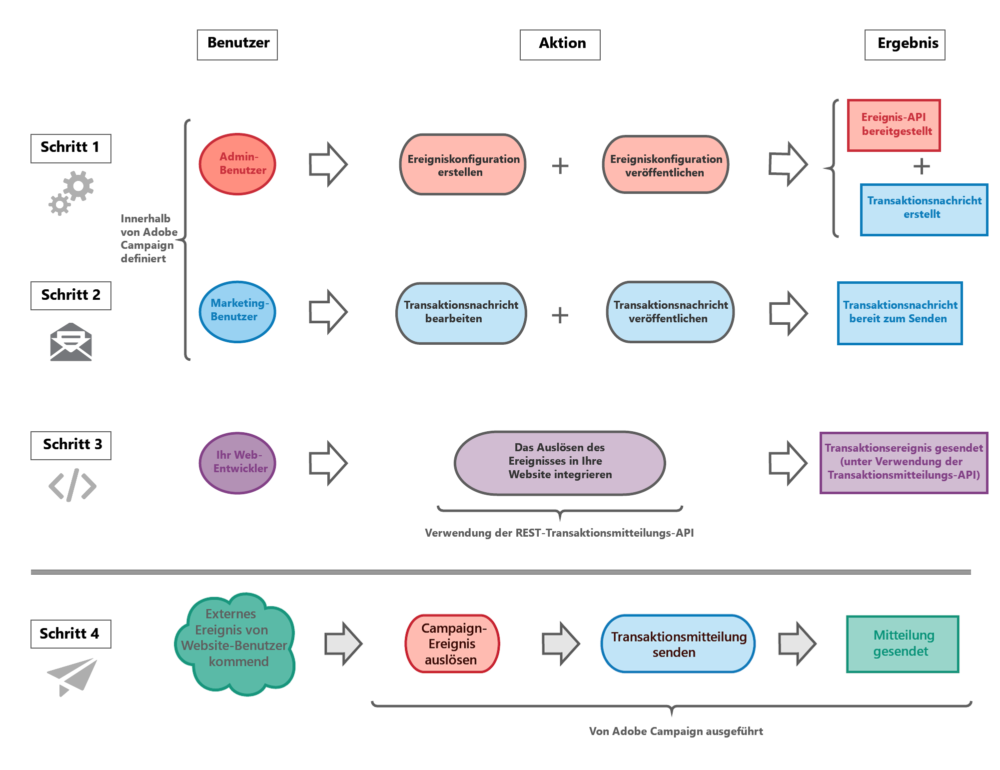
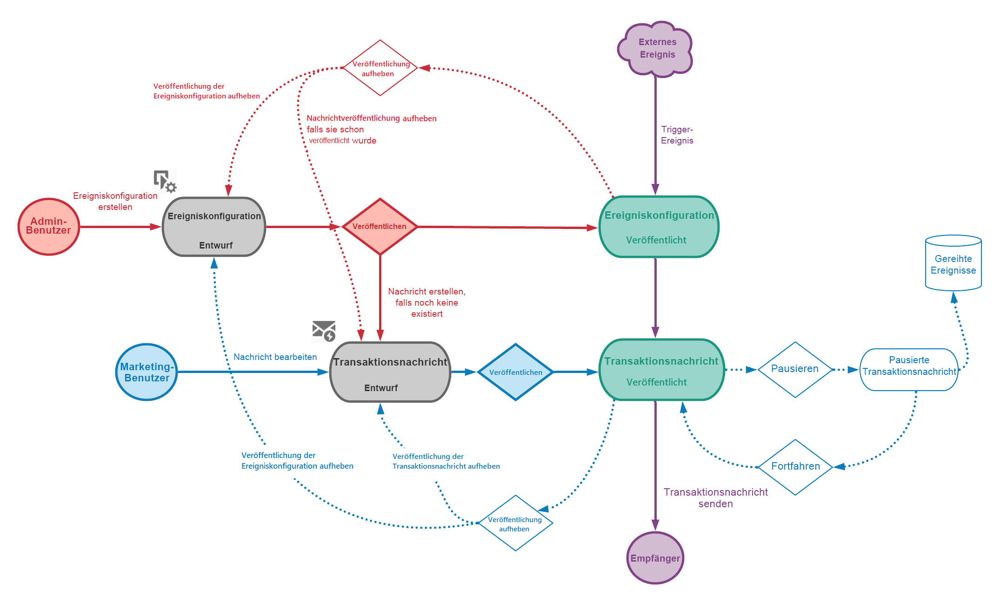

# Erste Schritte mit Transaktionsnachrichten {#getting-started-with-transactional-messaging}

## Übersicht

Einführung in das Konzepts der **Transaktionsnachrichten**

Mit Transaktionsnachrichten können Sie Ihren Kunden individuelle und einzigartige Nachrichten in Echtzeit senden.

Sie können Willkommensmeldungen, Versandbestätigungen, Passwortaktualisierungen usw. sein.
In Adobe Campaign empfängt die entsprechende Funktion Ereignisse von einem Informationssystem, auf die sie mit personalisierten Transaktionsnachrichten reagiert.

Transaktionsnachrichten können je nach Ihren Optionen per E-Mail, SMS oder Push-Benachrichtigung versendet werden. Prüfen Sie diesbezüglich Ihren Lizenzvertrag.

In Adobe Campaign hat die Verarbeitung von Transaktionsnachrichten Priorität vor allen anderen Sendungen.

Transaktionsnachrichten sind auch in der Adobe Campaign Standard API verfügbar. Weiterführende Informationen finden Sie im [entsprechenden Handbuch](../../api/using/managing-transactional-messages.md).

>[!NOTE]
>
>Alle Transaktionsnachrichten werden nun mit dem erweiterten MTA von Adobe Campaign gesendet, um die Zustellbarkeit, den Durchsatz und die Bounce-Handhabung zu verbessern. Alle Auswirkungen sind dieselben wie bei standardmäßigen Marketing-Nachrichten. Weiterführende Informationen hierzu finden Sie in [diesem Abschnitt](../../administration/using/configuring-email-channel.md).

## Definition von Transaktionsnachrichten {#transactional-messaging-definition}

<table>
<tr>
<td align="center"> 
<b>Was ist eine Transaktionsnachricht?</b>
</td>
<td>
Es handelt sich um eine individuelle und einmalige Nachricht, die von einem Anbieter wie einer Website gesendet wird.
</td>
<td>
Sie wird erwartet, weil sie wichtige Informationen enthält, die der Empfänger überprüfen oder bestätigen möchte.
</td>
</tr>
<tr>
<td align="center"> 
<b>Wann wird diese Nachricht gesendet?</b>
</td>
<td>
 Da diese Nachricht wichtige Informationen enthält, erwartet der Benutzer, dass sie in Echtzeit gesendet wird.
</td>
<td>
Folglich muss die Verzögerung zwischen der Auslösung des Ereignisses und dem Eintreffen der Nachricht sehr kurz sein.
</td>
</tr>
<tr>
<td align="center"> 
<b>Warum ist das wichtig?</b>
</td>
<td>
Im Allgemeinen hat eine Transaktionsnachricht hohe Öffnungsraten. Sie sollte daher sorgfältig gestaltet werden.
</td>
<td>
Sie kann einen starken Einfluss auf das Verhalten der Kunden haben, da sie die Kundenbeziehung definiert.
</td>
</tr>
<tr>
<td align="center"> 
<b>Einige Beispiele:</b>
</td>
<td>
Eine Transaktionsnachricht kann eine Begrüßungsnachricht nach der Kontoerstellung, eine Bestätigung nach einer Bestellung, eine Rechnung usw. sein.
</td>
<td>
Es kann sich auch um eine Nachricht handeln, die eine Kennwortänderung bestätigt, oder um eine Benachrichtigung, nachdem ein Kunde Ihre Website besucht hat.
</td>
</tr>
</table>

## Transaktionsnachrichtentypen

In Adobe Campaign sind zwei Arten von Transaktionsnachrichten verfügbar:

[Ereignis-Transaktionsnachrichten](../../channels/using/event-transactional-messages.md), die sich auf ein Ereignis beziehen.

* Ereignis-Transaktionsnachrichten enthalten keine Profilinformationen.

* Sie sind nicht mit [Ermüdungsregeln](../../sending/using/fatigue-rules.md) kompatibel (auch nicht im Falle einer Anreicherung mit Profilen).

* Die Zielgruppe des Versands wird durch die Daten definiert, die im Ereignis selbst enthalten sind.

[Profil-Transaktionsnachrichten](../../channels/using/profile-transactional-messages.md), die sich auf Profile in der Marketing-Datenbank von Campaign beziehen.

Mit Profil-Transaktionsnachrichten haben Sie folgende Möglichkeiten:

* Apply [marketing typology rules](../../sending/using/managing-typology-rules.md) or [fatigue rules](../../sending/using/fatigue-rules.md)

* einen Abmelde-Link in die Nachricht einfügen

* die Transaktionsnachrichten zur allgemeinen Versandberichterstattung hinzufügen

* Die Transaktionsnachrichten für die Customer Journey nutzen

Der Nachrichtentyp wird bei der Konfiguration des Ereignisses definiert, das eine Transaktionsnachricht auslösen soll. Siehe [Transaktionsnachrichten konfigurieren](../../administration/using/configuring-transactional-messaging.md).

>[!IMPORTANT]
>
>Sie können nur dann auf alle Transaktionsnachrichten zugreifen, wenn Sie der Sicherheitsgruppe **[!UICONTROL Administratoren (alle Einheiten)]** angehören.

## Funktionsweise von Transaktionsnachrichten {#transactional-messaging-operating-principle}

Nehmen wir zur Erläuterung der Funktionsweise den Fall einer Firmen-Website, auf der Kunden Artikel kaufen können.

Verlässt ein Website-Besucher die Seite, ohne den Kauf abzuschließen, wird ihm automatisch eine Benachrichtigungs-E-Mail zugeschickt, um ihn an seinen stehen gelassenen Warenkorb zu erinnern.

Gehen Sie hierzu wie folgt vor.

### Schritt 1: Ereigniskonfiguration erstellen und publizieren {#create-event-configuration}

**Konfiguration von Transaktionsereignissen**:

* Konfigurieren Sie ein Ereignis mit dem Namen „Warenkorbabbruch“ und publizieren Sie diese Ereigniskonfiguration.

* Die von Ihrem Website-Entwickler verwendete API wird bereitgestellt und eine Transaktionsnachricht automatisch erstellt.

* Beachten Sie, dass dieser Schritt von einem Benutzer mit [Administratorrechten](../../administration/using/users-management.md#functional-administrators) ausgeführt werden muss.

Die Erstellung und Veröffentlichung eines Ereignisses finden Sie im Abschnitt [Ereignis konfigurieren, um eine Ereignis-Transaktionsnachricht zu senden](../../administration/using/configuring-transactional-messaging.md#use-case--configuring-an-event-to-send-a-transactional-message).

### Schritt 2: Transaktionsnachricht bearbeiten und publizieren {#create-transactional-message}

**Bearbeitung von Transaktionsnachrichten**

* Bearbeiten und personalisieren Sie die Transaktionsnachricht, testen Sie sie und publizieren Sie sie dann.

* Die Transaktionsnachricht ist dann versandfertig.

* This step can be performed by any marketing user with [standard user access rights](../../administration/using/users-management.md#basic-users).

Weitere Informationen zum Bearbeiten und Publizieren einer Transaktionsnachricht finden Sie unter [Ereignis-Transaktionsnachrichten](../../channels/using/event-transactional-messages.md).

### Schritt 3: Ereignis-Aktivierung integrieren {#integrate-event-trigger}

**Integration von Ereignisaktivierungen**

* Verwenden Sie die REST-Transaktionsnachrichten-API, um das Ereignis in Ihre Website zu integrieren.&lt;

* Das Ereignis wird ausgelöst, wenn ein Kunde seinen Warenkorb abbricht.

* Dieser Schritt wird vom Entwickler Ihrer Website ausgeführt.

Weitere Informationen zur Integration des Ereignisses in Ihre Website finden Sie unter [Website-Integration](../../administration/using/configuring-transactional-messaging.md#integrating-the-triggering-of-the-event-in-a-website).

### Schritt 4: Nachrichtenversand {#message-delivery}

**Externes Ereignis von Ihrer Website**

* Sobald alle diese Schritte ausgeführt wurden, kann die Nachricht gesendet werden.

* Sobald ein Benutzer die Website verlässt, ohne die Produkte in seinem Warenkorb zu bestellen, wird das entsprechende Campaign-Ereignis ausgelöst.

* Der Benutzer erhält dann automatisch eine Benachrichtigungs-E-Mail.

## Die wichtigsten Schritte {#key-steps}

Die wichtigsten Schritte beim Erstellen und Verwalten personalisierter Transaktionsnachrichten in Adobe Campaign sind in der folgenden Tabelle zusammengefasst.

## Verwandte Themen

* [Die wichtigsten Schritte im Nachrichtenversand](../../channels/using/key-steps-to-send-a-message.md)
* [Erste Schritte mit Kommunikationskanälen](../../channels/using/get-started-communication-channels.md)

<!--## Transactional messaging publication process {#transactional-messaging-pub-process}

The chart below illustrates the whole transactional messaging publication process.

For more on the event configuration steps, see [Transactional messaging configuration](../../administration/using/configuring-transactional-messaging.md).

Read more:

* [Event transactional messages](../../channels/using/event-transactional-messages.md)
* [Profile transactional messages](../../channels/using/profile-transactional-messages.md)
* [Transactional push notifications](../../channels/using/transactional-push-notifications.md)
* [Follow-up messages](../../channels/using/follow-up-messages.md)-->