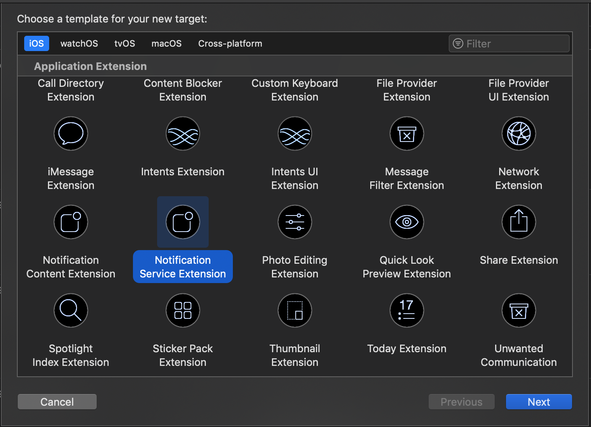

# Anzeigen eines Bildes aus einer Push-Benachrichtigung des Adobe Campaign Standard {#image-push}

>[!NOTE]
>
>Dieses Dokument gilt nur für iOS-Geräte.

## Schritt 1: Einrichten der Push-Benachrichtigung {#set-up-push}

Push-Benachrichtigungen werden von Experience Platform SDKs unterstützt.

Mobile Apps, über die Push-Benachrichtigungen empfangen werden, müssen von einem Administrator in der Adobe-Campaign-Benutzeroberfläche konfiguriert werden.

Durch die Konfiguration von sowohl Adobe Campaign als auch Adobe Mobile Services können Sie die Daten Ihrer Mobile Apps für Ihre Kampagnen verwenden. Weiterführende Informationen hierzu finden Sie auf dieser [Seite](https://helpx.adobe.com/de/campaign/kb/configuring-app-sdk.html).

Um Push-Benachrichtigungen mit einer Experience Cloud SDK-Anwendung zu senden, muss eine mobile App im Adobe Experience Platform Launch eingerichtet und in Adobe Campaign konfiguriert werden. Weiterführende Informationen hierzu finden Sie auf dieser [Seite](https://helpx.adobe.com/de/campaign/kb/configuring-app-sdk.html#ChannelspecificapplicationconfigurationinAdobeCampaign).

## Schritt 2: Push-Benachrichtigung im Adobe Campaign anpassen {#customize-push}

In Adobe Campaign stehen Ihnen zur Anpassung von Push-Benachrichtigungen bei deren Erstellung eine Reihe erweiterter Optionen zur Verfügung.

1. Push-Benachrichtigung erstellen. Weiterführende Informationen hierzu finden Sie auf dieser Seite.

1. Rufen Sie auf Ihrer Seite mit den Inhalten für Push-Benachrichtigungen den Abschnitt Erweiterte Optionen auf.

1. Geben Sie die URL Ihrer Datei in das Feld &quot;URL des Rich-Media-Inhalts&quot;ein.
Unter iOS 10 oder höher können Sie Bild-, GIF-, Audio- und Videodateien einfügen.

   

1. Vorschau und speichern Sie Ihre Push-Benachrichtigung.

## Schritt 3: Anpassen des Codes der mobilen Anwendung {#mobile-app-code}

Nachdem Sie Ihre Push-Benachrichtigung in Adobe Campaign angepasst haben, müssen Sie Ihre Mobilanwendung so konfigurieren, dass das Bild auf Geräten angezeigt wird.

>[!NOTE]
>
>Wenn sich Ihr Antrag unter Ziel-C befindet, lesen Sie die folgende [Dokumentation](https://docs.adobe.com/content/help/en/mobile-services/ios/messaging-ios/push-messaging/c-set-up-rich-push-notif-ios.html).

Wenn sich Ihre App in Swift befindet, führen Sie die folgenden Schritte aus:

1. Öffnen Sie Ihr xCode-Projekt.

1. Wählen Sie im Xcode-Projekt **Datei** > **Neu** > **Zielgruppe**.

1. Wählen Sie &quot;Benachrichtigungsdiensterweiterung&quot;.

   

1. Überprüfen Sie, ob die **NotificationService.swift** -Dateiklasse erstellt wurde.

1. Bearbeiten Sie diese Klasse und ersetzen Sie den Standardinhalt durch Folgendes.
Dadurch kann die Anwendung den eingehenden Parameter mit der Bild-URL verarbeiten, ihn analysieren, lokal kopieren und dann aus der Push-Benachrichtigung anzeigen.

   ```
   import UserNotifications
   
   class NotificationService: UNNotificationServiceExtension {
   
   var contentHandler: ((UNNotificationContent) -> Void)?
   var bestAttemptContent: UNMutableNotificationContent?
   
   override func didReceive(_ request: UNNotificationRequest, withContentHandler contentHandler: @escaping (UNNotificationContent) -> Void) {
       self.contentHandler = contentHandler
       bestAttemptContent = (request.content.mutableCopy() as? UNMutableNotificationContent)
   
       if let bestAttemptContent = bestAttemptContent {
           var urlString:String? = nil
           if let urlImageString = request.content.userInfo["media-attachment-url"] as? String {
               urlString = urlImageString
           }
   
           if urlString != nil, let fileUrl = URL(string: urlString!) {
               print("fileUrl: \(fileUrl)")
   
               // Download the attachment
               URLSession.shared.downloadTask(with: fileUrl) { (location, response, error) in
                   if let location = location {
                       // Move temporary file to remove .tmp extension
                       if (error == nil) {
                           let tmpDirectory = NSTemporaryDirectory()
                           let tmpFile = "file://".appending(tmpDirectory).appending(fileUrl.lastPathComponent)
                           let tmpUrl = URL(string: tmpFile)!
                           try! FileManager.default.moveItem(at: location, to: tmpUrl)
   
                           // Add the attachment to the notification content
                           if let attachment = try? UNNotificationAttachment(identifier: fileUrl.lastPathComponent, url: tmpUrl) {
                               bestAttemptContent.attachments = [attachment]
                               }
                       }
                       if(error != nil) {
                           print("Failed to download attachment: \(error.debugDescription)")
                       }
                   }
                   // Serve the notification content
                   contentHandler(bestAttemptContent)
               }.resume()
           }
       }
   }
   
   override func serviceExtensionTimeWillExpire() {
       // Called just before the extension will be terminated by the system.
       // Use this as an opportunity to deliver your "best attempt" at modified content, otherwise the original push payload will be used.
       if let contentHandler = contentHandler, let bestAttemptContent = bestAttemptContent {
           contentHandler(bestAttemptContent)
       }
   }
   
   }
   ```

Das Mobilgerät sollte die folgende Nutzlast erhalten, während die Benachrichtigung gesendet wird.

Die Bild-URL wird der Schlüssel-URL für Medienanlagen zugeordnet. Dies ist das Schlüssel/Wert-Paar, das Sie aus der Codeperspektive der Anwendung verarbeiten müssen, um das Bild herunterzuladen und anzuzeigen.

```
userInfo: [AnyHashable("media-attachment-url"): https://pbs.twimg.com/profile_images/876737835314950144/zPTs9b7o.jpg, AnyHashable("_dId"): 1de3ef93, AnyHashable("_mId"): h280a5, AnyHashable("aps"): {
 
    alert =     {
 
        body = "Message Body here";
 
        title = "This a push from Campaign";
 
    };
 
    badge = 1;
 
    "mutable-content" = 1;
 
}]
```

## Schritt 4: Testen Sie das Senden des Push {#test-send-push}

Sie können jetzt testen, wie Sie Ihre Anwendung und den in Schritt 2 erstellten Versand erstellen. Weitere Informationen zum Vorbereiten und Senden Ihrer Push-Benachrichtigung finden Sie auf dieser [Seite](../../channels/using/preparing-and-sending-a-push-notification.md).


