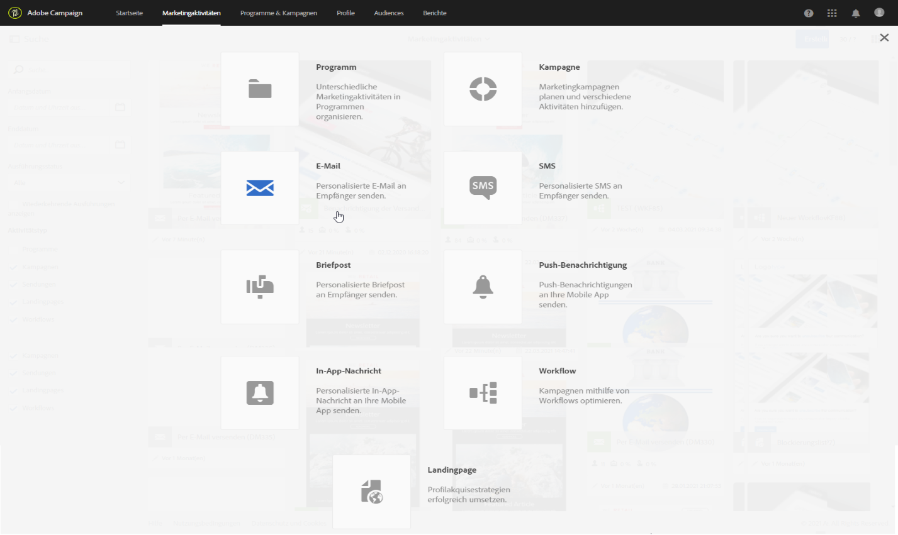
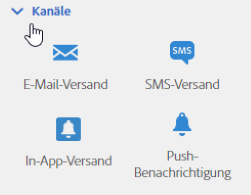
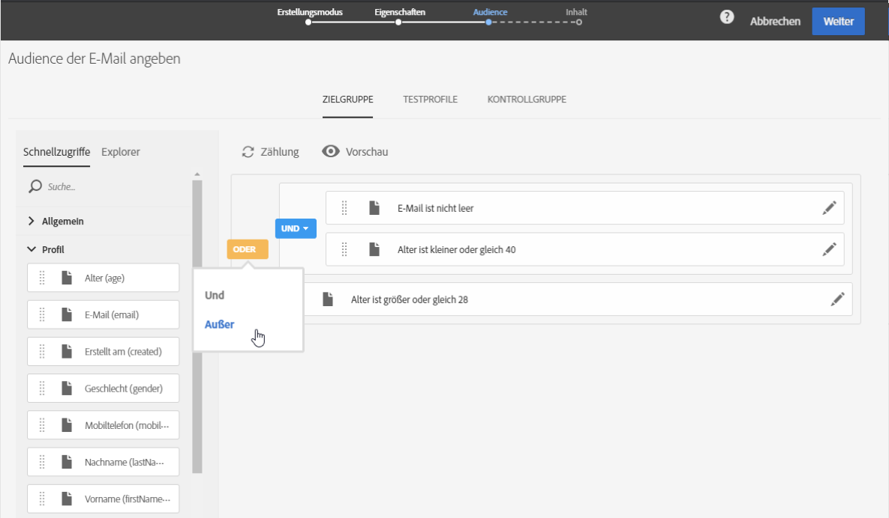
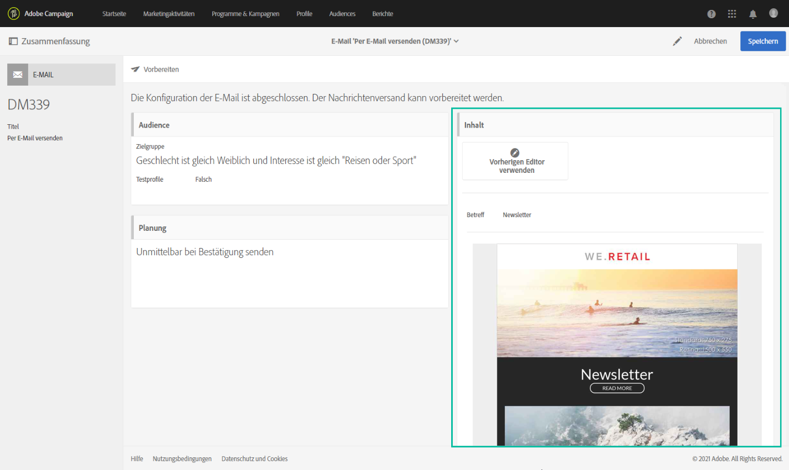
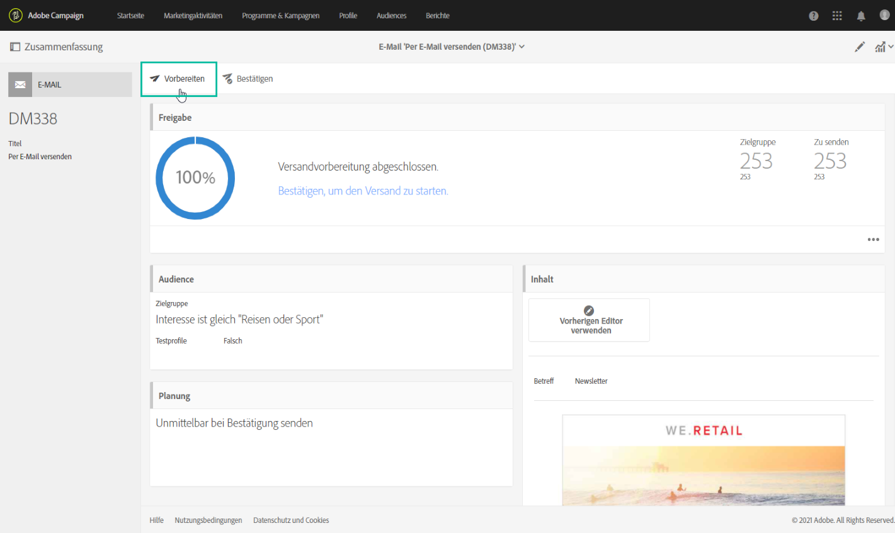
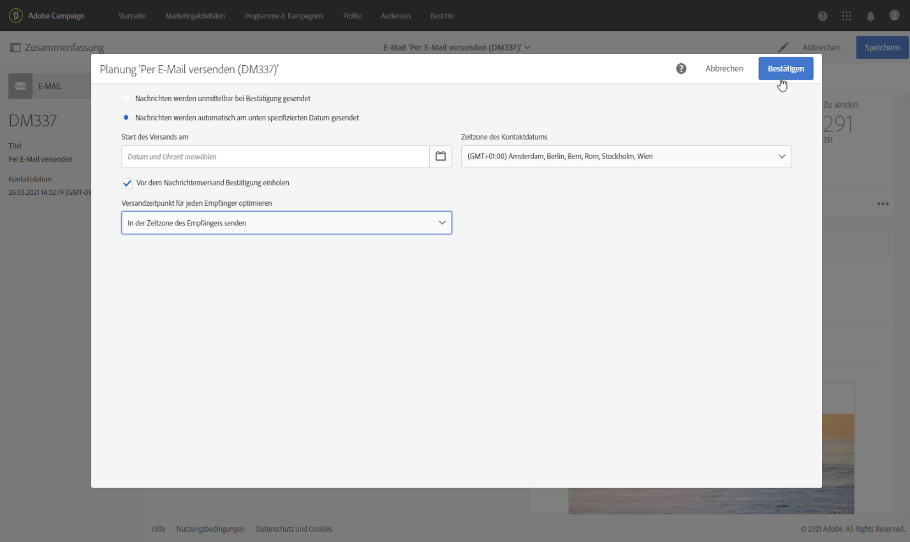
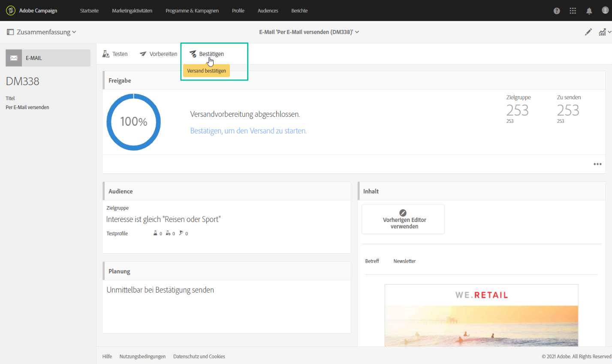
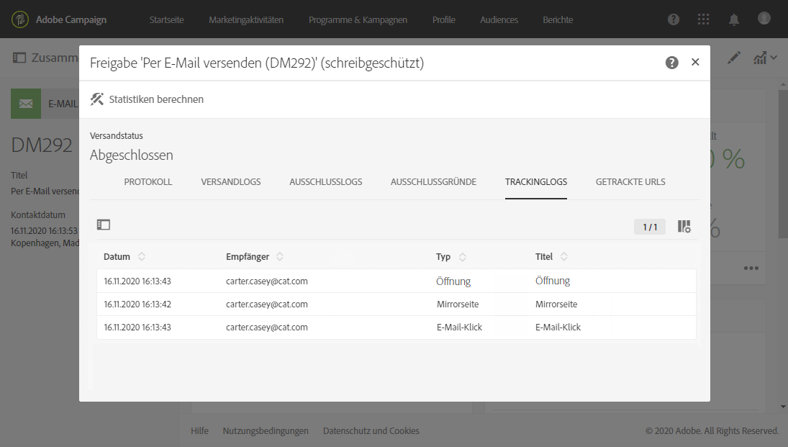
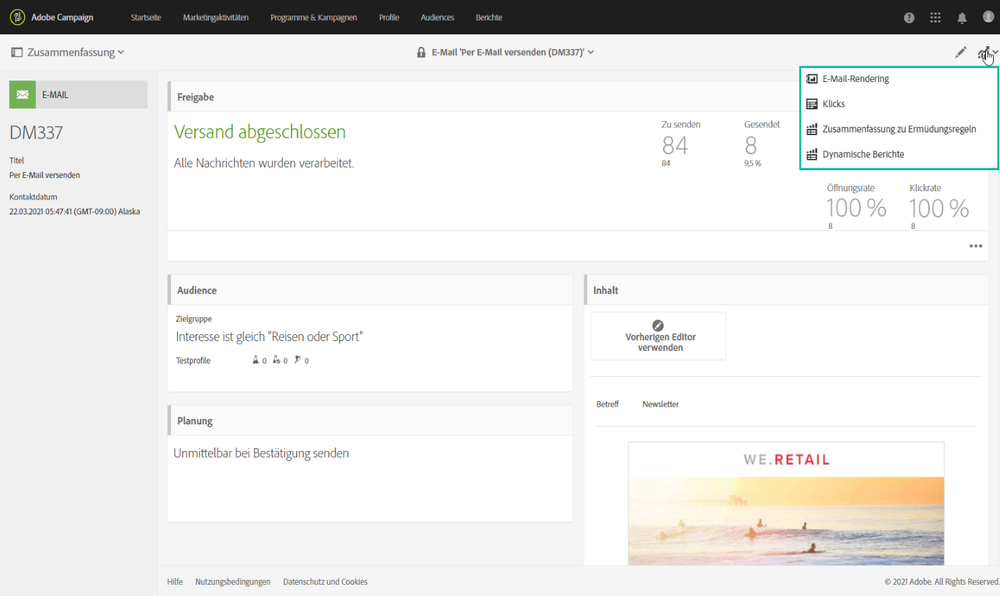

# Wichtigste Schritte im Nachrichtenversand{#key-steps-to-send-a-message}

In diesem Abschnitt erfahren Sie, wie Sie mit Adobe Campaign Standard Nachrichten personalisieren und gezielt an eine bestimmte Zielgruppe senden können.

Näheres dazu, wie Sie die einzelnen Kommunikationskanäle erstellen und konfigurieren, finden Sie in den folgenden Abschnitten:

* [E-Mails erstellen](../../channels/using/creating-an-email.md)
* [SMS erstellen](../../channels/using/creating-an-sms-message.md)
* [Briefpostversand erstellen](../../channels/using/creating-the-direct-mail.md)
* [Push-Benachrichtigung erstellen](../../channels/using/preparing-and-sending-a-push-notification.md).
* [In-App-Nachricht vorbereiten und senden](../../channels/using/preparing-and-sending-an-in-app-message.md)

Näheres über Best Practices beim Versand finden Sie in [diesem Abschnitt](../../sending/using/delivery-best-practices.md).

## Nachricht erstellen

Verwenden Sie die [Marketing-Aktivitäten](../../start/using/marketing-activities.md) in Campaign Standard, um eine E-Mail oder SMS, einen Briefpostversand, eine Push-Benachrichtigung oder eine In-App-Nachricht zu erstellen.

Nachrichten können entweder über die Liste der Marketing-Aktivitäten oder über einen Workflow mit [speziellen Aktivitäten](../../automating/using/about-channel-activities.md) erstellt werden.

## Zielgruppe definieren

Definieren Sie die Empfänger Ihrer Nachricht. Verwenden Sie dazu den [Abfrage-Editor](../../automating/using/editing-queries.md) im linken Bereich, um die in Ihrer Datenbank enthaltenen Daten zu filtern und Regeln zur Bestimmung Ihrer Zielgruppe zu erstellen.

Es stehen verschiedene Zielgruppen zur Verfügung:

* **[!UICONTROL Zielgruppe]** gibt die Hauptzielgruppe Ihrer E-Mail an,
* **[!UICONTROL Testprofile]** sind die Profile, mit denen Sie Ihre E-Mail testen und validieren können (siehe [Verwaltung von Testprofilen](../../audiences/using/managing-test-profiles.md)).

## Inhalt erstellen und personalisieren

Im Block **[!UICONTROL Inhalt]** können Sie Ihre Nachricht mithilfe von Feldern aus Ihrer Datenbank erstellen und personalisieren. Weitere Informationen zur Erstellung von Inhalten für einen bestimmten Kanal finden Sie in den Abschnitten oben auf dieser Seite.

## Vorbereiten und Testen

Die Nachricht [vorbereiten](../../sending/using/preparing-the-send.md). Im Rahmen dieses Vorgangs wird die Zielpopulation berechnet und die personalisierte Nachricht vorbereitet.

**Überprüfen und testen Sie Ihre Nachricht** anhand der Campaign Standard-Funktionen für Vorschau, E-Mail-Rendering, Testversand usw., bevor Sie sie absenden. Weiterführende Informationen hierzu finden Sie in [diesem Abschnitt](../../sending/using/previewing-messages.md).

Verwenden Sie den Block **[!UICONTROL Planung]**, um zu definieren, wann Ihre Nachrichten gesendet werden (siehe [Versandplanung](../../sending/using/about-scheduling-messages.md)).

## Senden und verfolgen

Sobald die Nachricht fertig ist, können Sie den Versand bestätigen. Im Block für die **[!UICONTROL Bereitstellung]** werden Fortschritt und Ergebnis des Versands angezeigt.

Es stehen mehrere Protokolle zur Verfügung, mit denen Sie den Versand Ihrer Nachrichten überwachen können (siehe [Versand überwachen](../../sending/using/monitoring-a-delivery.md)). Sie können außerdem mithilfe der [Tracking-Funktionen](../../sending/using/tracking-messages.md) von Campaign Standard das Verhalten der Empfänger Ihres Versands verfolgen.

Messen Sie die Effektivität Ihrer Nachrichten und die Entwicklung Ihrer Sendungen und Kampagnen anhand verschiedener Indikatoren und Diagramme (siehe [Zugriff auf Berichte](../../reporting/using/about-dynamic-reports.md)).

