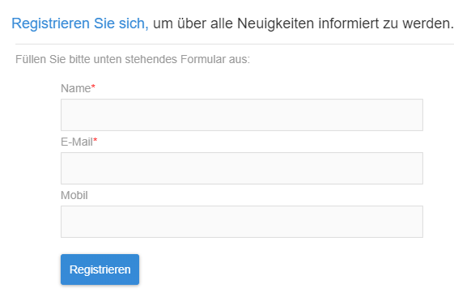

# Einschränkungen bei Landingpages{#landing-page-limitations}

**Schreiben und Aktualisieren von Daten**

* Landingpages sind auf **[!UICONTROL Profil]** und **[!UICONTROL Abonnement]**-Ressourcen beschränkt. Die Speicherung und Aktualisierung von Datensätzen ist im **[!UICONTROL Profil]** und über die Anmeldung zu/Abmeldung von einem **[!UICONTROL Dienst]** möglich.
Weiterführende Informationen zur Ressourcenkonfiguration finden Sie im Abschnitt [Datenstruktur der Ressource konfigurieren](../../developing/using/configuring-the-resource-s-data-structure.md).

>[!CAUTION]
>
>Die Ansicht oder Aktualisierung von auf einer Landingpage eingegebenen Daten ist über keine andere Ressource als **[!UICONTROL Profil]** und **[!UICONTROL Abonnement]** möglich.

**Vorausfüllen**

* Auf einer Landingpage ist keine automatische Anzeige von Daten möglich. Außerdem können keine Dienste angezeigt werden, für die Profile bereits ein Abonnement besitzen. Weiterführende Informationen zu Diensten finden Sie auf dieser [Seite](../../audiences/using/creating-a-service.md).

* Der Zugriff auf eine Landingpage mit einem vorausgefüllten Formular (Daten werden bereits mit der Seite geladen) kann ausschließlich über eine Adobe Campaign-E-Mail erfolgen. Über eine Seite einer Website ist der Zugriff auf ein derartiges Formular nicht möglich.

**Abstimmung**

* Das Abstimmungsverhalten sieht folgendermaßen aus: Sobald eine Übereinstimmung gefunden wird, endet der Abstimmungsprozess. Dies bedeutet, dass die Abstimmung nur für einen Profildatensatz durchgeführt werden kann und nicht für mehrere Datensätze, falls Duplikate vorhanden sind.

Sie möchten beispielsweise die folgende Akquise-Landingpage an Ihre Profile senden, um Ihre Campaign-Datenbank mit den Mobiltelefonnummern der Profile zu aktualisieren.

Wenn eines Ihrer Profile auf Ihrer Landingpage neue Daten eingibt, aber bereits ein dupliziertes Profil vorhanden ist, wird das passende Profil mit dem frühesten Erstellungsdatum aktualisiert, da Profile nach ihrem Erstellungsdatum priorisiert werden.

Hier wurde nur das erste Profil aktualisiert, da dessen Eintrag früher erfolgte.

**Testen der Landingpage**

* Landingpages funktionieren nur mit Profilen, nicht aber mit Testprofilen, weshalb Landingpages nicht im Zuge eines E-Mail-Testversands getestet werden können.
