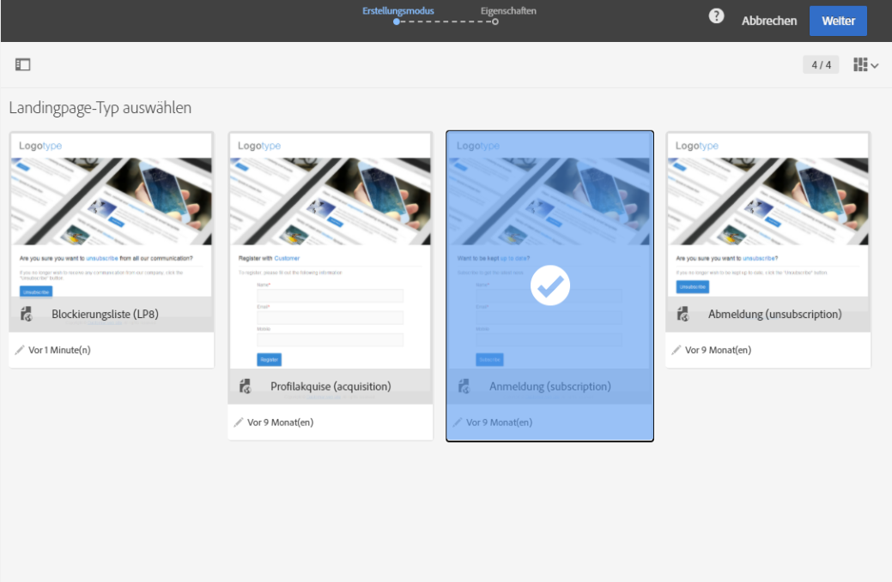

# About landing page templates {#landing-page-templates}

Campaign ist mit einer Reihe nativer Landingpage-Vorlagen ausgestattet:

* **[!UICONTROL Akquise]**: Dies ist die Standardvorlage für Landingpages, mit der Sie Daten in der Campaign-Datenbank erfassen und aktualisieren können.
* **[!UICONTROL Anmeldung]**: Mit dieser Vorlage können Sie Abonnements für einen Dienst anbieten.
* **[!UICONTROL Abmeldung]**: Mit dieser Vorlage können Sie eine Verbindung zwischen einer gesendeten E-Mail und Abonnenten eines Dienstes herstellen, sodass sich diese von diesem Dienst abmelden können.
* **[!UICONTROL Blacklist]**: Verwenden Sie diese Vorlage, wenn ein Kontakt nicht mehr von Campaign kontaktiert werden möchte. Weiterführende Informationen zum Blacklisting erfahren Sie im Abschnitt [Funktionsweise des Opt-in- und Opt-out-Verfahrens in Campaign](../../audiences/using/about-opt-in-and-opt-out-in-campaign.md).

Diese Vorlagen werden bei der Erstellung einer neuen Landingpage standardmäßig vorgeschlagen.



Um auf Landingpage-Vorlagen zuzugreifen, wählen Sie das Adobe Campaign-Logo in der linken oberen Ecke aus und danach **[!UICONTROL Ressourcen]** &gt; **[!UICONTROL Vorlagen]** &gt; **[!UICONTROL Landingpage-Vorlagen]**.

>[!NOTE]
>
>Adobe empfiehlt, eigene Vorlagen durch das Duplizieren nativer Vorlagen zu erstellen. Manche Parameter können nur in Landingpage-Vorlagen festgelegt und nicht direkt in Landingpages geändert werden.

Bei der Erstellung einer Vorlage wird empfohlen, den Tags ein **'type'**-Attribut beizufügen. Die Interpretation dieser Information durch den Editor hilft dem Benutzer bei der Zuordnung von Datenbankfeldern zu Formularfeldern bei der Konfiguration von Webanwendungen.

Beispiel eines HTML-Codes in einer Vorlage:

```
<input id="email" type="email" name="email"/>
```

Eine offizielle Liste aller möglichen 'type'-Attribute ist unter folgender Adresse abrufbar: [http://www.w3schools.com/tags/att_input_type.asp](http://www.w3schools.com/tags/att_input_type.asp).