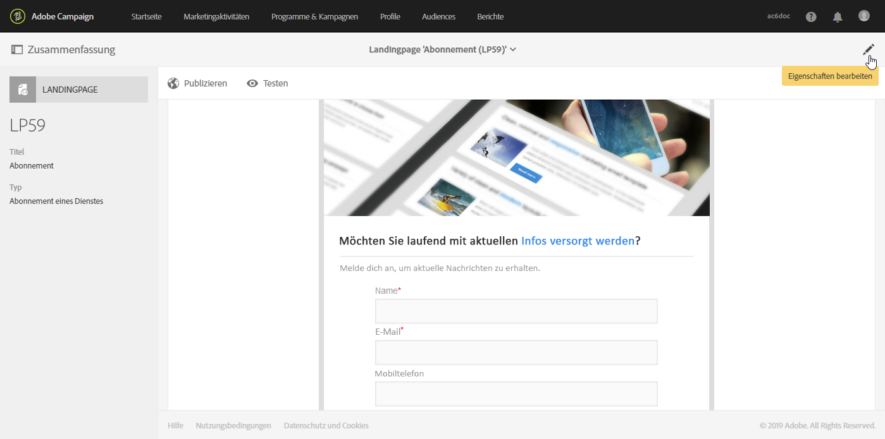
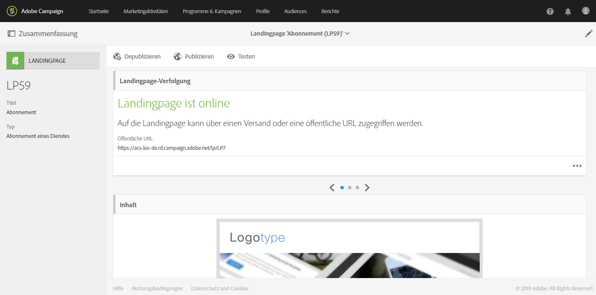

# Wichtigste Schritte zum Einrichten einer Landingpage {#main-steps-create-a-landing-page}

## Erstellen von Einstiegsseiten

Die wichtigsten Schritte beim Einrichten der Einstiegsseiten sind:

Auf dieser Seite finden Sie Informationen zu den einzelnen Schritten sowie Hinweise zu den dedizierten Dokumentationen für weitere Details.

## Konfigurieren der Einstiegsseitenvorlage {#configure-the-landing-page-template}

Bevor Sie eine Einstiegsseite einrichten, müssen Sie zunächst eine Einstiegsseitenvorlage konfigurieren, die Ihren Anforderungen entspricht. Sobald die Vorlage fertig ist, werden alle darauf basierenden Einstiegsseiten mit den gewünschten Parametern vorkonfiguriert.

1. From the advanced menu, via the Adobe Campaign logo, select **[!UICONTROL Resources]** / **[!UICONTROL Templates]** / **[!UICONTROL Landing page templates]**, then duplicate the template that you want to use.
1. Geben Sie in den Vorlageneigenschaften alle Parameter an, die Ihre Einstiegsseiten gemeinsam haben müssen. Beispiel: die Targeting-Dimension, die Seitenzugriffsparameter für identifizierte oder nicht identifizierte Besucher, Aktionen, die spezifisch für die Formularüberprüfung durch einen Besucher sind, die im Inhalt zu verwendende Marke/das Logo usw.
1. Speichern Sie Ihre Änderungen.

Weitere Informationen zu Einstiegsseitenvorlagen finden Sie in [diesem Abschnitt](../../channels/using/about-landing-pages.md).

##  Landingpage erstellen und konfigurieren {#create-and-configure-the-landing-page}

Erstellen Sie ausgehend von der im vorangehenden Schritt definierten Vorlage eine neue Landingpage innerhalb des Programms oder der Kampagne Ihrer Wahl.

1. Erstellen Sie die Einstiegsseite basierend auf der gewünschten Vorlage.
1. Geben Sie die allgemeinen Parameter der Einstiegsseite ein (Bezeichnung, Beschreibung usw.).
1. Anschließend greifen Sie auf das Dashboard der Einstiegsseite zu. Bearbeiten Sie bei Bedarf die Eigenschaften der Einstiegsseite. Standardmäßig sind die Eigenschaften in der Vorlage der Einstiegsseite konfiguriert.
Aus Sicherheitsgründen und aus Plattformleistungen empfehlen wir dringend, ein Ablaufdatum in den Eigenschaften der Einstiegsseite festzulegen. Nach Abschluss des Vorgangs wird die Veröffentlichung der Einstiegsseite am ausgewählten Datum automatisch rückgängig gemacht. For more on validity parameters, refer to [this section](../../channels/using/sharing-a-landing-page.md#setting-up-validity-parameters).

   

   >[!NOTE]
   >
   >Sollten Sie Änderungen vornehmen, gelten diese nur für die in Bearbeitung befindliche Landingpage. Wenn Sie die Änderungen auf andere Landingpages anwenden möchten, können Sie sie in einer dedizierten Vorlage vornehmen und von dieser Vorlage ausgehend andere Landingpages erstellen.

## Entwerfen der Einstiegsseite {#design-the-landing-page}

Sie können jetzt den Inhalt der Einstiegsseite definieren. Standardmäßig enthält die Einstiegsseite drei Seiten, auf die über einen Bildlaufpfeil zugegriffen werden kann: die Hauptseite des Inhalts, eine Bestätigungsseite und eine Fehlerseite.

Auf jeder Seite werden standardmäßig mehrere Felder konfiguriert. Bei Bedarf können Sie deren Eigenschaften und Zuordnung bearbeiten.

Sie können auch konfigurieren, wie sich die Bestätigungsschaltfläche verhält, sobald ein Profil darauf klickt, und den Inhalt entsprechend Ihren Anforderungen (Bild, Personalisierungsfelder usw.) personalisieren. Sie können beispielsweise den Vornamen eines Profils auf der Bestätigungsseite der Einstiegsseite einfügen, um ihnen für die Registrierung zu danken.

Weitere Informationen zum Entwurf der Einstiegsseite finden Sie in [diesem Abschnitt](../../channels/using/designing-a-landing-page.md).

## Einstiegsseite testen {#test-the-landing-page}

Sobald die Einstiegsseite definiert ist, können Sie simulieren, wie sie ausgeführt wird, und sich verhalten, wenn sie online verfügbar ist.

>[!CAUTION]
>
>Die Einstiegsseitentests können nur mit Profilen und nicht mit Testprofilen durchgeführt werden. Wenn das Formular gesendet wird, werden die Daten des ausgewählten Profils auf "real"aktualisiert. Um echte Profile nicht zu ändern, verwenden Sie ein gefälschtes Kundenprofil.

Wenn Sie mit dem Verhalten der Einstiegsseite zufrieden sind, können Sie sie veröffentlichen, um sie online verfügbar zu machen.

Weitere Informationen zum Testen einer Einstiegsseite finden Sie in [diesem Abschnitt](../../channels/using/sharing-a-landing-page.md#testing-the-landing-page-).

## Veröffentlichen der Einstiegsseite {#publish-the-landing-page}

Sobald die Tests erfolgreich abgeschlossen sind, können Sie die Einstiegsseite über die Schaltfläche " **[!UICONTROL Veröffentlichen]** "in der Aktionsleiste im Dashboard veröffentlichen. Ein Überwachungsblock zeigt den Fortschritt und den Status der Veröffentlichung an.

Durch die Publikation der Landingpage wird diese online verfügbar. Nach ihrer Publikation lässt sich die Landingpage weiterhin aktualisieren: Hierzu müssen Sie sie nach jeder Änderung erneut publizieren. Sie können die Veröffentlichung einer Einstiegsseite jederzeit rückgängig machen, damit sie nicht mehr verfügbar ist.

Nach der Publikation ist Ihre Landingpage zur Nutzung bereit. Sie können nun verschiedene Zugriffsmechanismen definieren, um entweder neue Profile für Ihre Datenbank oder zusätzliche Informationen zu bereits existierenden Profilen hinzuzugewinnen.

Weitere Informationen zur Veröffentlichung der Einstiegsseite finden Sie in [diesem Abschnitt](../../channels/using/sharing-a-landing-page.md#publishing-a-landing-page).
