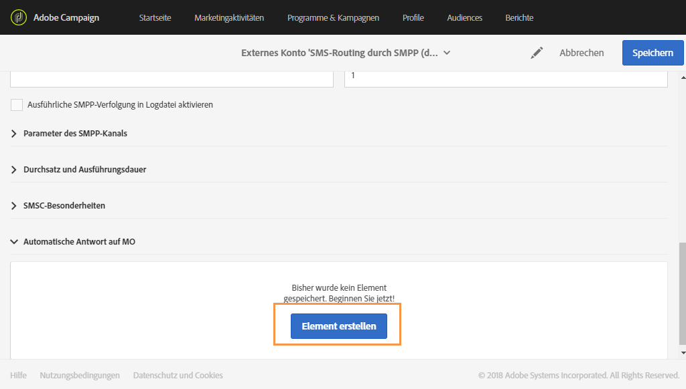
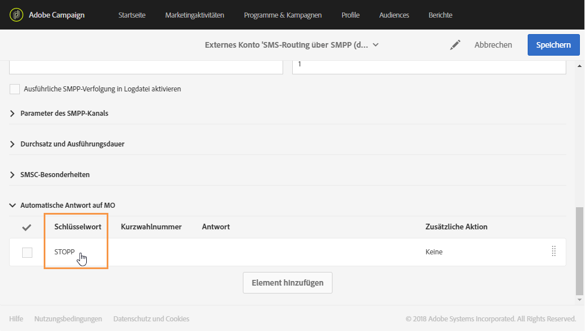
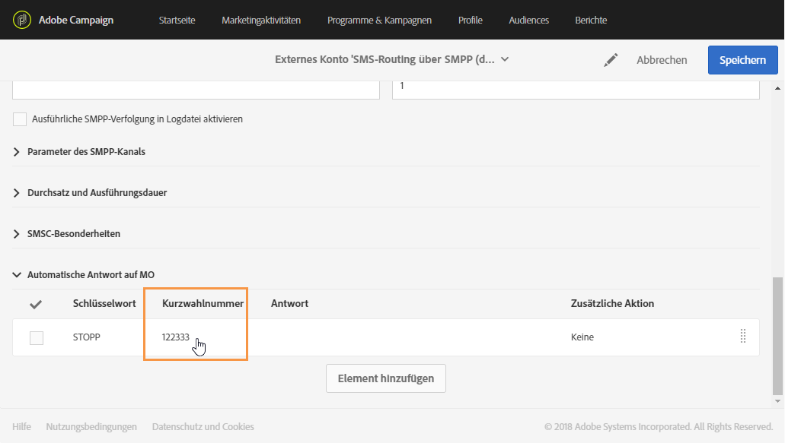
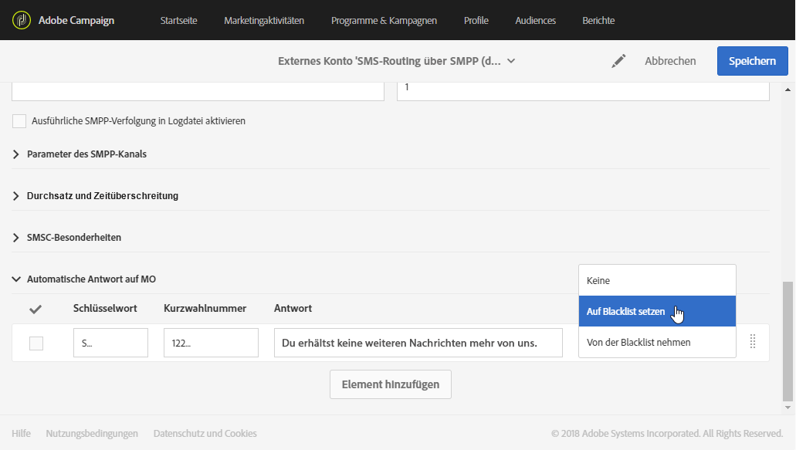
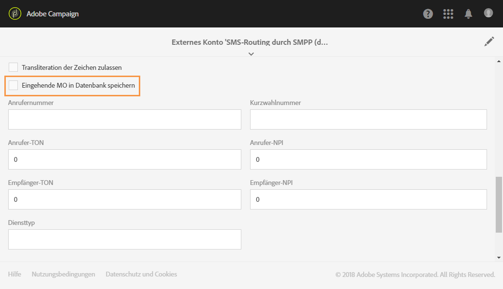
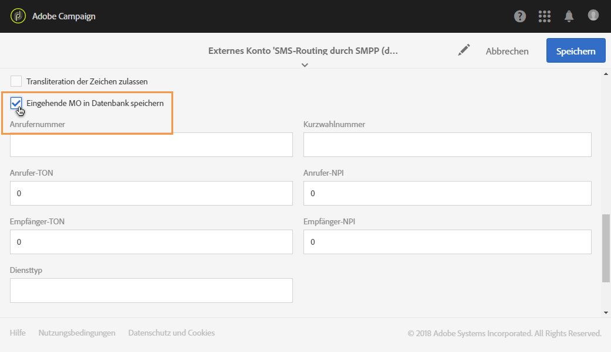
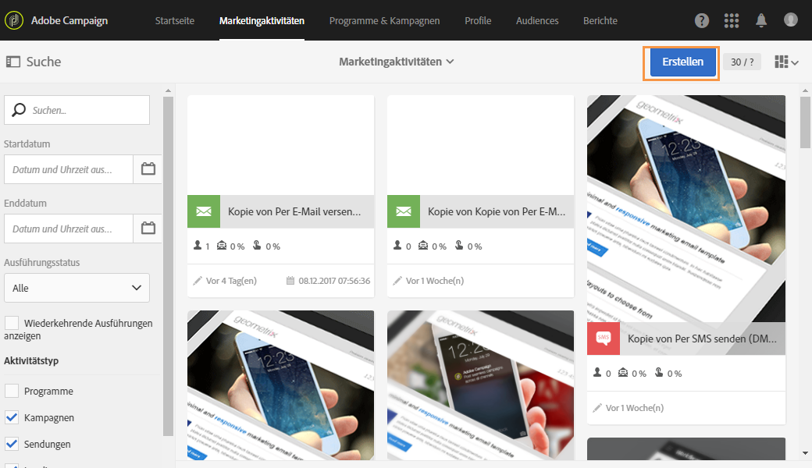
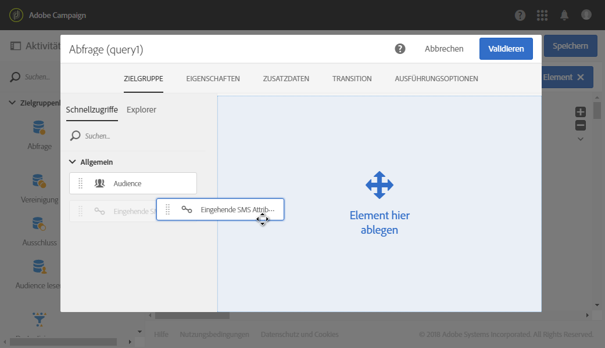
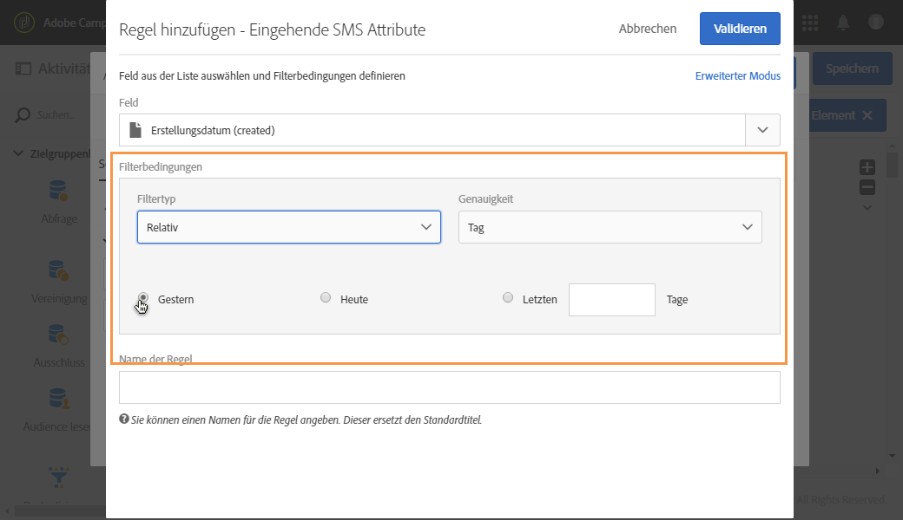

# Eingehende SMS verwalten{#managing-incoming-sms}

## STOP-SMS verwalten {#managing-stop-sms}

Sie können einem Profil, das auf eine per Campaign gesendete SMS-Nachricht antwortet, eine automatische Nachricht sowie die auszuführende Aktion zurücksenden.

Diese Konfiguration wird im Bereich **[!UICONTROL Automatische Antwort auf MO]** des [externen SMS-Routing-Kontos](../../administration/using/configuring-sms-channel.md#defining-an-sms-routing) definiert. MO steht für 'Mobile Originated', was bedeutet, dass Sie für das Mobilgerät, von dem die SMS gesendet wurde, eine automatische Antwort konfigurieren können.

Gehen Sie dabei folgendermaßen vor:

1. Greifen Sie mithilfe des Adobe-Campaign-Logos oben links im Bildschirm und der Schaltflächen **[!UICONTROL Administration &gt; Anwendungskonfiguration &gt; externe Konten]** und dann über das externe Konto **SMS-Routing durch SMPP]auf das entsprechende Menü zu.[!UICONTROL **
1. Klicken Sie unter der Kategorie **[!UICONTROL Automatische Antwort auf MO]** auf **Element erstellen], um Ihre automatische Antwort zu konfigurieren.[!UICONTROL **

   

1. Wählen Sie das Schlüsselwort aus, das diese automatische Antwort auslöst. Bei den Schlüsselwörtern kann die Groß-/Kleinschreibung ignoriert werden. Wenn beispielsweise in unserem Beispiel die Empfänger das Schlüsselwort "STOP" senden, erhalten sie die automatische Antwort.

   Lassen Sie diese Spalte leer, wenn Sie unabhängig vom Schlüsselwort dieselbe Antwort senden möchten.

   

1. Spezifizieren Sie im Feld **[!UICONTROL Kurzwahlnummer]die Nummer, die normalerweise für den Versand von Nachrichten verwendet wird. Sie dient als Absendername.** Sie können die Spalte **[!UICONTROL Kurzwahlnummer]leer lassen, wenn Sie unabhängig von der Kurzwahlnummer dieselbe Antwort senden möchten.**

   

1. Type in the answer you want to send to your recipients in the field **[!UICONTROL Reply]**.

   Lassen Sie die Spalte **[!UICONTROL Antworten]leer, wenn nur eine Aktion ausgeführt, aber keine Antwort gesendet werden soll.** Dies ermöglicht beispielsweise das Entfernen einer Telefonnummer eines Benutzers aus der Quarantäne, wenn er ein anderes Schlüsselwort als "STOP" sendet.

   

1. Im Feld **[!UICONTROL Zusätzliche Aktion]kann Ihrer automatischen Antwort eine Aktion zugeordnet werden:**

   * Mit der Aktion **[!UICONTROL Unter Quarantäne stellen]wird die Telefonnummer des Profils automatisch unter Quarantäne gestellt.**
   * Mit der Aktion **[!UICONTROL Aus Quarantäne holen]wird die Telefonnummer des Profils aus der Quarantäne entlassen.**
   * Mit der Aktion **[!UICONTROL Keine]wird Ihre Nachricht ohne Aktion an die Empfänger gesendet.**
   Wenn Empfänger beispielsweise in der folgenden Konfiguration das Schlüsselwort "STOP" senden, erhalten sie eine Abmeldebestätigung und ihre Telefonnummer wird mit dem Status **[!UICONTROL Blacklist]unter Quarantäne gestellt.** Der Status bezieht sich ausschließlich auf die Telefonnummer, und das Profil wird nicht auf die Blacklist gesetzt, sodass der Empfänger nach wie vor E-Mail-Nachrichten erhält.

   

Mit dieser automatischen Antwort werden Ihre Empfänger automatisch vom Erhalt Ihrer Nachrichten abgemeldet und unter Quarantäne gestellt. The quarantined recipients are listed in the **[!UICONTROL Addresses]** table available through the **[!UICONTROL Administration]** &gt; **[!UICONTROL Channels]** &gt; **[!UICONTROL Quarantines]** menu. Weiterführende Informationen zu Quarantänen finden Sie in diesem [Abschnitt](../../sending/using/understanding-quarantine-management.md).

Diese eingehenden SMS-Nachrichten können bei Bedarf gespeichert werden. Weiterführende Informationen dazu finden Sie in diesem [Abschnitt](../../channels/using/managing-incoming-sms.md#storing-incoming-sms).

## Eingehende SMS speichern {#storing-incoming-sms}

Im externen Konto **[!UICONTROL SMS-Routing durch SMPP]können Sie eingehende Nachrichten speichern, wenn beispielsweise ein Abonnent mit "STOP" auf eine SMS-Nachricht antwortet, um von Ihren Empfängerlisten gelöscht zu werden.**

Durch Aktivierung der Option **[!UICONTROL Eingehende MO in Datenbank speichern]** in der Kategorie **Parameter des SMPP-Kanals]werden alle SMS-Nachrichten in der inSMS-Tabelle gespeichert und können über eine Abfrage-Aktivität in einem Workflow abgerufen werden.[!UICONTROL **

Gehen Sie dabei folgendermaßen vor:

1. Aktivieren Sie im Feld **[!UICONTROL Parameter des SMPP-Kanals]** die Option **[!UICONTROL Eingehende MO in Datenbank speichern]**.

   

1. In the **[!UICONTROL Marketing activities]** tab, click **[!UICONTROL Create]** then select **[!UICONTROL Workflow]**.

   

1. Wählen Sie den gewünschten Workflow-Typ aus.
1. Bearbeiten Sie die Eigenschaften Ihres Workflows und wählen Sie **[!UICONTROL Erstellen aus]**. Weiterführende Informationen zur Workflow-Erstellung finden Sie in diesem [Abschnitt](../../automating/using/building-a-workflow.md).
1. Ziehen Sie eine **[!UICONTROL Abfrage]-Aktivität in den Arbeitsbereich und wählen Sie die Aktivität durch einen Doppelklick aus.**
1. Wählen Sie im Tab **[!UICONTROL Eigenschaften]** der Abfrage im Feld **[!UICONTROL Ressource]die Option** Eingehende SMS (inSMS)] aus.**[!UICONTROL **

   

1. Ziehen Sie danach im Tab **[!UICONTROL Zielgruppe]** die Regel **Eingehende SMS Attribute]in den Arbeitsbereich.[!UICONTROL **

   

1. Hier möchten wir alle eingehenden Nachrichten vom Vortag in die Zielgruppe einbeziehen. In the **[!UICONTROL Field]** category, select **[!UICONTROL Creation date (created)]**.
1. In **[!UICONTROL Filter type]**, select **[!UICONTROL Relative]** then in **[!UICONTROL Level of precision]**, choose **[!UICONTROL Day]**.

   

1. Danach haben Sie die Möglichkeit auszuwählen, ob Daten vom aktuellen Tag, vom Vortag oder von den letzten Tagen abgerufen werden sollen. Klicken Sie auf **[!UICONTROL Bestätigen], wenn Ihre Abfrage fertig konfiguriert ist.**

Mit dieser Abfrage werden alle empfangenen STOP-Nachrichten im ausgewählten Zeitrahmen abgerufen.

Diese Aktivität ermöglicht es Ihnen beispielsweise, eine Population zu erstellen und Ihre Sendungen besser zu personalisieren.
