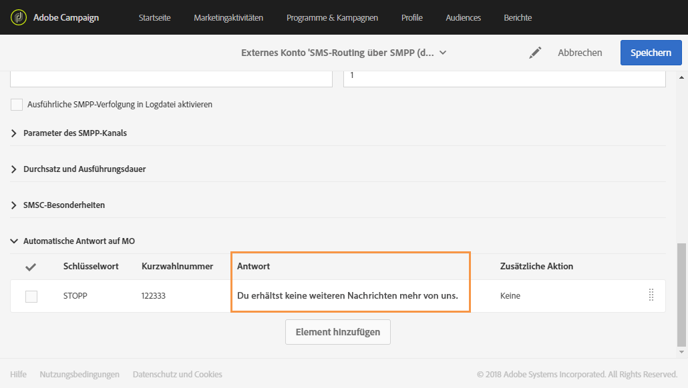
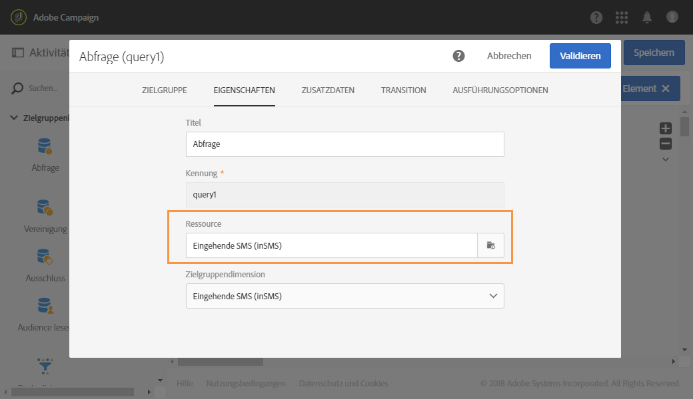

# Eingehende SMS verwalten{#managing-incoming-sms}

## STOP-SMS verwalten {#managing-stop-sms}

Sie können einem Profil, das auf eine per Campaign gesendete SMS-Nachricht antwortet, eine automatische Nachricht sowie die auszuführende Aktion zurücksenden.

Diese Konfiguration wird im Bereich **[!UICONTROL Automatische Antwort auf MO]** des [externen SMS-Routing-Kontos](../../administration/using/configuring-sms-channel.md#defining-an-sms-routing) definiert. MO steht für &#39;Mobile Originated&#39;, was bedeutet, dass Sie für das Mobilgerät, von dem die SMS gesendet wurde, eine automatische Antwort konfigurieren können.

Gehen Sie dabei folgendermaßen vor:

1. Greifen Sie mithilfe des Adobe-Campaign-Logos oben links im Bildschirm und der Schaltflächen **[!UICONTROL Administration > Anwendungskonfiguration > externe Konten]** und dann über das externe Konto **[!UICONTROL SMS-Routing durch SMPP]** auf das entsprechende Menü zu.
1. Klicken Sie unter der Kategorie **[!UICONTROL Automatische Antwort auf MO]** auf **[!UICONTROL Element erstellen]**, um Ihre automatische Antwort zu konfigurieren.

   

1. Wählen Sie das Schlüsselwort aus, das diese automatische Antwort auslöst. Bei den Schlüsselwörtern kann die Groß-/Kleinschreibung ignoriert werden. Wenn beispielsweise in unserem Beispiel die Empfänger das Schlüsselwort &quot;STOP&quot; senden, erhalten sie die automatische Antwort.

   Lassen Sie diese Spalte leer, wenn Sie unabhängig vom Schlüsselwort dieselbe Antwort senden möchten.

   

1. Spezifizieren Sie im Feld **[!UICONTROL Kurzwahlnummer]** die Nummer, die normalerweise für den Versand von Nachrichten verwendet wird. Sie dient als Absendername. Sie können die Spalte **[!UICONTROL Kurzwahlnummer]** leer lassen, wenn Sie unabhängig von der Kurzwahlnummer dieselbe Antwort senden möchten.

   

1. Geben Sie im Feld **[!UICONTROL Antworten]** die Antwort ein, die Sie Ihren Empfängern senden möchten.

   Lassen Sie die Spalte **[!UICONTROL Antworten]** leer, wenn nur eine Aktion ausgeführt, aber keine Antwort gesendet werden soll. Dies ermöglicht beispielsweise das Entfernen einer Telefonnummer eines Benutzers aus der Quarantäne, wenn er ein anderes Schlüsselwort als &quot;STOPP&quot; sendet.

   

1. Im Feld **[!UICONTROL Zusätzliche Aktion]** kann Ihrer automatischen Antwort eine Aktion zugeordnet werden:

   * Mit der Aktion **[!UICONTROL Unter Quarantäne stellen]** wird die Telefonnummer des Profils automatisch unter Quarantäne gestellt.
   * Mit der Aktion **[!UICONTROL Aus Quarantäne holen]** wird die Telefonnummer des Profils aus der Quarantäne entlassen.
   * Mit der Aktion **[!UICONTROL Keine]** wird Ihre Nachricht ohne Aktion an die Empfänger gesendet.

   Wenn Empfänger beispielsweise in der folgenden Konfiguration das Schlüsselwort &quot;STOPP&quot; senden, erhalten sie eine Abmeldebestätigung und ihre Telefonnummer wird mit dem Status **[!UICONTROL Auf Blockierungsliste]** unter Quarantäne gestellt. Der Status bezieht sich ausschließlich auf die Telefonnummer. Das Profil wird nicht auf die Blockierungsliste gesetzt, sodass der Empfänger nach wie vor E-Mail-Nachrichten erhält.

   

Mit dieser automatischen Antwort werden Ihre Empfänger automatisch vom Erhalt Ihrer Nachrichten abgemeldet und unter Quarantäne gestellt. Die unter Quarantäne gestellten Empfänger sind in der Tabelle **[!UICONTROL Adressen]** aufgeführt, die über das Menü **[!UICONTROL Administration]** > **[!UICONTROL Kanäle]** > **[!UICONTROL Quarantänen]** abrufbar ist. Weiterführende Informationen zu Quarantänen finden Sie in diesem [Abschnitt](../../sending/using/understanding-quarantine-management.md).

Diese eingehenden SMS-Nachrichten können bei Bedarf gespeichert werden. Weiterführende Informationen dazu finden Sie in diesem [Abschnitt](#storing-incoming-sms).

## Eingehende SMS speichern   {#storing-incoming-sms}

Im externen Konto **[!UICONTROL SMS-Routing durch SMPP]** können Sie eingehende Nachrichten speichern, wenn beispielsweise ein Abonnent mit &quot;STOPP&quot; auf eine SMS-Nachricht antwortet, um von Ihren Empfängerlisten gelöscht zu werden.

Durch Aktivierung der Option **[!UICONTROL Eingehende MO in Datenbank speichern]** in der Kategorie **[!UICONTROL Parameter des SMPP-Kanals]** werden alle SMS-Nachrichten in der inSMS-Tabelle gespeichert und können über eine Abfrage-Aktivität in einem Workflow abgerufen werden.

Gehen Sie dabei folgendermaßen vor:

1. Aktivieren Sie im Feld **[!UICONTROL Parameter des SMPP-Kanals]** die Option **[!UICONTROL Eingehende MO in Datenbank speichern]**.

   

1. Wählen Sie im Tab **[!UICONTROL Marketingaktivitäten]** die Option **[!UICONTROL Erstellen]** und dann **[!UICONTROL Workflow]**.

   

1. Wählen Sie den gewünschten Workflow-Typ aus.
1. Bearbeiten Sie die Eigenschaften Ihres Workflows und wählen Sie **[!UICONTROL Erstellen aus]**. Weiterführende Informationen zur Workflow-Erstellung finden Sie in diesem [Abschnitt](../../automating/using/building-a-workflow.md).
1. Ziehen Sie eine **[!UICONTROL Abfrage]**-Aktivität in den Arbeitsbereich und wählen Sie die Aktivität durch einen Doppelklick aus.
1. Wählen Sie im Tab **[!UICONTROL Eigenschaften]** der Abfrage im Feld **[!UICONTROL Ressource]** die Option **[!UICONTROL Eingehende SMS (inSMS)]** aus.

   

1. Ziehen Sie danach im Tab **[!UICONTROL Zielgruppe]** die Regel **[!UICONTROL Eingehende SMS Attribute]** in den Arbeitsbereich.

   

1. Hier möchten wir alle eingehenden Nachrichten vom Vortag in die Zielgruppe einbeziehen. Wählen Sie in der Kategorie **[!UICONTROL Feld]** die Option **[!UICONTROL Erstellungsdatum (created)]** aus.
1. Wählen Sie in **[!UICONTROL Filtertyp]** die Option **[!UICONTROL Relativ]** und danach in **[!UICONTROL Präzisionsniveau]** die Option **[!UICONTROL Tag]** aus.

   

1. Danach haben Sie die Möglichkeit auszuwählen, ob Daten vom aktuellen Tag, vom Vortag oder von den letzten Tagen abgerufen werden sollen. Klicken Sie auf **[!UICONTROL Bestätigen]**, wenn Ihre Abfrage fertig konfiguriert ist.

Mit dieser Abfrage werden alle empfangenen STOP-Nachrichten im ausgewählten Zeitrahmen abgerufen.

Diese Aktivität ermöglicht es Ihnen beispielsweise, eine Population zu erstellen und Ihre Sendungen besser zu personalisieren.
