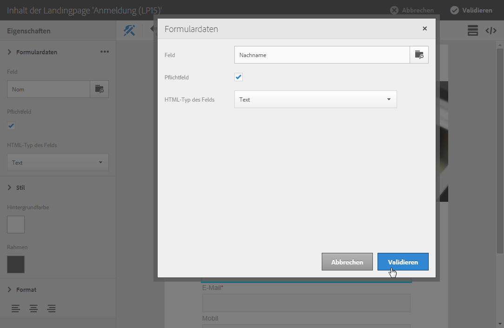
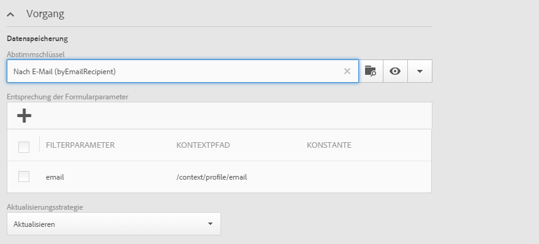

# Landingpage-Formulardaten verwalten{#managing-landing-page-form-data}

## Landingpage über die Dateneigenschaften ändern{#changing-a-landing-page-form-data-properties}

Inhaltsblöcken wie beispielsweise Eingabefeldern, Radiobuttons oder Checkboxes können Datenbankfelder zugeordnet werden. To do this, select the block and enter the **[!UICONTROL Form data]** in the palette.

* Wählen Sie aus der Dropdown-Liste **Feld** das Datenbankfeld aus, das dem Formularfeld zugeordnet werden soll.
* Wenn die Option **Pflichtfeld** aktiviert ist, kann der Nutzer das Formular nicht absenden, ohne dieses Feld ausgefüllt zu haben. In diesem Fall wird eine Fehlermeldung angezeigt.

## Mapping der Formularfelder  {#mapping-form-fields}

Über Eingabefelder können Daten in der Campaign-Datenbank gespeichert bzw. dort aktualisiert werden. Dazu müssen Sie Blöcken wie Eingabe- oder Auswahlfeldern Datenbankfelder zuordnen. Gehen Sie wie folgt vor:

1. Wählen Sie in der Landingpage einen Block aus.
1. Füllen Sie den **[!UICONTROL Form data]** Teil in der Palette aus.

   

1. Choose a database field to link with the form field in the **[!UICONTROL Field]** selection zone. Landingpages können nur mit **Profilen** gemappt werden.

1. Aktivieren Sie bei Bedarf die **[!UICONTROL Mandatory]** Option. Die Seite kann nur gesendet werden, wenn der Benutzer dieses Feld ausgefüllt hat. Wenn ein Pflichtfeld nicht ausgefüllt wurde, erscheint eine Fehlermeldung bei der Validierung der Seite.

1. Definieren Sie den Feldtyp, indem Sie z. B. **[!UICONTROL Text]** die Option **[!UICONTROL Number]** oder **[!UICONTROL Date]** den **[!UICONTROL HTML type of the field]** Auswahlbereich auswählen.
Wenn Sie eine obligatorische Option auswählen, **[!UICONTROL Checkbox]** stellen Sie sicher, dass sie vom **[!UICONTROL Field]** Typ ist.

>[!NOTE]
>
>Die Standardfelder der nativen Landingpages sind bereits ausgefüllt. Sie können sie nach Bedarf ändern.

## Datenspeicherung und -abstimmung{#data-storage-and-reconciliation}

In den Abstimmparametern wird definiert, wie mit den von Besuchern in der Landingpage gemachten Angaben verfahren werden soll.

Gehen Sie wie folgt vor:

1. Edit the landing page properties accessed via the  icon in the landing page dashboard, and display the **[!UICONTROL Job]** parameters.

   

1. Select the **[!UICONTROL Reconciliation key]**: these database fields (for example: email, first name, last name) are used to determine whether the visitor has a profile that is already known in the Adobe Campaign database. Dies erlaubt je nach gewählter Aktualisierungsstrategie, das existierende Profil zu aktualisieren oder ein neues zu erstellen.
1. Define the **[!UICONTROL Form parameter mapping]**: this section allows you to map the landing page field parameters and those used in the reconciliation key.
1. Select the **[!UICONTROL Update strategy]**: if the reconciliation key recovers an existing database profile, you can choose for this profile to be updated with the data entered in the form or instead prevent this update.
