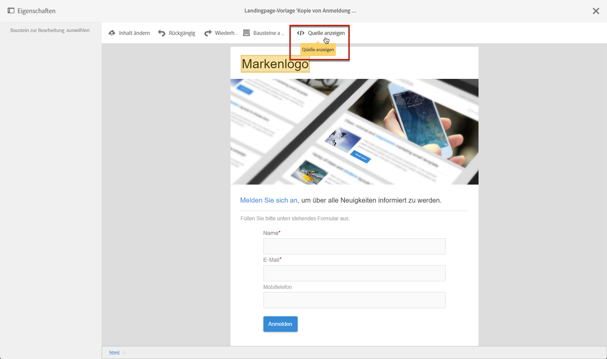
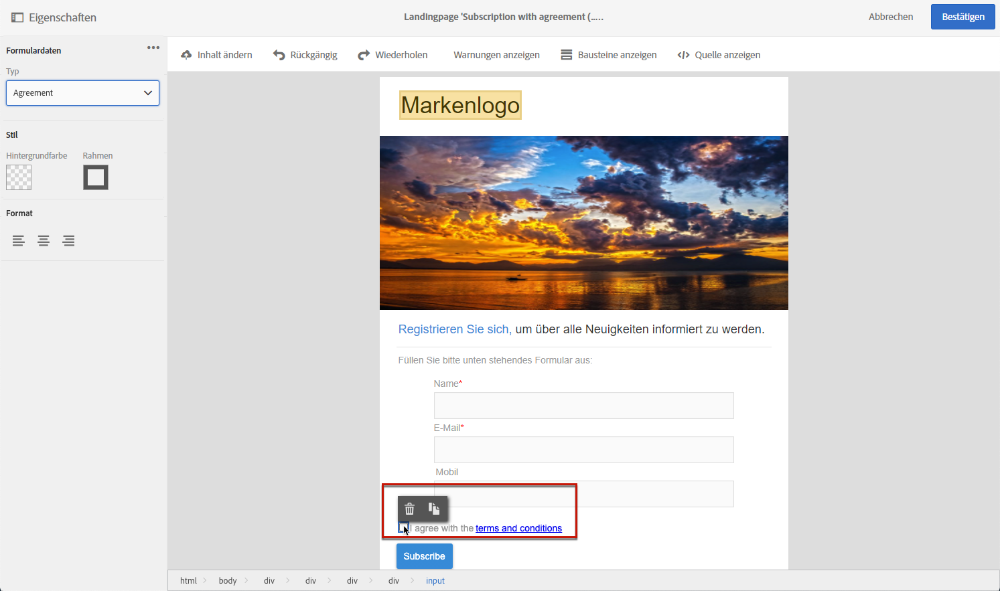

# Landingpage-Formulardaten verwalten{#managing-landing-page-form-data}

## Landingpage über die Dateneigenschaften ändern{#changing-a-landing-page-form-data-properties}

Inhaltsblöcken wie beispielsweise Eingabefeldern, Radiobuttons oder Checkboxes können Datenbankfelder zugeordnet werden. Markieren Sie dazu den Block und greifen Sie in der Palette auf **[!UICONTROL Formulardaten]** zu.

* Wählen Sie aus der Dropdown-Liste **Feld** das Datenbankfeld aus, das dem Formularfeld zugeordnet werden soll.
* Wenn die Option **Pflichtfeld** aktiviert ist, kann der Nutzer das Formular nicht absenden, ohne dieses Feld ausgefüllt zu haben. In diesem Fall wird eine Fehlermeldung angezeigt.

## Mapping der Formularfelder       {#mapping-form-fields}

Über Eingabefelder können Daten in der Campaign-Datenbank gespeichert bzw. dort aktualisiert werden. Dazu müssen Sie Blöcken wie Eingabe- oder Auswahlfeldern Datenbankfelder zuordnen. Gehen Sie wie folgt vor:

1. Wählen Sie in der Landingpage einen Block aus.
1. Füllen Sie in der Palette die **[!UICONTROL Formulardaten]** aus.

   

1. Geben Sie bei **[!UICONTROL Feld]** das Datenbankfeld an, das dem Formularfeld zugeordnet werden soll. Landingpages können nur mit **Profilen** gemappt werden.

1. Aktivieren Sie bei Bedarf die Option **[!UICONTROL Pflichtfeld]**. Die Seite kann nur gesendet werden, wenn der Anwender dieses Feld ausgefüllt hat. Wenn ein Pflichtfeld nicht ausgefüllt wurde, erscheint eine Fehlermeldung bei der Validierung der Seite.

1. Im Feld **[!UICONTROL HTML-Typ des Felds]** können Sie darüber hinaus angeben, ob es sich beispielsweise um **[!UICONTROL Text]** **[!UICONTROL Zahl]** oder **[!UICONTROL Datum]** handelt.
Wenn Sie eine obligatorische **[!UICONTROL Checkbox]** auswählen, stellen Sie sicher, dass sie vom Typ **[!UICONTROL Feld]** ist.

>[!NOTE]
>
>Die Standardfelder der nativen Landingpages sind bereits ausgefüllt. Sie können sie nach Bedarf ändern.

## Datenspeicherung und -abstimmung{#data-storage-and-reconciliation}

In den Abstimmparametern wird definiert, wie mit den von Besuchern in der Landingpage gemachten Angaben verfahren werden soll.

Gehen Sie wie folgt vor:

1. Bearbeiten Sie die Landingpage-Eigenschaften über das Symbol  im Landingpage-Dashboard und rufen Sie die Parameter **[!UICONTROL Vorgang]** auf.

   

1. Wählen Sie den **[!UICONTROL Abstimmschlüssel]** aus: Diese Datenbankfelder wie beispielsweise E-Mail, Nachname, Vorname usw. dienen dazu, Besucher bereits in der Adobe Campaign-Datenbank enthaltenen Profilen zuzuordnen. Dies erlaubt je nach gewählter Aktualisierungsstrategie, das existierende Profil zu aktualisieren oder ein neues zu erstellen.
1. Definieren Sie das **[!UICONTROL Mapping der Filterparameter]**: In diesem Bereich können Sie eine Beziehung zwischen den Formularfeldern und den im Abstimmschlüssel verwendeten Feldern herstellen.
1. Wählen Sie eine **[!UICONTROL Aktualisierungsstrategie]**: Wenn der Abstimmschlüssel die Zuordnung eines Besuchers zu einem existierenden Profil der Datenbank ermöglicht, haben Sie die Wahl, das Profil mit den Formulardaten zu aktualisieren oder nicht.

## Kontrollkästchen für Vereinbarungen {#agreement-checkbox}

Sie können ein Kontrollkästchen hinzufügen, das das Profil vor dem Senden der Landingpage prüfen muss.

So können Sie beispielsweise die Zustimmung der Benutzer zu Datenschutzrichtlinien einholen oder sie dazu bringen, Ihre Nutzungsbedingungen zu akzeptieren, bevor sie das Formular übermitteln.

<!--This is particularly useful in the following case:

When a profile opens the landing page from an Outlook.com mailbox, Outlook checks whether the links on the landing page are suspicious. However, this Outlook security feature (called safelinks) has an unwanted effect: it automatically activates the buttons included on the landing page. Consequently, profiles are automatically subscribed or unsubscribed without confirmation when the landing page is displayed after clicking the email link, even if they do not submit the form.

To avoid this, Adobe recommends you always add to your landing page a checkbox which enables the profile to agree before proceeding with subscription or unsubscription.-->

>[!IMPORTANT]
>
>Die Auswahl dieses Kontrollkästchens ist für Ihre Benutzer obligatorisch. Wenn diese Option nicht ausgewählt ist, kann sie die Landingpage nicht senden.

Gehen Sie wie folgt vor, um dieses Kontrollkästchen einzufügen und zu konfigurieren:

1. Klicken Sie beim Erstellen der Landingpage auf **[!UICONTROL Quelle anzeigen]**.

   

1. Fügen Sie manuell ein Kontrollkästchen ein, wie im folgenden Beispiel:

   

   <!--
   
<input type="checkbox" class="nl-dce-todo" data-nl-bindto="agreement" data-nl-agreementmsg="You must agree with the terms and conditions before proceeding" />I agree with the terms and conditions

   -->

1. Klicken Sie auf **[!UICONTROL Quelle ausblenden]**.

1. Das neue Kontrollkästchen wird angezeigt. Wählen Sie es aus.

   

1. Die entsprechende Dropdown-Liste wird im Abschnitt **[!UICONTROL Formulardaten]** der Palette angezeigt. Wählen Sie **[!UICONTROL Agreement]** aus der Liste aus.

   

   >[!NOTE]
   >
   >Das Element **[!UICONTROL Agreement]** wird keinem Feld der Campaign-Datenbank zugeordnet.

1. Klicken Sie auf das Symbol  neben **[!UICONTROL Formulardaten]**, um auf die erweiterten Eigenschaften des Kontrollkästchens zuzugreifen.

1. Sie können die Nachricht bei Bedarf bearbeiten.

   

   Dieser Text wird als Warnhinweis angezeigt, wenn der Benutzer das Kontrollkästchen vor dem Senden des Formulars nicht aktiviert hat.

   >[!NOTE]
   >
   >Diese Aktion ist standardmäßig obligatorisch und kann nicht geändert werden.

1. Wählen Sie **[!UICONTROL Bestätigen]** aus.

Jetzt muss der Benutzer jedes Mal, wenn die Landingpage angezeigt wird, dieses Kontrollkästchen aktivieren, bevor er das Formular sendet. Andernfalls wird die Warnung angezeigt und der Benutzer kann das Formular erst senden, wenn das Kontrollkästchen aktiviert wurde.