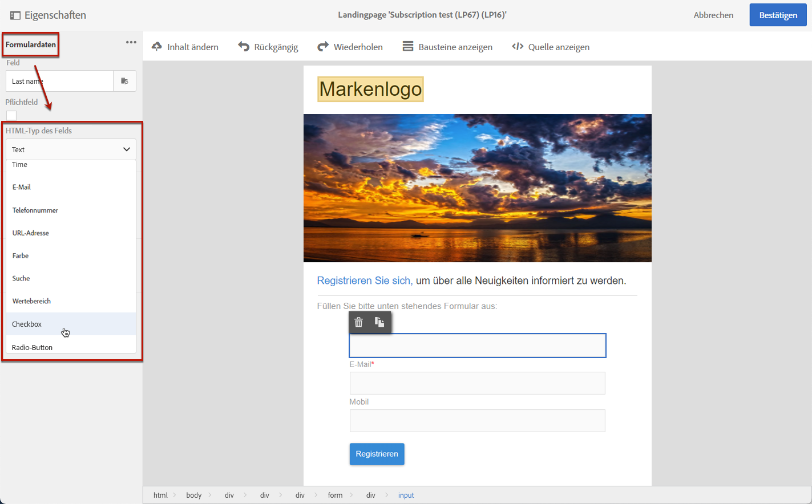

# Verwalten von Landingpage-Formulardaten{#managing-landing-page-form-data}

Im Inhalt der Landingpage werden Eingabefelder verwendet, um Daten aus der Campaign-Datenbank zu speichern oder zu aktualisieren.

Dazu müssen diese Felder Datenbankfeldern zugeordnet werden.

Sie können die Zuordnung über den Abschnitt **[!UICONTROL Formulardaten]** in der linken Palette definieren und verwalten.

## Zuordnung der Formularfelder {#mapping-form-fields}

Um die Campaign-Datenbank gemäß Ihren Bedürfnissen zu aktualisieren, verknüpfen Sie die entsprechenden Datenbankfelder mit Bausteinen vom Typ Eingabefeld, Radiobutton oder Checkbox Ihrer Landingpage.

Gehen Sie dazu wie folgt vor:

1. Wählen Sie im Inhalt der Landingpage einen Baustein aus.

   >[!NOTE]
   >
   >Die Standardfelder der nativen Landingpages sind bereits ausgefüllt. Sie können sie nach Bedarf ändern.

1. Rufen Sie in der linken Palette den Abschnitt **[!UICONTROL Formulardaten]** auf.

1. Um den Feldtyp zu ändern, wählen Sie einen Wert aus der Dropdown-Liste **[!UICONTROL HTML-Typ des Felds]** aus.

   

   >[!NOTE]
   >
   >Weiterführende Informationen zur Verwendung des Checkbox-Typs in einer Landingpage finden Sie in den Abschnitten [Mehrere Dienstanmeldungen aktualisieren](#multiple-subscriptions) und [Zustimmungs-Checkbox](#agreement-checkbox).

1. Wenn Sie einen Feldtyp auswählen, der nicht mit dem Datenbankfeld kompatibel ist, das derzeit im Bereich **[!UICONTROL Feld]** ausgewählt ist, wird eine Warnmeldung angezeigt. Wählen Sie für eine optimale Zuordnung einen geeigneten Wert aus.

   

1. Verwenden Sie den Bereich **[!UICONTROL Feld]**, um ein Datenbankfeld auszuwählen, das mit dem Formularfeld verknüpft werden soll.

   

   >[!NOTE]
   >
   >Landingpages können nur den Ressourcen **[!UICONTROL Profile]** oder **[!UICONTROL Service]** zugeordnet werden.

   In diesem Beispiel ordnen Sie das Feld **Name** Ihrer Landingpage dem Feld **[!UICONTROL Nachname]** der Ressource **[!UICONTROL Profile]** zu.

   

1. Aktivieren Sie bei Bedarf die Option **[!UICONTROL Pflichtfeld]**. In diesem Fall kann das Formular der Landingpage nur gesendet werden, wenn der Benutzer dieses Feld ausgefüllt hat.

   

   Wenn ein Pflichtfeld nicht ausgefüllt wurde, erscheint eine Fehlermeldung, wenn der Benutzer das Formular sendet.

1. Klicken Sie auf **[!UICONTROL Bestätigen]**, um Ihre Änderungen zu speichern.

<!--If you choose a mandatory **[!UICONTROL Checkbox]**, make sure that it is of **[!UICONTROL Field]** type.-->

## Datenspeicherung und -abstimmung{#data-storage-and-reconciliation}

In den Abstimmparametern wird definiert, wie mit den von Besuchern in der Landingpage gemachten Angaben verfahren werden soll.

Gehen Sie wie folgt vor:

1. Bearbeiten Sie die Landingpage-Eigenschaften über das Symbol  im Landingpage-Dashboard und rufen Sie die Parameter **[!UICONTROL Vorgang]** auf.

   

1. Wählen Sie den **[!UICONTROL Abstimmschlüssel]** aus: Dieses Datenbankfeld wird verwendet, um zu bestimmen, ob der Besucher über ein bereits in der Adobe Campaign-Datenbank bekanntes Profil verfügt. Dies kann beispielsweise die E-Mail-Adresse, der Vorname oder der Nachname sein. Mit dem Abstimmschlüssel können Sie ein Profil gemäß dem unten definierten Parameter **[!UICONTROL Aktualisierungsstrategie]** aktualisieren oder erstellen.

1. Definieren Sie das **[!UICONTROL Formularparameter-Mapping]**: In diesem Bereich können Sie eine Beziehung zwischen den Formularfeldern und den im Abstimmschlüssel verwendeten Feldern herstellen.

1. Wählen Sie eine **[!UICONTROL Aktualisierungsstrategie]** aus: Wenn der Abstimmschlüssel ein existierendes Profil in der Datenbank findet, haben Sie die Wahl, das Profil mit den Formulardaten zu aktualisieren oder nicht.

   

## Mehrere Service-Abonnements {#multiple-subscriptions}

Sie können mehrere Checkboxes auf einer Landingpage verwenden, damit sich Benutzer bei mehreren Services anmelden oder abmelden können.

Gehen Sie dazu wie folgt vor:

1. Bei der Erstellung der Landingpage:

   * Wählen Sie einen Baustein und im Abschnitt **[!UICONTROL Formulardaten]** die Option **[!UICONTROL Checkbox]** als Feldtyp aus.

     

   * Wenn Sie HTML-Kenntnisse haben, können Sie mithilfe der Schaltfläche **[!UICONTROL Quelle anzeigen]** auch manuell eine Checkbox einfügen.

     

     Damit können Sie die Checkbox an beliebiger Stelle auf der Seite einfügen.

     

1. Stellen Sie sicher, dass die Checkbox in Ihrem Inhalt ausgewählt ist. Die Dropdown-Liste Typ **** wird im Abschnitt **[!UICONTROL Formulardaten]** in der linken Palette angezeigt. Wählen Sie **[!UICONTROL Dienst und Abonnement]** aus der Liste aus.

   

1. Wählen Sie eine Option aus der Dropdown-Liste **[!UICONTROL Verhalten]** aus.

   

1. Wählen Sie einen [Service](../../audiences/using/creating-a-service.md) aus der entsprechenden Liste aus.

   

1. Stellen Sie sicher, dass die Option **[!UICONTROL Pflichtfeld]** deaktiviert ist. Andernfalls haben Ihre Benutzer keine Wahl.

   

1. Um weitere Checkboxes hinzuzufügen, mit denen Benutzer zusätzliche Services abonnieren können, wiederholen Sie die obigen Schritte so oft wie nötig.

   

Nach der Veröffentlichung der Landingpage können Benutzer auf derselben Seite mehrere Checkboxes auswählen, um mehrere Newsletter zu abonnieren.

## Zustimmungs-Checkbox {#agreement-checkbox}

Sie können eine Checkbox hinzufügen, die das Profil vor dem Absenden eines Formulars auf der Landingpage markieren muss.

So können Sie beispielsweise die Zustimmung der Benutzer zu Datenschutzrichtlinien einholen oder sie dazu bringen, Ihre Nutzungsbedingungen zu akzeptieren, bevor sie ein Formular absenden.

>[!IMPORTANT]
>
>Das Markieren dieser Checkbox ist für Benutzer obligatorisch. Wenn sie nicht markiert wird, können Benutzer kein Formular über die Landingpage absenden.

Gehen Sie wie folgt vor, um eine Checkbox einzufügen und zu konfigurieren:

1. Bei der Erstellung der Landingpage:

   * Wählen Sie einen Baustein und im Abschnitt **[!UICONTROL Formulardaten]** die Option **[!UICONTROL Checkbox]** als Feldtyp aus.

     

   * Wenn Sie HTML-Kenntnisse haben, können Sie mithilfe der Schaltfläche **[!UICONTROL Quelle anzeigen]** auch manuell eine Checkbox einfügen.

     

     <!--Manually insert a checkbox, such as in the example below:

      <!--Click **[!UICONTROL Hide source]**.-->

1. Stellen Sie sicher, dass die Checkbox ausgewählt ist.

   

1. Die Dropdown-Liste Typ **** wird im Abschnitt **[!UICONTROL Formulardaten]** in der linken Palette angezeigt. Wählen Sie **[!UICONTROL Zustimmung]** aus der Liste aus.

   

   >[!NOTE]
   >
   >Das Element **[!UICONTROL Zustimmung]** ist keinem Feld der Campaign-Datenbank zugeordnet.

1. Klicken Sie auf das Symbol  neben **[!UICONTROL Formulardaten]**, um auf die erweiterten Eigenschaften der Checkbox zuzugreifen.

1. Sie können die Nachricht bei Bedarf bearbeiten.

   

   Dieser Text wird als Warnhinweis angezeigt, wenn der Benutzer die Checkbox vor dem Absenden des Formulars nicht markiert hat.

   >[!NOTE]
   >
   >Diese Aktion ist standardmäßig obligatorisch und kann nicht geändert werden.

1. Klicken Sie auf **[!UICONTROL Bestätigen]**.

Jetzt müssen Benutzer immer vor dem Absenden des Formulars auf der Landingpage diese Checkbox markieren. Andernfalls wird ein Warnhinweis angezeigt und der Benutzer kann das Formular erst absenden, nachdem die Checkbox markiert wurde.